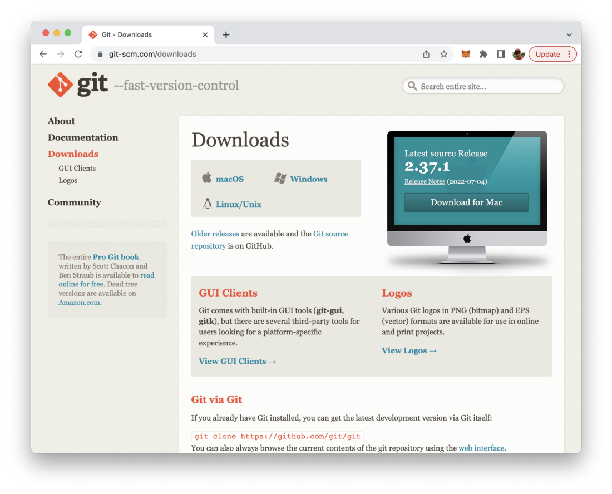
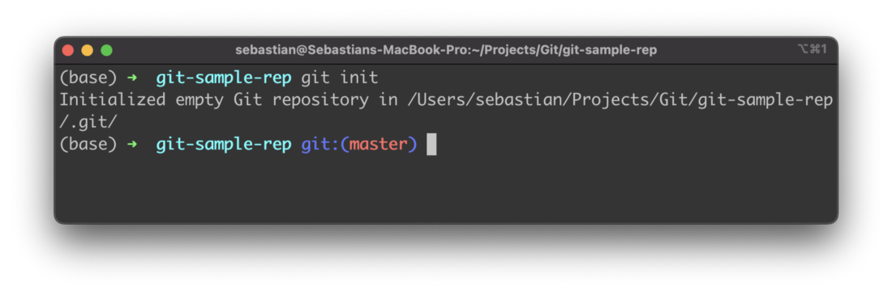
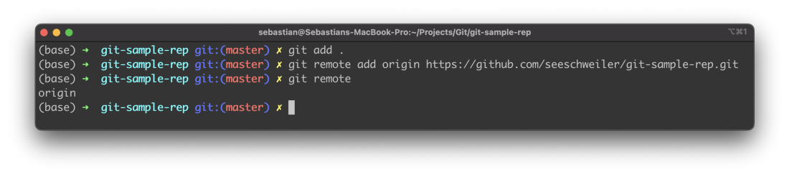
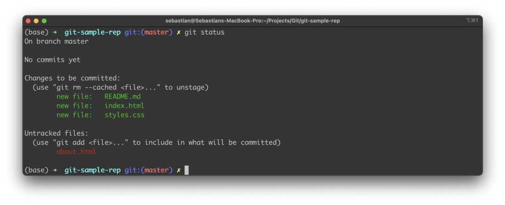
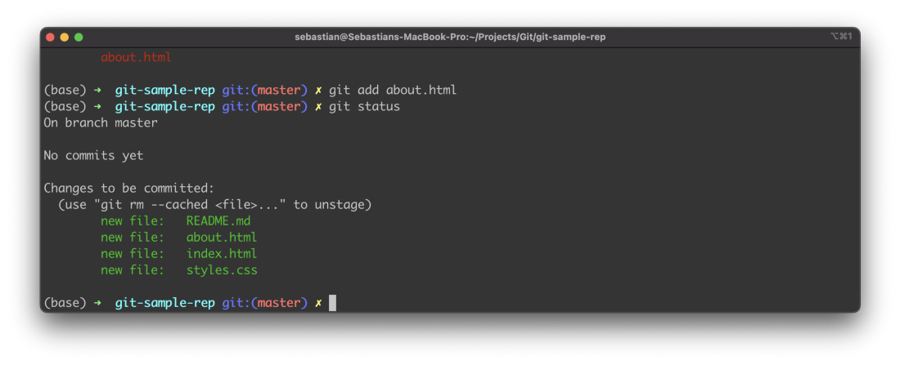
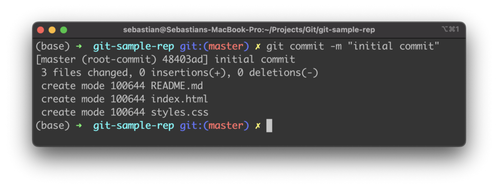
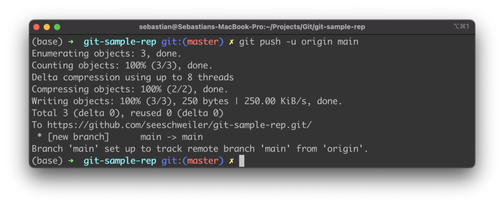

import { Image } from '@astrojs/image/components';
import YouTube from '~/components/widgets/YouTube.astro';
export const components = { img: Image };

*Photo by [Roman Synkevych](https://unsplash.com/@synkevych) on [Unsplash.com](https://unsplash.com)*

This article is just a quick overview of the top Git commands you need to know as a developer.

Git is a free and open source distributed version control system designed to handle everything from small to very large projects with speed and efficiency. Git is available for macOS, Windows, and Linux. It runs on the command like by using the git command. In order to install Git just follow the steps on https://git-scm.com/downloads:



GitHub is a provider of Internet hosting for software development and version control using Git. So you can use GitHub to create a remote Git repository easily and push and fetch content from and to your local Git repository. You can create your free GitHub account at https://github.com/.

Let’s take a look at the 10 most important Git commands every developer should now when starting to work with Git and GitHub:

## 1: git init

Use this command to initialize a new git repository in the current folder.



## 2: git remote add origin

Herewith you can add a remote repository to your local git repository, e.g. a remote Git repository which is hosted on GitHub. Therefore you need to pass the URL of this remote repository to command as well:

```bash
$ git remote add origin https://github.com/seeschweiler/git-sample-rep.git
```

## 3: git remote

This command is used to get the information of already connected remote Git repositories.



## 4: git status

By using this command you can get an overview of the status of files of the working tree in your local Git repository. It tells you if files are tracked, untracked, and modified.



## 5: git add / git add .

This command adds a change in the working tree to the staging area. It tells Git that you want to include updates to a particular file in the next commit.
You can use git add . to simply add all changed files to the staging area at once.



## 6: git reset

By using this command you’re able to unstage files (remove files from the staging area). Unstaged files are not part of the next git commit.


## 7: git commit

The git commit command is used to commit staged files. Commit means that a snapshot based in the work tree and the staged files is created. This snapshot is like a saved version of the project. For each commit you need to write a commit message which can be done directly on the command line by using command option -m followed by the message text:



## 8: git branch

This command is used to create a new branch in your local repository. E.g. to create a new branch with name main in your local repository you need to execute:

```bash
$ git branch main
```

## 9: git push / git fetch

By using the git push command you can upload the commits of a local repository to a remote Git repository.

If you want to push the committed content from the local main branch to the remote git repository you need to use git push command in the following way:

```bash
$ git push -u origin main
```

You should then see the result of the push action on the console:



## 10: git fetch / git pull

Git fetch is a command that allows you to download objects from another repository (e.g. remote repository). However by using git fetch you only get the information about changes, no changes are done to the files on the local repository. This is useful if you want to get the information of changes first and then deciding on the necessary actions.

In contract git pull is doing the download and the merger with the files in the local repository in just one step.