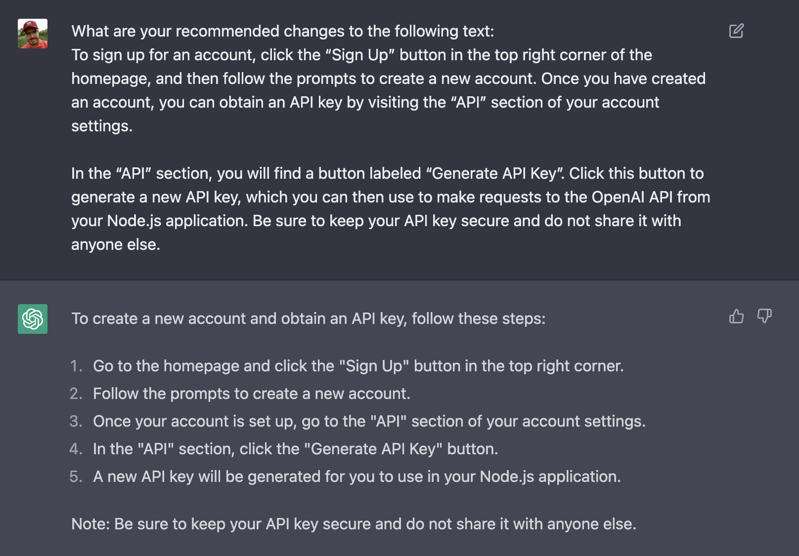

import { Image } from '@astrojs/image/components';
import YouTube from '~/components/widgets/YouTube.astro';
export const components = { img: Image };

*Title Photo by [Andreas Klassen](https://medium.com/r/?url=https%3A%2F%2Funsplash.com%2F%40schmaendels%3Futm_source%3Dmedium%26utm_medium%3Dreferral) on [Unsplash](https://medium.com/r/?url=https%3A%2F%2Funsplash.com%3Futm_source%3Dmedium%26utm_medium%3Dreferral)*

Most people do not know how to unveil the full potential of ChapGPT in order to boost your productive in the most efficient way. This article shows you 10 incredible practical use cases of ChapGPT you must know!

ChatGPT is a type of artificial intelligence (AI) technology that is designed to have conversations with people. It can understand and respond to written or spoken language in a way that is similar to how a human might. ChatGPT is really cool because it can learn from the conversations it has with people and become more accurate and helpful over time. Some people use ChatGPT to have fun conversations or to get answers to questions, while others use it for more practical purposes like helping them with tasks or generating ideas. Overall, ChatGPT is a really interesting and innovative tool that has a lot of potential to make our lives easier and more efficient.

If you haven't signed up for ChatGPT yet, you first need to go to the website https://openai.com/blog/chatgpt/ and signup for a new and free account:

Once you're logged in you'll see the ChatGPT user interface:

Here you can start directly interacting with ChatGPT by providing your input in the input element on the bottom of the screen.

Let's explore some of the best use cases of ChatGPT which can help you to boost your productivity significantly.

## 1. Summarize

ChatGPT is great in generating summaries. If you have found an article on the web which is too long and you just want to have a summary if the most important points ChatGPT is here to assist you:

By using this technique you can get save a lot of reading time but at the same time get a good understanding of the main points of an article.

## 2. Simplify

Summarising a text is already a great function of ChatGPT. However, a summary is saying nothing about the complexity of the resulting text. Fortunately you can tell ChatGPT to summarize or explain a given text and at the same time simplify the topic:

## 3. Creating Drafts

A first draft of text on a specific topic can get help you to get into the process of writing. ChatGPT is able to delivers high quality drafts with ease. Here is how you can generate a draft for an article:

## 4. Writing

ChatGPT is a great writing assistent! On your existing text ChatGPT is able to perform various tasks like:

* Proofread spelling & grammar
* Recommend changes
* Change text to a specific style

Let's see an example of what ChatGPT can do for you as a writer:

That's absolutely great! ChatGPT is able to provide some quick improvements to the text and to the structure.

## 5. Get New Ideas

Getting to new ideas can be a hard task. ChatGPT is here to help - it's actually very good in generating new ideas:

## 6. Research

Maybe you have an idea or topic in mind you'd like to write about and you have to do the research. Therefore you need to find Videos, Articles, Books, or Podcasts and collect information about the topic from those sources.

With ChatGPT you can speed up the process of finding the sources of information in a very easy way. You just have to tell ChatGPT what you want to find, e.g.

If you have decided which video tutorial you'd like to what ChatGPT can tell you where to find it as well:

Another example:

ChatGPT makes it very easy to find the right sources of information for your specific topic and the content type you are looking for. Research becomes much easier with the help of ChatGPT

## 7. Search

ChatGPT is able to be an alternative to classic search engines like Google. ChatGPT is free to use, comes with no ads and provides search results directly. In contrast to search engines you do not need to first click on a link to website and then extract the answer from the content given on site.

However: You need to keep in mind that ChatGPT was trained on information up until 2021. So ChatGPT is not able to provide you with answers to search results for recent topics.

## 8. Code Generation & Code Correction

ChatGPT is great in generating source code for you. You just need to tell ChatGPT which programming language to use and you need to provide a description of the programming problem which should be solved. Take a look at the following simple example:

That's already great. But ChatGPT can do more for you. If you've written your own source code and your code is not running as expacted you can ask ChatGPT to find problems in your code:

## 9. Learning

If you want to start learning a new topic and you're maybe overwhelmed where to start and what to learn first, ChatGPT is there to great a learning plan for you quickly:

## 10. Telling You Jokes

Yes, this one isn't so much about productivity! However, having some fun is necessary to stay productive - so ChatGPT can tell you jokes as well :)

