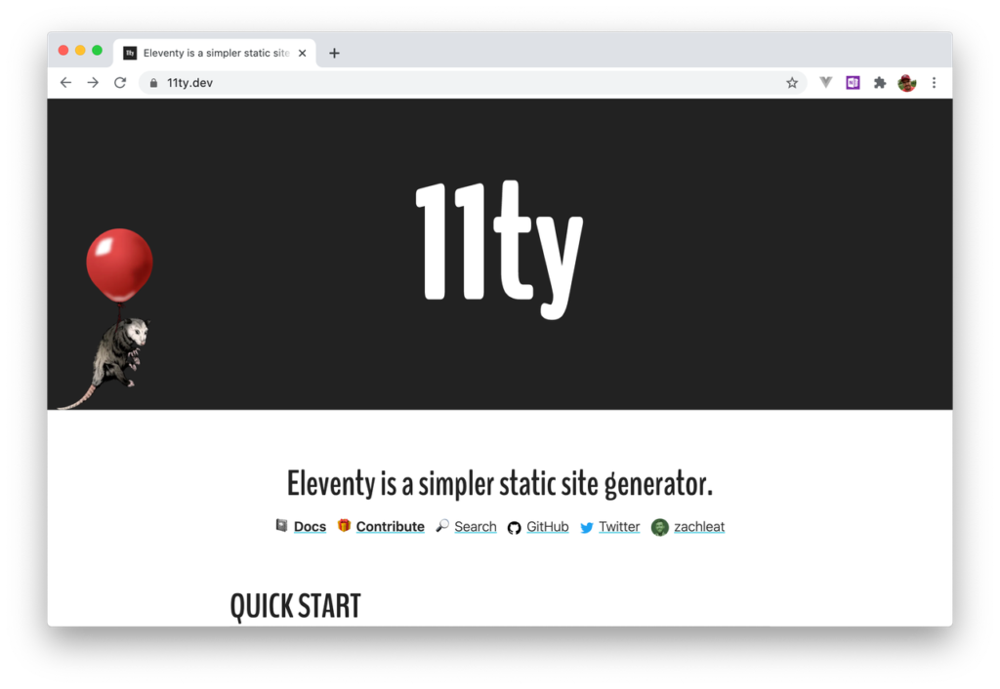
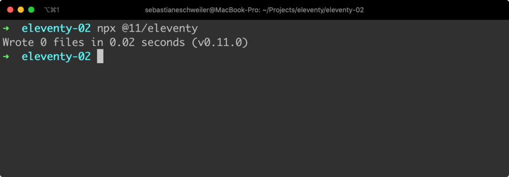
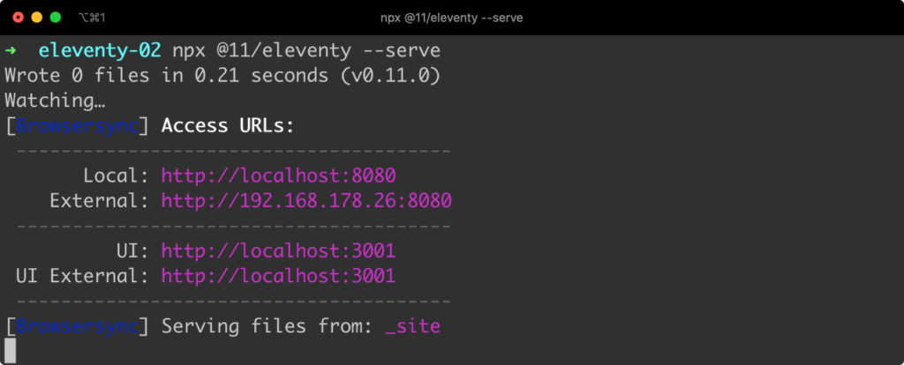
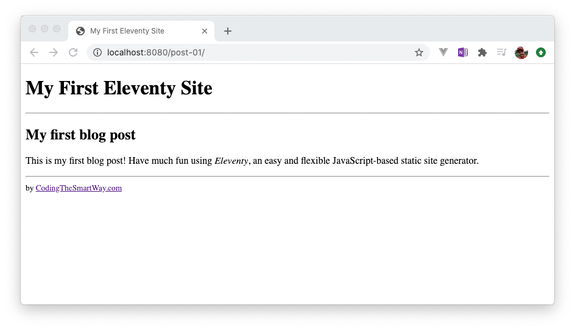
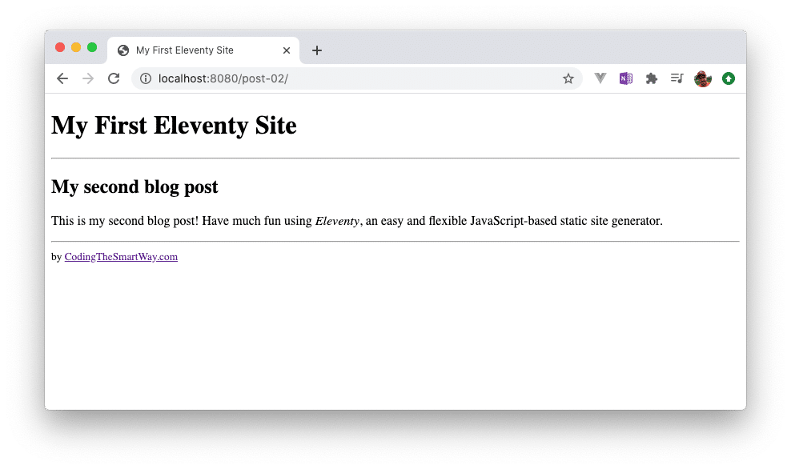

Eleventy is a simple static site generator based on JavaScript. The great thing about Eleventy is that it is zero-config by default but can also be run with configurations options which makes it flexible and extremely easy to use at the same time.  
  
In contrast to other static site generators Eleventy does not force you to use a specific template engine. Eleventy works with many different template languages like:

- HTML (_\*.html_)
- Markdown (_\*.md_)
- JavaScript (_\*.11ty.js_)
- Liquid (_\*.liquid_)
- Nunjucks (_\*.njk_)
- Handlebars (_\*.hbs_)
- Mustache (_\*.mustache_)
- EJS (_\*.ejs_)
- Haml (_\*.html_)
- Pug (_\*.pug_)
- JavaScript Template Literals (_\*.jstl_)

You can choose to use any of these template languages and Eleventy is able to recognize the corresponding engine by the file extension.  
  
The project’s website can be found at [https://www.11ty.dev/](https://www.11ty.dev/).



## Creating Your First Project

### Create A Project Folder

In order to start a new Eleventy project you just need to create an empty folder first:  
  
`$ mkdir eleventy-01`  
`$ cd eleventy-01`

`nano`

### Create A package.json File

Inside this newly created project folder we’re creating an initial package.json file, so that we’re able to use the Node.js Package Manager (npm) tool for managing our dependencies:  
  
`$ npm init -y`

### Installing Eleventy

Having created the _package.json_ file we’re adding the Eleventy package (_@11ty/eleventy_) as a development dependency to out project by using the _npm install_ command in the following way:  
  
`$ npm install --save-dev @11ty/eleventy`

### Running Eleventy

That’s all. Eleventy is installed and ready to run. Give it a try and start Eleventy by using the _npx_ command in the following way:  
  
`$ npx @11/eleventy`  
  
You’ll see a result similar to the following output:



As we’ve not created any additional files in the project folder the output is telling you that 0 files have been generated.  
  
You can also start Eleventy in hot reloading mode by using option _\--serve_:  
  
`$ npx @11/eleventy --serve`  
  
The output then looks like the following:



This time the command keeps running and is watching for any file changes of template files inside the current project folder. If the content of a file is changed and then saved Elevanty is recognizing this change automatically and generating a new output file.

### Adding Templates

Now it’s time to really see Eleventy in action and that requires us to add template files to our project.

### Creating A Layout Template

First of all we’re creating a special template file, a layout template. By using a layout template you can wrap content with a common layout. To create such a template we’re first adding a new folder to the project:  
  
`$ mkdir _includes`  
  
Then inside this new _\_includes_ folder we’re creating a new empty file with name _mylayout.njk_ and insert the following template code:

```markup
---
site_title: My First Eleventy Site
---

<!doctype html>
<html lang="en">
    <head>
        <meta charset="utf-8">
        <meta name="viewport" content="width=device-width, initial-scale=1.0">
        <title>{{ site_title }}</title>
    </head>
    <body>
        <h1>{{ site_title }}</h1>
        <hr/>
        {{ content | safe }}
        <hr/>
        <small>by
            <a href="https://codingthesmartway.com">CodingTheSmartWay.com</a>
        </small>
    </body>
</html>
```

By using the file extension njk we’re indicating that we’re using the Nunjucks templating language inside this file. If you want to learn more about Nunjucks you can find the project’s website and the corresponding documentation at [https://mozilla.github.io/nunjucks/](https://mozilla.github.io/nunjucks/).  
  
The code begins with a front matter section at the beginning. Inside the front matter section you can define data which can then be used in the following template code. In the example we’re using the front matter section to define the _site\_title_ property which is containing a string is the value.  
  
Inside the template code we’re accessing _site\_title_ by using double curly braces. The value of this property is used to set the title of the page.

### Creating Templates Using A Layout

Now let’s create two more templates (using Markdown as the template language) using our previously created layout template:  
  
Create a new file _post-01.md_ in the project folder and insert the following markdown code:

```markdown
---
layout: mylayout.njk
title: My first blog post
---

## {{ title }}

This is my first blog post! Have much fun using _Eleventy_, an easy and flexible JavaScript-based static site generator.
```

In the front matter section we’re using the _layout_ property to specify that this template should use the layout template which has been implemented in _mylayout.njk_.  
  
Let’s create a second markdown file using the same layout template which is named _post-02.md_:

```markdown
---
layout: mylayout.njk
title: My second blog post
---

## {{ title }}

This is my second blog post! Have much fun using _Eleventy_, an easy and flexible JavaScript-based static site generator.
```

Now you should be able to see the result of the site generation process in the browser when accessing URL [http://localhost:8080/post-01/](http://localhost:8080/post-01/):



and URL http://localhost:8080/post-02/:



Here you can see that the content of both pages is embedded in the same layout (because the header and the footer is coming from the layout file).