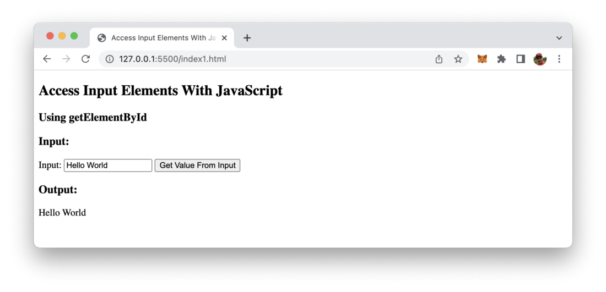
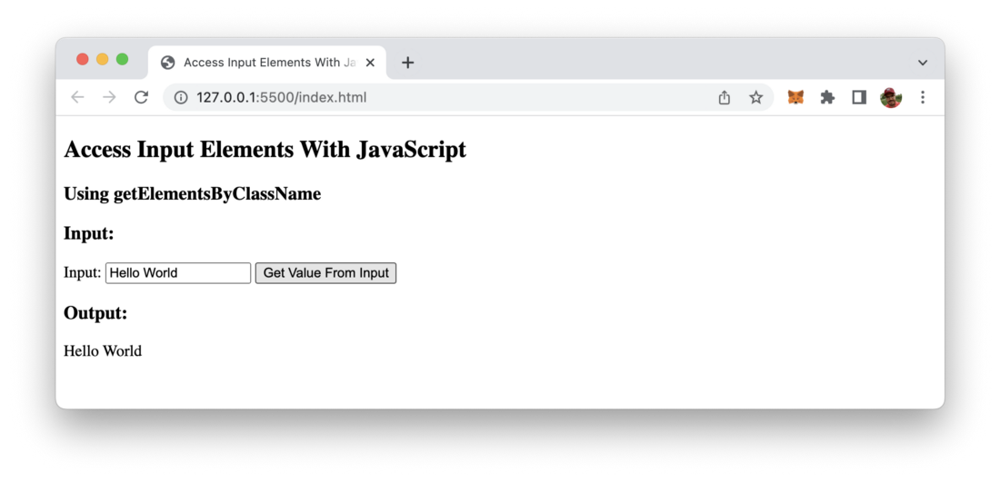

import { Image } from '@astrojs/image/components';
import YouTube from '~/components/widgets/YouTube.astro';
export const components = { img: Image };

*Photo by Nubelson Fernandes on Unsplash.com*

Accessing input field values is a common task when developing web applications. JavaScript offers different ways of accessing input fields. This article will guide you through the three main ways to access input element values in JavaScript.

In order to be able to access the value of HTML input fields from your JavaScript code you need to identify elements clearly. JavaScript offers different ways to identify elements and therewith access its value. The three options are listed in the following.

## Option 1: Access Input Elements With document.getElementById(id)

The first way to get access to the value of an input element is to make sure that the input element has a unique identifier assigned to it like you can see in the following line of HTML code:

```html
<input type=”text” id=”textInput1" />
```

This text input element is clearly identified by ID textInput1. To access the element the JavaScript method document.getElementById can be used. This function is expecting to get the ID of the element as an argument. You can then use the value property of the returned object to access the value of the input element.

The following listing contains a complete example making use of the document.getElementById method:

```html
<!DOCTYPE html>
<html>
  <head>
    <title>Access Input Elements With JavaScript</title>
    <meta charset="UTF-8" />
  </head>

  <body>
    <h2>Access Input Elements With JavaScript</h2>
    <h3>Using getElementById</h3>

    <h3>Input:</h3>
    <label for="textInput1">Input: </label>
    <input type="text" id="textInput1" />

    <button type="button" onclick="getInputValue()">
      Get Value From Input
    </button>

    <h3>Output:</h3>
    <p id="output"></p>
    <script>
      function getInputValue() {
        let inputValue = document.getElementById("textInput1").value;
        document.getElementById("output").innerHTML = inputValue;
      }
    </script>
  </body>
</html>
```

Everytime the user hits the button the function getInputValue is called. This function then reads the value of the input element by using the document.getElementById method and outputs the value into the HTML element with ID output. Therefore the input value is assigned to the innerHTML property.

The result should look like the following:



## Option 2: Access Input Elements With document.getElementsByClassName(‘class’)

The second option to access an input element from JavaScript is to use the method document.getElementsByClassName which allows retrieving DOM elements by assigned class names. Therefore we need to pass in the class name as string as an argument.

In the following listing you can see the code which is making use of document.getElementsByClassName:

```html
<!DOCTYPE html>
<html>
  <head>
    <title>Access Input Elements With JavaScript</title>
    <meta charset="UTF-8" />
  </head>

  <body>
    <h2>Access Input Elements With JavaScript</h2>
    <h3>Using getElementsByClassName</h3>

    <h3>Input:</h3>
    <label for="textInput1">Input: </label>
    <input type="text" class="inputField" />

    <button type="button" onclick="getInputValue()">
      Get Value From Input
    </button>

    <h3>Output:</h3>
    <p id="output"></p>
    <script>
      function getInputValue() {
        let inputValue = document.getElementsByClassName("inputField")[0].value;
        document.getElementById("output").innerHTML = inputValue;
      }
    </script>
  </body>
</html>
```

One thing is important to note here: Of course a class can be assigned to multiple DOM elements. That’s the reason why getElementsByClassName is returning an array. So before accessing the value property of an returned element we need to use the array selector ([0]) to select the first element in the returned array.

Again you should be able to see the following output in the browser:



## Option 3: Access Input Elements With document.querySelector(‘selector’)

The third way of accessing input elements with JavaScript is using te document.querySelector method. By using this method you can use CSS selectors to retrieve HTML elements. If you haven’t worked with CSS selectors before you can find a good overview and introduction to the CSS selectors syntax at https://www.w3schools.com/cssref/css_selectors.asp. E.g. you can use the #[element-id] sign to select elements by ID and you can use .[class-name] to select by class name.

Let’s take a look at a simple example once again:

```html
<!DOCTYPE html>
<html>
  <head>
    <title>Access Input Elements With JavaScript</title>
    <meta charset="UTF-8" />
  </head>

  <body>
    <h2>Access Input Elements With JavaScript</h2>
    <h3>Using getElementById</h3>

    <h3>Input:</h3>
    <label for="textInput1">Input 1: </label>
    <input type="text" id="textInput1" />
    <br/>
    <label for="textInput2">Input 2: </label>
    <input type="text" id="textInput2" class="inputField" />

    <button type="button" onclick="getInputValue()">
      Get Value From Inputs
    </button>

    <h3>Output:</h3>
    <p id="output"></p>
    <script>
      function getInputValue() {
        let inputValue1 = document.querySelector("#textInput1").value; 
        let inputValue2 = document.querySelector(".inputField").value; 
        document.getElementById("output").innerHTML = "Input Value 1: " + inputValue1 + " Input Value 2: " + inputValue2;
      }
    </script>
  </body>
</html>
```

Output of example in the browser:


That’s it, three easy way to access input elements with JavaScript.