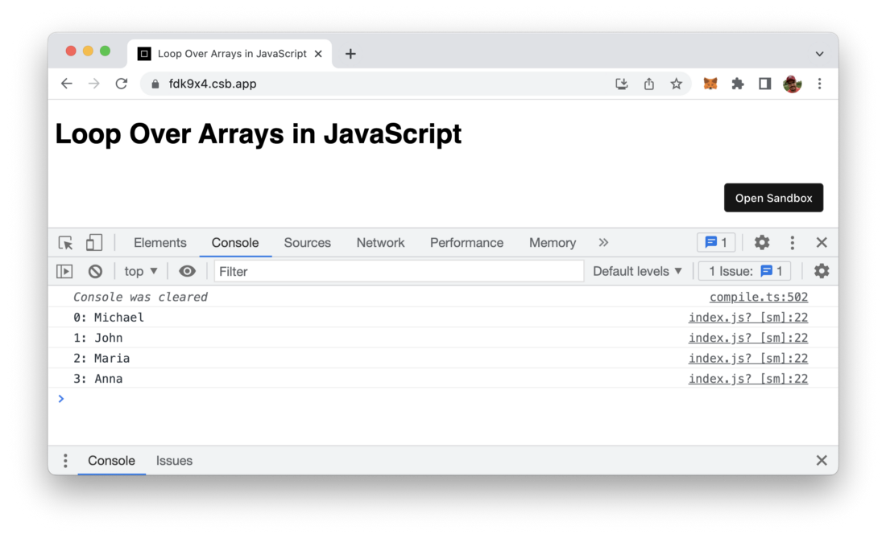
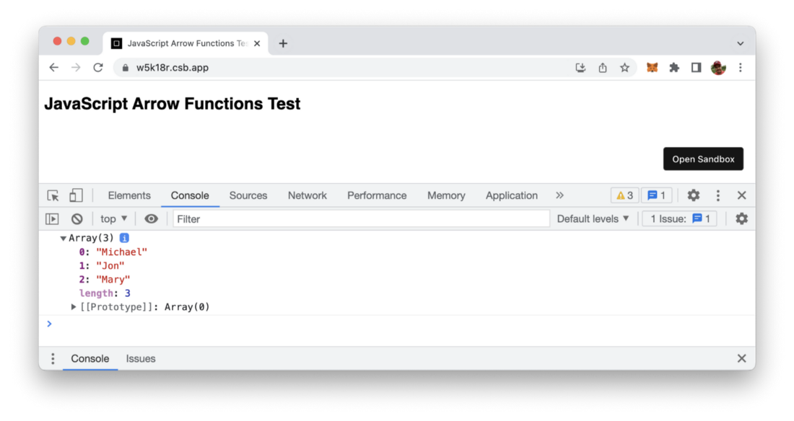

import { Image } from '@astrojs/image/components';
import YouTube from '~/components/widgets/YouTube.astro';
export const components = { img: Image };

Arrays are a data element which can store multiple different elements in just one variable. Arrays are used when you need to store a list of elements and a very common task in programming is to loop over the elements of that array to perform a certain action. In this article you’ll learn 5 different ways of accessing the elements in an JavaScript array one by one.

## 1: Defining An JavaScript Array And Access Elements One By One

Ok, so let’s start very easy. Let’s define an JavaScript array names which consists of four string elements. Then access each of the elements separately by using brackets and specifying the index of the array element we’d like to access (array index start at 0 for the first element):

```js
var names = ["Michael", "John", "Maria", "Anna"];

console.log(names[0]);
console.log(names[1]);
console.log(names[2]);
console.log(names[3]);
```

This should give you the following output:


## 2: Using The For Loop To Loop Through Array Elements

Next step is to really loop through the array elements. Therefore a for loop is used in the following JavaScript example:

```js
var names = ["Michael", "John", "Maria", "Anna"];

for (var index = 0; index < names.length; index++) {
  console.log(names[index]);
}
```

The for loop statement is using an index variable which is incremented by one for every loop execution and used to access the array elements by using the brackets syntax as seen before. The output should then look just the same.

## 3: Using The While Loop To Loop Through Array Elements

The while loop loop can also be used to achieve the same result in the following way:

```js
var names = ["Michael", "John", "Maria", "Anna"]

var index = 0
while (index < names.length) {
  console.log(names[index]);
  index++;
}
```

## 4: Using forEach Method To Loop Through Array Elements

Every array object in JavaScript has a forEach method which can also be used for looping over the elements of an array. This method calls a function for each element in an array. The function which is called is handed over as an argument to the call of forEach like you can see in the following code listing:

```js
var names = ["Michael", "John", "Maria", "Anna"]
 
names.forEach(myFunction);
function myFunction(item, index)
{
    console.log(index + ": " + item);
}
```

In this case myFunction is defined and executed for each array element. The element itself is passed into this function as the item parameter. The current array index for which the function is executed is passed in as the index parameter. The resulting output can be seen in the following:



## 5: Using map Method To Loop Through Array Elements

Another array method JavaScript is providing is the map method. The map method creates a new array populated with the results of calling a provided function on every element in the calling array. Just take a look at the following example:

```js
// Capitalize first character of each name
var names = ["michael", "jon", "mary"];
var result = names.map((name) => {
  var modified = name.charAt(0).toUpperCase() + name.substr(1);
  return modified;
});

console.log(result);
```

Here we’re using the Array map method to iterate over the elements of the names array. An anonymous arrow function is passed into the call of map. This function is executed for each single array element and capitalize the first letter of each name. The result are stored in a new array with name result. The output is the following:


