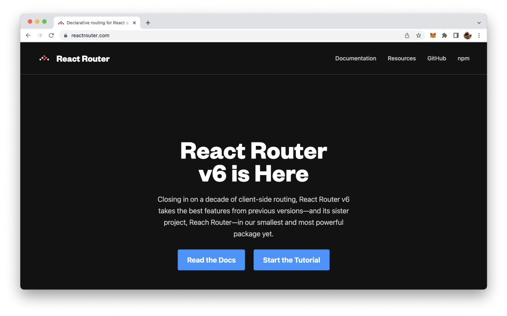
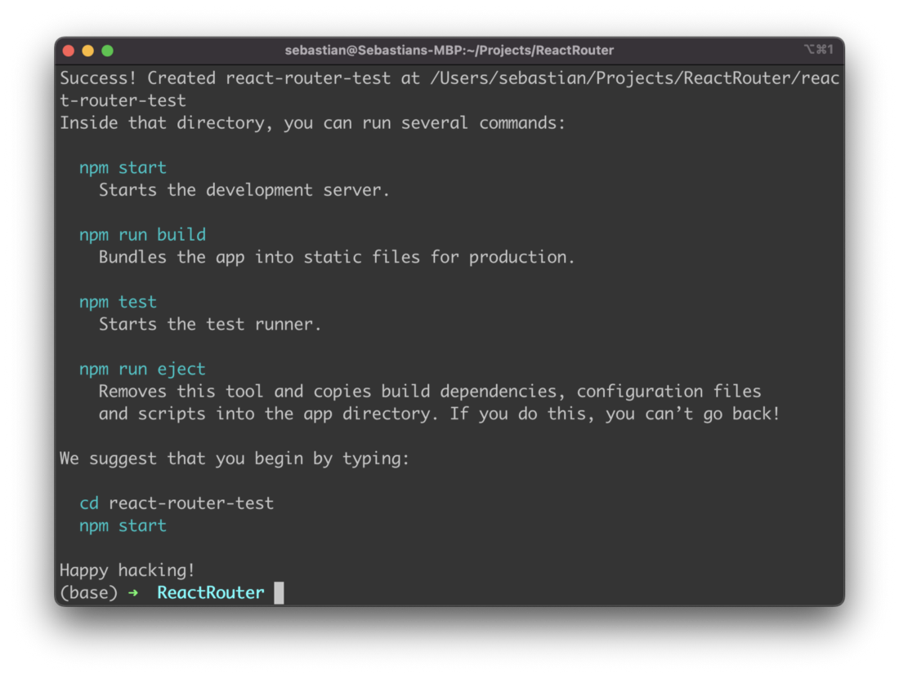
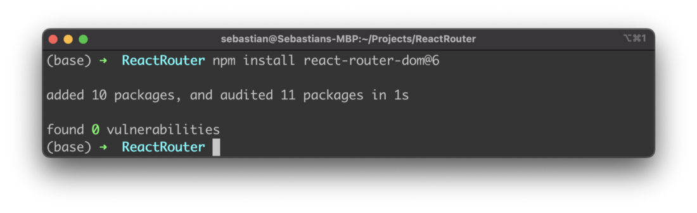
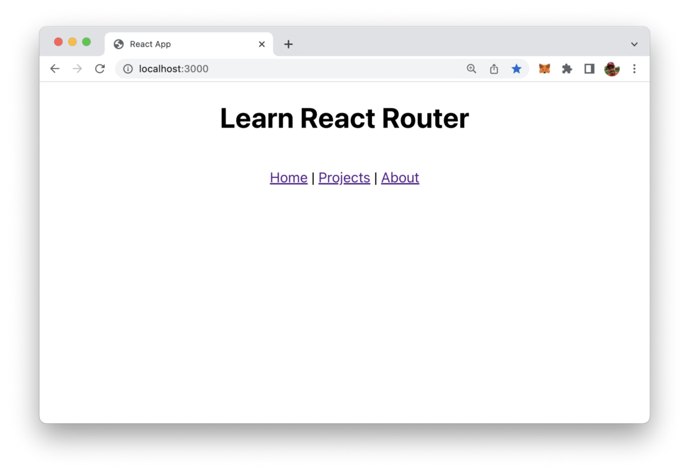
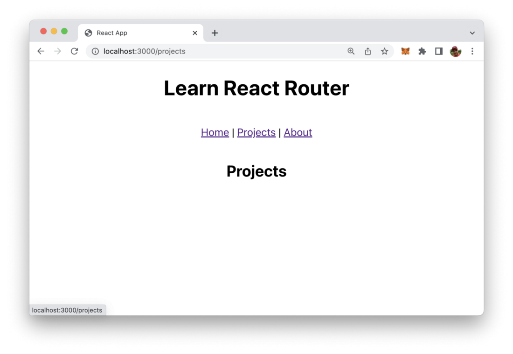
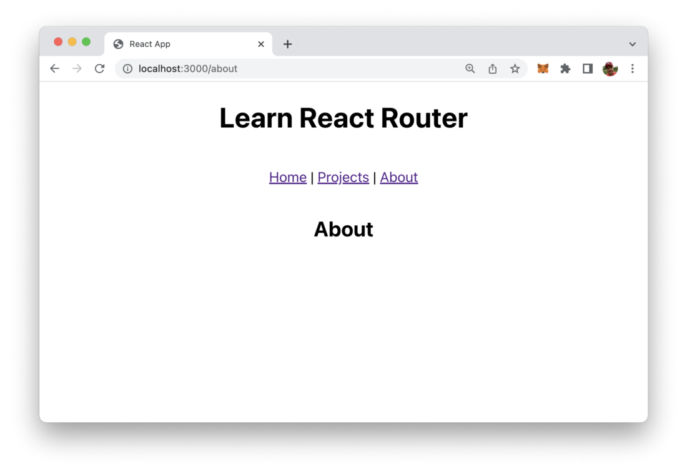

import { Image } from '@astrojs/image/components';
import YouTube from '~/components/widgets/YouTube.astro';
export const components = { img: Image };

React is one of the most used JavaScript-based front-end framework right now. As routing is a common task when implementing React web application this article runs you through the process of setting up routing with React router in your React project quickly.

React Router is a fully-featured client and server-side routing library for React. The project’s website is available at https://reactrouter.com/:



Activating React Router for your React web application is easy and just comprises few steps. Let’s start the process by setting up a new fresh React project first.

## Step 1: Setting Up A React Project

The easiest way to setup a new React project is to use the create-react-app script in the following way:

```bash
$ npx create-react-app react-router-test
```

Once the command has finished downloading and installing the new React project in folder react-router-test you should see the following output on the command line:



## Step 2: Installing React Router

Now we have a new React project folder react-router-test. Change into this new folder by typing in:

```bash
Then use the Node.js Package Manager command line tool NPM to install the React Router package:
```

Here you can see the output on the command line when executing this command:



## Step 3: Use BrowserRouter Component To Activate The Router

In the project folder open file index.js and change the default implementation to the following:

```js
import React from 'react';
import ReactDOM from 'react-dom/client';
import './index.css';
import App from './App';
import { BrowserRouter } from "react-router-dom";

const root = ReactDOM.createRoot(
  document.getElementById('root')
);

root.render(
  <BrowserRouter>
    <App />
  </BrowserRouter>
);
```

Here we’re importing the BrowserRouter component from package react-router-dom. We use BrowserRouter as the top level element in the call of root.render. In the next step we’ll embed the route configuration of our app inside the `<BrowserRouter>` element right here.

## Step 4: Configure Routes

For adding the route configuration we need extend the import statement to also import Routes and Route. By using these two components we’ll add the route configuration in the following way:

```js
import React from 'react';
import ReactDOM from 'react-dom/client';
import './index.css';

import { BrowserRouter, Routes, Route } from "react-router-dom";

import App from './App';
import Projects from "./routes/projects";
import About from "./routes/about";

const root = ReactDOM.createRoot(
  document.getElementById('root')
);

root.render(
  <BrowserRouter>
    <Routes>
        <Route path="/" element={<App />}>
          <Route path="projects" element={<Projects />} />
          <Route path="about" element={<About />} />
        </Route>
    </Routes>
  </BrowserRouter>
);
```

Inside `<BrowserRouter>` we need to add a `<Routes>` element which is containing the route configuration as single `<Route>` elements as childs.

First a `<Route>` element is added to cover the default route of the app (/) and connect this route to the output of App component. Inside this route configuration two route elements are included which are connecting route /projects to the output of component Projects and route /about to the output of component About.

## Step 5: Implement Components For Routes

Next we need to implement the two React components which have been connected to the routes: Projects and About.

*src/routes/projects.jsx:*

```js 
export default function Projects() {
    return (
      <main style={{ padding: "1rem 0" }}>
        <h2>Projects</h2>
      </main>
    );
}
```

*src/routes/about.jsx:*

```js
export default function About() {
    return (
      <main style={{ padding: "1rem 0" }}>
        <h2>About</h2>
      </main>
    );
}
```

## Step 6: Using Link And Outlet Component

Now let’s bring everything together and open file App.js which contains the default implementation of the main React application component App. Change the default implementation to the code which is available in the following listing:

```js
import './App.css';

import { Link, Outlet } from "react-router-dom";

function App() {
  return (
    <div className="App">

      <h1>Learn React Router</h1>

      <br/>
      <Link to="/">Home</Link> {" | "}
      <Link to="/projects">Projects</Link> {" | "}
      <Link to="/about">About</Link>
      <br/>
      <Outlet />

    </div>
  );
}

export default App;
```

Two components are imported from the react-router-dom package: Link and Outlet.

The Link component is used to output links to the routes of our application. The target route is specified by using the to property.

The Outlet component is used to specify where the output of child routes should be inserted.

## Step 7: Try it out!

Finally let’s start the development web server and try out if everything works. Type in

```bash
$ npm start 
```

The web server start and the React application open in the browser, so that you should see the following output:



Clicking on the link Projects takes you directly to the /projects route of our application and displays the output which is coming from Projects components without reloading the page:



Clicking on the About link shows you the output from About component on route /about:



React Route is working as expected. Feel free to play around with the project and start adding additional routes to your web application.