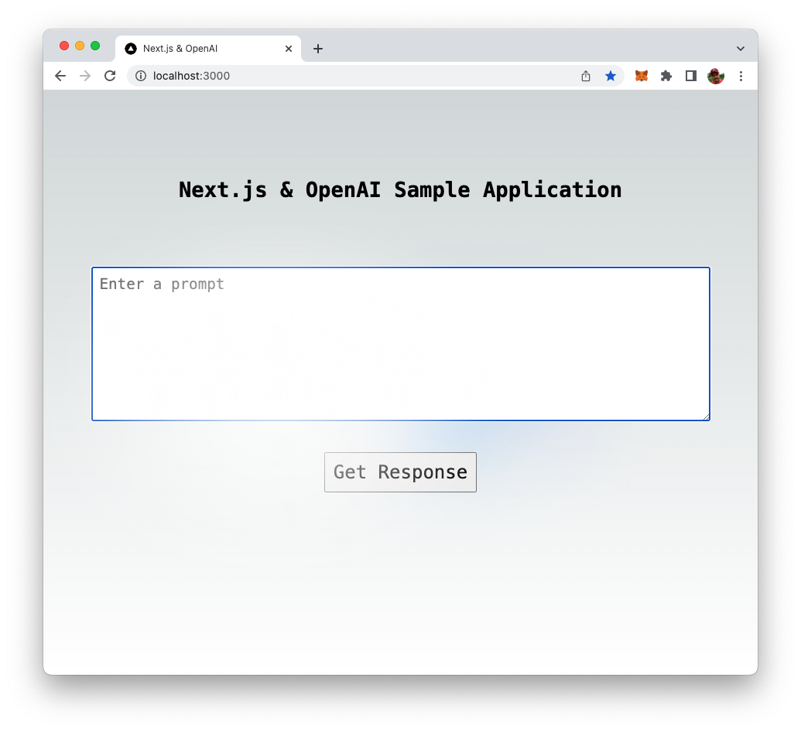

import { Image } from '@astrojs/image/components';
import YouTube from '~/components/widgets/YouTube.astro';
export const components = { img: Image };

Welcome to our beginner's guide to building a Next.js app with the OpenAI API. In this tutorial, we will walk you through the process of creating a powerful and intelligent Next.js application utilizing the capabilities of the OpenAI API.

Next.js is a popular framework for building server-rendered React applications, and the OpenAI API is a powerful tool for incorporating advanced artificial intelligence functionality into your app. By combining these two technologies, you can create a powerful and dynamic web application that can adapt and improve over time.

In this guide, we will cover the basics of setting up a Next.js application, integrating the OpenAI API, and using it to add advanced functionality to your app. We will also provide examples and code snippets to help you understand the concepts and implement them in your own project.

Whether you are a beginner developer or an experienced professional, this guide is designed to help you understand the potential of OpenAI API and how it can be used to enhance your Next.js application. So, let's get started and explore the world of AI-powered web development!

## Prerequisites

Before diving in, ensure that the following prerequisites are installed on your machine:

_Node.js and npm (Node.js Package Manager)_: These are necessary to construct a Next.js and React application. You can download Node.js from the official website (https://nodejs.org/) or by using a package manager like Homebrew (https://brew.sh/).

_Yarn Package Manager_: We'll use the Yarn package manager to create and management dependencies in the Next.js project. Installation instructions for Yarn can be found on the project's website at: https://yarnpkg.com/getting-started/install.

## Retrieving An OpenAI API Key

To obtain an API key for the OpenAI API, you will need to sign up for a free OpenAI account on the OpenAI website (https://openai.com/):


To sign up for an account, click the "Sign Up" button in the top right corner of the homepage, and then follow the prompts to create a new account. Once you have created an account, you can obtain an API key by visiting the "API" section of your account settings.

In the "API" section, you will find a button labeled "Generate API Key". Click this button to generate a new API key, which you can then use to make requests to the OpenAI API from your Node.js application. Be sure to keep your API key secure and do not share it with anyone else.


## Setting up the Project

In order to setup a new Next.js project we'll use the following command:

```bash
$ yarn create next-app
```

You'll then be asked to answer a few questions in regard to the project setup:


Furthermore you need to specify a name for the new project. For our example we'll choose the name next-openai-app. This is at the same time the name of the folder which is created to contain the initial project setup.

The setup project is installing all default project dependencies are finally you should be able to see a success message:


## Integrating the OpenAI API

Next we need to install the OpenAI API client library by using Yarn again in the following way:

```bash
$ yarn add openai
```

The package is being downloaded and installed:


Next step is to create an environment variable in our Next.js application which is able to hold to OpenAI API key.

Create a new file _.env.local_ in the root directory of the project and insert the following:

```
OPENAI_API_KEY=[INSERT YOUR OPENAI API KEY HERE]
```

[INSERT YOUR OPENAI API KEY HERE] need to be replayed with your OpenAI API key which you have retrieved from the OpenAI dashboard before.

## Implement The API Endpoint

In our Next.js project we're creating a new API endpoint which is able to handle the communication with the OpenAI API by using the openai package.

Therefore we're creating a new file pages/api/openai.js and insert the following code:

```js
import { OpenAIApi, Configuration } from "openai";

const configuration = new Configuration({
  apiKey: process.env.OPENAI_API_KEY,
});

const openai = new OpenAIApi(configuration);

export default async (req, res) => {
  if (req.body.prompt !== undefined) {
    const completion = await openai.createCompletion({
      model: "text-davinci-003",
      prompt: `${req.body.prompt}`,
    });

    res.status(200).json({ text: `${completion.data.choices[0].text}` });
  } else {
    res.status(400).json({ text: "No prompt provided." });
  }
};
```

This code imports the OpenAIApi and Configuration modules from the _openai_ package, creates a Configuration object, and uses it to create an instance of the OpenAIApi. It exports an async function that handles an incoming HTTP request and response. The function first checks if the request body contains a property named "prompt", If it does exist, it calls the "createCompletion" method on the OpenAI API instance, passing an object that contains the model ID _text-davinci-003_ and the prompt text from the request body. It then sends a JSON response with a status code of 200 and a text property containing the first choice of the completion returned by the OpenAI API. If the request body does not contain a prompt, the function sends a JSON response with a status code of 400 and a text property with the message _No prompt provided._
Let's start the web server in development mode by entering

```bash
$ yarn dev
```

Once the server is started you can switch to a second terminal instance and use the curl command to send an HTTP post request to the http://localhost:3000/api/openai endpoint. The body data of this request must be in JSON format and containing the prompt property:

```bash
$ curl -X POST -H "Content-Type: application/json" -d '{"prompt": "How are you"}' http://localhost:3000/api/openai
```

As a result you should be able to see a message coming back from OpenAI providing an answer to your input.

## Implement The Front-End

Next we further need to complete the implementation by adding the front-end code in file _pages/index.js_. Start by adding the following lines of code:

```js
const [prompt, setPrompt] = useState("");
const [isLoading, setIsLoading] = useState(false);
const [response, setResponse] = useState("");
```

This code is using the React Hooks feature called "useState" to initialize three state variables: "prompt", "isLoading", and "response". The "useState" function is called with an initial value for each variable, which is an empty string for "prompt" and "response", and "false" for "isLoading".

The "useState" function returns an array with two elements. The first element is the current state value, and the second element is a function to update the state value. These elements are destructured into the variables "prompt", "isLoading", "response", "setPrompt", "setIsLoading", and "setResponse".

The variables "prompt", "isLoading", and "response" can be used to access the current state value of each state variable, and the functions "setPrompt", "setIsLoading", and "setResponse" can be used to update the state value of each state variable respectively.

```js
  const getResponseFromOpenAI = async () => {
    setResponse("");
    console.log("Getting response from OpenAI...");
    setIsLoading(true);
    const response = await fetch("/api/openai", {
      method: "POST",
      headers: {
        "Content-Type": "application/json",
      },
      body: JSON.stringify({ prompt: prompt }),
    });

    const data = await response.json();
    setIsLoading(false);
    console.log(data.text);
    setResponse(data.text);
  };
```

This code defines an asynchronous function named "getResponseFromOpenAI" which is used to get a response from our previously created API endpoint called "/api/openai".

The function starts by resetting the state variable "response" to an empty string using the "setResponse" function, and then logs a message "Getting response from OpenAI…" to the console. Then it sets the state variable "isLoading" to true using the "setIsLoading" function to indicate that a request is in progress.

Then it uses the JavaScript Fetch API to make a POST request to the "/api/openai" endpoint, passing the current value of the "prompt" state variable as the request body, and the "Content-Type" header set to "application/json".

The response from the API call is awaited, and then parsed to JSON using the "json()" method. Then the function sets the "isLoading" state variable to false using the "setIsLoading" function, indicating that the request has completed. It then logs the text of the response to the console, using "console.log(data.text);". And finally it updates the "response" state variable with the text of the response using the "setResponse" function.

This function is likely being used to make a request to the OpenAI API to get a response based on the current value of the "prompt" state variable, and is setting the response to the "response" state variable and also handling the loading state while the request is made and being handled.

Let's adapt the JSX code as well:

```html
      <main className={styles.main}>
        <div className={styles.description}>
          <h1 className={styles.title}>Next.js & OpenAI Sample Application</h1>
        </div>

        <div className={styles.center}>
          <textarea
            className={styles.promptInput}
            placeholder="Enter a prompt"
            onChange={(e) => setPrompt(e.target.value)}
            row="5"
            cols="50"
          />
          <button className={styles.button} onClick={getResponseFromOpenAI}>
            Get Response
          </button>

          <div className={styles.response}>
            {isLoading ? (
              <div>Waiting for response ...</div>
            ) : (
              <div>{response}</div>
            )}
          </div>
        </div>
      </main>
```

This JSX code renders the main section of our front-end user interface. It uses className attribute to apply styles from an imported CSS file called to various elements.

It has a main container with a className of "styles.main". Inside of it, there is a div container with className of "styles.description" which contains a title inside of h1 tag with className of "styles.title" that says "Next.js & OpenAI Sample Application".

Then it has another div container with className of "styles.center", inside of it, there is a textarea element with className of "styles.promptInput" to take input from the user with a placeholder of "Enter a prompt". The "onChange" attribute is set to a function that updates the "prompt" state variable with the current value of the textarea. It also has "row" and "cols" attribute to set the number of rows and columns.

There is a button element with className of "styles.button" and an "onClick" attribute that triggers the "getResponseFromOpenAI" function when clicked. The text inside of button is "Get Response".

Finally, there is a div element with className of "styles.response" which shows the response message. Inside of it, it uses a ternary operator to check if the "isLoading" state variable is true or false. If it's true, it shows the text "Waiting for response …", otherwise it shows the value of the "response" state variable.

## Complete source code of pages/index.js

The complete source code of pages/index.js should the look like the following:

```js
import Head from "next/head";
import { useState, useEffect } from "react";
import styles from "@/styles/Home.module.css";

export default function Home() {
  const [prompt, setPrompt] = useState("");
  const [isLoading, setIsLoading] = useState(false);
  const [response, setResponse] = useState("");

  const getResponseFromOpenAI = async () => {
    setResponse("");
    console.log("Getting response from OpenAI...");
    setIsLoading(true);
    const response = await fetch("/api/openai", {
      method: "POST",
      headers: {
        "Content-Type": "application/json",
      },
      body: JSON.stringify({ prompt: prompt }),
    });

    const data = await response.json();
    setIsLoading(false);
    console.log(data.text);
    setResponse(data.text);
  };

  return (
    <>
      <Head>
        <title>Next.js & OpenAI</title>
        <meta name="description" content="Generated by create next app" />
        <meta name="viewport" content="width=device-width, initial-scale=1" />
        <link rel="icon" href="/favicon.ico" />
      </Head>
      <main className={styles.main}>
        <div className={styles.description}>
          <h1 className={styles.title}>Next.js & OpenAI Sample Application</h1>
        </div>

        <div className={styles.center}>
          <textarea
            className={styles.promptInput}
            placeholder="Enter a prompt"
            onChange={(e) => setPrompt(e.target.value)}
            row="5"
            cols="50"
          />
          <button className={styles.button} onClick={getResponseFromOpenAI}>
            Get Response
          </button>

          <div className={styles.response}>
            {isLoading ? (
              <div>Waiting for response ...</div>
            ) : (
              <div>{response}</div>
            )}
          </div>
        </div>
      </main>
    </>
  );
}
```

## Testing The Application

Now it's time to test our application. Open http://localhost:3000/ in a browser and you should be able to see a front-end similar to:



Start entering your question in the input field:


Click on button "Get Response" to send the input to OpenAI's language model. You should then see the message "Waiting for response …":


Once the response from OpenAI is received the text provided by OpenAI is displayed:


## Conclusion

In conclusion, building a Next.js app with the OpenAI API is a powerful way to add advanced functionality and intelligence to your web application. By following the steps outlined in this beginner's guide, you can easily integrate the OpenAI API into your Next.js application and start utilizing its capabilities.

We've covered the basics of setting up a Next.js application, integrating the OpenAI API, and using it to add advanced functionality to your app. However, this is just the beginning. The OpenAI API offers many more capabilities that you can explore and use in your projects. With the OpenAI API, you can build applications that can understand natural language, generate text, and even make predictions.

As you continue to build and improve your Next.js app with the OpenAI API, remember to always stay up-to-date on the latest advancements in the field and take advantage of new features and capabilities as they become available. With the power of the OpenAI API, your Next.js app can become even more powerful and intelligent, making it stand out from the rest.

Thank you for reading this guide, and we hope you found it helpful. We wish you all the best in your next AI-powered Next.js project.