import { Image } from '@astrojs/image/components';
import YouTube from '~/components/widgets/YouTube.astro';
export const components = { img: Image };

Discord is a popular real-time messaging platform with great support for programmable bots. In this tutorial you'll learn how to build a simple Discord chatbot from start to finish. You do not need any prior knowledge of Discord or Discord APIs, just follow this easy step-by-step guide.

## Creating A Discord Test Server

First we need to create our own Discord server. This means that you need to have a Discord user account already and that you're signed in. If you have not used Discord before and have no existing user account you need to go to https://discord.com/ first and create one.

When you are signed into Discord you can create a new server by simple clicking on the + icon on the left:

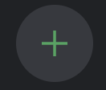

You should then see the "Create a server" dialog in which you can choose option "Create My Own":

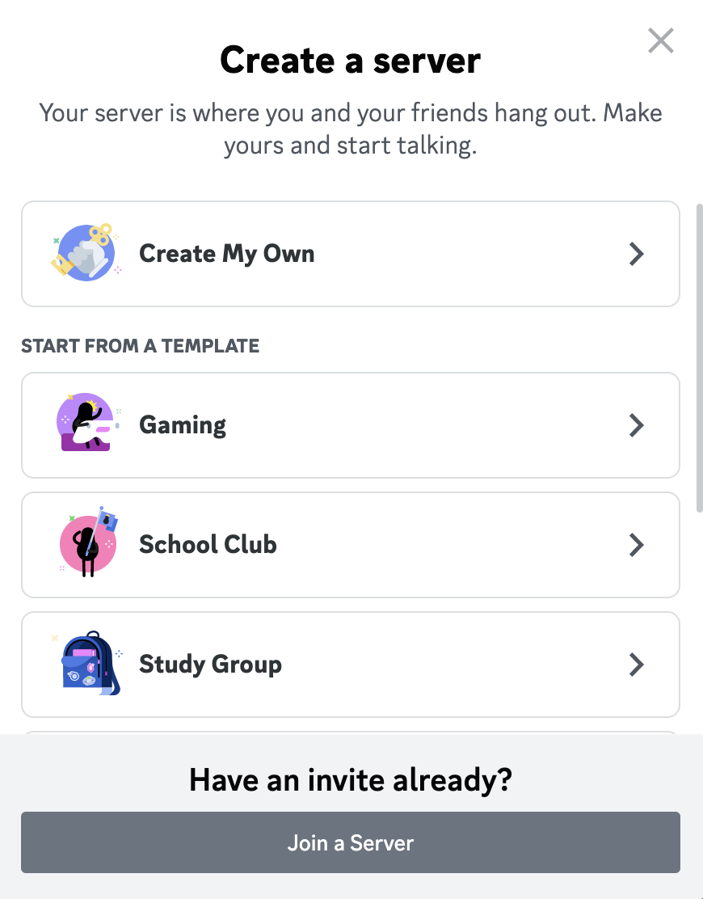

On the following screen we simply select "For a club or community":

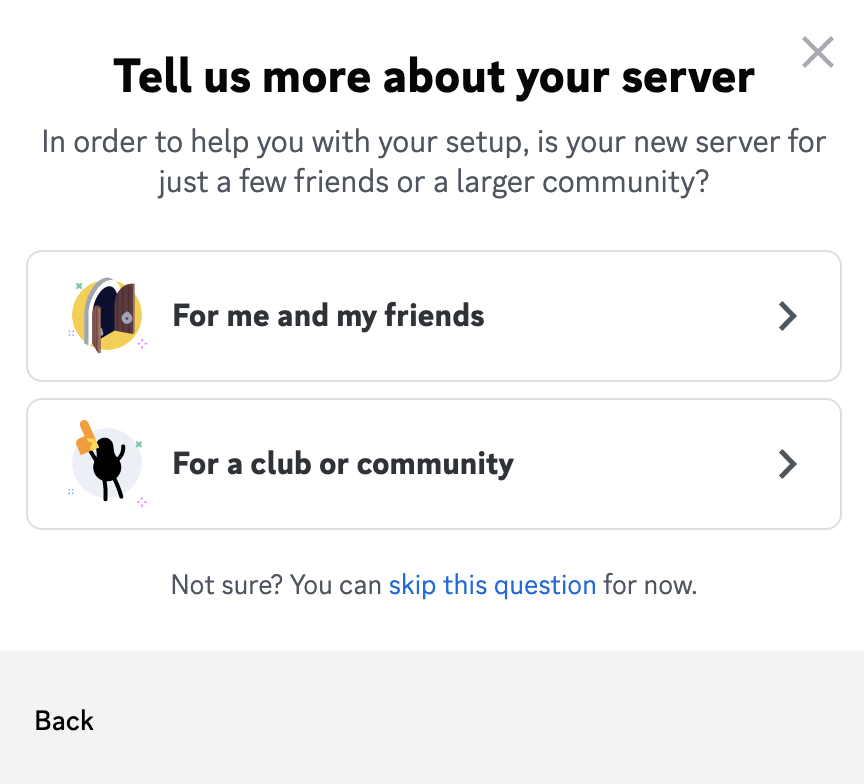

And finally you're being asked to assign a name to the new Discord server:

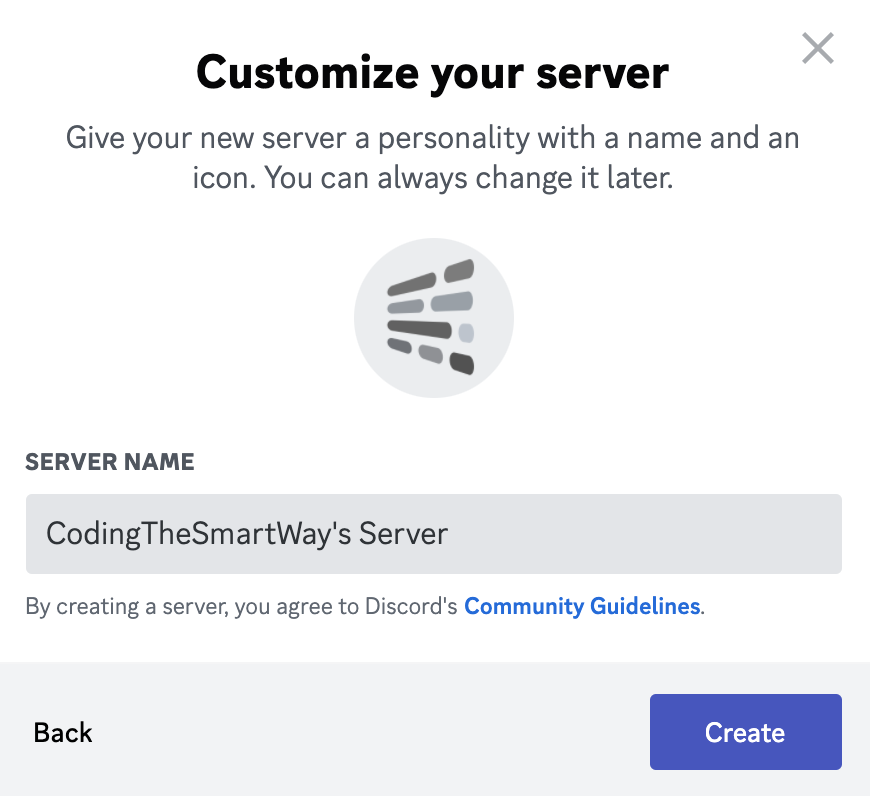

Once you hit button "Create" the new Server is created and added to your Discord user interface.

## Creating A Discord Application Entry and A Bot Account

Before we're starting to write code for our Discord bot, we need to go to the Discord developer dashboard which can be found at https://discord.com/developers/applications/:

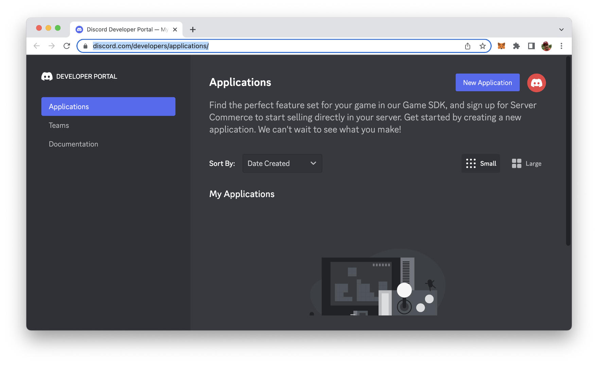

In the Applications section you need to create a new Discord application entry by clicking on Button "New Application". Next, you need to enter a name for the application:

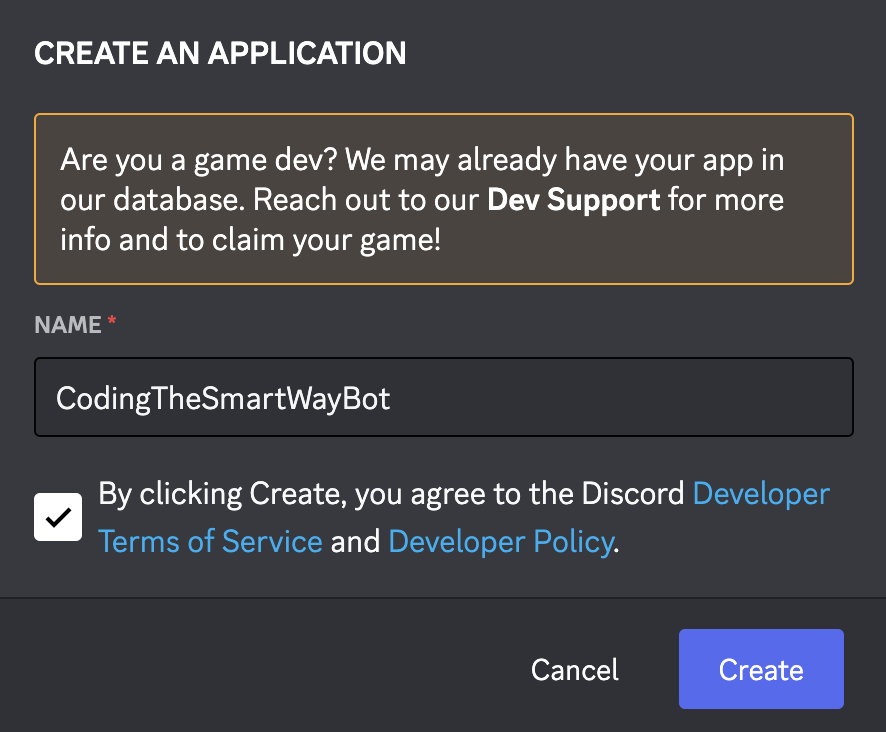

After clicking on button "Create" the new application entry is created and you're redirected to the details page of that application:

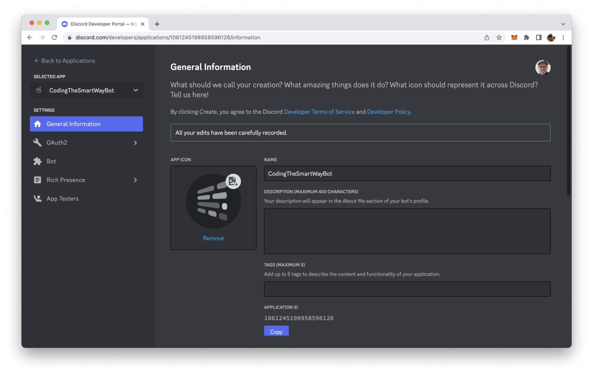

With the application entry available we need to open the Bot tab and create a bot user account which is needed to run our bot program later on.

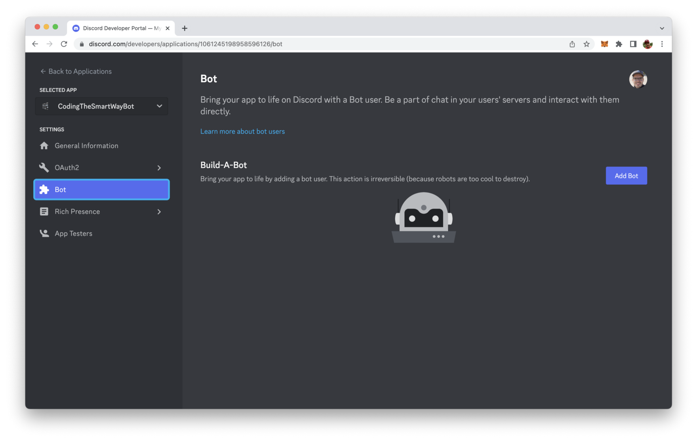

Click on button "Add Bot". In the following dialog you need to confirm this step again by clicking on "Yes, do it!":

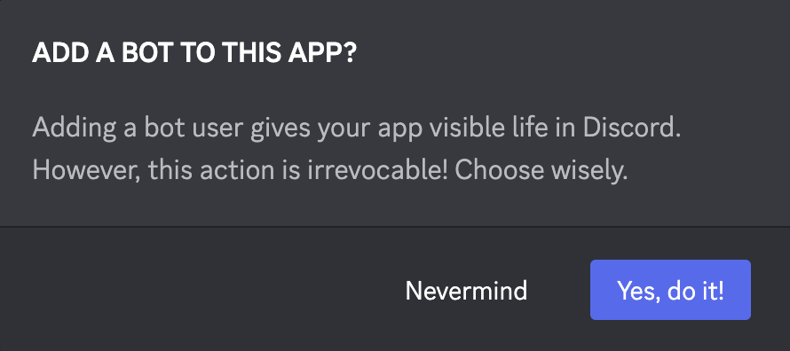

The bot user account is created. You will then see a screen similar to:

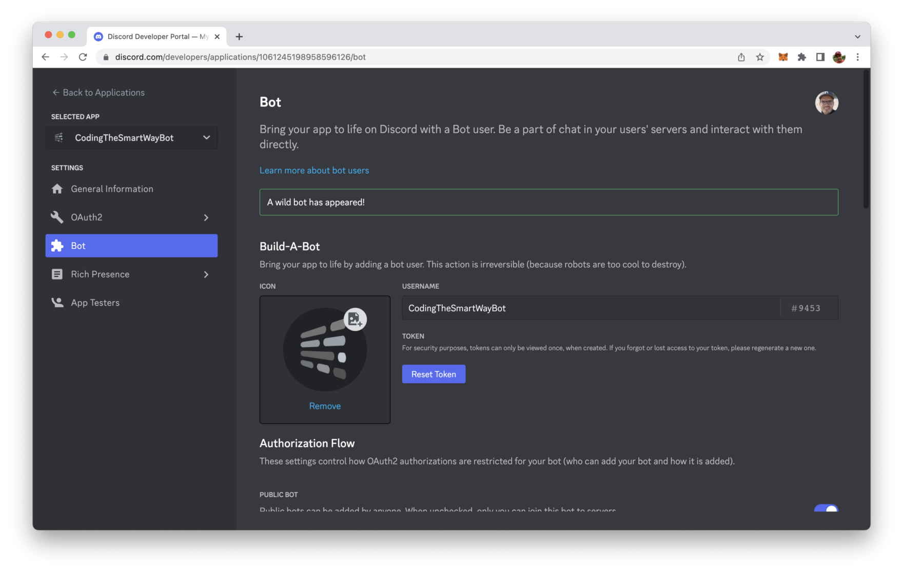

By clicking on the buttom "Reset Token" you can create a new token for the bot user. This token will be needed later on when implementing our Discord chabot with Node.js.

In the bot account view you need to scroll down and activate option "Message Content Intent":

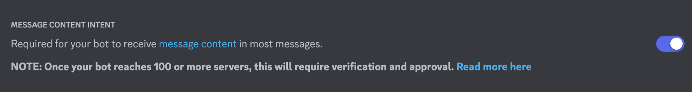

Activating this option is necessary, so that we can implement a bot who is able to receive and react on specific messages.

Switch to tab OAuth2. That the place where you can find the client ID. This ID will be needed for the next step.

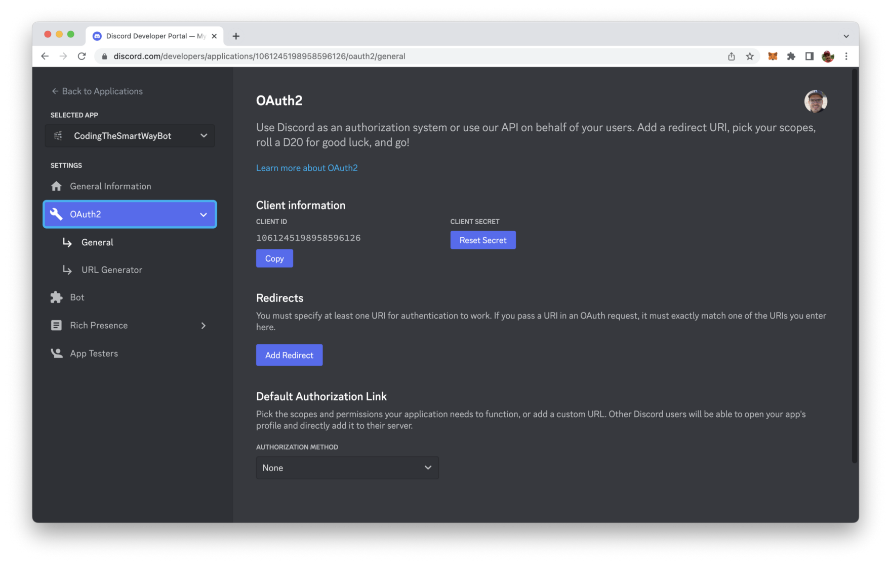

In order to connect the configured bot with the Discord server we have been creating at the beginning you need to add your specific client ID to the following URL and open this URL in any browser:

```
https://discord.com/oauth2/authorize?scope=bot&client_id=[YOUR CLIENT ID]
```

You will then see the following screen asking you for permission to connect the bot with the Discord server:

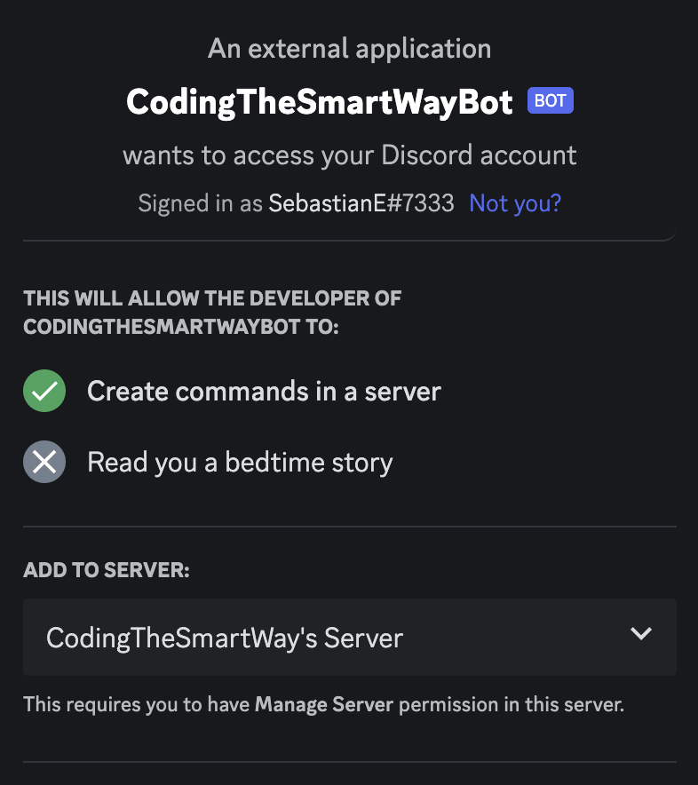

After premission is ganted you can see that the bot account is listed as offline in the user list within your Discord application:

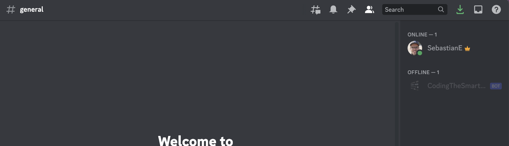

The configuration is done. Let's move on and implement the bot logic with Node.js.

##Creating The Node.js Project

To create the bot we'll use Node.js and Express. So we need to initialize a new Node project first:

```bash
$ mkdir discord_bot
$ cd discord_bot
$ npm init -y
```

Next we need to add the needed dependencies by running:

```bash
$ npm install eris express body-parser
```

Beside the Express framework and the body-parser package we're installing the Eris library. Eris is a lightweight Node.js wrapper for interfacing with Discord APIs easily.

If you'd like to get further information on Eris you can take a look at the project's website at https://abal.moe/Eris/:

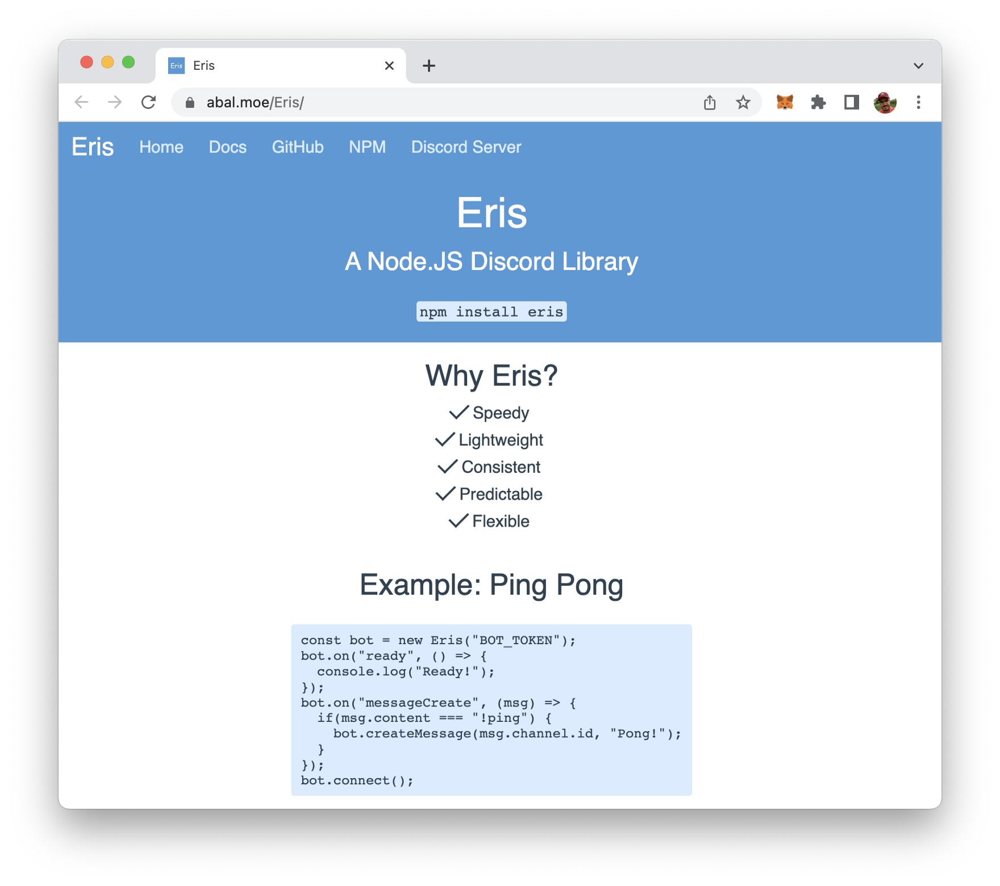

## Implementing The Bot

Great, the project setup is completed, the needed dependencies have been installed. It's time to implement the bot. Let's create a new file:

```bash
$ touch bot.js
```

and start by entering the following lines of code on top:

```js
const Eris = require("eris");

const bot = new Eris("YOUR BOT TOKEN", {
    intents: [
        "guildMessages"
    ]
});

bot.on("ready", () => { 
    console.log("Bot is ready!"); 
});
```

We're creating a new bot instance of Eris. The constructor requires is to hand over two parameter:

* As the first parameter you need to pass in your bot token (from the Discord developer dashboard) as string.
* The second parameter is a configuration object.

By using the bot.on method we're registering an event handler function for the ready event. This is printing out a message to the console once the ready event is received.

We can add the following lines of code to also register an event handler function for the error event:

```js
bot.on("error", (err) => {
  console.error(err); 
});
```

Next, let's also add an event handler for the messageCreate event type. This event is invoked everytime a new message in entered in the chat. The message is received via the msg parameter. The content of the message is then available via msg.content:

```js
bot.on("messageCreate", (msg) => { 
    if(msg.content === "Hello Bot") { 
        bot.createMessage(msg.channel.id, "Here I am! Ready to chat ...");
    } 
});
```

We keep our bot logic very simple: If the received message is "Hello Bot" the bot should respond automatically with "Here I am! Ready to chat …". In order to send out the respond we're using the bot.createMessage method.

Finally we need to call:

```js
bot.connect();
```

to activate the bot.

In the following listing you can see the complete code of our bot implementation in bot.js:

```js
const Eris = require("eris");

const bot = new Eris("[ENTER YOUR BOT TOKEN]", {
    intents: [
        "guildMessages"
    ]
});

bot.on("ready", () => { 
    console.log("Bot is connected and ready!"); 
});

bot.on("error", (err) => {
  console.error(err); 
});

bot.on("messageCreate", (msg) => { 
    if(msg.content === "Hello Bot") { 
        bot.createMessage(msg.channel.id, "Here I am! Ready to chat ...");
    } 
});

bot.connect();
```

Let's run the bot program by typing in the following command:

```bash
$ node bot.js
```

You should then receive the message "Bot is connected and ready" on the command line:

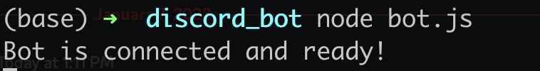

In your Discord server you'll see that your bot account is marked as online:

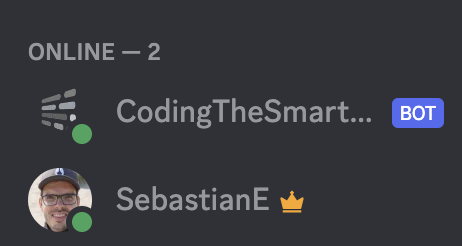

Let's give it a try and type in the message "Hello Bot". You should then receive the answer from the bot immediately:

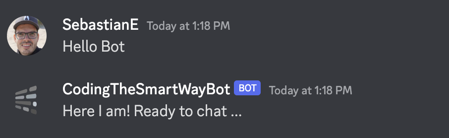

## Conclusion

Extending your Discord server with Chatbots is not rocket science. By following the steps of this article you have implemented activated your first bot from start to finish. From here you can move on easily and extend the logic of the bot as you want.