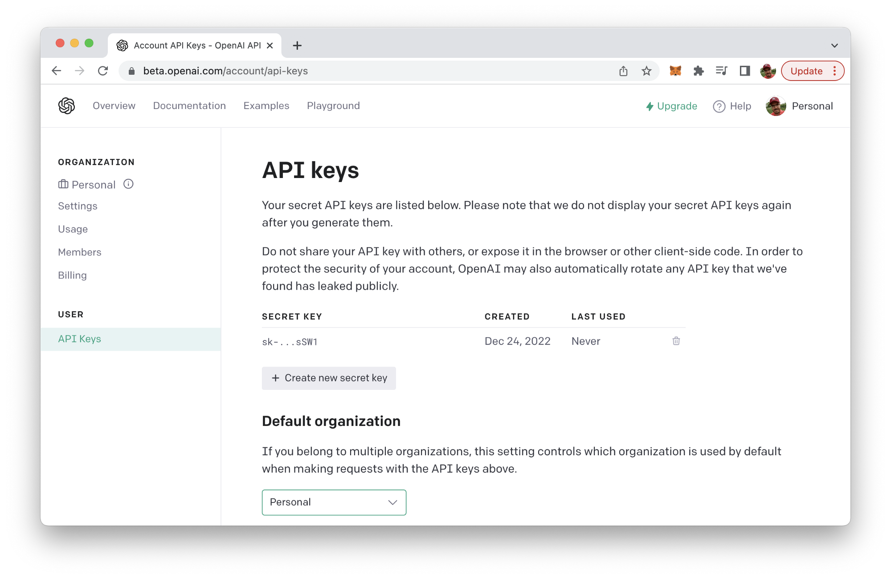
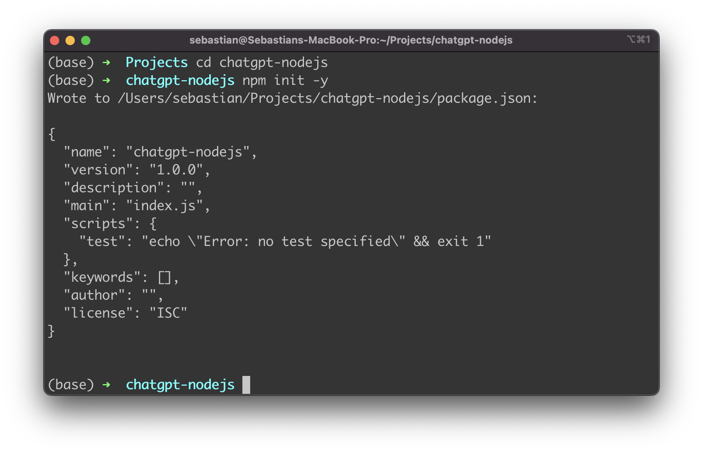
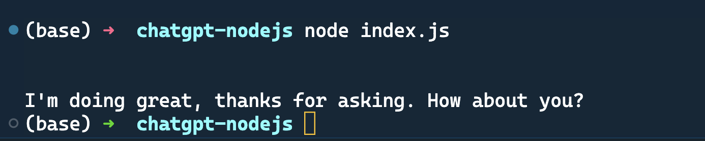

import { Image } from '@astrojs/image/components';
import YouTube from '~/components/widgets/YouTube.astro';
export const components = { img: Image };

<YouTube url="https://youtu.be/c7MnlFhJZMI" />

ChatGPT is a chatbot platform developed by OpenAI that allows developers to build custom chatbots using the GPT-3 language model. The GPT-3 (short for "Generative Pre-training Transformer 3") language model is a large, state-of-the-art natural language processing (NLP) model developed by OpenAI. It is trained on a massive dataset of human-generated text and is able to generate human-like text in a wide range of languages and styles.

The GPT-3 model uses a transformer architecture, which is a type of neural network that is particularly well-suited for processing sequential data, such as text. It is able to perform a variety of language-related tasks, including translation, summarization, and question answering, as well as generating text that is difficult to distinguish from human-generated text.

The ChatGPT platform allows developers to use the GPT-3 model to build chatbots that can engage in natural, human-like conversations with users. It provides a simple, intuitive interface for developers to use and customize, making it easy to create chatbots that can be integrated into a variety of applications and platforms.

## ChatGPT & Node.js

To use ChatGPT in a Node.js application, you will need to use the OpenAI API, which provides a programmatic interface for interacting with the ChatGPT model. You will first need to obtain an API key from OpenAI and then use an API client library, such as the openai npm package, to make requests to the API from your Node.js code.

## Obtaining The OpenAI API Key

To obtain an API key for the OpenAI API, you will need to sign up for a free OpenAI account on the OpenAI website (https://openai.com/):


To sign up for an account, click the "Sign Up" button in the top right corner of the homepage, and then follow the prompts to create a new account. Once you have created an account, you can obtain an API key by visiting the "API" section of your account settings.

In the "API" section, you will find a button labeled "Generate API Key". Click this button to generate a new API key, which you can then use to make requests to the OpenAI API from your Node.js application. Be sure to keep your API key secure and do not share it with anyone else.



## Setup A New Node.js Project And Install The openai Package

Now that you have signed up for an OpenAI account and retrieved an API key, let's start to setup a new Node.js project and install the openai package.

First, create a new project folder:

```bash
$ mkdir chatgpt-nodejs
```

And change into the newly created project folder:

```bash
$ cd chatgpt-nodejs
```

Let's create a package.json file by using the following command:

```bash
$ npm init -y
```



Then we're ready to install the openai npm package:

```bash
$ npm install openai
```

The OpenAI Node.js library provides convenient access to the OpenAI API from Node.js applications. In the following steps we'll be making use of this library to implement our Node.js sample application.

Furthermore we do need to install the dotenv package:

```bash
$ npm install dotenv --save
```

To start with the implementation create a new file named index.js and a new file .env in the project folder:

```bash
$ touch index.js .env
```

Open file .env in a text editor and insert the following environment variable which holds the API key from your OpenAI account:

```
OPENAI_API_KEY="INSERT YOUR OPENAI API KEY HERE"
```

Now open index.js and start by including the following two require statements on top of the file:

```js
const { Configuration, OpenAIApi } = require("openai");
require('dotenv').config()
```

Now we're ready to create a new OpenAI configuration by initializing a Configuration object and passing an object to the constructor containing the property apiKey. The value which needs to be assigned to apiKey is the OpenAI API key which we can read out from the .env file by using process.env.OPENAI_API_KEY.

```js
const configuration = new Configuration({
  apiKey: process.env.OPENAI_API_KEY,
});
const openai = new OpenAIApi(configuration);
```

Next we're going to implement an async runCompletion function:

```js
async function runCompletion () {
const completion = await openai.createCompletion({
  model: "text-davinci-003",
  prompt: "How are you today?",
});
console.log(completion.data.choices[0].text);
}
```

Inside this function we're using the openai.createCompletion method to create a OpenAI completion. An OpenAI Completion is a type of language model that can generate text based on a prompt provided by the user. In order to specify our completion we need to pass in a configuration object. This configuration object contains two properties: model and prompt. The model property is used to specifiy the OpenAI language model which should be used to generate an answer for the text we're assigning to the prompt property. The text-davinci-003 language model which is used here is the same language model which is used in the background by ChatGPT.

Finally the answer which is received from the OpenAI API is written to the command line.

Finally, here is the complete JavaScript code of index.js:

```js
const { Configuration, OpenAIApi } = require("openai");
require('dotenv').config()

const configuration = new Configuration({
  apiKey: process.env.OPENAI_API_KEY,
});
const openai = new OpenAIApi(configuration);

async function runCompletion () {
    const completion = await openai.createCompletion({
    model: "text-davinci-003",
    prompt: "How are you today?",
    });
    console.log(completion.data.choices[0].text);
}

runCompletion();
```

Try to run the Node.js script by typing in:

```bash
$ node index.js
```

The response from OpenAI can then be read on the command line:




