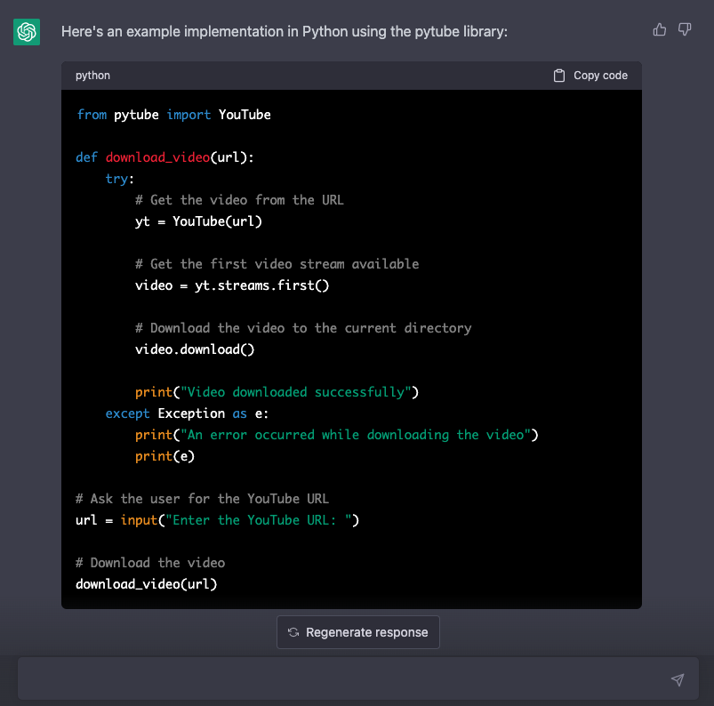
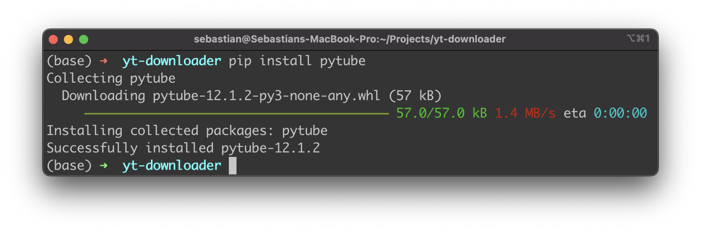
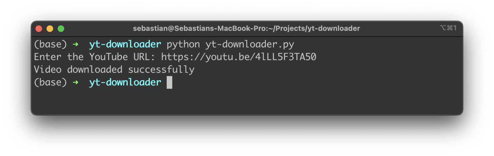
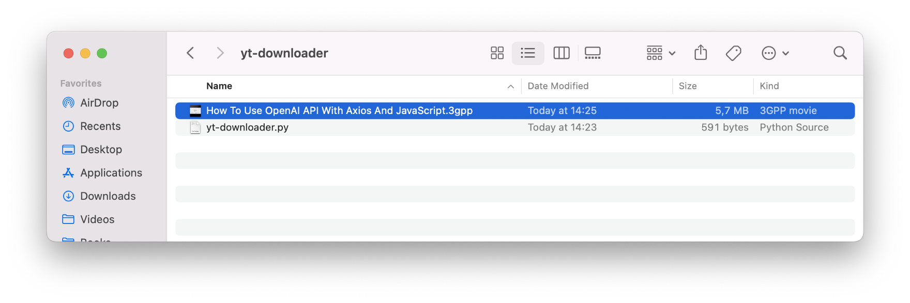
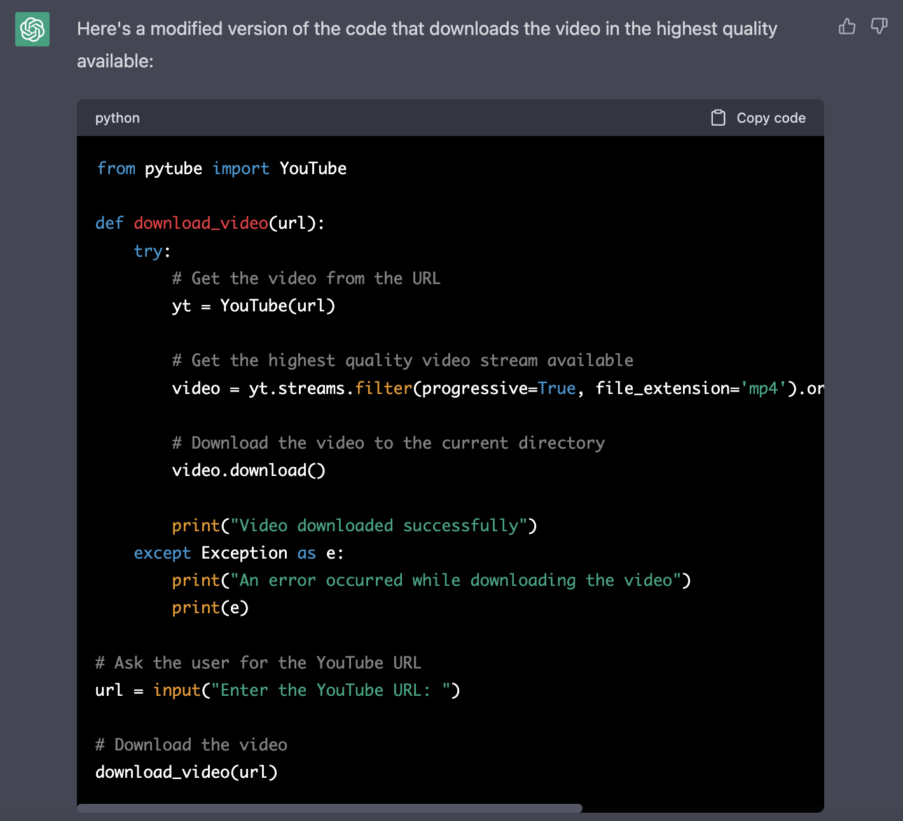
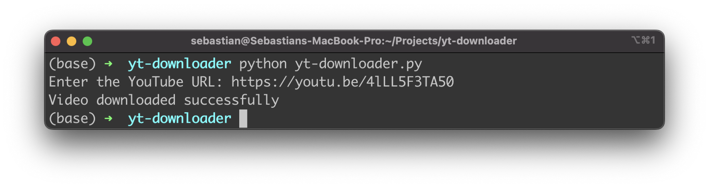
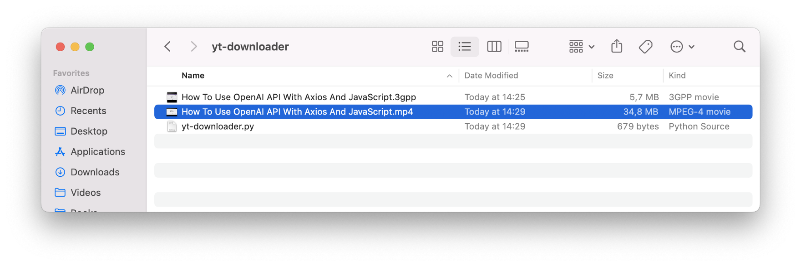

import { Image } from '@astrojs/image/components';
import YouTube from '~/components/widgets/YouTube.astro';
export const components = { img: Image };

Let's use ChatGPT's code generation capabilities to generate a full functional YouTube downloader app in Python without having to write a single line of code by our own! Don't believe this is possible? Just follow the steps in this tutorial …

ChatGPT is a large language model trained by OpenAI that can generate code based on natural language input. This means that you can describe what you want to achieve in plain English and ChatGPT will generate code for you.

In this tutorial we'll use this feature of ChatGPT to get Python code generated for a script which is able to download any video from YouTube. In order to keep this small program dynamic the user must be able to input the URL of the YouTube Video on the command line.

Let's head over to ChatGPT at https://chat.openai.com/chat and start by inputting out requirements for code generation by using the following description:


ChatGPT start immediately generating the code for the Python script using the pytube library as requested:



```bash
$ mkdir yt-downloader
$ cd yt-downloader
$ touch yt-downloader.py
```

With that project directory in place copy and paster the code which was generated by ChatGPT directly into the empty file yt-downloader.py.

```python
from pytube import YouTube

def download_video(url):
    try:
        # Get the video from the URL
        yt = YouTube(url)
        
        # Get the first video stream available
        video = yt.streams.first()
        
        # Download the video to the current directory
        video.download()
        
        print("Video downloaded successfully")
    except Exception as e:
        print("An error occurred while downloading the video")
        print(e)
        
# Ask the user for the YouTube URL
url = input("Enter the YouTube URL: ")

# Download the video
download_video(url)
```

The code first imports the YouTube class from the pytube library. Then, it defines a function download_video that takes a YouTube video URL as an argument. Inside the function, the code attempts to download the video by creating a YouTube object with the provided URL and accessing the first available video stream. The video stream is then downloaded to the current directory.

The function also contains a try-except block to handle exceptions that may occur during the download process. If an error occurs, the function prints an error message and the exception that was raised.

After defining the download_video function, the code prompts the user to enter the YouTube URL and then calls the download_video function with the URL as an argument. If the download is successful, the function prints a message indicating that the video was downloaded successfully.

## Test The Code

In order to test the generated code you can execute the Python script on the command line by simply typing in:

```bash
$ python yt-downloader.py
```

In case you have not installed the pytube library already on your development system you need to get pytupe installed first by typing in:

```bash
$ pip install pytube
```

The package manager downloads and installs this system in your Python development environment:



When you run the Python script you'll be prompted on the command line to provide the URL of the YouTube Video you'd like to download:



Enter the URL and hit return.

As a result you can see that a video in 3GPP format has been downloaded into the project folder:



The format is providing the downloaded video in very low quality and resolution, so that is probably not what we want to have. Let's use ChatGPT again to refactor the code to download a high quality version in the next step:

## Refactor The Code To Download Videos In Highest Quality

Let's tell ChatGPT that we want to have a new version of the Python script which is able to download the video in high quality:


The code is regenerated immediately:



The changes in this version of the code are in the line where the video stream is retrieved. The filter method is used to only include progressive video streams with the mp4 file extension, and the order_by and desc methods are used to sort the streams in descending order by resolution, so that the highest quality video stream is retrieved first.

Let's copy that code over to yt-download.py and replace the existing code in that file with those lines which hvave been provided by ChatGPT:

```python
from pytube import YouTube

def download_video(url):
    try:
        # Get the video from the URL
        yt = YouTube(url)
        
        # Get the highest quality video stream available
        video = yt.streams.filter(progressive=True, file_extension='mp4').order_by('resolution').desc().first()
        
        # Download the video to the current directory
        video.download()
        
        print("Video downloaded successfully")
    except Exception as e:
        print("An error occurred while downloading the video")
        print(e)
        
# Ask the user for the YouTube URL
url = input("Enter the YouTube URL: ")

# Download the video
download_video(url)
```

With the refactored code in place let's run the program once again:



As a result you can see that the download is now available in MP4 format which provides a higher resolution:

