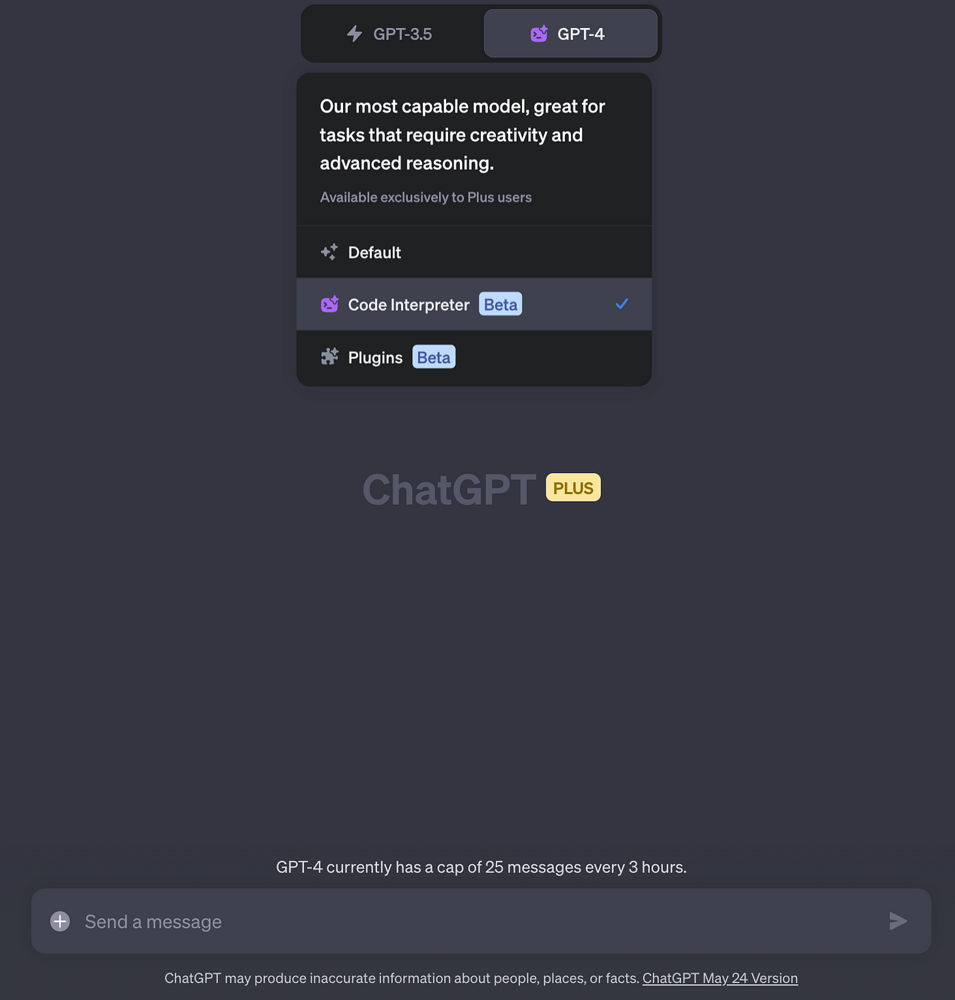
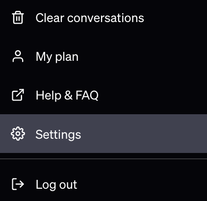
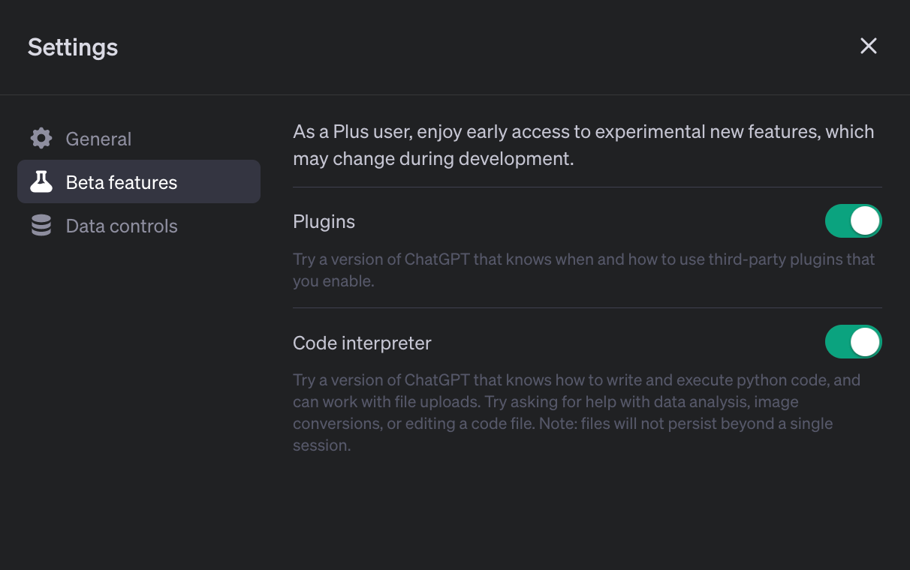
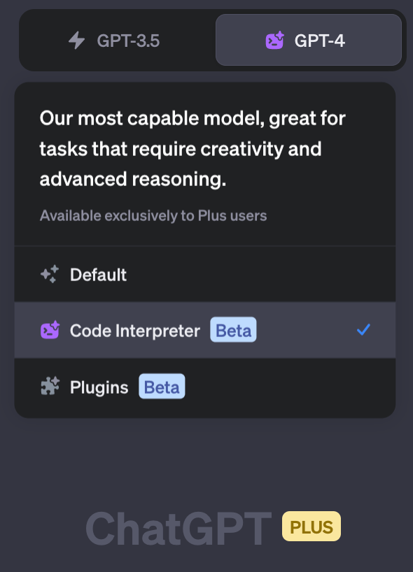
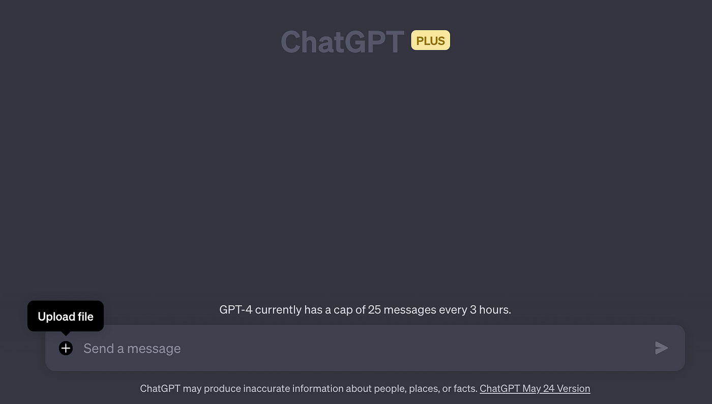

import { Image } from '@astrojs/image/components';
import YouTube from '~/components/widgets/YouTube.astro';
export const components = { img: Image };

If you're like me, always on the lookout for tools that can simplify your data analysis tasks, then you're in for a treat. Today, I'm going to introduce you to a game-changing feature of ChatGPT - the Code Interpreter. This isn't just another plugin; it's a powerful ally that can help you unlock a world of possibilities, from generating stunning data visualizations to cleaning up datasets. Whether you're a seasoned data scientist or a curious beginner, the Code Interpreter is a tool that can make your data analysis tasks a breeze. Let's learn how to get Code Interpreter activated in ChatGPT …

## What is the Code Interpreter?

The Code Interpreter is a plugin for ChatGPT that allows the AI to run code, analyze data, create charts, edit files, and perform mathematical operations. It's like having a personal data scientist at your disposal, ready to help you make sense of complex data and provide actionable insights.

The Code Interpreter is available to all ChatGPT Plus subscribers and can be enabled through the account settings. It's a powerful tool that can write code in Python and manipulate files up to 100MB in size.

## The Power of Code Interpreter

The Code Interpreter is not just a tool for running code; it's a tool for unlocking possibilities. It allows ChatGPT Plus users to generate charts, maps, data visualizations, and graphics, analyze music playlists, create interactive HTML files, clean datasets, and even extract color palettes from images.

For example, a user can upload a CSV file of every lighthouse location in the US and ask ChatGPT to create a GIF map of the lighthouse locations, where the map is very dark but each lighthouse twinkles. A few seconds later, ChatGPT produces an accurate map with twinkling lights atop based on the data uploaded.

## How To Get Started With ChatGPT Code Interpreter

To access Code Interpreter in ChatGPT you first need to log into your ChatGPT account and then access the settings view:

In the settings view you need to select Beta features and the you need to activate the Code interpreter option:

Once the the beta feature is activated you are able to select the Code Interpreter option in any new GPT-4 chat instance, like you can see in the following:

Once Code Interpreter is active you can see that the prompt input field is extended with an option to also upload files:

By using the upload function you can supply Code Interpreter with additional data, like datasets e.g. which are needed to solve a coding task.

## Conclusion

And there you have it! A comprehensive guide to enabling and using the Code Interpreter in ChatGPT. As we've seen, this feature is more than just a code-running tool; it's a key to unlocking a world of possibilities. With the ability to generate charts, analyze playlists, create interactive HTML files, and even extract color palettes from images, the Code Interpreter is a testament to the power of AI in data analysis. So, go ahead and give it a try.
