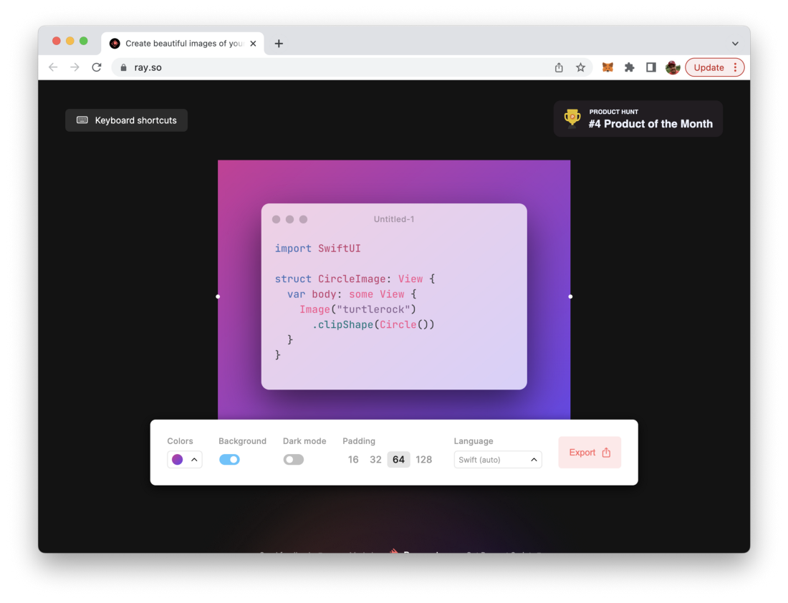
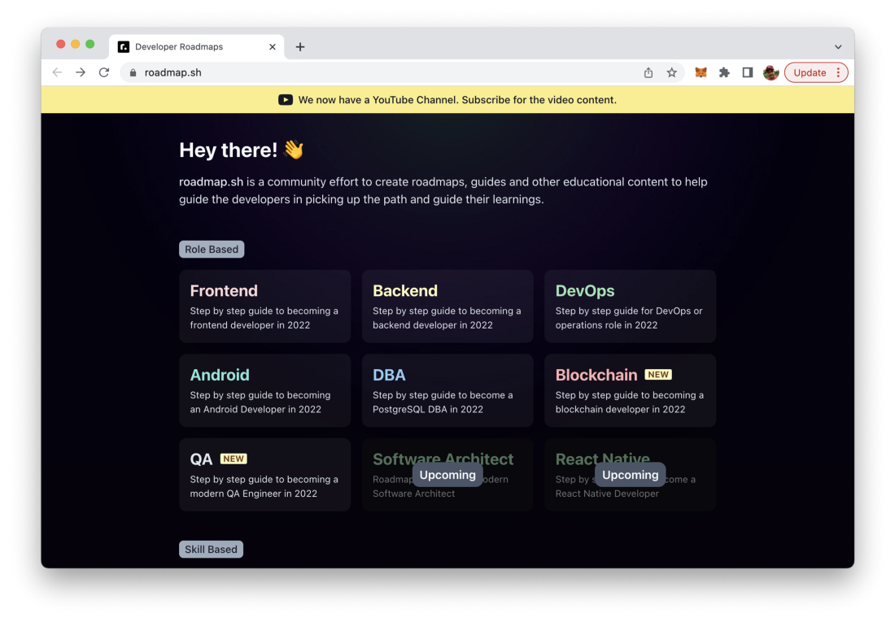
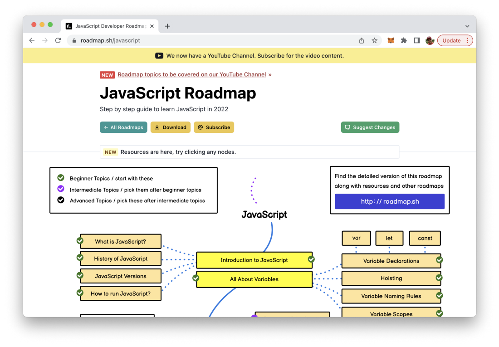
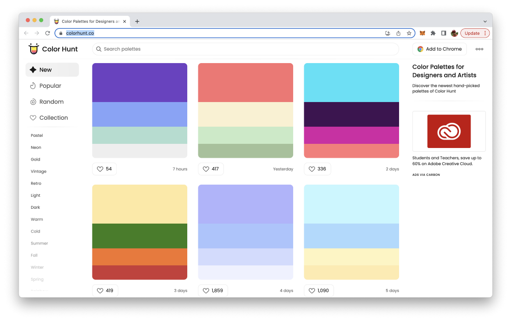
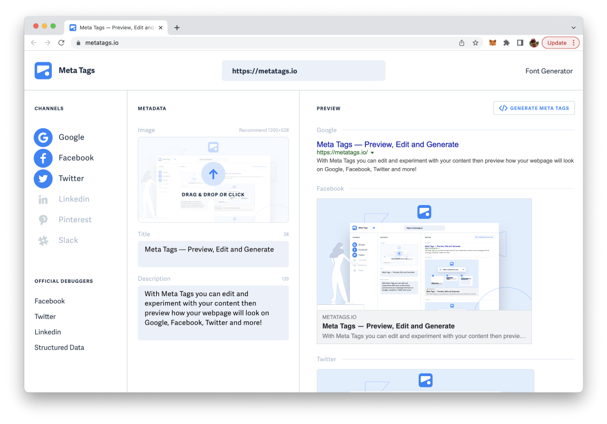
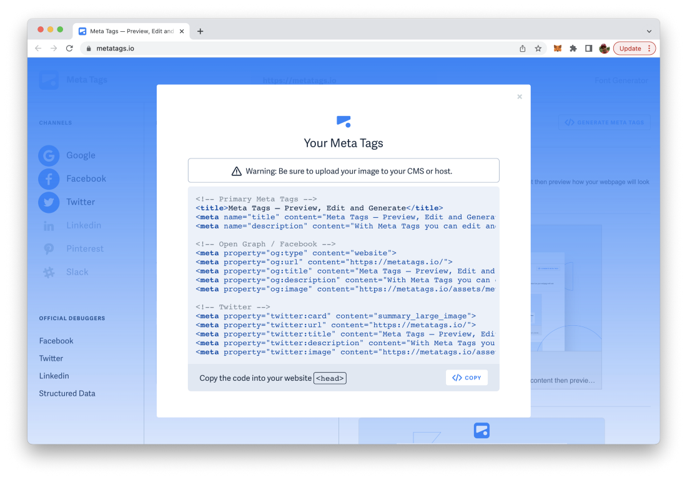
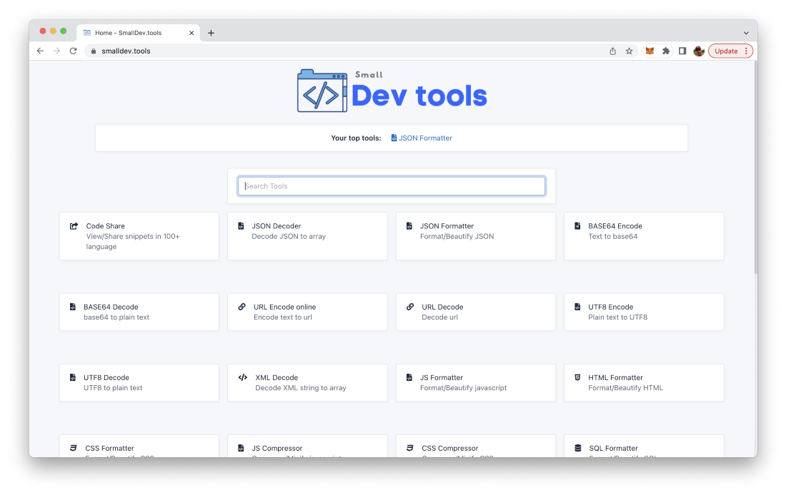
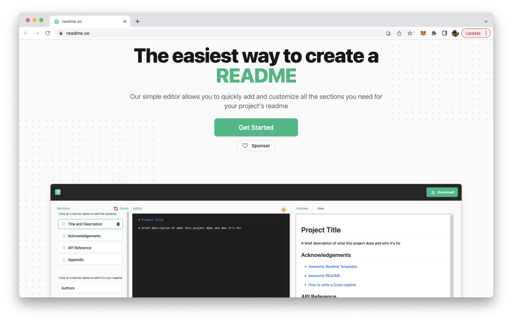
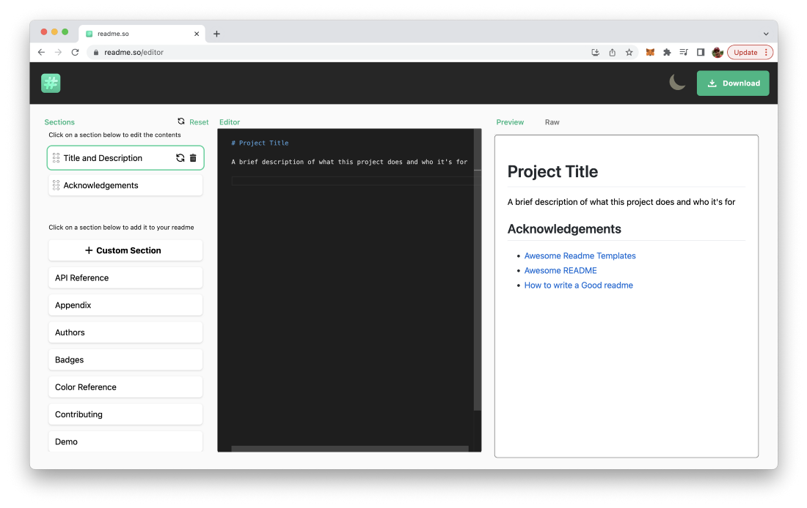
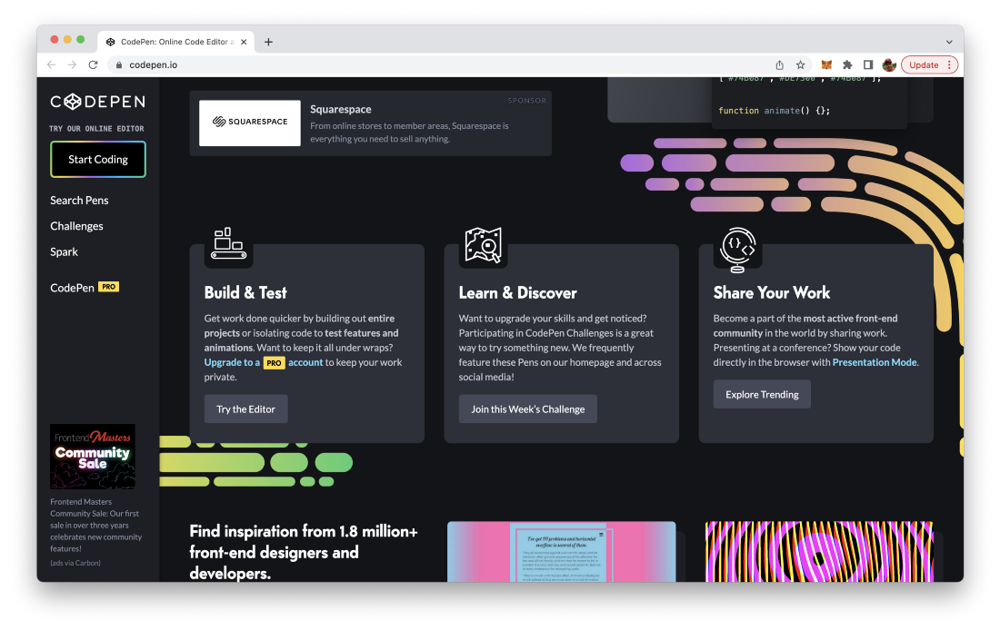

import { Image } from '@astrojs/image/components';
import YouTube from '~/components/widgets/YouTube.astro';
export const components = { img: Image };

*Photo by John Schnobrich on Unsplash.com*
## 1. ray.so

URL: https://ray.so/

This website lets you turn your code into beautiful images. You can apply different settings for generating the image of your code, e.g. apply different presets of syntax colors, hide or show the background, and toggle between dark and light mode easily.

## 2. Roadmap.sh

URL: https://roadmap.sh/

roadmap.sh is a community effort to create roadmaps, guides and other educational content to help guide the developers in picking up the path and guide their learnings.

You can choose between role-based or skill-based learning path. In addition the website provides you with Video tutorials and guides for different technologies. A typical learning path roadmap is shown in the following screenshot:

You can use this learning path to navigate through the topics which are essential to cover the topic and you’re provided with learning resources for every single entry in the roadmap.

## 3. Colorhunt.co

URL: https://colorhunt.co/

Looking for the next gorgeous color palette to start your new design project. Then take a look at https://colorhunt.co/ and you’ll be able to choose from many great color palettes:

## 4. Metatags.io

The metatags.io/ service is a website meta tag generator which also comes with a preview of how your website is displayed in Google, Facebook and Twitter.

You can enter the necessary website information like, preview image, title and description and hit the “Generate Meta Tags” button to get HTML meta tags generated which can directly copied and inserted into the head section of your HTML website.

## 5. Smalldev.tools

URL: https://smalldev.tools/

This website is a collection of small but very useful developer tools, like

- code formatters
- de- und encoders
- minifies
- generators
- editors
- etc.

## 6. Readme.so

URL: https://readme.so/

readme.so/ is a web-based visual- and markdown-based editor for your project’s readme file. By using the editor you can add the various sections which might be relevant for your specific Readme file and add the relevant content per section. The final Readme file can then be easily downloaded.

## 7. Codepen.io

URL: https://codepen.io/

CodePen is an online community for testing and showcasing user-created HTML, CSS and JavaScript code snippets. It functions as an online code editor and open-source learning environment, where developers can create code snippets, called “pens,” and test them.

