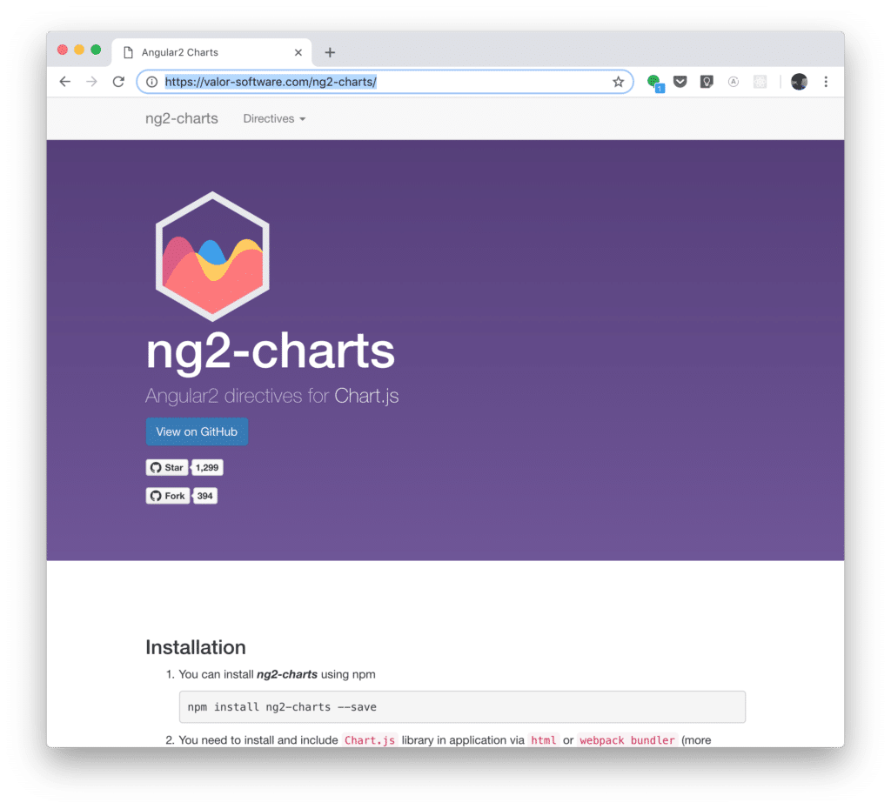
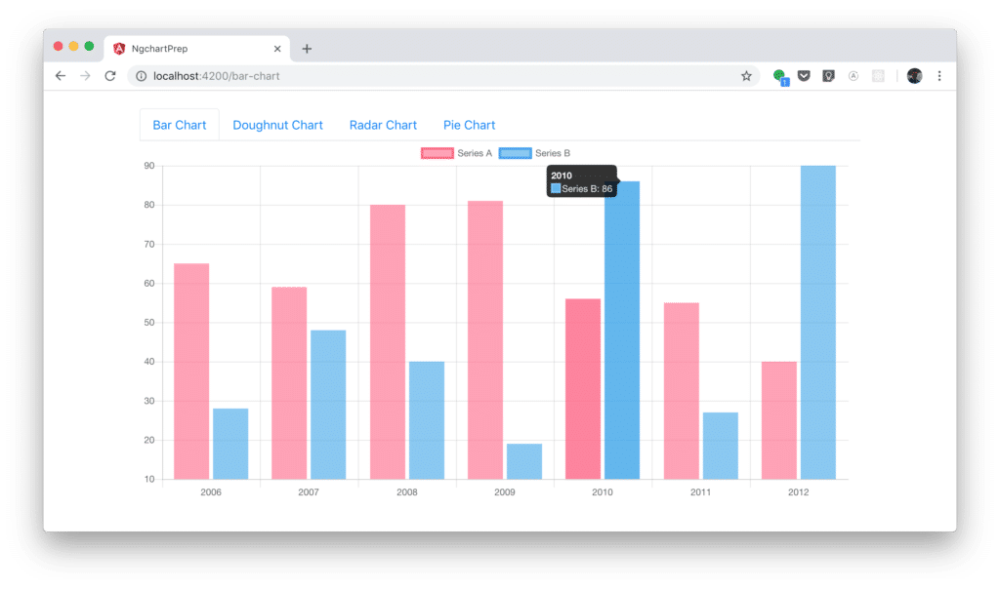
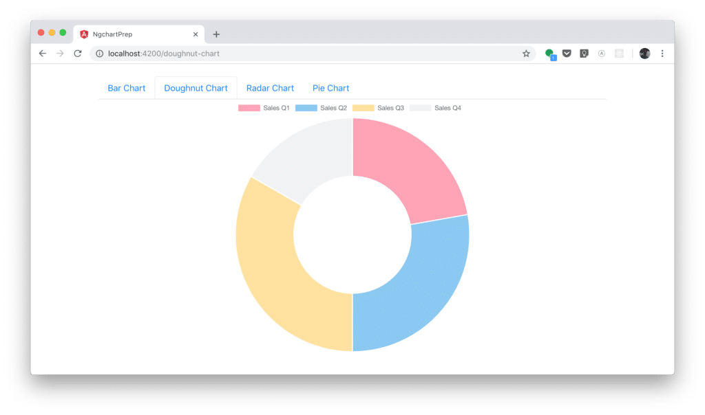
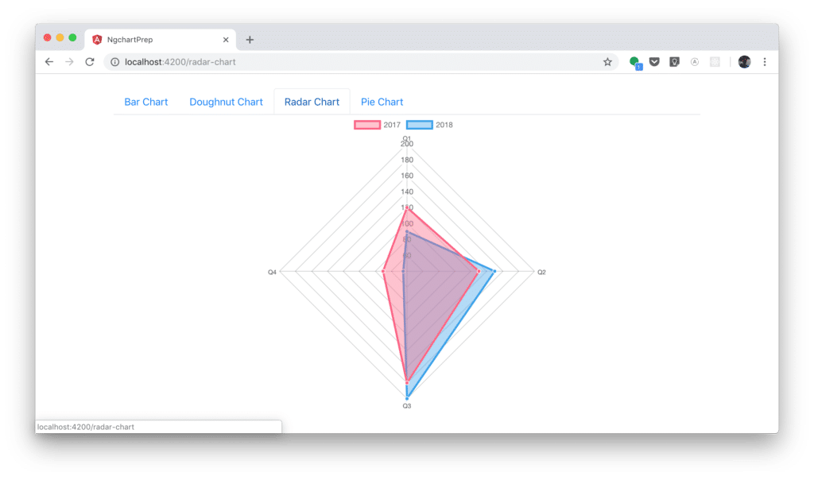
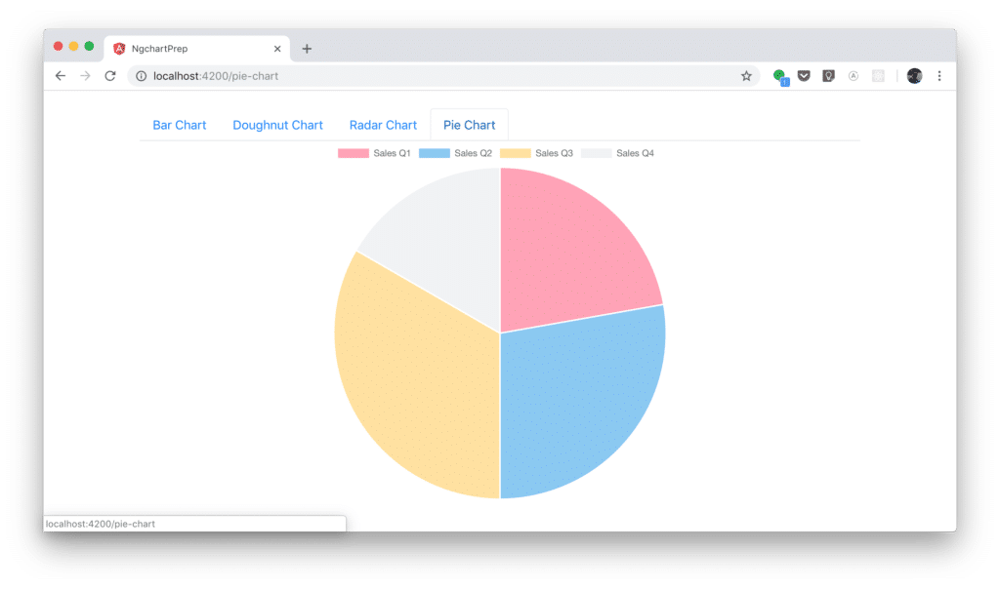

import { Image } from '@astrojs/image/components';
import YouTube from '~/components/widgets/YouTube.astro';
export const components = { img: Image };


<YouTube url="https://youtu.be/1iW0KnEk6UM" />

Chart.js is an opens source JavaScript library which makes it very easy to include animated and responsive charts in your website. If you'd like to combine Chart.js with Angular there is another package which you can use: _ng2-charts_. Adding this package to your project gives you access to Angular directives which you can use to include charts from the Chart.js library. In the following tutorial you'll see some practical examples of how to use the different chart types of Chart.js with the help of _ng2-charts_.

## Initiating A New Angular Project

Let's get started with setting up a new Angular project with Angular CLI:

`$ ng new ngchart --routing`

This command is downloading the default Angular project template and making sure that all dependencies are being installed.

Change into the newly created project folder:

`$ cd ngchart`

### Installing ng2-charts And Chart.js

Now we need to make sure that the ng2-charts library and the Chart.js library is added as a dependency:

`$ npm install ng2-charts`

`$ npm install chart.js`

Having completed this step the chart.js JavaScript file needs to be added in _index.html_ via the following script element which is placed in the body section of the HTML code:

```html
<script src="node_modules/chart.js/src/chart.js"></script>
```

If you would like to take a look at the projects' websites you can take a look at [https://www.chartjs.org/](https://www.chartjs.org/):




### Adding Bootstrap

Furthermore we're going to use some of Bootstrap's CSS classes, so let's install Bootstrap as well:

`$ npm install bootstrap`

To include Bootstrap's CSS file make also sure to add the following line of code in _styles.css_:

```js
@import '~bootstrap/dist/css/bootstrap.min.css';
```

### Importing ChartsModule

To be able to make use of _ng2-charts_ directives in our Angular application we need to make sure to add _ChartsModule_. Therefore first add the following import statement in app.module.ts:

```js
import { ChartsModule } from 'ng2-charts';
```

Furthermore make sure to add _ChartsModule_ to the imports array of the _@NgModule_ decorator as well:

```js
  imports: [
    BrowserModule,
    RouterModule.forRoot(routes),
    ChartsModule
  ],
```

### Adding Basic HTML Structure

Let's also add a basis HTML structure (including a tab navigation) in _app.component.html_:

```html
<div class="container">
  <ul class="nav nav-tabs">
    <li class="nav-item">
      <a class="nav-link" routerLink="/bar-chart">Bar Chart</a>
    </li>
    <li class="nav-item">
      <a class="nav-link" routerLink="/doughnut-chart">Doughnut Chart</a>
    </li>
    <li class="nav-item">
      <a class="nav-link" routerLink="/radar-chart">Radar Chart</a>
    </li>
    <li class="nav-item">
      <a class="nav-link" routerLink="/pie-chart">Pie Chart</a>
    </li>
  </ul>
  <div>
      <router-outlet></router-outlet>
  </div>
</div>
```

We're making use of Bootstrap's CSS classes to implement the navigation structure. Furthermore the `<router-outlet>` element is added as a placeholder for the routing component which is activated. The corresponding router configuration will be added to our application later on.

## Bar Chart Example

Let's implement a first example in which we're going to implement a bar chart. In our Angular application let's create another component:

`$ ng g c my-bar-chart`

This command is adding four new files to our project:

- _src/app/my-bar-chart/my-bar-chart.component.html_
- _src/app/my-bar-chart/my-bar-chart.component.ts_
- _src/app/my-bar-chart/my-bar-chart.component.css_
- _src/app/my-bar-chart/my-bar-chart.component.spec.ts_

Open _my-bar-chart.component.html_ and replace the content of that file with the following code:

```html
<div>
  <div style="display: block">
    <canvas baseChart
            [datasets]="barChartData"
            [labels]="barChartLabels"
            [options]="barChartOptions"
            [legend]="barChartLegend"
            [chartType]="barChartType">
    </canvas>
  </div>
</div>
```

Here we're using the _baseChart_ directive which is added to a canvas element. Furthermore the attributes _datasets_, _labels_, _options_, _legend_ and _chartType_ are bound to class members which are added to the implementation of class _MyBarChartComponent_ in _my-bar-chart-component.ts_:

```js
import { Component, OnInit } from '@angular/core';

@Component({
  selector: 'app-my-bar-chart',
  templateUrl: './my-bar-chart.component.html',
  styleUrls: ['./my-bar-chart.component.css']
})
export class MyBarChartComponent implements OnInit {

  constructor() { }

  public barChartOptions = {
    scaleShowVerticalLines: false,
    responsive: true
  };

  public barChartLabels = ['2006', '2007', '2008', '2009', '2010', '2011', '2012'];
  public barChartType = 'bar';
  public barChartLegend = true;

  public barChartData = [
    {data: [65, 59, 80, 81, 56, 55, 40], label: 'Series A'},
    {data: [28, 48, 40, 19, 86, 27, 90], label: 'Series B'}
  ];

  ngOnInit() {
  }

}
```

## Doughnut Chart Example

Let's create a second new component in our Angular application to see a doughnut chart example in action:

`$ ng g c my-doughnut-chart`

Again, the HTML code which needs to be inserted in in _my-doughnut-chart.component.html_:

```html
<div style="display: block">
  <canvas baseChart
              [data]="doughnutChartData"
              [labels]="doughnutChartLabels"
              [chartType]="doughnutChartType"></canvas>
</div>
```

In _my-doughnut-chart-component.ts_ the following TypeScript code needs to be inserted:

```js
import { Component, OnInit } from '@angular/core';

@Component({
  selector: 'app-my-doughnut-chart',
  templateUrl: './my-doughnut-chart.component.html',
  styleUrls: ['./my-doughnut-chart.component.css']
})
export class MyDoughnutChartComponent implements OnInit {

  public doughnutChartLabels = ['Sales Q1', 'Sales Q2', 'Sales Q3', 'Sales Q4'];
  public doughnutChartData = [120, 150, 180, 90];
  public doughnutChartType = 'doughnut';

  constructor() { }

  ngOnInit() {
  }

}
```

## Radar Chart Example

In the third example we're creating a radar chart example. Again we're starting by creating a new component:

`$ ng g c my-radar-chart`

Here is the HTML code which needs to be inserted in _my-radar-chart.component.html_:

```html
<div style="display: block">
  <canvas baseChart
          [datasets]="radarChartData"
          [labels]="radarChartLabels"
          [chartType]="radarChartType"></canvas>
</div>
```

And the corresponding TypeScript code in _my-radar-chart.component.ts_:

```js
import { Component, OnInit } from '@angular/core';

@Component({
  selector: 'app-my-radar-chart',
  templateUrl: './my-radar-chart.component.html',
  styleUrls: ['./my-radar-chart.component.css']
})
export class MyRadarChartComponent implements OnInit {

  public radarChartLabels = ['Q1', 'Q2', 'Q3', 'Q4'];
  public radarChartData = [
    {data: [120, 130, 180, 70], label: '2017'},
    {data: [90, 150, 200, 45], label: '2018'}
  ];
  public radarChartType = 'radar';

  constructor() { }

  ngOnInit() {
  }

}
```

## Pie Chart Example

The final component is used to add a pie chart example to our application:

`$ ng g c my-pie-chart`

HTML code in _my-pie-chart.component.html_:

```html
<div style="display: block">
  <canvas baseChart
          [data]="pieChartData"
          [labels]="pieChartLabels"
          [chartType]="pieChartType"></canvas>
</div>
```

In _my-pie-chart.component.ts_:

```js
import { Component, OnInit } from '@angular/core';

@Component({
  selector: 'app-my-pie-chart',
  templateUrl: './my-pie-chart.component.html',
  styleUrls: ['./my-pie-chart.component.css']
})
export class MyPieChartComponent implements OnInit {

  public pieChartLabels = ['Sales Q1', 'Sales Q2', 'Sales Q3', 'Sales Q4'];
  public pieChartData = [120, 150, 180, 90];
  public pieChartType = 'pie';

  constructor() { }

  ngOnInit() {
  }

}
```

## Router Configuration

Finally we need to make sure that the router configuration is in place. First of all the following import statement needs to be available in _app.module.ts_:

```js
import { Routes, RouterModule } from '@angular/router';
```

The router configuration comprises routes for our four components plus one default route which is connected to _MyBarChartComponent_.

```js
const routes: Routes = [
  {path: 'bar-chart', component: MyBarChartComponent},
  {path: 'doughnut-chart', component: MyDoughnutChartComponent},
  {path: 'radar-chart', component: MyRadarChartComponent},
  {path: 'pie-chart', component: MyPieChartComponent},
  {path: '**', component: MyBarChartComponent }
];
```

To activate the router configuration _RouterModule_ needs to be added to the imports array in the following way:

```js
  imports: [
    BrowserModule,
    RouterModule.forRoot(routes),
    ChartsModule
  ],
```

As a result you should now be able to see the following application in the browser.

Bar Chart:









## Conclusion

Chart.js is one of the most popular JavaScript charting libraries available. By using Chart.js you're able to include responsive charts in your website with ease. Combining the power of Chart.js with Angular is a very common use case. The _ng2-charts_ library is containing Angular directives which makes it even easier to including Chart.js charts in your single-page web application.