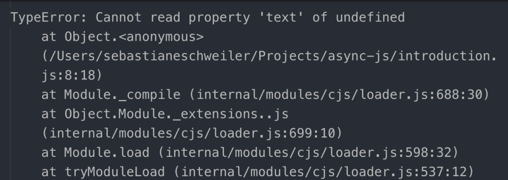
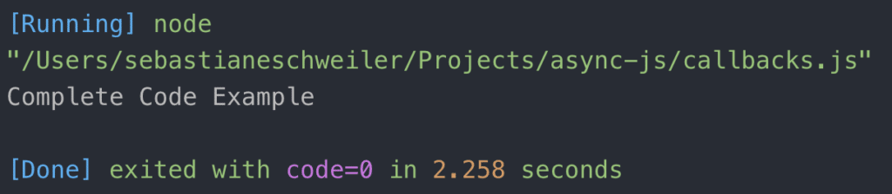
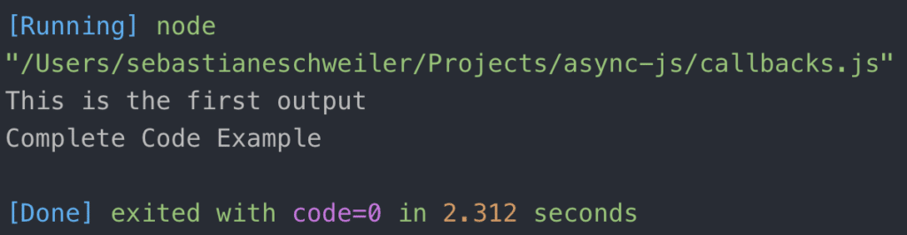
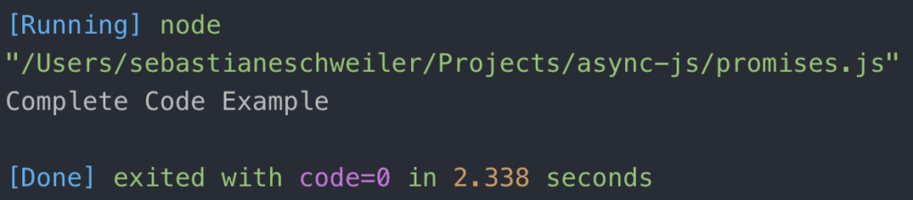
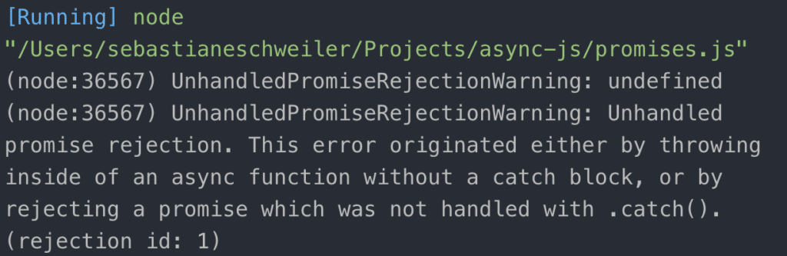
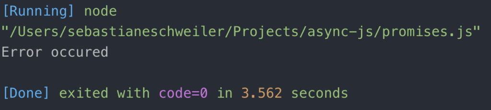

import { Image } from '@astrojs/image/components';
import YouTube from '~/components/widgets/YouTube.astro';
export const components = { img: Image };


<YouTube url="https://youtu.be/cDcmIfXFaWc" />

## Introduction To Asynchronous Programming in JavaScript

In general JavaScript is running code in a non-blocking way. This means that code which is is taking some time to finish (like accessing an API, reading content from the local file system etc.) is being executed in the background and in parallel the code execution is continued. This behaviour is being described by term asynchronous programming.

Because JavaScript is executed in that non-blocking way you have to take additional measures to deal with that code if you need to have the result available before further code is being executed.

Let's take a look at the following first example to get a better understanding of the problem:

```js
const getTodo = () => {
    setTimeout(() => {
        return { text: 'Complete Code Example' }
    }, 2000)
}

const todo = getTodo()
console.log(todo.text)
```

Here we're defining a function _getTodo_. This function is returning a todo item (as a JSON object with the string property _text_). To simulate a API call we're delaying the response for 2 seconds by wrapping the return statement in an anonymous function which is passed to _setTimeout_. The second parameter of _setTimeout_ is the amount of millisecond for which the execution of the function should be delayed.

The result of the _getTodo_ function call is stored in a constant named todo and finally we're trying to print out the _text_ information by using a console.log call. This result in the following error when executing this code:



So why are we getting this type of error stating that it cannot read property _text_ of undefined. The reason is quite clear: as the return value of getTodo function is delivered with a delay of 2000 milliseconds the object is not available when trying to output _todo.text_ to the console. The code execution has continued without waiting for the call of _getTodo_ to be finished. This is a typical problem when dealing with asynchronous code executing.

So what could be a solution to this problem? Fortunately JavaScript has many solutions to offer. First we're going to take a look at Callbacks in the following section.

## Callbacks

Callbacks are simple functions which are used to notify the calling instance when an asynchronous code block has been executed and the result is available.

Using callbacks is simple as we only need to deal with functions, take a look at the following example:

```js
const getTodo = callback => {
    setTimeout(() => {
       callback ({ text: 'Complete Code Example' })
    }, 2000)
}

getTodo(todo => {
    console.log(todo.text)
})
```

The _getTodo_ function is defined, so that it takes the callback function as a parameter. Inside _getTodo_ we're again using the getTimeout function to delay the execution of code for 2000 milliseconds. Instead of just returning the object we're now calling the callback function. As an argument we're passing in the object which should be returned.

When calling getTodo we now need to make sure to pass in a callback function as a parameter. In the example from above we're doing this by using the fat arrow syntax to define an anonymous function. Inside that functions we're outputting _todo.text_. This function is invoked from inside of _getTodo_ when the 2000 millisecond delay is passed.

Running this code again is now delivering the expected result, the string “Complete Code Example” is output to the command line:



Just to get a better understanding of the execution flow of the code let's add another _console.log_ call at the end of the file:

```js
const getTodo = callback => {
    setTimeout(() => {
       callback ({ text: 'Complete Code Example' })
    }, 2000)
}

getTodo(todo => {
    console.log(todo.text)
})

console.log("This is the first output")
```

This code leads to the following output:



From the result you can learn that the last console.log statement is executed first. The reason is quite obvious. The first _console.log_ statement is embedded in the callback function of _getTodo_. The execution of this callback function is still delayed by 2000 milliseconds, so the the output to the command line is delayed as well.

## Promises

Now that you've learnt about callbacks lets turn to _Promises_ which is a built-in language feature of JavaScript and makes handling asynchronous code easier and more readable:

```js
const getTodo = () => {
    return new Promise((resolve, reject) => {
        setTimeout(() => {
            let error = false;
            if(!error)
                resolve({ text: 'Complete Code Example' })
            else
                reject()
        }, 2000)     
    })
}

getTodo().then(todo => {
    console.log(todo.text)
})
```

This code is basically doing the same as seen before in our callback example but with _Promises_.

Inside the _getTodo_ function we're making sure to return a new _Promise_. The constructor of the _Promise_ class is expecting to get a function which is containing the asynchronous code as a parameter. This function is then expecting to get two parameter, _resolve_ and _reject_, and containing the asynchronous code which needs to be executed.

In case the asynchronous code has been executed successfully we're calling _resolve_. In case of errors we're calling the reject function.

When calling the _getTodo_ function we're now able to chain a call of _then_. Then is expecting to get handed over a function which is executed once the Promise is being resolved. As a parameter this function gets what is passed into the call of resolve. In the example from above we're using the function body to print the content of _text_ property to the console once again.

The result (after 2000 milliseconds delay) should correspond to what you can see in the following:



To simulate the occurrence of an error lets set the _error_ variable to true.

```js
let error = true;
```

By making this change we're now making sure that the else branch is entered and instead of the _resolve_ function the _reject_ function is called. By invoking the _reject_ function we're informing about the fact that the Promise cannot be resolved successfully because an error has occurred.

Though, when executing the code again we're running in the following error informing us about an unhandled promise rejection warning:



In order to handle the rejection of a promise we need to make further changes to our code and also chain a call of _catch_ as you can see in the following:

```js
getTodo()
    .then(todo => {
        console.log(todo.text)
    })
    .catch(error => {
        console.log("Error occurred")
    })
```

The _catch_ function is expecting to get passed in a function which is handling the error state. In our example we're just making sure to output the string “Error occurred” to the console which then should lead to the following result when re-executing the code:



## Async / Await

Now that you have learnt about Promises and how Promises may help you to deal with asynchronous JavaScript code we can go one step further and learn about two new language keywords which have been added to JavaScript with the ES2017 language specification.

By using _async_ and _await_ the handling of promises is becoming more easier, let's take a look at the following code:

```js
const getTodo = () => {
    return new Promise((resolve, reject) => {
        setTimeout(() => {
            let error = false;
            if(!error)
                resolve({ text: 'Complete Code Example' })
            else
                reject()
        }, 2000)     
    })
}

async function fetchTodo () {
    const todo = await getTodo()
    return todo
}

fetchTodo().then(todo => console.log(todo.text))
```

The implementation of the getTodo function has not changed at all. Still the Promise is created and depending on the value of the error variable it is resolved or rejected like seen before.

What has changed is the way the _getTodo_ function is called. A new function _fetchTodo_ is being implemented and the _async_ keyword is used to indicate that this function is executing asynchronous code based on a Promise.

Inside of _fetchTodo_ we're calling the _getTodo_ method by using the keyword _await_. This indicates that _getTodo_ is returning a Promise and we have to wait for the Promise to be resolved (or rejected). The result of what is being returned from the promise is stored in _todo_. In the next line of code the _todo_ object is being returned. This is possible because by using the keyword _await_ we're making sure that the next line of code is being executed after the Promise (returned from _getTodo_) has been resolved.

Finally we're calling _fetchTodo_ and chaining a call of _then_. The function which is passed to then makes sure that the _text_ information of the _todo_ item is output to the console once again:


In the last example let's take a look at how we're able to handle error when applying asnyc / await:

```js
const getTodo = () => {
    return new Promise((resolve, reject) => {
        setTimeout(() => {
            let error = true;
            if(!error)
                resolve({ text: 'Complete Code Example' })
            else
                reject()
        }, 2000)     
    })
}

async function fetchTodo () {
    try { 
        const todo = await getTodo()
        return todo
    } catch (error) {
        console.log("Error occurred")
    }
}

fetchTodo()
    .then(todo => console.log(todo.text))
    .catch(() => console.log("Error occurred")))
```

Inside the async _fetchTodo_ function we're using a try-catch-block to handle an error which might occur when executing the call of function _getTodo_.

## Summary

In general JavaScript is executing asynchronous code in a non-blocking way which is great to ensure responsiveness of the application. However, when dealing with asynchronous code (e.g. reading from the file system, accessing external APIs) we need to handle it in a special way to be able to deal with the results which this code is delivering.

JavaScript offers various possibilities of doing so. With callbacks, Promises and async/await you've learnt about the most common concepts of how to deal with asynchronous code in your JavaScript program in this blog posts.