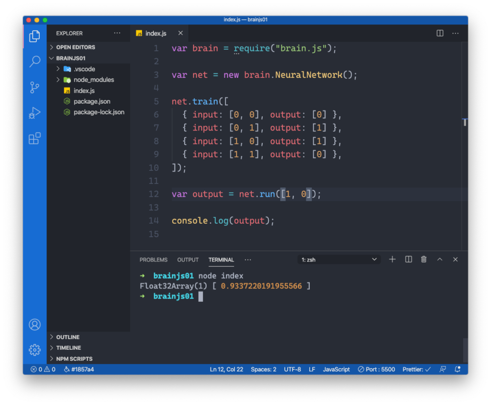

import { Image } from '@astrojs/image/components';
import YouTube from '~/components/widgets/YouTube.astro';
export const components = { img: Image };


<YouTube url="https://youtu.be/gi09S_MydoU" />

### Part 1: Building Your First Neural Network

Neural Networks are the essential building blocks for machine learning and artificial intelligence applications. By using Neural Networks we’re able to solve problems that can’t easily by solved by traditional algorithms, like face detection, voice recognition, or medical diagnosis.  
  
In this tutorial we’ll start from the very beginning. You’ll learn how to apply Neural Networks by using a JavaScript library called Brain.js. Brain.js makes it very easy to get started with Neural Networks and Deep Learning because it gives hides away the complexity of neural networks and instead provides you with an easy to use API to create and configure neural networks very easily.

### A First Example With Brain.js

Before actually getting started with Neural Networks and Brain.js let’s take a quick look at the problem which should be solved in this first part of this series. As a first simple example our Neural Network should be trained with data coming from an Exclusive OR (XOR) gate consisting two input parameters and one output parameter.

Here you can see that the output will be 1 when only one of the two input parameters is 1 as well.

### Setting Up The Project

To setup a new Brain.js project we simply need to create a new empty folder at first:  
  
`$ mkdir my-brainjs-test`  
  
We’ll be using the Node.js Package Manager (NPM) to manage the dependencies of this project. In order to be able to use NPM we need to make sure that Node.js is installed first. If Node.js is not installed yet just go to [https://nodejs.org/en/](https://nodejs.org/en/) and follow the installation instructions for your platform.  
  
Now we’re able to use the _npm_ command to create a new package.json file within the project folder by executing the command in the following way:  
  
`$ npm init -y`  
  
Now we’re ready to add the NPM package _brain.js_ to our project by using the following command:  
  
`$ npm install --save brain.js`

### Creating A Neural Network With Brain.js

Let’s now make use of Brain.js and create a first simple neural network that will be used to solve the XOR task by using deep learning. Create a new empty JavaScript file in the project folder:  
  
`$ touch index.js`  
  
Then insert the following two lines of code:

```javascript
var brain = require("brain.js");

var net = new brain.NeuralNetwork();
```

By using the require function in the first line we’re including the Brain.js package in our script, so that we’re able to access Brain.js functionality. Next we’re creating a new instance of the Brain.js _NeuralNetwork_ class with default settings. This neural network will be used to solve our XOR problem.

### Training The Neural Network

The next step is to train the neural network with labeled training data. Labeled in this case means that we’re providing not only the input to the neural network but also the output. For our simple XOR problem the training code looks like what you can see in the following code listing:

```javascript
net.train([
  { input: [0, 0], output: [0] },
  { input: [0, 1], output: [1] },
  { input: [1, 0], output: [1] },
  { input: [1, 1], output: [0] },
]);
```

Training the neural network is done by calling the train method and providing an array with the training data included as a parameter to the method call.  
  
The array consists of objects which comprises two properties each: The _input_ property is used to provide an array of two input values and the _output_ property is used to provide an array with the resulting value.

### Run The Neural Network

Now that the neural network is trained we’re ready to let it solve the problem by using the run method and providing an array of inputs:

```javascript
var output = net.run([1, 0]);

console.log(output);
```

The resulting value is stored in output and written to the console as you can see in the following screenshot:



Providing the input values 1 and 0 should lead to the result of 1. However as you can see in the screenshot we’re not getting exactly 1 as the resulting value. Instead we’re getting back a result from the neural network which is very close to 1. The reason for this is that the neural network is not dealing with a fixed algorithm to solve the problem. Instead the neural network is learning based on the provided sample data and performing it’s internal computation of the basis of probabilities.  
  
Again in the following code listing you can see the complete code of _index.js_:

```javascript
var brain = require("brain.js");

var net = new brain.NeuralNetwork();

net.train([
  { input: [0, 0], output: [0] },
  { input: [0, 1], output: [1] },
  { input: [1, 0], output: [1] },
  { input: [1, 1], output: [0] },
]);

var output = net.run([1, 0]);

console.log(output);
```