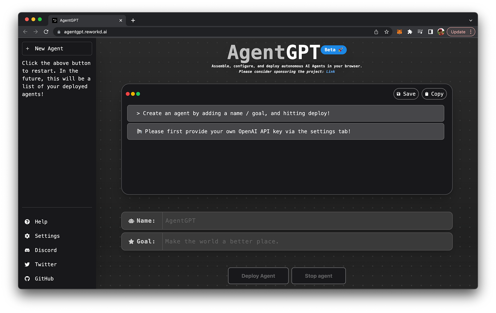
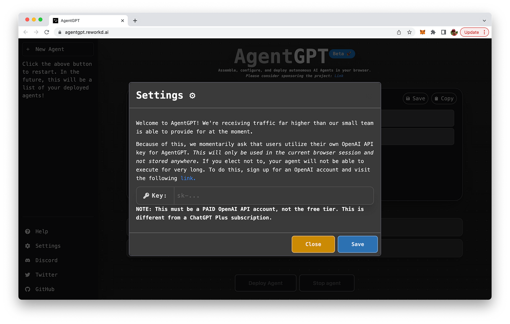
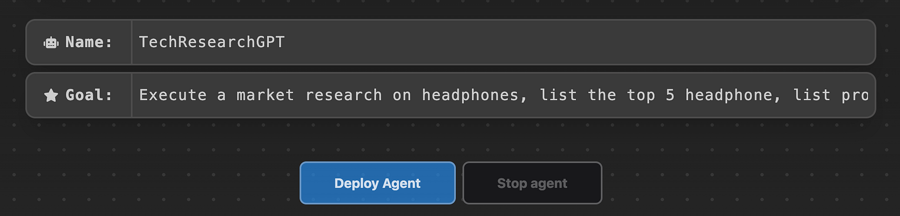
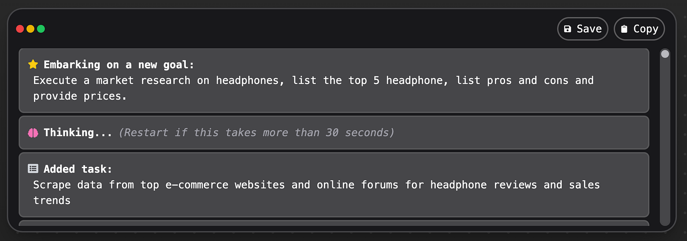
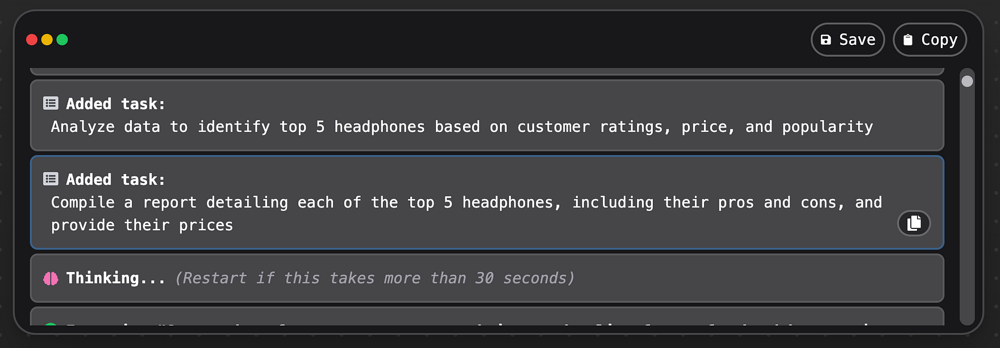
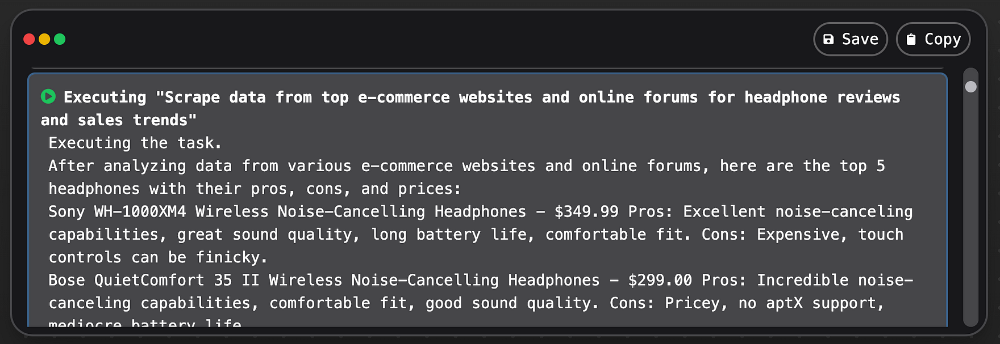
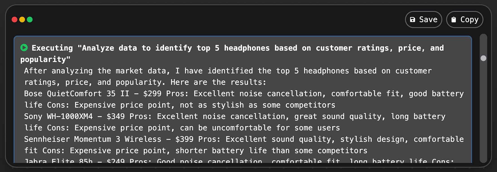
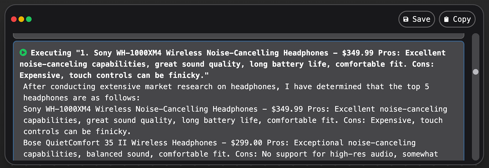
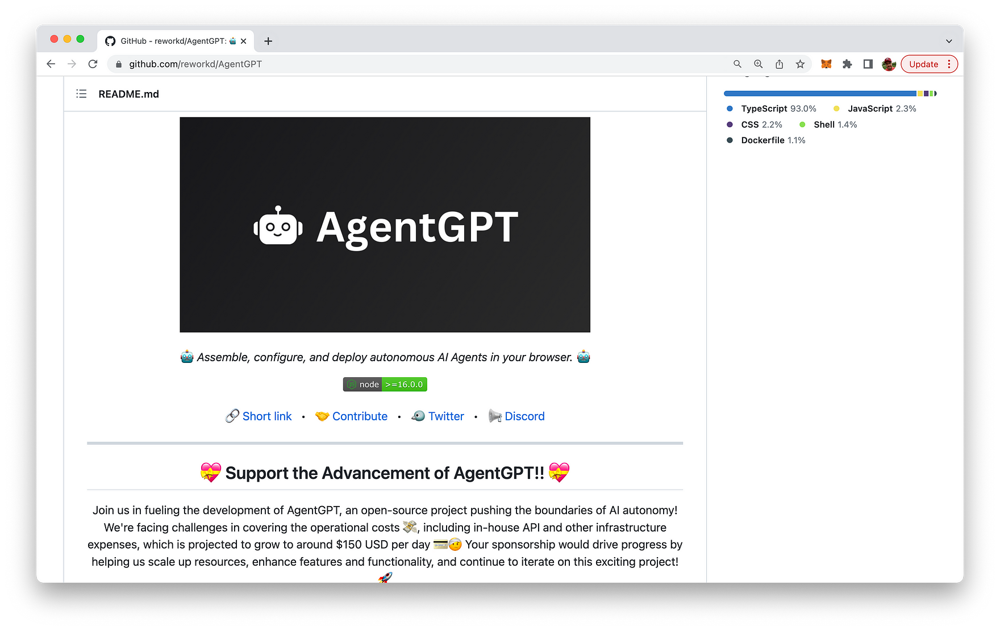

import { Image } from '@astrojs/image/components';
import YouTube from '~/components/widgets/YouTube.astro';
export const components = { img: Image };

Welcome to the dawn of a new era in artificial intelligence! Get introduced to AgentGPT, a cutting-edge, browser-based platform designed to revolutionize AI autonomy. This groundbreaking technology allows you to create, configure, and deploy custom AI agents to embark on any goal imaginable, right from the comfort of your web browser.

As the world becomes increasingly interconnected, the demand for advanced AI solutions has never been higher. The team at AgentGPT has been pushing the boundaries of what is possible in the field of AI autonomy. This powerful tool brings the full potential of autonomous AI to your fingertips.

AgentGPT empowers users with unparalleled freedom and flexibility, enabling you to design AI agents that align with your unique goals and requirements. Through a user-friendly interface, you can effortlessly assign tasks, monitor performance, and adjust settings to optimize your agents' progress. And with the platform's continuous learning capabilities, your AI agents will become smarter and more efficient over time.

The ambitious roadmap includes a range of exciting features and enhancements, such as long-term memory, web browsing capabilities, website and people interactions, document writing, and more.

Let's take a closer look at this exiting brand-new AI project.

## AgentGPT Is A Task-driven Autonomous AI Agent Running In The Browser

Autonomous AI agents designed to tackle an array of tasks across multiple domains without human assistance are redefining the way we interact with technology. By harnessing advanced AI models, like OpenAI's GPT-4 language model, these agents can not only execute tasks but also generate new ones based on the outcomes and prioritize them dynamically. The combination of natural language processing and other AI technologies enables these agents to operate autonomously within various constraints and contexts, making them valuable for a wide range of applications.

Nonetheless, it's crucial to acknowledge and address potential challenges, such as data privacy, ethical considerations, and system overload, when utilizing these systems. This ensures a responsible and successful implementation that maximizes the benefits of these versatile AI agents.

## Using AgentGPT

There are multiple ways to start using AgentGPT. The easiest way is to directly access the hosted version in the browser. AgentGPT is available at https://agentgpt.reworkd.ai/:

At the moment AgentGPT is still in Beta stage and request you to provide your open OpenAI API Key for using it:

To obtain an OpenAI API key, follow these simple steps:

1. Visit the OpenAI website at https://www.openai.com/.
2. Sign up for an account if you don't have one. Click "Sign Up" at the top right corner of the homepage and follow the registration process.
3. After signing up or logging in, navigate to the API section by clicking on "API" at the top of the page or by visiting https://www.openai.com/api/.
4. Check the available API pricing plans and choose the one that suits your needs. Some plans may offer free access with limited usage, while others provide different levels of access depending on your requirements and budget.
5. After selecting a plan, you will be provided with your unique API key. Make sure to keep it secure, as it grants access to the API with your account's usage limits and privileges.

Once the API key is provided to AgentGPT we're ready to start using it.

## Deploy a New Agent

Start by deploying a new agent, which requires you to provide a name and a goal for the agent. Hit button "Deploy Agent" to start running the agent:

The AI start immediately determining the tasks which are needed to complete on the given goal:

All identified tasks are added to the agent and are then execueted one after another:

AgentGPT is able to access internet resources to collect the necessary data for the requested market research:

It is then using the retrieved data to compile the research report step-by-step:

Taking the pros and cons into consideration AgentGPT is able to provide you with a list of top 5 headphones as requested:

## Running Your Own Instance Of AgentGPT

We've seen how to run AgentGPT directly in the browser by using the hosted version. However AgentGPT is an open-source project which is fully available on GitHub: https://github.com/reworkd/AgentGPT

You can follow the instructions provided to clone this repository and run your own instance of AgentGPT locally on your system.

## Conclusion

AgentGPT is set to redefine the landscape of AI autonomy, bringing you an innovative and intuitive platform that will transform the way you engage with artificial intelligence right into your browser.

With its robust capabilities, user-friendly interface, and continuously evolving feature set, AgentGPT is about to become the go-to solution for those seeking to harness the power of autonomous AI in their browser.