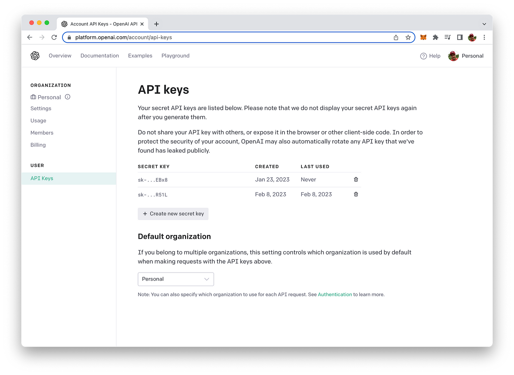

import { Image } from '@astrojs/image/components';
import YouTube from '~/components/widgets/YouTube.astro';
export const components = { img: Image };

Chatbots powered by advanced AI technology like GPT-4 can help you significantly improve user engagement, provide instant assistance, and elevate the overall user experience. In this tutorial, we will guide you through building an AI Chatbot Web App that harnesses the power of Node.js, Socket.IO, and the GPT-4 API. By following this step-by-step guide, you'll learn how to create a seamless, real-time chatbot experience that can transform your website and impress your visitors.

One of the essential aspects of an engaging chatbot is its ability to maintain context throughout the conversation. By keeping track of the conversation history, our AI chatbot can provide relevant, personalized, and coherent responses, which significantly enhances the overall user experience.

In this section, we will focus on how our chatbot web application incorporates conversation history to deliver a context-aware and interactive experience. Our implementation ensures that each new response from the GPT-4 API takes into account not only the user's latest input but also the entire conversation history. This context-aware approach allows the chatbot to refer back to previous exchanges and respond appropriately, creating a more natural and engaging interaction between the user and the chatbot.

By the end of this tutorial, you will have a fully functional chatbot web application that keeps track of the conversation history, enabling context-aware interactions and providing a superior user experience. With this powerful tool at your disposal, you can create more meaningful connections with your website visitors, streamline customer support, and drive user engagement to new heights.

Take a look at the chat bot web app we're going to build in this tutorial from start to finish.


To create a full Node.js web application that offers chatbot functionality using GPT-4, you'll need to set up an Express server, use Socket.IO for real-time communication, and serve a simple front-end with an HTML, CSS, and JavaScript file. Here's a step-by-step guide:

## Setting Up The Project And Install Dependencies

Before diving into the chatbot's implementation, it's essential to set up the project and install the necessary dependencies. In the following we will guide you through the initial steps to create your project's structure, install the required Node.js packages, and ensure a smooth development experience. Let's get started with setting up the foundation for our AI-powered chatbot web application!

__Step 1: Create a new directory for your project and navigate to it__

Execute the following command to create a new project directory in the very first step:

```bash
mkdir gpt4-chatbot
cd gpt4-chatbot
```

__Step 2: Initialize a new Node.js project and install the required packages__

Next, create a package.json file in the project folder and make sure that all needed dependencies are being installed:

```bash
npm init -y
npm install express socket.io openai dotenv
```

__Step 3: Create a `.env` file to store your OpenAI API key:__

```
OPENAI_API_KEY=your_openai_api_key
```

To retrieve your OpenAI API key you need to create a user account at https://openai.com/ and access the API Keys section in the OpenAI dashboard to create a new API key.



## Implement The Server Logic

__Step 4: Create an `app.js` file for the server:__

```js
// app.js

require("dotenv").config();
const express = require("express");
const http = require("http");
const socketIO = require("socket.io");
const { Configuration, OpenAIApi } = require("openai");

const app = express();
const server = http.createServer(app);
const io = socketIO(server);
const port = process.env.PORT || 3000;

// OpenAI API configuration
const configuration = new Configuration({
  apiKey: process.env.OPENAI_API_KEY,
});
const openai = new OpenAIApi(configuration);

app.use(express.static("public"));

io.on("connection", (socket) => {
  console.log("New user connected");

  // Initialize the conversation history
  const conversationHistory = [];

  socket.on("sendMessage", async (message, callback) => {
    try {
      // Add the user message to the conversation history
      conversationHistory.push({ role: "user", content: message });

      const completion = await openai.createChatCompletion({
        model: "gpt-4",
        messages: conversationHistory,
      });

      const response = completion.data.choices[0].message.content;

      // Add the assistant's response to the conversation history
      conversationHistory.push({ role: "assistant", content: response });

      socket.emit("message", response);
      callback();
    } catch (error) {
      console.error(error);
      callback("Error: Unable to connect to the chatbot");
    }
  });

  socket.on("disconnect", () => {
    console.log("User disconnected");
  });
});

server.listen(port, () => {
  console.log(`Server is running on port ${port}`);
});
```

This code snippet is the main server-side code for a Node.js chatbot web application that uses the GPT-4 API, Express, and Socket.IO.

1. `dotenv` is imported and configured to load environment variables from a `.env` file.
2. The necessary modules, such as `express`, `http`, `socket.io`, and `openai`, are imported.
3. An Express app, an HTTP server, and a Socket.IO server are created, with the server listening on a specified port (from environment variables or defaulting to 3000).
4. The OpenAI API is configured with the provided API key.
5. The `public` directory is set as the static files directory for the Express app.
6. A connection event listener is added to the Socket.IO server. When a new user connects:

* The user's connection is logged.
* An empty array called `conversationHistory` is initialized to store the conversation history.
* A `sendMessage` event listener is added to the connected socket. When a user sends a message: The user's message is added to the `conversationHistory` array. A GPT-4 API request is made with the conversation history as input. The chatbot's response is extracted from the API result and added to the `conversationHistory` array. Finally, the chatbot's response is emitted back to the user through the `message` event. If there is an error, an error message is sent back to the user.

7. A `disconnect` event listener is added to the connected socket to log when a user disconnects.
8. The server is started, and a log message indicates it is running on the specified port.

__Step 5: Create a `public` directory and inside it, create the `index.html`, `styles.css`, and `script.js` files__

Use the following command to complete this step:

```bash
mkdir public
cd public
touch index.html styles.css script.js
```

## Implement The Front-End

__Step 6: Add the following HTML code to the `index.html` file:__

The following HTML code represents the main page of a chatbot web application. It provides the basic structure and includes the necessary CSS and JavaScript files for the chatbot's front-end and needs to be inserted into `index.html`:

```html
<!-- public/index.html -->

<!DOCTYPE html>
<html lang="en">
<head>
  <meta charset="UTF-8">
  <meta name="viewport" content="width=device-width, initial-scale=1.0">
  <title>Chatbot</title>
  <link rel="stylesheet" href="styles.css">
</head>
<body>
  <div id="chat-container">
    <div id="messages"></div>
    <form id="message-form">
      <input type="text" id="message-input" placeholder="Type your message" autocomplete="off" />
      <button type="submit">Send</button>
    </form>
  </div>
  <script src="/socket.io/socket.io.js"></script>
  <script src="script.js"></script>
</body>
</html>
```

__Step 7: Add the following CSS code to the `styles.css` file__

```css
/* public/styles.css */

body {
  font-family: Arial, sans-serif;
  display: flex;
  justify-content: center;
  align-items: center;
  height: 100vh;
  margin: 0;
}

#chat-container {
  width: 400px;
  border: 1px solid #ccc;
  border-radius: 5px;
  display: flex;
  flex-direction: column;
}

#messages {
  height: 300px;
  overflow-y: auto;
  padding: 10px;
}

#message-form {
  display: flex;
  padding: 10px;
}

#message-input {
  flex-grow: 1;
  padding: 5px;
  border: 1px solid #ccc;
  border-radius: 5px;
}

button {
  background-color: #007bff;
  color: white;
  border: none;
  border-radius: 5px;
  padding: 6px 12px;
  margin-left: 5px;
  cursor: pointer;
}

button:hover {
  background-color: #0056b3;
}
```

__Step 8: Add the following JavaScript code to the `script.js` file__

This code snippet is the custom JavaScript file (`public/script.js`) for the front-end of the chatbot web application. It manages user interactions, displays messages, and communicates with the server using Socket.IO:

```js
// public/script.js

const socket = io();

const messageForm = document.getElementById("message-form");
const messageInput = document.getElementById("message-input");
const messages = document.getElementById("messages");

function displayMessage(role, message) {
  const div = document.createElement("div");
  div.innerHTML = `<p><b>${
    role === "user" ? "You" : "Assistant"
  }:</b> ${message}</p>`;
  messages.appendChild(div);
  messages.scrollTop = messages.scrollHeight;
}

messageForm.addEventListener("submit", (e) => {
  e.preventDefault();

  const message = messageInput.value;
  displayMessage("user", message); // Display user's message in the chat

  socket.emit("sendMessage", message, (error) => {
    if (error) {
      return alert(error);
    }

    messageInput.value = "";
    messageInput.focus();
  });
});

socket.on("message", (message) => {
  displayMessage("assistant", message); // Display assistant's message in the chat
});
```

1. A Socket.IO client instance is created using `io()` and assigned to the `socket` variable.
2. DOM elements, such as the message form, message input field, and messages container, are selected using `getElementById`.
3. The `displayMessage` function is defined to create and display chat messages in the messages container. It takes the message sender's role (either "user" or "assistant") and the message content as arguments, creates a new `div` element with the formatted message, appends it to the messages container, and scrolls the container to the bottom.
4. An event listener is added to the message form to handle form submissions: a. The default form submission behavior is prevented using `e.preventDefault()`. The user's message is retrieved from the input field and displayed using the displayMessage function. The sendMessage event is emitted through the Socket.IO client with the user's message, and an error callback function is provided. If there's an error, it is displayed as an alert. Otherwise, the input field is cleared, and focus is returned to the input field.
5. An event listener is added to the Socket.IO client to handle the `message` event: a. When a message is received from the server (the chatbot's response), the `displayMessage` function is called with the role "assistant" and the received message to display it in the chat.

## Test The Application

__Step 9: Start your server by running__

```bash
node app.js
```

Now, you can visit http://localhost:3000 in your browser and interact with the GPT-4 chatbot. The chatbot will respond to your messages, and you can have a conversation with it.


As you can see: the chat bot is aware of the context of the conversation and is providing answers which are taking the conversation history into consideration.

## Conclusion

Congratulations on successfully building your AI-powered chatbot web application using Node.js, Socket.IO, and the GPT-4 API! By following this tutorial, you have unlocked a powerful tool for enhancing user engagement and transforming your website's user experience. With its context-aware capabilities and real-time interaction, your chatbot is well-equipped to meet the evolving expectations of today's users.

As you continue to develop and refine your chatbot, remember that the possibilities are endless. You can further customize the chatbot's functionality, appearance, and integration with other services to cater to your specific needs. The foundation we've built together in this tutorial serves as a stepping stone for creating even more advanced and personalized AI-driven interactions.

Happy coding!