import { Image } from '@astrojs/image/components';
import YouTube from '~/components/widgets/YouTube.astro';
export const components = { img: Image };

Are you interested in building a robust and efficient RESTful API for your web application but don't want to spend hours of time and effort on coding? Look no further! In this blog post, we'll show you how to create a complete REST web API using the power of ChatGPT, an advanced language model from OpenAI, in just 5 minutes.

Thanks to ChatGPT's natural language processing capabilities and it's ability to generate source code, it's possible to build a RESTful API without needing to write a single line of code by yourself.

We'll provide a step-by-step guide that shows you how to create an API that can perform basic CREATE, READ, and DELETE operations for a simple data model, such as a user database. We'll ask ChatGPT to use Python to create the API code for us.

Whether you're a developer looking to save time on your next project, or a business owner looking to quickly build an API for your application, this guide is perfect for you. So let's get started and build a complete REST web API with ChatGPT in just 5 minutes!

## What We Want to Create

So let's make sure that we have clear requirements for the web API that we want to get created using ChatGPT. Let's list the requirements:

_Create a complete REST web API in Python including the following endpoints_

* _HTTP GET endpoint at /user to retrieve a single user record_
* _HTTP GET endpoints at /users to retrieve all user records_
* _HTTP POST endpoint at /newuser to create a new user record. User data (username, password, status) is handed over in request body in JSON format. User id is assigned automatically_
* _HTTP DELETE endpoint at /deleteuser to delete an existing user record. User id is provided in request body. The user data is persisted into an MySQL database. The connection string to the remote database is provided_

So, let's put this prompt into ChatGPT:

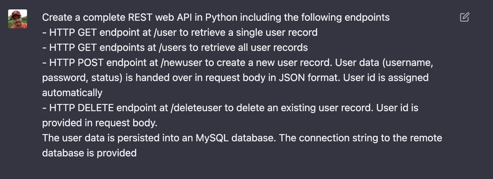

As a response ChatGPT is starting to generate Python code using the Flask web framework:

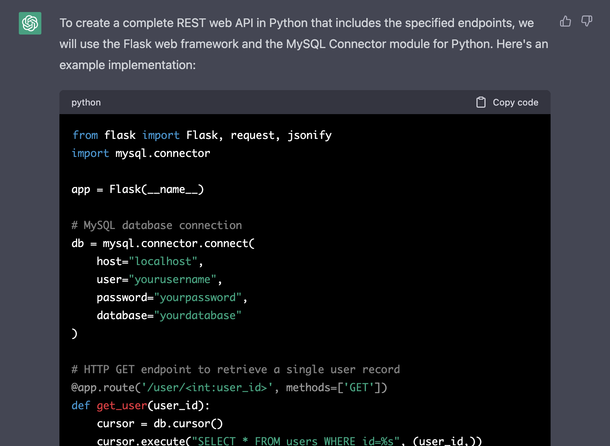

In the following listing you can see the complete Python code which is generated by ChatGPT:

```py
from flask import Flask, request, jsonify
import mysql.connector

app = Flask(__name__)

# MySQL database connection
db = mysql.connector.connect(
    host="localhost",
    user="yourusername",
    password="yourpassword",
    database="yourdatabase"
)

# HTTP GET endpoint to retrieve a single user record
@app.route('/user/<int:user_id>', methods=['GET'])
def get_user(user_id):
    cursor = db.cursor()
    cursor.execute("SELECT * FROM users WHERE id=%s", (user_id,))
    user = cursor.fetchone()
    cursor.close()
    if user is not None:
        return jsonify({"id": user[0], "username": user[1], "password": user[2], "status": user[3]})
    else:
        return jsonify({"message": "User not found"}), 404

# HTTP GET endpoint to retrieve all user records
@app.route('/users', methods=['GET'])
def get_users():
    cursor = db.cursor()
    cursor.execute("SELECT * FROM users")
    users = cursor.fetchall()
    cursor.close()
    user_list = []
    for user in users:
        user_list.append({"id": user[0], "username": user[1], "password": user[2], "status": user[3]})
    return jsonify(user_list)

# HTTP POST endpoint to create a new user record
@app.route('/newuser', methods=['POST'])
def create_user():
    data = request.get_json()
    username = data['username']
    password = data['password']
    status = data['status']
    cursor = db.cursor()
    cursor.execute("INSERT INTO users (username, password, status) VALUES (%s, %s, %s)", (username, password, status))
    db.commit()
    new_user_id = cursor.lastrowid
    cursor.close()
    return jsonify({"id": new_user_id, "username": username, "password": password, "status": status}), 201

# HTTP DELETE endpoint to delete an existing user record
@app.route('/deleteuser', methods=['DELETE'])
def delete_user():
    data = request.get_json()
    user_id = data['id']
    cursor = db.cursor()
    cursor.execute("DELETE FROM users WHERE id=%s", (user_id,))
    db.commit()
    cursor.close()
    return jsonify({"message": "User deleted successfully"}), 200

if __name__ == '__main__':
    app.run(debug=True)
```

In the code above, we first import the required modules - Flask and mysql.connector. We then create a MySQL database connection using the connection details provided.

We define four endpoints, each with its own route and HTTP method. The `/user/<int:user_id>` endpoint is a GET request that retrieves a single user record by its ID. The `/users` endpoint is a GET request that retrieves all user records. The `/newuser` endpoint is a POST request that creates a new user record. The `/deleteuser` endpoint is a DELETE request that deletes an existing user record by its ID.

For each endpoint, we use the jsonify function to return the data in JSON format. For the `create_user` and `delete_user` endpoints, we use the `request.get_json()` function to extract the user data and user ID from the request body.

Finally, we run the Flask app with `app.run(debug=True)`. The `debug=True` option enables debugging mode, which provides more detailed error messages during development.

Create a new file py-api.py and insert the generated Python code. Make sure to also install the needed Python libraries by using the pip command for installation like you can see in the following:

```bash
$ pip install mysql-connector-python
$ pip install flask
```

## Setting Up The Database Connection

The code which is provided by ChatGPT contains the following section:

```python
# MySQL database connection
db = mysql.connector.connect(
    host="localhost",
    user="yourusername",
    password="yourpassword",
    database="yourdatabase"
)
```

Based on the values assigned to host, user, password, and database the connection to the MySQL database is created. This part of the code needs to be adapted to meet the settings of your specific database instance.

If you want to use an existing MySQL database instance you can directly input the connection details here.

If you want to create a new MySQL instance just for testing purposes you can use a service like db4free.net.

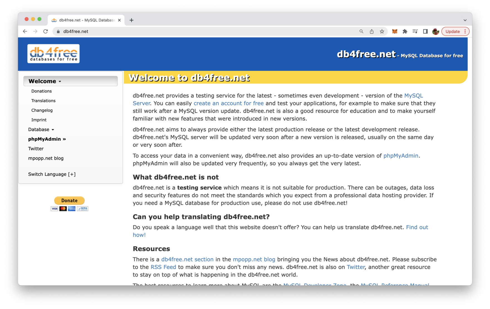

Once we have a running MySQL database instance available (and inserted the connection details into the Python code) we also need to make sure that the database table users is initiated. Let's ask ChatGPT again for the SQL code to do so:

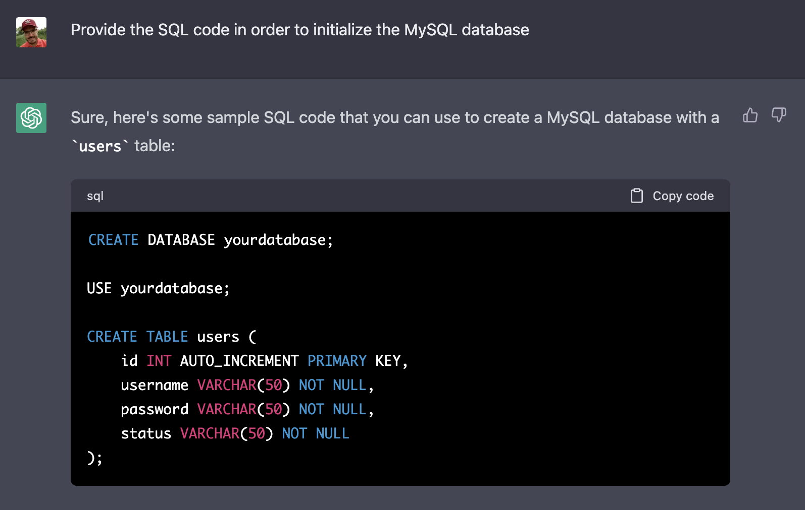

Wo do only need the CREATE TABLE SQL statement:

```sql
CREATE TABLE users (
    id INT AUTO_INCREMENT PRIMARY KEY,
    username VARCHAR(50) NOT NULL,
    password VARCHAR(50) NOT NULL,
    status VARCHAR(50) NOT NULL
);
```

This statement can now be used to create the corresponding users table in our database. If you have created your MySQL database with db4free.net you can directly log into the phpMyAdmin web interface and paste the SQL statement for execution into the web interface:

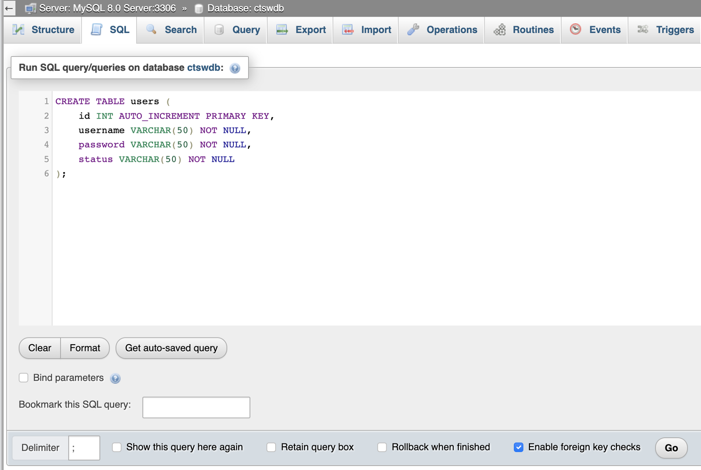

If you execute this statement by clicking on the "Go" button you should be able to see that the table has been created successfully:

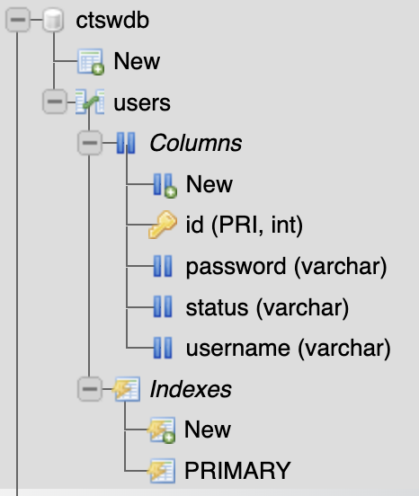

## Testing The API

Let's test the Python script by running the Flask web server. Just type in the following command:

```bash
$ python py-api.py
```

You should then receive the following output informing you about the fact the the server is started on port 5000:

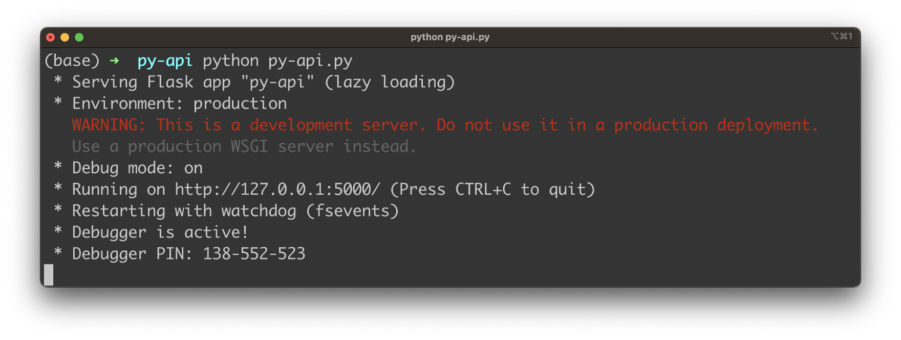

Let's start testing the various endpoints of our web API by using the Postman tool (https://www.postman.com/).

First lets create a new user by sending a POST request to endpoint `http://localhost:5000/newuser` and hand over the data for the new user in the request body in JSON format:

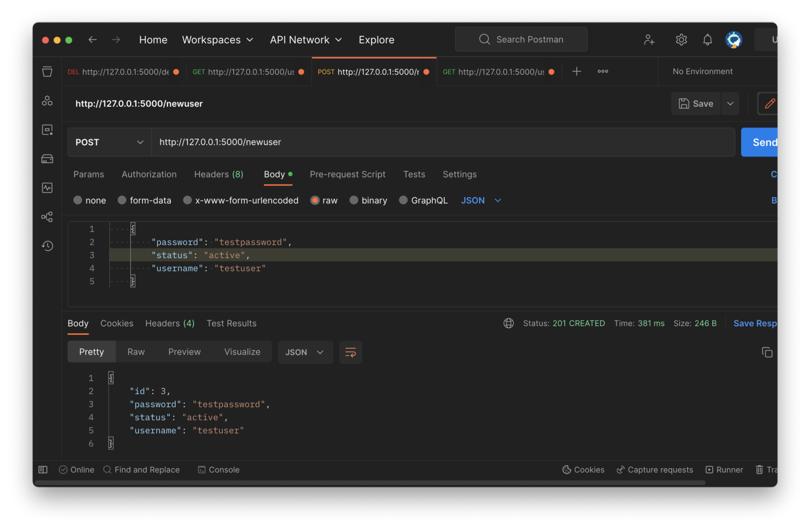

When executing this request you should receive a JSON object as a response. This object should include the user data again plus the ID which has been assigned automatically.

After having created the first user record let's try to retrieve that user record again by sending a GET request to endpoint `http://localhost:5000/user/[id]`:

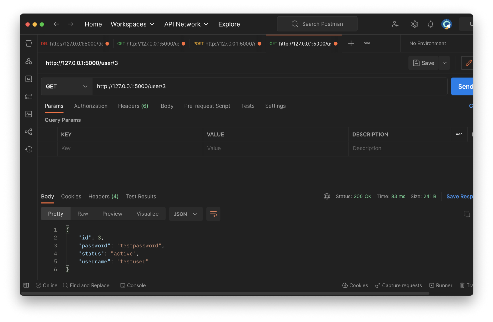

As a response to this request you should be able to see the user object in JSON format.

You can also retrieve the list of all users by sending the GET request to `http://localhost:5000/users`:

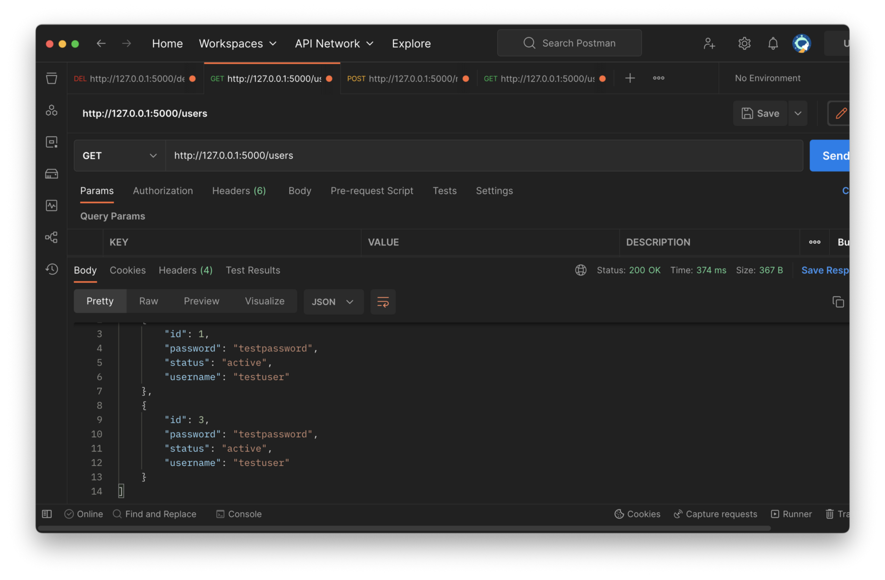

Finally we're addressing a DELETE request to the endpoint `http://localhost:5000/deleteuser` like you can see in the following screenshot:

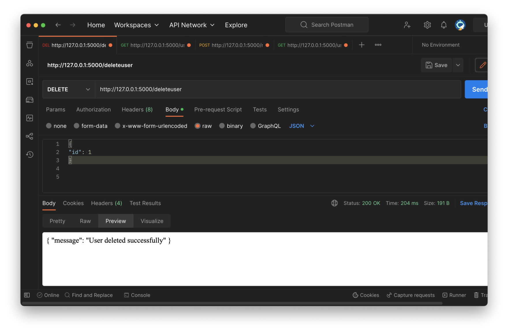

If everything is working as expected you get the confirmation message that the user has been deleted successfully.

## Conclusion

Building a complete RESTful API in just 5 minutes is no longer a far-fetched dream. With the power of ChatGPT and Python's Flask framework, you can quickly and easily create an API that meets your specific requirements without writing extensive code or worrying about technical details.

In this blog post, we've shown you how to build a simple user database API with basic operations using ChatGPT. We hope this guide has given you a taste of what's possible with this technology and how it can help you save time and resources when building your next project.