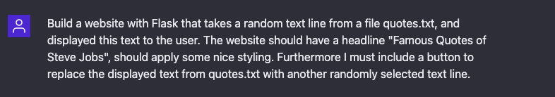

import { Image } from '@astrojs/image/components';
import YouTube from '~/components/widgets/YouTube.astro';
export const components = { img: Image };

<YouTube url="https://youtu.be/xL6NUzM_3qU" />

Welcome to the exciting world of natural language processing and machine learning! Today, we will be exploring the capabilities of ChatGPT, a state-of-the-art language model developed by OpenAI. One of the most impressive features of ChatGPT is its ability to generate source code based on simple descriptions. Imagine being able to build a complete website in just one minute without writing a single line of code yourself. Sounds too good to be true? Let's find out!

With the power of ChatGPT, we will attempt to automatically build a complete website from scratch, and see just how accurate and efficient the results are. This experiment will not only showcase the capabilities of ChatGPT, but also give a glimpse into the future of how technology can revolutionize the way we develop and build websites. So, let's dive in and see what ChatGPT can do!

## What Are We Going To Build?

The website we're going to build with ChatGPT displays a random quote from a text file called "quotes.txt" on the homepage. When the website is accessed, the application reads the content of the quotes.txt file and then selects a random quote from the list of quotes and passes it to the frontend where it is displayed on the webpage. Additionally, the webpage contains a button labeled "Change Quote", when clicked, it will refresh the page and will show another random quote.

So let's start to ask ChatGPT to generate a list of famous quotes by Steve Jobs:


Next provide a description of the website we'd like to get generated by ChatGPT:



Based on our textual description ChatGPT is generating a comprehensive response which is step-by-step instructions and source code written in Python and making use of the Flask web framework:


In order to make use of the provided code we have to create a project folder and files inside this new project folder by using the following commands:

```bash
$ mkdir flask-quotes
$ cd flask-quotes
$ touch quotes.txt
$ touch app.py
```

Start by coping the 20 generated quotes into file quotes.txt.

Next, copy the source code which ChatGPT has provided for file app.py into that.

This code is a basic example of a Flask application that display a random quote from a file called "quotes.txt" on the homepage of the website.

The `app = Flask(__name__)` line creates a new Flask application and assigns it to the variable `app`.

The `@app.route('/')` decorator is used to define a route for the homepage of the website. The function `home()` is called when this route is accessed. Inside the function, the script opens the `quotes.txt` file using the `open()` function and assigns the content of the file to the variable quotes using the `.readlines()` method. Then using the `random.choice(quotes)` function, the script picks a random quote from the list of quotes. The selected quote is passed as a variable named `quote` to the home.html template which is returned to be rendered in the browser.

The if `__name__ == '__main__'`: line is used to check if the script is being run directly or if it is being imported as a module. If it is being run directly, the `app.run(debug=True)` line starts the development web server and runs the application. The `debug=True` argument is used to enable the interactive debugger during development.

The next instructions we have received from ChatGPT can been seen in the following screenshot:


Let's follow the steps which are suggested by ChatGPT and create a new folder templates and inside this folder create a new file home.html:

```bash
$ mkdir templates
$ touch templates/home.html
```

Copy and paste the HTML code from ChatGPT into home.html. This is an HTML template that displays a webpage with a title "Famous Quotes of Steve Jobs", a header tag with the same title, a div element that displays a quote passed from the backend, and a button labeled "Change Quote", which when clicked, reloads the webpage. The template also links a CSS file for styling the webpage.

Next we're receiving instructions for including the CSS code into the Flask project:


Follow these instruction again by entering the following commands:

```bash
$ mkdir static
$ touch static/styles.css
```

And finally copy and paste the CSS code from ChatGPT to styles.css.
That's it, we ready to test if everything is working as requested.

Start the development webserver by entering:

```bash
$ python app.py
```

You should then see the following response on the command line:


The server is running on port 5000 locally. So you can access the website by entering 127.0.0.1:5000 in your browser:


Great, the website is loading and the output we're receiving is fully corresponding to what we have requested. A random quote is selected and displayed. We can use button "Change Quote" to randomly select a new one and update the output:

