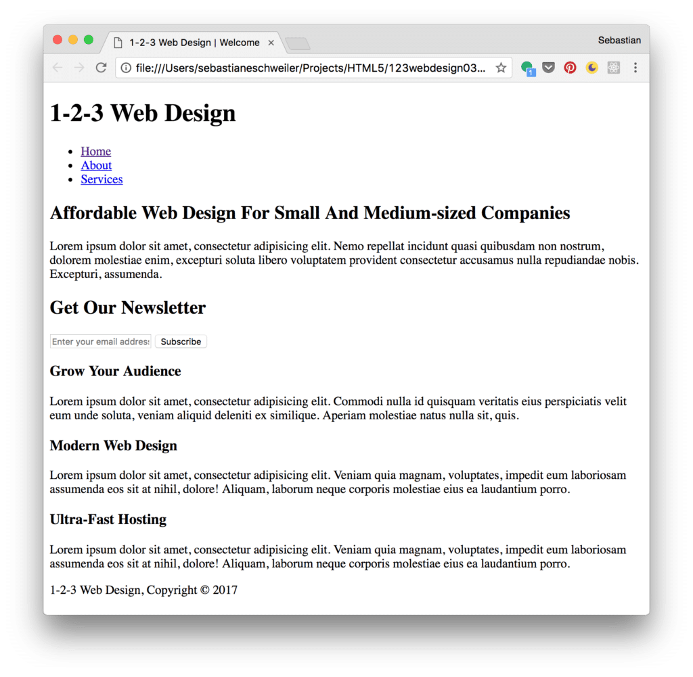

import { Image } from '@astrojs/image/components';
import YouTube from '~/components/widgets/YouTube.astro';
export const components = { img: Image };

<YouTube url="https://youtu.be/wlTMtUBxxsM" />

In this tutorial we'll be building a real-world website with pure HTML 5 and CSS 3 which can be used as a template for a web design agency or any other business website. Let's take a look at the final result first:

The website template is fully responsible and consists of three pages. The start page looks like the following:


If you're accessing the web site on a smaller screen size the layout will adapt accordingly as you can see in the following screenshot:


Furthermore the website template consist of an _About_ and a _Services_ page:


[

Let's explore the steps needed to implement this website from scratch.

## Implementing The Start Page

In the following steps we'll be using plain HTML 5 and CSS 3 code for implementation. No additional framework is needed. Let's start by creating a new and empty project folder:

`$ mkdir 123webdesign`

Change into that newly created project folder

`$ cd 123webdesign`

and create subfolders with the following commands:

`$ mkdir css` `$ mkdir img` `$ mkdir fonts`

Because we want to make use of Font Awesome icons, we need to make sure that the icon library is added to our project. Go to [http://fontawesome.io](http://fontawesome.io/), download the free package, unpack the archive and copy the files from the _css_ and _fonts_ folder to the corresponding subfolders in the project.

### Implement Index.html

Let's start coding by adding a new file _index.html_ to our root project folder and add the following HTML code:

```html
<!DOCTYPE html>
<html>
  <head>
    <meta charset="utf-8">
    <meta name="viewport" content="width=device-width">
    <meta name="description" content="Affordable Web Design For Small And Medium-sized Companies">
    <meta name="author" content="Sebastian Eschweiler">
    <title>1-2-3 Web Design | Welcome</title>
    <link rel="stylesheet" href="./css/style.css">
    <link rel="stylesheet" href="./css/font-awesome.min.css">
  </head>
  <body>
    <header>

    </header>

    <section id="showcase">

    </section>

    <section id="newsletter">

    </section>

    <section id="boxes">

    </section>

    <footer>
      <p>1-2-3 Web Design, Copyright &copy; 2017</p>
    </footer>
  </body>
</html>
```

As you can see we're defining five sections within the _body_ element:

- _header_: Contains the top level bar of the site with branding and navigation menu.
- _showcase section_: Contains the main image and the main side headline.
- _newsletter section_: Contains an email input field and and a submit button, so that the user can subscribe to the newsletter.
- _boxes section_: Contains three boxes to highlight services.
- _footer_: Contains the code which is needed to display the footer.

Let's add the needed HTML code for each section step by step ...

### Add HTML Code For Header

Within the _header_ section add the following code to display branding and the navigation menu on top:

```html
<div class="container">
        <div id="branding">
          <h1><i class="fa fa-rocket"></i> <span class="highlight">1-2-3</span> Web Design</h1>
        </div>
        <nav>
          <ul>
            <li class="current"><a href="index.html">Home</a></li>
            <li><a href="about.html">About</a></li>
            <li><a href="services.html">Services</a></li>
          </ul>
        </nav>
      </div>
```

### Add HTML Code For Section Showcase

Next, insert the following code within the showcase section:

```html
 <div class="container">
        <h1>Affordable Web Design For Small And Medium-sized Companies</h1>
        <p>Lorem ipsum dolor sit amet, consectetur adipisicing elit. Nemo repellat incidunt quasi quibusdam non nostrum, dolorem molestiae enim, excepturi soluta libero voluptatem provident consectetur accusamus nulla repudiandae nobis. Excepturi, assumenda.</p>
  </div>
```

### Add HTML Code For Section Newsletter

The newsletter subscription form is made up of the following HTML code:

```html
      <div class="container">
        <h1>Get Our Newsletter</h1>
        <form action="">
          <input type="email" placeholder="Enter your email address ... ">
          <button type="submit" class="button_1">Subscribe</button>
        </form>
      </div>
```

### Add HTML Code For Section Boxes

Finally add the following HTML code in boxes section:

```html
      <div class="container">
        <div class="box">
          <i class="fa fa-signal fa-5x"></i>
          <h3>Grow Your Audience</h3>
          <p>Lorem ipsum dolor sit amet, consectetur adipisicing elit. Commodi nulla id quisquam veritatis eius perspiciatis velit eum unde soluta, veniam aliquid deleniti ex similique. Aperiam molestiae natus nulla sit, quis.</p>
        </div>

        <div class="box">
          <i class="fa fa-photo fa-5x"></i>
          <h3>Modern Web Design</h3>
          <p>Lorem ipsum dolor sit amet, consectetur adipisicing elit. Veniam quia magnam, voluptates, impedit eum laboriosam assumenda eos sit at nihil, dolore! Aliquam, laborum neque corporis molestiae eius ea laudantium porro.</p>
        </div>

        <div class="box">
          <i class="fa fa-cube fa-5x"></i>
          <h3>Ultra-Fast Hosting</h3>
          <p>Lorem ipsum dolor sit amet, consectetur adipisicing elit. Veniam quia magnam, voluptates, impedit eum laboriosam assumenda eos sit at nihil, dolore! Aliquam, laborum neque corporis molestiae eius ea laudantium porro.</p>
        </div>
      </div>
```

Now you should be able to see the following result in the browser if you open _index.html_ directly: 

### Styling Index.html

In the next step we need to style the content of the website. The file _css/style.css_ has already been included in _index.html_:

```html
<link rel="stylesheet" href="./css/style.css">
```

Let's use that file to include the CSS code which is needed to style our web application:

### General CSS Code

First insert some general CSS code:

```css
body{
  font: 15px/1.5 Arial, Helvetica, sans-serif;
  padding: 0;
  margin:0;
  background-color: #f4f4f4;
}

.container{
  width: 80%;
  margin: auto;
  overflow: hidden;
}

ul{
  margin: 0;
  padding: 0;
}
```

### Header CSS Code

The header section is containing the branding of the site and the navigation menu. For styling the following CSS code is needed and also added to file _style.css_:

```css
/* Header */
header{
  background: #353637;
  color: #ffffff;
  padding-top: 30px;
  min-height: 70px;
  border-bottom: #32a0c2 3px solid;
}

header a{
  color: #ffffff;
  text-decoration: none;
  text-transform: uppercase;
  font-size: 16px;
}

header li{
  float: left;
  display: inline;
  padding: 0 20px 0 20px;
}

header #branding{
  float: left;
}

header #branding h1{
  margin: 0;
}

header nav{
  float: right;
  margin-top: 10px;
}

header .highlight, header .current a{
  color: #32a0c2;
  font-weight: bold;
}

header a:hover{
  color: #cccccc;
  font-weight: bold;
}
```

Please note, that the menu links should change the appearance when the mouse is moved over the element. Therefore the the selector _header a:hover_ is used and the _color_ and _font-weight_ property values are set.

### CSS Code For Section Showcase

For the showcase section the following CSS code is needed:

```css
/* Showcase */

#showcase {
  min-height: 400px;
  background:url('../img/headerbg.jpg') no-repeat center;
  background-size: cover;
  text-align: center;
  color: #ffffff;
}

#showcase h1{
  margin-top: 100px;
  font-size: 55px;
  margin-bottom: 10px;
}

#showcase p{
  font-size: 20px;
}
```

The background image is set by using the _background_ property of the section element with ID showcase. The image file is stored inside the _img_ folder and the filename is _headerbg.jpg_. This file is selected by using the CSS function _url_. This function expects the relative path as the first and only parameter.

To make sure that the image is adapting to various screen sizes correctly it is important to furthermore use the options _no-repeat_ and _center_. Furthermore you should make sure to set CSS property _background-size_ to value _cover_.

### CSS Code For Section Newsletter

The CSS code for section newsletter is available in the following listing and needs to be inserted into _style.css_ as well:

```css
/* Newsletter */
#newsletter{
  padding: 15px;
  color: #ffffff;
  background: #353637;
}

#newsletter h1{
  float: left;
}

#newsletter form{
  float: right;
  margin-top: 15px;
}

#newsletter input[type="email"]{
  padding: 4px;
  height: 25px;
  width: 250px;
}

.button_1{
  height: 38px;
  background: #cccccc;
  border: 0;
  padding-left: 20px;
  padding-right: 20px;
  color: #353637;
}
```

### Footer CSS Code

Next, add the CSS code for the footer area:

```css
footer{
  padding: 20px;
  margin-top: 20px;
  color: #ffffff;
  background-color: #32a0c2;
  text-align: center;
}
```

### Making The Website Responsive By Using Media Queries

Finally, we want to make sure that the web site is responsive and is adapting to changing screen sizes. The way this is achieved is by adding media queries to the CSS code:

```css
@media(max-width: 768px){
  header #branding,
  header nav,
  header nav li,
  #newsletter h1,
  #newsletter form,
  #boxes .box {
    float: none;
    text-align: center;
    width: 100%;
  }

  header{
    padding-bottom: 20px;
  }

  #showcase h1{
    margin-top: 40px;
  }

  #newsletter button {
    display: block;
    width: 100%;
  }

  #newsletter form input[type="email"] {
    width: 100%;
    margin-bottom: 5px;
  }
}
```

By using the @media keyword we're able to define CSS code which is only activated at a specific screen size. In our example we want to define CSS code which is valid for screen sizes with a maximum width of 768 pixel. There we need to set the _max-width_ attribute to the value 768px:

```css
@media(max-width: 768px){ /\* insert CSS code for small screen sizes here \*/ }
```

## Implementing The About Page

As the website should consists of two more pages we're continuing the implementation with the next page: About.

### Adding HTML Code in File About.html

Create a new file _about.html_ in the project folder and insert the following HTML code:

```html
<!DOCTYPE html>
<html>
  <head>
    <meta charset="utf-8">
    <meta name="viewport" content="width=device-width">
    <meta name="description" content="Affordable Web Design For Small And Medium-sized Companies">
    <meta name="author" content="Sebastian Eschweiler">
    <title>1-2-3 Web Design | About</title>
    <link rel="stylesheet" href="./css/style.css">
    <link rel="stylesheet" href="./css/font-awesome.min.css">
  </head>
  <body>
    <header>
      <div class="container">
        <div id="branding">
          <h1><i class="fa fa-rocket"></i> <span class="highlight">1-2-3</span> Web Design</h1>
        </div>
        <nav>
          <ul>
            <li><a href="index.html">Home</a></li>
            <li class="current"><a href="about.html">About</a></li>
            <li><a href="services.html">Services</a></li>
          </ul>
        </nav>
      </div>
    </header>

    <section class="main">
      <div class="container">
        <article id="main-col">
          <h1 class="page-title">
            About Us
          </h1>
          <p>
            Lorem ipsum dolor sit amet, consectetur adipisicing elit. Voluptatum quaerat modi fuga doloremque id, dolores tempora, rerum ducimus ipsum dolor explicabo blanditiis! Esse tempore, iure quibusdam aspernatur provident ducimus nesciunt?
          </p>
          <p class="dark">
            Lorem ipsum dolor sit amet, consectetur adipisicing elit. Voluptates, at, a. Tempora rerum excepturi quam accusantium labore? Hic alias ducimus, at reiciendis voluptatum, veritatis ipsum animi dolore dolorem dignissimos dolores.
            Lorem ipsum dolor sit amet, consectetur adipisicing elit. Nihil porro ipsa, assumenda alias harum debitis ab, a, eligendi, fugiat voluptas consectetur. Placeat cumque autem nemo accusamus odio labore dolore, in.
            Lorem ipsum dolor sit amet, consectetur adipisicing elit. Excepturi quam odio porro quo beatae ipsam laboriosam ea optio, suscipit ut dolorum! Nisi eius fugiat fugit illo, obcaecati quo. Dicta, eaque.
          </p>
        </article>
        <aside id="sidebar">
          <div class="dark">
            <h3><i class="fa fa-users"></i> The Team</h3>
            <p>Lorem ipsum dolor sit amet, consectetur adipisicing elit. Magnam vel, molestias nostrum sed, adipisci dicta cumque explicabo distinctio provident voluptatum repellendus amet neque esse impedit. Debitis voluptate incidunt, aperiam minima?</p>
          </div>
        </aside>
      </div>
    </section>

    <footer>
      <p>1-2-3 Web Design, Copyright &copy; 2017</p>
    </footer>
  </body>
</html>
```

The page consists of two columns: a main column containing a title and text and a sidebar with additional text.

### Adding CSS Code for About Page

The following CSS code needs to be added to _css/style.css_:

```css
/* Sidebar */

aside#sidebar{
  float: right;
  width: 30%;
  padding: 5px;
}

aside#sidebar .contact input, aside#sidebar .contact textarea{
  width: 90%;
  padding: 5px;
}

article#main-col{
  float: left;
  width: 65%;
}
```

Furthermore the CSS media query needs to be extended to apply a different styling to _article#main-col_ and _aside#sidebar_ as well:

```css
@media(max-width: 768px){
  header #branding,
  header nav,
  header nav li,
  #newsletter h1,
  #newsletter form,
  #boxes .box,
  article#main-col,
  aside#sidebar {
    float: none;
    text-align: center;
    width: 100%;
  }
  
  [...]
}
```

## Implementing The Services Page

Finally, we're going to implement services.html.

### Adding HTML Code In File Services.html

Create a new file _services.html_ and insert the following HTML code:

```html
<!DOCTYPE html>
<html>
  <head>
    <meta charset="utf-8">
    <meta name="viewport" content="width=device-width">
    <meta name="description" content="Affordable Web Design For Small And Medium-sized Companies">
    <meta name="author" content="Sebastian Eschweiler">
    <title>1-2-3 Web Design | About</title>
    <link rel="stylesheet" href="./css/style.css">
    <link rel="stylesheet" href="./css/font-awesome.min.css">
  </head>
  <body>
    <header>
      <div class="container">
        <div id="branding">
          <h1><i class="fa fa-rocket"></i> <span class="highlight">1-2-3</span> Web Design</h1>
        </div>
        <nav>
          <ul>
            <li><a href="index.html">Home</a></li>
            <li><a href="about.html">About</a></li>
            <li class="current"><a href="services.html">Services</a></li>
          </ul>
        </nav>
      </div>
    </header>

    <section class="main">
      <div class="container">
        <article id="main-col">
          <h1 class="page-title">Our Services</h1>
            <ul id="services">
              <li>
                <h3>Website Starter Package</h3>
                <p>Lorem ipsum dolor sit amet, consectetur adipisicing elit, sed do eiusmod tempor incididunt ut labore et dolore magna aliqua. Ut enim ad minim veniam, quis nostrud exercitation ullamco laboris nisi ut aliquip ex ea commodo consequat. Duis aute irure dolor in reprehenderit in voluptate velit esse cillum dolore eu fugiat nulla pariatur. Excepteur sint occaecat cupidatat non proident, sunt in culpa qui officia deserunt mollit anim id est laborum.</p>
                <p>$ 1,000</p>
              </li>
              <li>
                <h3>Website Professional Package</h3>
                <p>Lorem ipsum dolor sit amet, consectetur adipisicing elit, sed do eiusmod tempor incididunt ut labore et dolore magna aliqua. Ut enim ad minim veniam, quis nostrud exercitation ullamco laboris nisi ut aliquip ex ea commodo consequat. Duis aute irure dolor in reprehenderit in voluptate velit esse cillum dolore eu fugiat nulla pariatur. Excepteur sint occaecat cupidatat non proident, sunt in culpa qui officia deserunt mollit anim id est laborum.</p>
                <p>$ 5,000</p>
              </li>
              <li>
                <h3>E-commerce Package</h3>
                <p>Lorem ipsum dolor sit amet, consectetur adipisicing elit, sed do eiusmod tempor incididunt ut labore et dolore magna aliqua. Ut enim ad minim veniam, quis nostrud exercitation ullamco laboris nisi ut aliquip ex ea commodo consequat. Duis aute irure dolor in reprehenderit in voluptate velit esse cillum dolore eu fugiat nulla pariatur. Excepteur sint occaecat cupidatat non proident, sunt in culpa qui officia deserunt mollit anim id est laborum.</p>
                <p>$ 8,000</p>
              </li>
            </ul>
        </article>
        <aside id="sidebar">
          <div class="dark">
            <h3>Contact Us</h3>
            <form class="contact">
              <div>
                <label>Name</label>
                <input type="text">
              </div>
              <div>
                <label>Email Address</label>
                <input type="email">
              </div>
              <div>
                <label>Message</label>
                <textarea placeholder="Your message ..."></textarea>
              </div>
              <button class="button_1" type="submit">Send</button>
            </form>
          </div>
        </aside>
      </div>
    </section>

    <footer>
      <p>1-2-3 Web Design, Copyright &copy; 2017</p>
    </footer>
  </body>
</html>
```

The services page is made up of two columns. In the main column three offerings are presented. In the sidebar a contact form is embedded with three input elements. In addition a submit button is included.

### Adding CSS Code For Services Page

The corresponding CSS code is inserted into file _css/style.css_ once again:

```css
/* Services */
ul#services li{
  list-style: none;
  padding: 20px;
  border: #cccccc solid 1px;
  margin-bottom: 5px;
  background: #32a0c2;
}

ul#services h3{
  border-bottom: #353637 solid 1px;
}
```

Furthermore the CSS code which is embedded in the media query is extended:

```css
  #newsletter form input[type="email"],
  .contact input,
  .contact textarea,
  .contact label{
    width: 100%;
    margin-bottom: 5px;
  }
```

Having added this last piece of code the result in the browser should now correspond to the website template which has been presented at the beginning.
