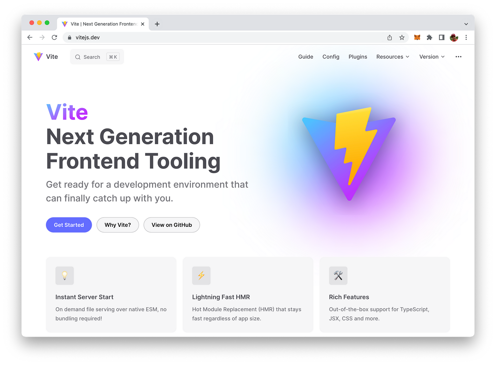
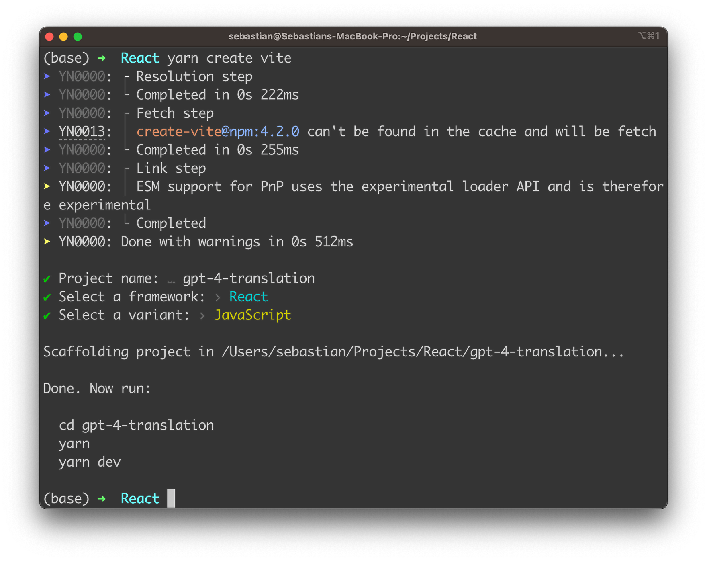
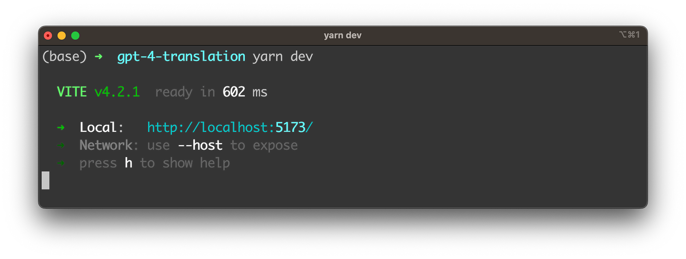
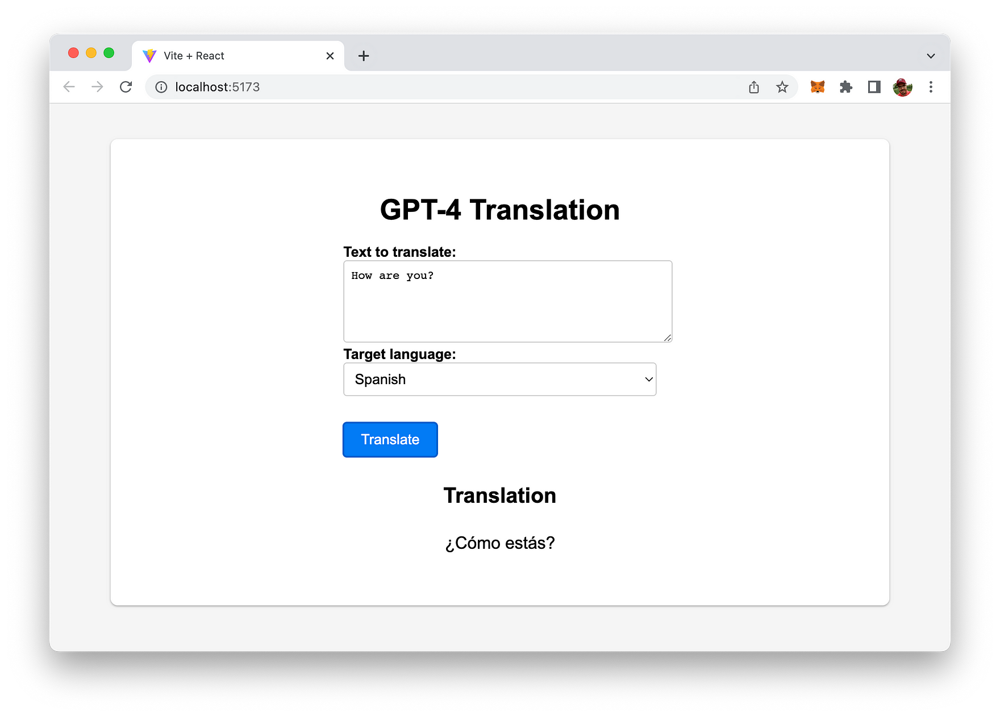

import { Image } from '@astrojs/image/components';
import YouTube from '~/components/widgets/YouTube.astro';
export const components = { img: Image };

In today's interconnected world, language translation plays a crucial role in bridging communication gaps and fostering global collaboration. With the advent of advanced AI models like OpenAI's GPT-4, we now have the opportunity to create highly accurate and context-aware translation tools. In this blog post, we'll walk you through the process of building a powerful language translator web app using React and the GPT-4 API.

React, a popular JavaScript library, enables us to create highly responsive and user-friendly interfaces, while GPT-4, the latest iteration of OpenAI's state-of-the-art language model, allows for highly accurate translations across various languages. By combining these two technologies, we will develop an intuitive and effective translation app that can cater to a wide range of users and use cases.

Throughout this tutorial, you'll learn how to set up the React app, integrate the GPT-4 API for translations, and apply user-friendly styling to the application. We'll also discuss best practices and optimization tips to ensure your translation app runs smoothly and efficiently.

By the end of this post, you'll have a fully functioning language translator app powered by GPT-4 and React, ready to be deployed or further customized to fit your needs. Let's dive in and start building your very own AI-driven translation tool!

## Creating A New React Project

Let's use Vite to create a new React project from scratch. If you need more information on Vite, take a look at the project's website: vitejs.dev



Use the following command to start the project scaffolding with Vite:

```bash
yarn create vite
```

You'll the be guided through the setup process as you can see in the following:



You're asked to provide a project name. Enter "gpt-4-translation", select React as a framework and set the variant to JavaScript. Once the setup process is completed you can enter the newly create project folder:

```bash
cd gpt-4-translation
```

In the project folder use the yarn command to make sure that all default dependencies of the project setup are being downloaded and installed:

```bash
yarn
```

Next, we need to add one further dependency: the Axios HTTP library:

```bash
yarn add axios
```

Furthermore we need to add one more file to the root folder of the project:

```bash
touch .env.local
```

This file is then be used to store and set environment variables. Here we'll create a new environment variable VITE_OPENAI_API_KEY which is used to hold our OpenAI API key:

```
VITE_OPENAI_API_KEY=[INSERT YOUR OPENAI API KEY HERE]
```

To retrieve your OpenAI API key, you must have an account with OpenAI and be granted access to their API services. Here's how you can get your API key:

1. Visit OpenAI's website: Go to https://www.openai.com/ and sign up for an account if you don't have one already.
2. Request API access: After signing up, request access to the OpenAI API. Keep in mind that API access to the GPT-4 model is not immediately available, as OpenAI operates on an invite-only basis as long as GPT-4 API is still in beta. In order to get access you need to sign up for the waiting list first.
3. Access the API dashboard: Once you've been granted access to the API, sign in to your OpenAI account and visit the API dashboard at https://platform.openai.com/signup.
4. Find your API key: In the API dashboard, locate the "API Keys" section. Your API key should be displayed there. The API key typically begins with "sk-" followed by a series of alphanumeric characters.

Remember to treat your API key as a sensitive piece of information, just like a password. Do not share it publicly or include it directly in your code.

## Implementing The React Application

In the following, we'll walk through the process of creating a language translator app using React and the GPT-4 API. Here's a step-by-step breakdown of the code you need to insert into _src/App.jsx_:

__1. Import required dependencies and styles:__

```js
import React, { useState } from "react";
import axios from "axios";
import "./App.css";
```

We import the React library, the `useState` hook for managing state, Axios for making API requests, and the App.css file for styling.

__2. Define the App component:__

```js
const App = () => {
  // ...
};
```

We create a functional App component that will be the core of our translation app.

__3. Initialize state variables:__

```js
const [text, setText] = useState("");
const [language, setLanguage] = useState("Spanish");
const [translation, setTranslation] = useState("");
```

We use the `useState` hook to manage the input text, the selected language, and the translated text.

__4. Define an array of supported languages:__

```js
const languages = ["Spanish", "French", "German", "Italian", "Portuguese"];
```

We create an array containing the supported languages for our translation app.

__5. Implement the translation function:__

```js
const translateText = async () => {
  // ...
};
```

We create an asynchronous `translateText` function that will handle making API requests to GPT-4 for translation.

__6. Make the API request using Axios:__

```js
const response = await axios.post(
  "https://api.openai.com/v1/chat/completions",
 {
  model: "gpt-4",
  messages: [
    {
      role: "system",
      content: `Translate the following English text to ${language}:`,
    },
    { role: "user", content: text },
  ],
},
{
  headers: {
    "Content-Type": "application/json",
    Authorization: `Bearer ${import.meta.env.VITE_OPENAI_API_KEY}`,
  },
}
```

We configure the API request by specifying the GPT-4 model, messages, and headers. In the messages array, we include a system message to instruct the model to translate the input text to the target language and a user message with the input text.

__7. Handle the API response:__

```js
const translatedText = response.data.choices[0].message.content;
setTranslation(translatedText);
```

We extract the translated text from the response data and update the translation state variable.

__8. Handle errors during translation:__

```js
catch (error) {
  console.error(error);
  alert("Error occurred during translation");
}
```

We add a catch block to handle any errors that might occur during the translation process.

__9. Implement the form submission handler:__

```js
e.preventDefault();
  translateText();
};
```

We create a handleSubmit function that prevents the default form submission behavior and calls the translateText function.

__10. Define the app's user interface:__

```js
return (
  // ...
);
```

We create the JSX markup for the app's user interface, including a form for inputting text, selecting a language, and a button for translating the text.

__11. Render the translation result:__

```js
{translation && (
  <>
    <h2>Translation</h2>
    <p>{translation}</p>
  </>
)}
```

We conditionally render the translated text if it exists.

__12. Export the App component:__

``js
export default App;
``

Finally, we export the App component to be used in the main entry point of our React application.

Let's again take a look at the complete code:

```js
import React, { useState } from "react";
import axios from "axios";
import "./App.css";

const App = () => {
  const [text, setText] = useState("");
  const [language, setLanguage] = useState("Spanish");
  const [translation, setTranslation] = useState("");

  const languages = ["Spanish", "French", "German", "Italian", "Portuguese"];

  const translateText = async () => {
    try {
      const response = await axios.post(
        "https://api.openai.com/v1/chat/completions",
        {
          model: "gpt-4",
          messages: [
            {
              role: "system",
              content: `Translate the following English text to ${language}:`,
            },
            { role: "user", content: text },
          ],
        },
        {
          headers: {
            "Content-Type": "application/json",
            Authorization: `Bearer ${import.meta.env.VITE_OPENAI_API_KEY}`,
          },
        }
      );

      const translatedText = response.data.choices[0].message.content;
      setTranslation(translatedText);
    } catch (error) {
      console.error(error);
      alert("Error occurred during translation");
    }
  };

  const handleSubmit = (e) => {
    e.preventDefault();
    translateText();
  };

  return (
    <div className="App">
      <h1>GPT-4 Translation</h1>
      <form onSubmit={handleSubmit}>
        <label htmlFor="text">Text to translate:</label>
        <br />
        <textarea
          id="text"
          value={text}
          onChange={(e) => setText(e.target.value)}
          rows={5}
          cols={40}
        ></textarea>
        <br />
        <label htmlFor="language">Target language:</label>
        <br />
        <select
          id="language"
          value={language}
          onChange={(e) => setLanguage(e.target.value)}
        >
          {languages.map((lang) => (
            <option key={lang} value={lang}>
              {lang}
            </option>
          ))}
        </select>
        <br />
        <button type="submit">Translate</button>
      </form>
      {translation && (
        <>
          <h2>Translation</h2>
          <p>{translation}</p>
        </>
      )}
    </div>
  );
};

export default App;
```

## Styling The Application

In order to apply a nice front-end styling for the React web app, insert the following CSS code into App.css:

```css
body {
  font-family: Arial, sans-serif;
  background-color: #f5f5f5;
}

.App {
  display: flex;
  flex-direction: column;
  align-items: center;
  padding: 40px;
  max-width: 800px;
  margin: 40px auto;
  background-color: #ffffff;
  border-radius: 8px;
  box-shadow: 0 1px 3px rgba(0, 0, 0, 0.12), 0 1px 2px rgba(0, 0, 0, 0.24);
}

h1 {
  font-size: 2em;
  margin-bottom: 20px;
}

label {
  font-size: 1em;
  font-weight: bold;
  margin-bottom: 5px;
}

textarea {
  width: 100%;
  border: 1px solid #cccccc;
  border-radius: 4px;
  padding: 8px;
  font-size: 1em;
}

select {
  width: 100%;
  border: 1px solid #cccccc;
  border-radius: 4px;
  padding: 8px;
  font-size: 1em;
  margin-bottom: 20px;
}

button {
  background-color: #007bf5;
  color: #ffffff;
  font-size: 1em;
  padding: 10px 20px;
  border-radius: 4px;
  border: none;
  cursor: pointer;
  margin-top: 10px;
}

button:hover {
  background-color: #34495e;
}

h2 {
  font-size: 1.5em;
  margin: 30px 0 10px 0;
}

p {
  font-size: 1.2em;
  text-align: justify;
}
```

Here's a brief description of the various styles applied:

1. `body`: Sets the default font family to Arial, sans-serif and the background color to a light gray.
2. `.App`: Styles the main container by centering it horizontally, setting a maximum width, and adding padding, background color, border-radius, and box-shadow. The flexbox properties ensure that the elements inside the container are displayed in a column and aligned to the center.
3. `h1`: Sets the font size for the main heading and adds a margin at the bottom.
4. `label`: Sets the font size, weight, and margin for form labels.
5. `textarea`: Styles the textarea input with width, border, border-radius, padding, and font size.
6. `select`: Styles the language dropdown with the same properties as the textarea and adds a margin at the bottom.
7. `button`: Styles the "Translate" button with a background color, font color, font size, padding, border-radius, and cursor. It also has a margin at the top.
8. `button:hover`: Changes the background color of the button when the mouse hovers over it.
9. `h2`: Sets the font size for the "Translation" heading and adds margins above and below.

## Running The Application

Now that the implementation is in place we're ready to run the React application and check the result in the browser. In order to start the development web server use the following command:

```bash
yarn dev
```

The development web server is starting up:



With the URL provided you can now access the React web app in the browser:



Just type in some text in English language select a target language and hit button "Translate". You should then be able to see the translation provided by GPT-4.

## Conclusion

Congratulations on successfully building a powerful and user-friendly language translator app using React and OpenAI's GPT-4 API! By leveraging the latest advancements in AI and web development, you have created an innovative tool that can break down language barriers and foster effective communication across the globe.

Throughout this tutorial, you've learned how to set up a React app, integrate the GPT-4 API, create an intuitive user interface, and apply modern styling to your application. These skills not only apply to building translation apps but can also be a solid foundation for other projects where you need to incorporate cutting-edge AI technologies and create responsive web applications.

As you continue to explore the capabilities of GPT-4 and React, consider expanding your app with additional features like speech recognition, real-time translation, or support for more languages. The possibilities are virtually endless, and with a strong foundation in place, you are well-equipped to tackle new challenges and create innovative solutions.

We hope this tutorial has provided you with valuable insights and inspired you to continue learning and experimenting in the exciting world of AI-driven applications. With the power of GPT-4 and React at your fingertips, the sky is the limit!