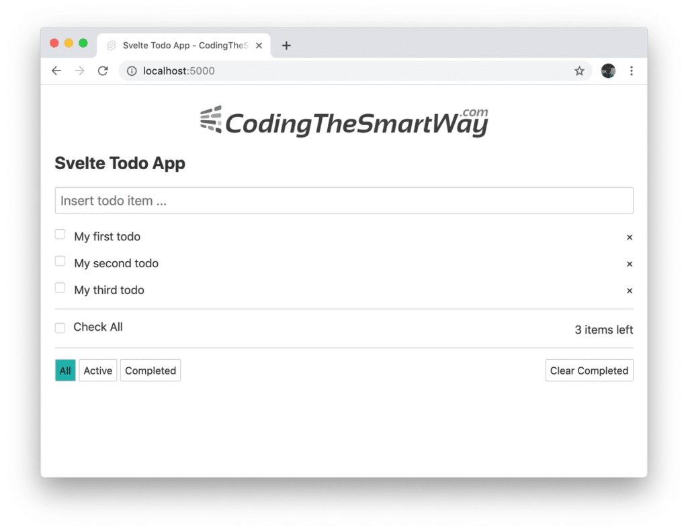
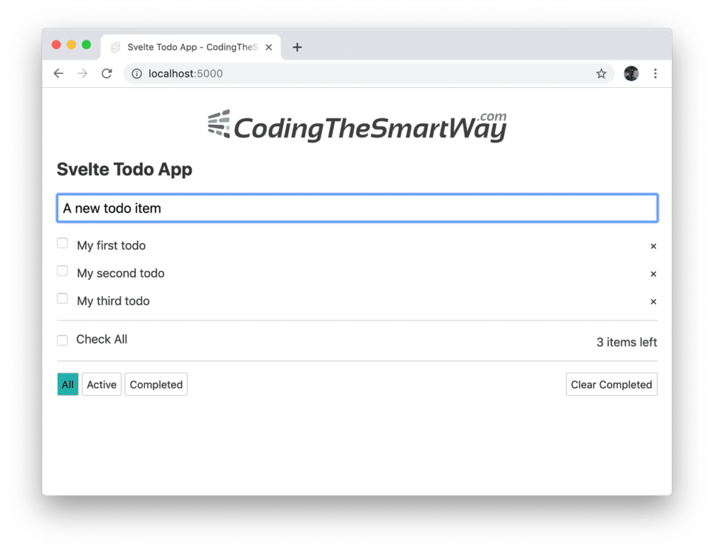
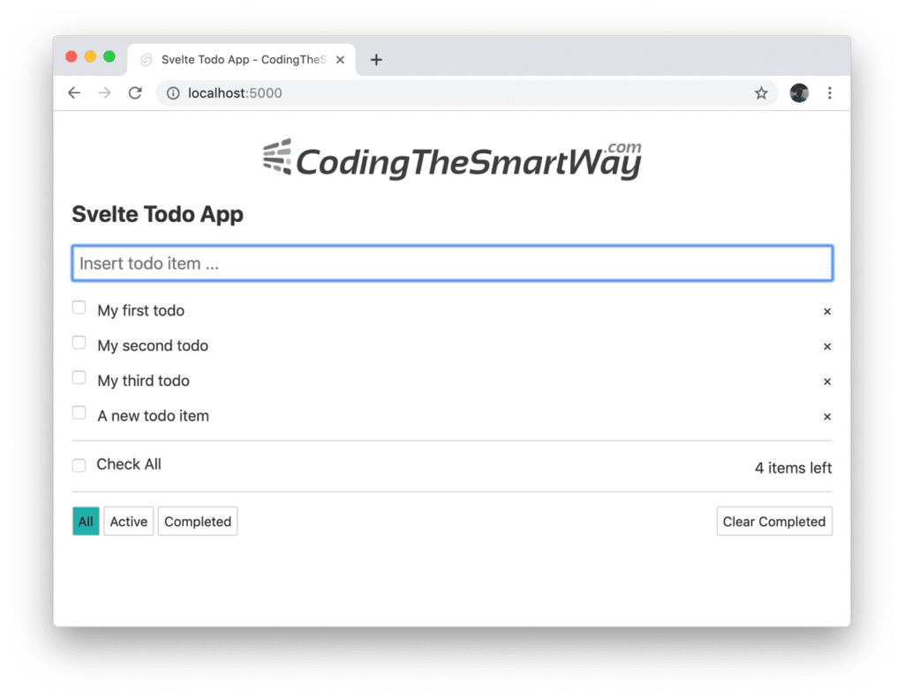
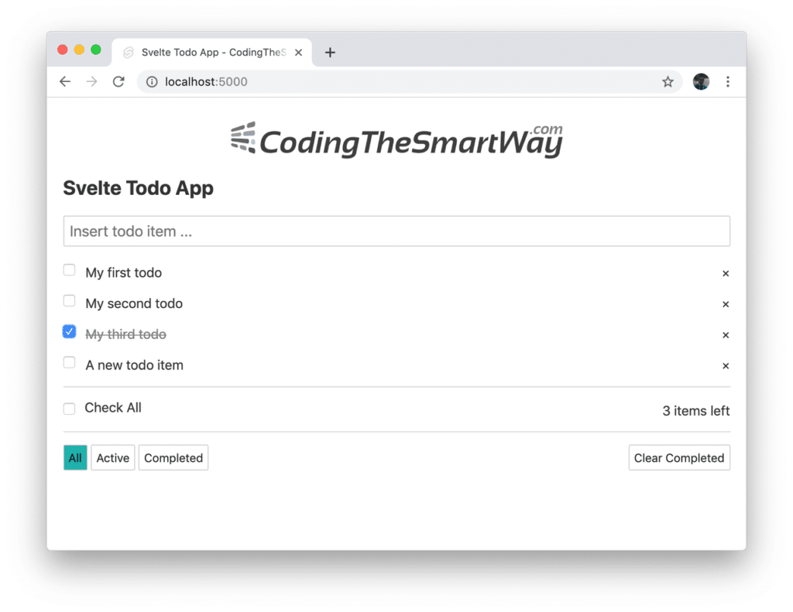
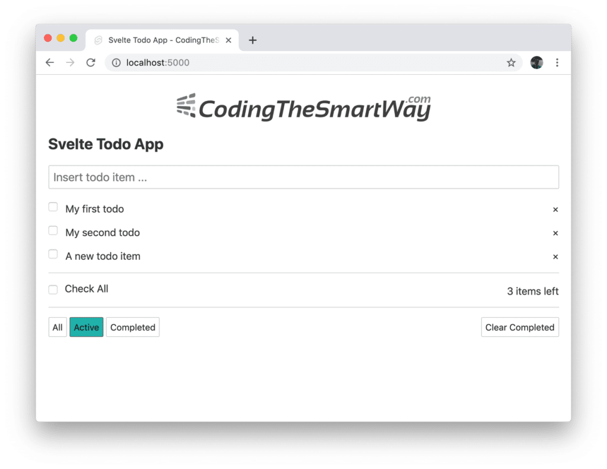
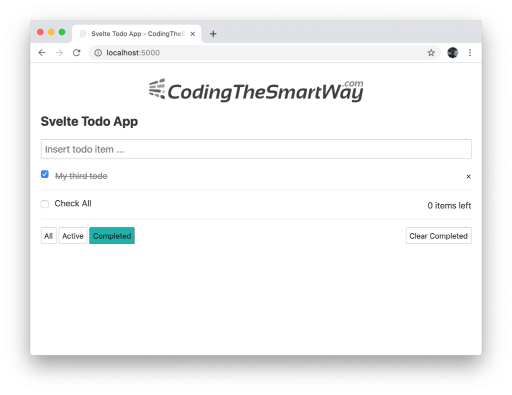
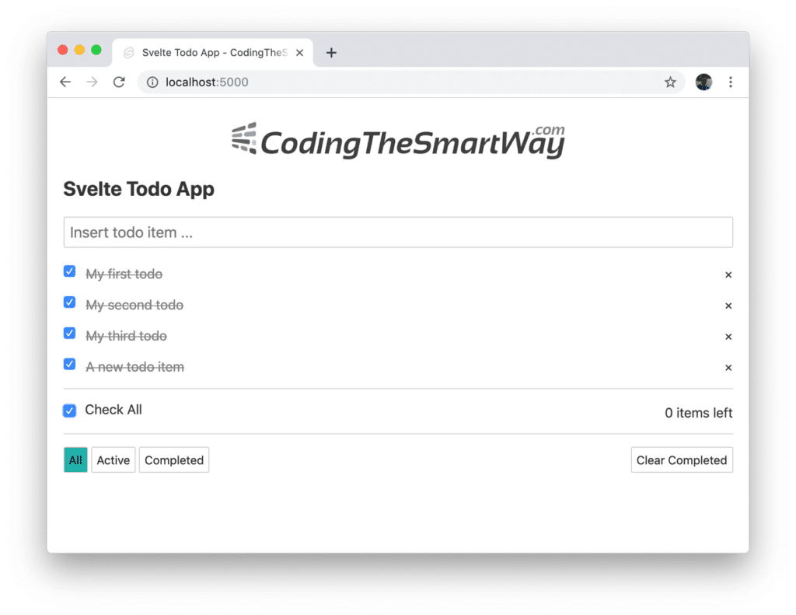

import { Image } from '@astrojs/image/components';
import YouTube from '~/components/widgets/YouTube.astro';
export const components = { img: Image };


<YouTube url="https://youtu.be/jmXvpJxwFyc" />

In the previous Svelte 3 Quickstart Tutorial we've covered the framework basics. Now it's time to go one step further and apply this knowledge to build a complete Svelte 3 todo application from start to finish.

Before getting started, let's first take a look at the application we're going to build in this tutorial. The start page of the web application will look like the following:



The user is presented with a list of todo items. Adding new todo items is possible by typing in the text in the input fields:



And afterwards hitting the Enter key to add the new item to the list as you can see in the following screenshot:



Each of the todo items has a checkbox in front of the todo text information. The checkbox can be used to toggle the completed state of each todo item. If a todo item is marked as completed by activating the checkbox the corresponding todo text is crossed out:



Furthermore the number of active todo items which is printed out (3 items left) is updated automatically.  
  
The user will also be able to apply filters to the list of to items by using the three buttons at the bottom left. E.g. clicking on the button _Active_ will apply a filter to the list which is only displaying todo items which are not in completed state:



In contrast to that you can use the button _Completed_ to apply a filter which is only displaying todo items which are in completed state already:



By clicking on the checkbox Check All it is possible to set all todo items to completed at once:



The application provides you with two options to delete todo items from the list:

- Use the _x_ icon on the right side to delete single todo items from the list
- Use button _Clear Completed_ to remove all todo items which are in completed state right now at once

Now that you have seen a first glimpse of what the final application will look like, let's get into the process of implementing it step by step by using Svelte 3 ...

## Setting Up The Project

First step is to setup the project. This is done by executing the following three commands:  
  
`$ npx degit sveltejs/template svelte-todo`  
`$ cd svelte-todo`  
`$ npm install`  
  
Having run through those commands the default Svelte project template has been downloaded to the new folder _svelte-todo_ and all needed development dependencies have been installed into the _node\_modules_ subfolder.

## Preparing Svelte Components

The todo application we're going to build will consist of two Svelte components: _Todos_ component and _TodoItem_ component. Therefore we're going to add the following two files in the _src_ folder of the project:

- _Todos.svelte_
- _TodoItem.svelte_

Having added these two files to the project we're ready to start implementing both components step by step.

## Setting Up Local Data

Let's start in file _Todos.svelte_. First we need to add a script section and within that section add some sample data:

```javascript
<script>
    let todos = [
        {
            id: 1,
            title: 'My first todo',
            completed: false
        },
        {
            id: 2,
            title: 'My second todo',
            completed: false
        },
        {
            id: 3,
            title: 'My third todo',
            completed: false
        },
    ];
</script>
```

Here you can see that an array is defined consisting of three todo item objects each consisting of the following properties:

- _id_: unique numeric ID of todo item
- _title_: text string describing the todo item
- _completed_: boolean value, specifying if the todo item is in completed state (=true) or not (=false)

Furthermore we're also adding the following import statement on top the script section:

```javascript
import TodoItem from './TodoItem.svelte';
```

This is importing _TodoItem_ component from _TodoItem.svelte_. This is needed because TodoItem component will be included in the template of Todo component later on.  
  
To further complete the script section add the following three variable definitions on top as well:

```javascript
let newTodoTitle ='';
let currentFilter = 'all';
let nextId = 4;
```

## Adding Template Code For Todos Component

In the next step let's add the template code into file _Todos.svelte_:

```html
<div class="container">

    <a href="https://codingthesmartway.com" target="_blank"></a>

    <h2>Svelte Todo App</h2>
    <input type="text" class="todo-input" placeholder="Insert todo item ..." bind:value={newTodoTitle} on:keydown={addTodo}>

    {#each filteredTodos as todo}
        <div class="todo-item">
            <TodoItem {...todo} on:deleteTodo={handleDeleteTodo} on:toggleComplete={handleToggleComplete} />
        </div>
    {/each}

    <div class="inner-container">
        <div><label><input class="inner-container-input" type="checkbox" on:change={checkAllTodos}>Check All</label></div>
        <div>{todosRemaining} items left</div>
    </div>

    <div class="inner-container">
        <div>
            <button on:click={() => updateFilter('all')} class:active="{currentFilter === 'all'}">All</button>
            <button on:click={() => updateFilter('active')} class:active="{currentFilter === 'active'}">Active</button>
            <button on:click={() => updateFilter('completed')} class:active="{currentFilter === 'completed'}">Completed</button>
        </div>

        <div>
            <button on:click={clearCompleted}>Clear Completed</button>
        </div>
    </div>

</div>
```

First thing to notice is that the template contains an input element on top which lets the user add new todo items. Therefore the value property of this element is bound to _newTodoTitle_ and the _addTodo_ function (to be implemented in the next step) is added as an event handler to the keydown event.  
  
An `{#each filteredTodos as todo} ... {/each}` block is used to iterate through the array of filtered todos (which will be implemented as a computed property _filteredTodos_ later on). Inside this block the current todo item is outputted by using the _TodoItem_ component:

```html
<TodoItem {...todo} on:deleteTodo={handleDeleteTodo} on:toggleComplete={handleToggleComplete} />
```

By using the spread operator `{...todo}` we're making sure that every single todo property (_id_, _completed_, _title_) is passed to _TodoItem_ is a component property. Futhermore event handlers are registered for the _deleteTodo_ and the _toggleComplete_ event.  
  
In addition the Check All checkbox is added to the template. The change event of this checkbox is bound to the event handler funktion _checkAllTodos_. This function will be added in the next steps to the implementation of Todos component and will contain the code which is needed to set all todo items to state completed at once.  
  
The total number of non-completed todo elements is output by using the computed property _todosRemaining_. This computed property will also be added to the implementation in the following steps.  
  
Finally you'll find HTML code outputting three buttons in order to let the user apply filter settings (all, active, and completed). Furthermore there is a fourth button included to clear (remove) all todo items which are already marked as completed at once.

## Adding The _addTodo_ Event Handler

Let's further complete the script section in _Todos.svelte_ by first adding the implementation of the _addTodo_ event handler function:

```javascript
function addTodo(event) {
    if (event.key === 'Enter') {
        todos = [...todos, {
            id: nextId,
            completed: false,
            title: newTodoTitle
        }];

        nextId = nextId + 1;
        newTodoTitle = '';
    }
}
```

As a parameter the function received the event object. We're able to use this object to check for the exact key which has been pressed by using _event.key_. If _event.key_ is equal to the string Enter we know that the enter key has been pressed and that we're ready to proceed with adding a new todo object to the _todos_ array.

## Adding Computed Properties _todosRemaining_ and _filteredTodos_

By taking a closer look at the component's template code we've already figured out that two computed properties needs to be implemented:

- _todosRemaining_: This computed property is updating automatically everytime the total number of non-completed todo item changes.
- _filteredTodos_: This computed property contains the filtered todo items as an array and is updated everytime the user changes the filter value automatically.

The following lines of code needs to be added:

```javascript
$: todosRemaining = filteredTodos.filter(todo => !todo.completed).length;
$: filteredTodos = currentFilter === 'all' ? todos : currentFilter === 'completed' 
    ? todos.filter(todo => todo.completed)
    : todos.filter(todo => !todo.completed)
```

## Adding _checkAllTodos_ Event Handler

Next, let's also add the implementation of function _checkAllTodos_ which we've attached as an event handler to the change event of the checkbox input element which is used to mark all todo items as completed:

```javascript
function checkAllTodos(event) {
    todos.forEach(todo => todo.completed = event.target.checked);
    todos = todos;
}
```

## Adding _updateFilter_ Event Handler

The implementation of the _updateFilter_ function is quite simple as you can see in the following listing:

```javascript
function updateFilter(newFilter) {
    currentFilter = newFilter;
}
```

As a parameter this function is taking the _newFilter_ value and the setting variable _currentFilter_ to this new value. Because _currentFilter_ is used in the _filteredTodos_ computed property, the value of the computed property is updated automatically due to reactivity in Svelte.

## Adding _clearCompleted_ Event Handler

The clearCompleted function is also very simple and implemented with only three lines of code:

```javascript
function clearCompleted() {
    todos = todos.filter(todo => !todo.completed);
}
```

The purpose of this function is to remove all todo items with status completed from the _todos_ array.

## Handling TodoItem Component Events

Now that we have added implementation for all the internal event handler functions we also need to fruther complete the implementation by adding two more event handler functions to also handle events coming from the child component TodoItem: _handleDeleteTodod_ and _handleToggleComplete_.

```javascript
function handleDeleteTodo(event) {
    todos = todos.filter(todo => todo.id !== event.detail.id);
}

function handleToggleComplete(event) {
    const todoIndex = todos.findIndex(todo => todo.id === event.detail.id);
    const updatedTodo = { ...todos[todoIndex], completed: !todos[todoIndex].completed};
    todos = [
        ...todos.slice(0, todoIndex),
        updatedTodo,
        ...todos.slice(todoIndex + 1),
    ];
}
```

The purpose of the _handleDeleteTodo_ function is to delete a specific todo element from the array of todos. To todo item which should be deleted is determined via it's unique identifier which is received within the event object.  
  
The purpose of the _handleToggleComplete_ function is to change between the completed and non-completed state of a specific todo item. First the the array index of this element is retrieved by using it's unique identifier. Next a new todo object is created with the completed value changed. Finally a new array is assigned to _todos_ containing the updated todo object replacing the old.

## Component Styling

Finally let's also add some styling to Todos component:

```css
<style>
    .container {
        max-width: 800px;
        margin: 10px auto;
    }
    .logo {
        display: block;
        margin: 20px auto;
        width: 50%;
    }
    .todo-input {
        width: 100%;
        padding: 10px, 20px;
        font-size: 18px;
        margin-bottom: 20px;
    }
    .inner-container {
        display: flex;
        align-items: center;
        justify-content: space-between;
        font-size: 16px;
        border-top: 1px solid lightgrey;
        padding-top: 15px;
        margin-bottom: 13px;
    }
    .inner-container-input {
        margin-right: 12px;
    }

    button {
        font-size: 14px;
        background-color: white;
        appearance: none;
    }

    button:hover {
        background: lightseagreen;
    }

    button:focus {
        outline: none;
    }

    .active {
        background: lightseagreen;
    }
</style>
```

## Implementing _TodoItem_ Component

For our second Svelte component, let's start by first adding the HTML template code into file _TodoItem.svelte_:

```html
<div class="todo-item">
    <div class="todo-item-left" transition:fly="{{ y: 20, duration: 300 }}">
        <input type="checkbox" bind:checked={completed} on:change={toggleComplete}>
        <div class="todo-item-label" class:completed={completed}>{title}</div>
    </div>
    <div class="remove-item" on:click={deleteTodo}>
        ×
    </div>
</div>
```

The template code consists of:

- one top level _div_ element containing everything else
- two child _div_ elements
    - the first child _div_ element is used to output the checkbox input element which is used to set a todo item to completed and the title text of the todo element
    - the second _div_ element is used to output the _x_ icon which is used to delete a todo element from the list

The template code is making use of several custom CSS classes which will be added to the component implementation later on.  
  
Furthermore the a Svelte fly transition effect is used to animate the appearance of the todo item element in the liste by adding the following attribute to the _div_ element:

```css
transition:fly="{{ y: 20, duration: 300 }}"
```

Next thing to notice is that we're binding event handler functions to the change event of the checkbox input element (_toggleComplete_) and to the click event of the x icon which is used to delete todo items (_deleteTodo_).  
  
Therefore we need to make sure to add the following _script_ section into the implementation of _TodoItem_ component which contains the implementation of both event handler functions:

```javascript
<script>
    import { createEventDispatcher } from 'svelte';
    import { fly } from 'svelte/transition';

    export let id;
    export let title;
    export let completed;

    const dispatch = createEventDispatcher();

    function deleteTodo() {
        dispatch('deleteTodo', {
            id: id
        });
    }

    function toggleComplete() {
        dispatch('toggleComplete', {
            id: id
        });
    }
</script>
```

Both functions, _deleteTodo_ and _toggleComplete_, are being used to emit events from the _TodoItem_ component, so that the parent component (_Todos_) is able to receive those events and attach event handler functions to those events.

## Component Styling

Finally let's add the following CSS code to _TodoItem.svelte_:

```css
<style>
    .todo-item {
        margin-bottom: 15px;
        display: flex;
        align-items: center;
        justify-content: space-between;
        animation-duration: 0.3s;
    }

    .remove-item {
        cursor: pointer;
        margin-left: 15px;
    }

    .remove-item:hover {
        color: lightseagreen; 
    }

    .todo-item-left {
        display: flex;
        align-items: center;
    }

    .todo-item-label {
        border: 1px solid white;
        margin-left: 12px;
    }

    .completed {
        text-decoration: line-through;
        color: grey;
    }
</style>
```

## Changing App.svelte

As the last implementation step, before we're stating up the web server, we need to include the output of _Todos_ component in App component. Here you need to change the content of file App.svelte to the code which you can see in the following listing:

```html
<script>
    import Todos from './Todos.svelte'
</script>

<Todos />
```

## Running The Application

Now that everything is implemented let's start the development web server by using the following command in the project folder:  
  
`$ npm run dev`  
  
The Svelte compilation process is executed and the web server is started, so that you should be able to access the application by opening up URL http://localhost:5000 in the browser.

## Building For Production

Once your project is ready for being deployed for production use you should run the following command to build an optimized version for that purpose:  
  
`$ npm run build`  
  
The output of the production build can then be found in the _public_ subfolder of your project directory. The content can be uploaded to your web hosting service directly.

## Summary

In this tutorial you've learned to build a real-world Svelte todo application from start to finish. By following the steps included in this guide you've learnt how to setup a Svelte application from scratch, creating custom Svelte components to structure your application, applying the Svelte concepts to implement the application logic and combining everything to build the final application.  