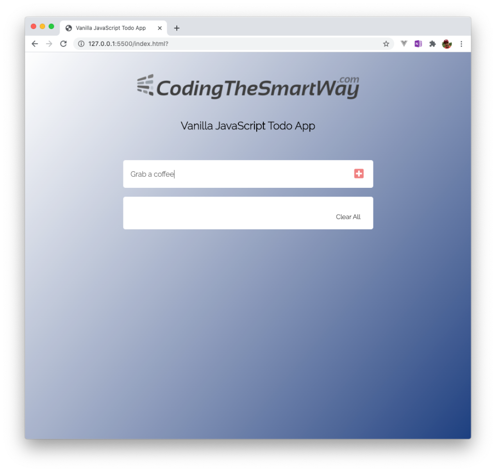
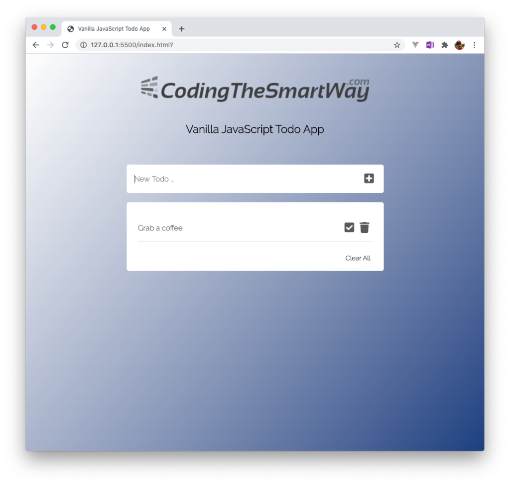
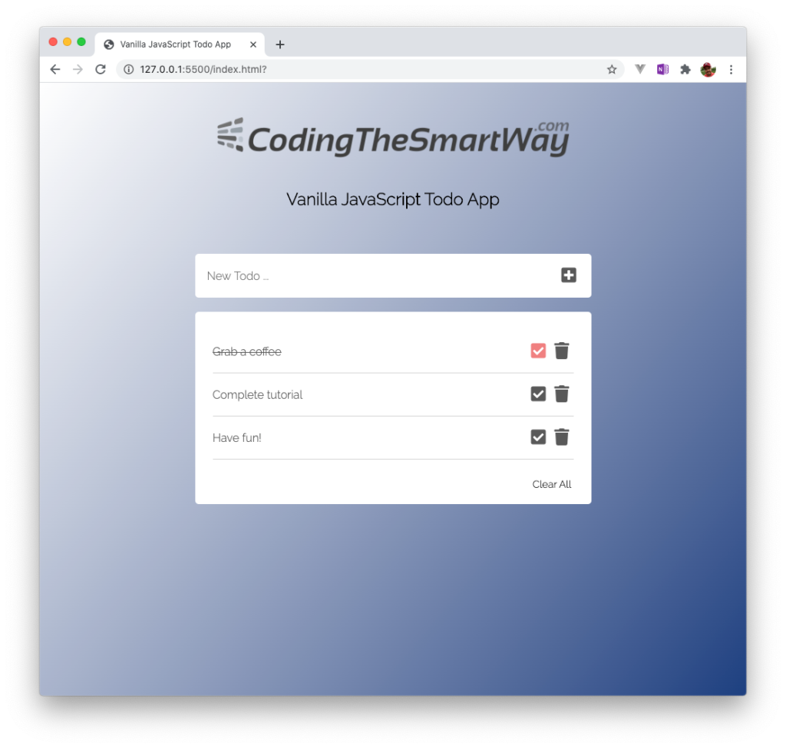
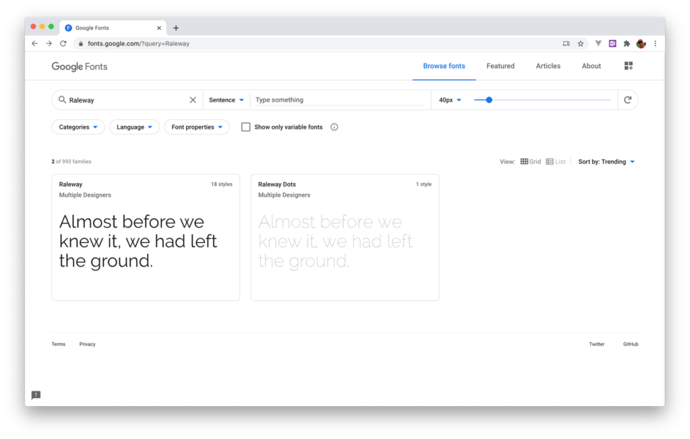
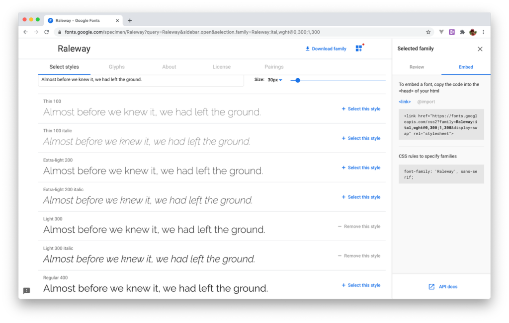
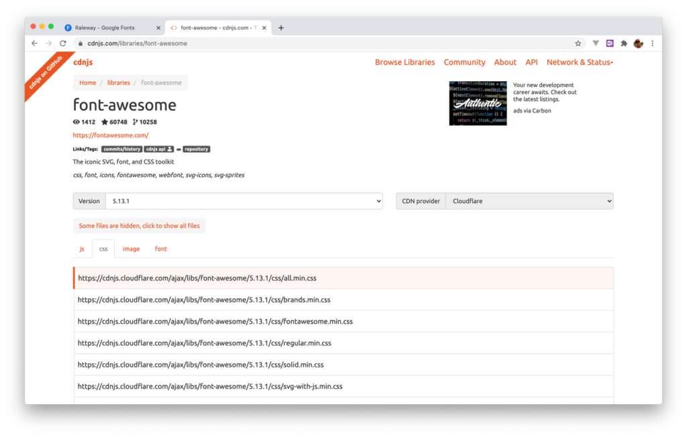
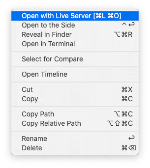
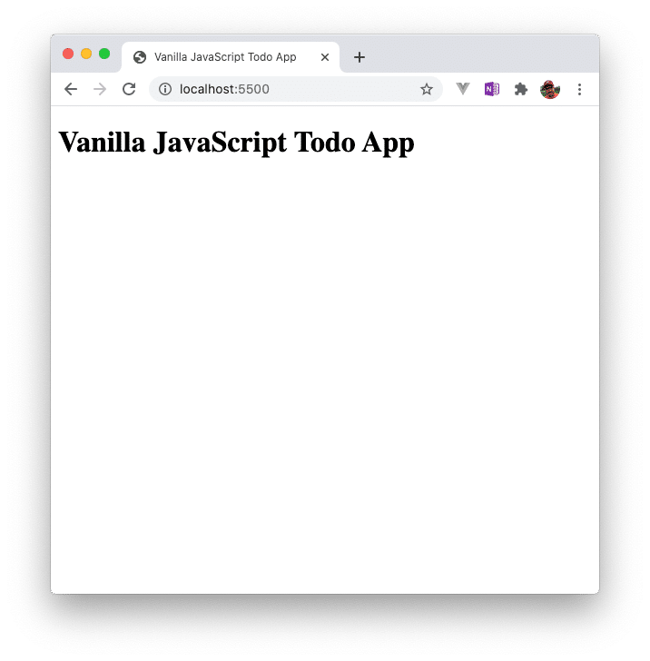

import { Image } from '@astrojs/image/components';
import YouTube from '~/components/widgets/YouTube.astro';
export const components = { img: Image };


<YouTube url="https://youtu.be/Udw66fdmKfQ" />

Welcome to this first part of the _Building A Vanilla JavaScript Todo App From Start To Finish_. In this series we’ll be building a complete todo web application with only using HTML, CSS, and JavaScript. This also means that we’ll only use pure vanilla JavaScript without any frameworks involved.  
  
Today’s web frameworks like React, Svelte, Vue, or Angular makes it possible to build powerful well structured feature-rich web application. However using those frameworks requires additional effort to learn the framework concepts and techniques. Often times those frameworks help a lot but on the other side frameworks are adding more complexity to apps, are increasing the bundle size and makes it hard for other developers (not knowing the framework) to understand your code.  
  
By using frameworks developers often forget then even with plain vanilla JavaScript it is possible to implement modern and sophisticated web applications with ease. The additional features and concepts a frameworks adds to your application is often not required, especially when we’re referring to simple web applications like a todo app.  
  
Furthermore it is essential to have a profound and good knowledge of standard JavaScript if you want to start with a framework later on.

### What We’re Going To Build

So there are good reasons to just learn how to implement a web application with only standard HTML, CSS and plain JavaScript. This is exactly what we’re going to do in this tutorial series. We’ll implement a simple Todo web application which you can see in the following screenshot:


You can use the input field to enter the title of a new task and add that task to the list by either clicking the plus icon or hitting return:



The new task item is then added to the list underneath. For each task two more icons are displayed: a check icon and a delete icon:



You can continue adding multiple task items in the same way. The list is extended automatically and each item is presented in a new row:


Clicking on the check icon of a task item will strike through the item text as you can see in the following:  



### Creating The Project

Creating the new project is easy as we do not need to install dependencies like frameworks or other packages. Just create a new project folder:  
  
`$ mkdir vanilla-js-todo`  
  
and change into that new folder by entering:  
  
`$ cd vanilla-js-todo`  
  
Inside that folder we need to create three new files

- _index.html_
- _app.js_
- _styles.css_

Now we’re ready to insert the basic HTML code into file index.html:

```html
<!DOCTYPE html>
<html lang="en">
<head>
    <meta charset="UTF-8">
    <meta name="viewport" content="width=device-width, initial-scale=1.0">
    <title>Vanilla JavaScript Todo App</title>
    <link rel="stylesheet" href="styles.css">
</head>
<body class="container">
    <h1>Vanilla JavaScript Todo App</h1>
    <script type="text/javascript" src="app.js"></script>
</body>
</html>
```

To insert the code you can use any code editor you like. A good choice is Visual Studio Code ([https://code.visualstudio.com/](https://code.visualstudio.com/)) which is free and and running on macOS, Windows, and Linux.  
  
Notice that we made sure to include our _styles.css_ in the head section and the _app.js_ script in the body section.

### Using Google Fonts

Because the application should have a modern UI, we should also include a modern-looking font which we can get from Google Fonts. Go to the website [https://fonts.google.com/](https://fonts.google.com/) and search for “Raleway”:



Then select to first search result and on the next screen select the styles you’d like to include (e.g. Light 300, and Light 300 italic). Then click on tab _Embed_ on the right side and copy the link element:



Insert the link element in the head section of index.html:

```html
<link href="https://fonts.googleapis.com/css2?family=Raleway:ital,wght@0,300;1,300&display=swap" rel="stylesheet">
```

### Using Font Awesome Icons

To be able to include some nice-looking icons in our app (like the trask icon, the check icon, and the plus icon) we’ll use an icon package which is called Font Awesome. We’re able to include this library by using a CSS file which is hosted on a CDN (Content Delivery Network). Go to page [https://cdnjs.com/libraries/font-awesome](https://cdnjs.com/libraries/font-awesome) switch to tab _CSS_ and copy the first link which is listed:



Then include it in our project by adding the following link element to the head section in _index.html_ as well:

```html
<link href="https://cdnjs.cloudflare.com/ajax/libs/font-awesome/5.13.1/css/all.min.css" rel="stylesheet">
```

### Starting Live Server

Finally let’s see what’ve got and run our application in the browser. To do so we’re starting a small live-reloading web server from within Visual Studio code. Therefore you need to install the Live Server extension and the you can click on the entry _Open with Liver Server_ when opening the context on file index.html:



Live server is then started on your local system and the website is automatically opened in your browser:



### What’s Next

In the next episode we’ll continue implementing the UI of the Todo application.