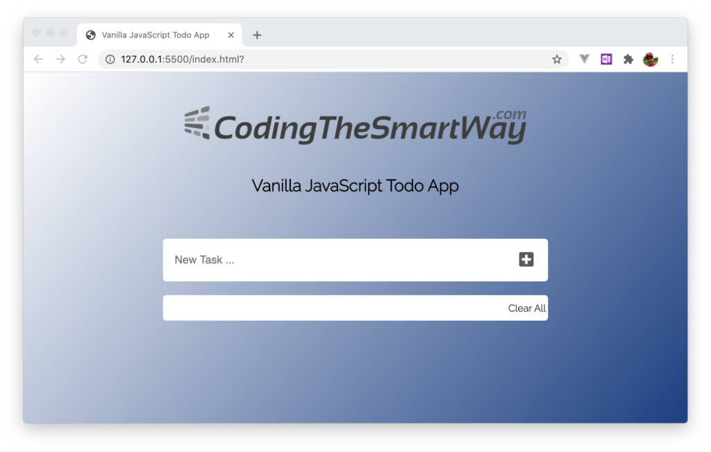

import { Image } from '@astrojs/image/components';
import YouTube from '~/components/widgets/YouTube.astro';
export const components = { img: Image };

<YouTube url="https://youtu.be/14oPpE8SUdo" />

Part of building a Vanilla JavaScript Todo App is adding a modern and nice-looking user interface. In this episode we're going to add the necessary CSS code which is needed to style the todo app and finish building the UI.  
  
When inserting the HTML code in the last part we’ve already made use of several CSS classes which have not been defined yet. Those classes will be defined in _styles.css_ now. Furthermore we’re going to define styling for standard HTML elements as well.  
  
In the following you can see the complete CSS code which needs to be inserted into _styles.css_:

```css
html {
    height: 100vh;
    min-width: 600px;
    background-image: linear-gradient(130deg, #FFFFFF,#1C3F80);
    background-repeat: no-repeat;
    background-size: auto;
}

.container {
    width: 600px;
    display: flex;
    justify-content: center;
    flex-direction: column;
    margin: auto;
    font-family: 'Raleway', sans-serif;
}

.logo {
    display: flex;
    margin: auto;
    flex-direction: column;
    max-width: 500px;
    padding: 1.5rem 0;
    align-items: center;
}

.main {
    padding: 20px;
}

form {
    background-color: #FFFFFF;
    padding: 15px;
    border-radius: 5px;
    display: flex;
}

input[type="text"] {
    height: 30px;
    outline: 0;
    border: none;
    font-size: 1rem;
    font-family: 'Raleway', sans-serif;
    color: #595959;
    flex-grow: 1;
}

button {
    font-size: 1.5rem;
    background-color: #FFFFFF;
    outline: 0;
    border: none;
    color: #595959;
}

button:hover {
    color: lightcoral;
}

.todoList {
    background-color: #FFFFFF;
    border-radius: 5px;
    margin-top: 20px;
    padding: 10px 25px;
    height: 100%;
    overflow-y: auto;
}

ul {
    padding-left: 0px;
    list-style: none;
}

li {
    display: flex;
    align-items: center;
    border-bottom: 1px solid lightgrey;
    padding: 15px 0;
    font-size: 1rem;
    color: #595959;
}

i {
    pointer-events: none;
}

.todo-item {
    flex-grow: 1;
}

.clearAll {
    display: flex;
    justify-content: flex-end;
    padding: 10px 3px;
    cursor: pointer;
    font-size: 0.9rem;
}

.clearAll:hover {
    color: lightcoral;
}
```

After having inserted the CSS code the application should then look like the following:



### What’s Next?

In the next episode we’re starting adding the JavaScript code which is needed to get the application fully working.
