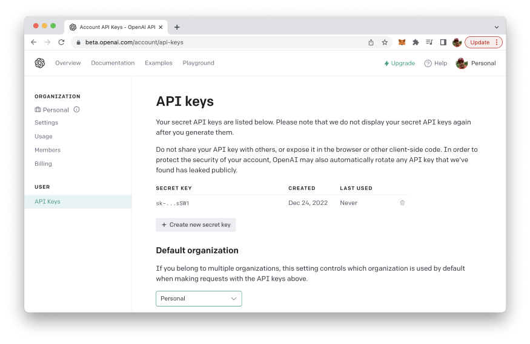
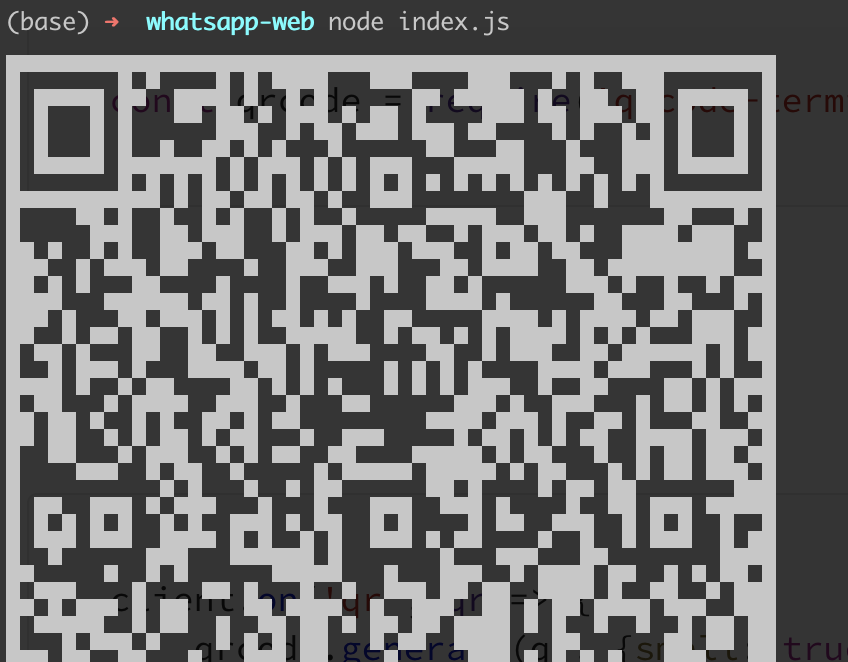
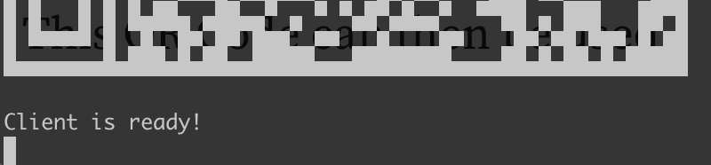
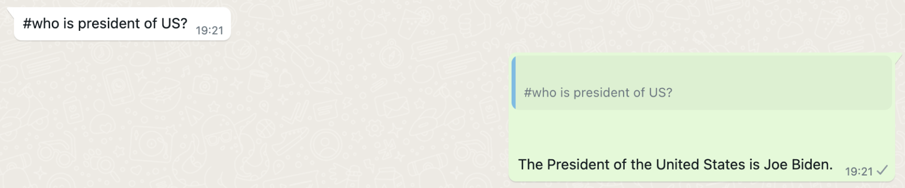

import { Image } from '@astrojs/image/components';
import YouTube from '~/components/widgets/YouTube.astro';
export const components = { img: Image };

Building a chatbot can be a fun and rewarding project, especially if you want to add an automated feature to your business or personal communication. In this guide, we will walk you through the process of building a chatbot for WhatsApp using the OpenAI language model behind ChatGPT. We're creating a bot who is generating responses to WhatApp messages automatically.

## Step 1: Setting Up A Node.js Project And Installing Dependencies

Let's start by creating a new Node.js project first. Enter the following commands:

```bash
$ mkdir whatsapp-bot
$ cd whatsapp-bot
$ npm init -y
```

Next, we're going to install the needed dependencies. First of all we do need to install the whatsapp-web.js package:

```bash
$ npm install whatsapp-web.js
```

Whatsapp-web.js is a Node.js client library that connects through the WhatsApp Web browser app.

Furthermore we need to install the qrcode-terminal npm package by using the following command:

```bash
$ npm install qrcode-terminal
```

The openai npm package needs to be installed as well:

```bash
$ npm install openai
```

The OpenAI Node.js library provides convenient access to the OpenAI API from Node.js applications. In the following steps we'll be making use of this library to implement our WhatsApp chatbot application.

Furthermore we do need to install the dotenv package:

```bash
$ npm install dotenv --save
```

## Step 2: Create Environment Variable for API Key

To start with the implementation create a new file named index.js and a new file .env in the project folder:

```bash
$ touch index.js .env
```

Open file .env in a text editor and insert the following environment variable which holds the API key from your OpenAI account:

```
OPENAI_API_KEY="INSERT YOUR OPENAI API KEY HERE"
```

## Step 3: Obtain The OpenAI API Key

To obtain an API key for the OpenAI API, you will need to sign up for a free OpenAI account on the OpenAI website (https://openai.com/):


To sign up for an account, click the "Sign Up" button in the top right corner of the homepage, and then follow the prompts to create a new account. Once you have created an account, you can obtain an API key by visiting the "API" section of your account settings.

In the "API" section, you will find a button labeled "Generate API Key". Click this button to generate a new API key, which you can then use to make requests to the OpenAI API from your Node.js application. Be sure to keep your API key secure and do not share it with anyone else.



Then replace the text INSERT YOUR OPENAI API KEY HERE in file .env with your personal API key.

## Step 4: Initialize whatsapp-web.js And Listen For Messages

Let's open index.js and start implementing the WhatApp chatbot by inserting the following require statement on top of the file:

```js
const { Client } = require('whatsapp-web.js');
const qrcode = require('qrcode-terminal');
const { Configuration, OpenAIApi } = require("openai");
require('dotenv').config()
```

Next, let's create an instance of Client which gives us access to the whatsapp-web.js functionality.

```js
const client = new Client();
```

Next we're registering event handler functions for the qr and ready event and making sure that the WhatApp client is successfully initialized:

```js
client.on('qr', (qr) => {
    qrcode.generate(qr, {small: true});
});

client.on('ready', () => {
    console.log('Client is ready!');
});

client.initialize();
```

In the event handler for the qr event we're using the qrcode.generate method to output the WhatApp QR code to the command line. This QR code needs to be used to authenticate via your WhatApp mobile app.

## Step 5: Initialize & Configure OpenAI

Now we're ready to create a new OpenAI configuration by initializing a Configuration object and passing an object to the constructor containing the property apiKey. The value which needs to be assigned to apiKey is the OpenAI API key which we can read out from the .env file by using process.env.OPENAI_API_KEY.

```js
const configuration = new Configuration({
  apiKey: process.env.OPENAI_API_KEY,
});
const openai = new OpenAIApi(configuration);
```

## Step 6: Implement runCompletion Function

Next we're going to implement an async runCompletion function:

```js
async function runCompletion (message) {
    const completion = await openai.createCompletion({
        model: "text-davinci-003",
        prompt: message,
        max_tokens: 200,
    });
    return completion.data.choices[0].text;
}
```

Inside this function we're using the openai.createCompletion method to create a OpenAI completion. An OpenAI Completion is a type of language model that can generate text based on a prompt provided by the user. In order to specify our completion we need to pass in a configuration object. This configuration object contains two properties: model and prompt. The model property is used to specifiy the OpenAI language model which should be used to generate an answer for the text we're assigning to the prompt property. The text-davinci-003 language model which is used here is the same language model which is used in the background by ChatGPT.

## Step 7: Generate A Completion And Respond To Messages

Next we need to listen to incoming WhatsApp messages. If the message is starting with # we're activating our bot function. This means that we're passing on the message (after the # sign) to the runCompletion function and sending back the result we're receiving from OpenAI:

```js
client.on('message', message => {
    console.log(message.body);

    if(message.body.startsWith("#")) {
        runCompletion(message.body.substring(1)).then(result => message.reply(result));
    }
});
```

## Step 8: Complete Code & Run The Bot

In the following you can see again the complete source code of file index.js again:

```js
const { Client } = require('whatsapp-web.js');
const qrcode = require('qrcode-terminal');
const { Configuration, OpenAIApi } = require("openai");
require('dotenv').config()

const client = new Client();

client.on('qr', (qr) => {
    qrcode.generate(qr, {small: true});
});

client.on('ready', () => {
    console.log('Client is ready!');
});

client.initialize();

const configuration = new Configuration({
    apiKey: process.env.OPENAI_API_KEY,
});
const openai = new OpenAIApi(configuration);

client.on('message', message => {
    console.log(message.body);

    if(message.body.startsWith("#")) {
        runCompletion(message.body.substring(1)).then(result => message.reply(result));
    }
});

async function runCompletion (message) {
    const completion = await openai.createCompletion({
        model: "text-davinci-003",
        prompt: message,
        max_tokens: 200,
    });
    return completion.data.choices[0].text;
}
```

To run the program you need to enter the following command on the command line:

```bash
$ node index.js
```

The output on the command line should then show the QR code correctly:



This QR Code can then be used for authentication via WhatsApp mobile app. After having scanned the QR code you should see the following message:



Now the Chatbot is running and listing for messages. Use the # sign and write question as a message in WhatsApp. The response is then generated by OpenAI and received as a response to the original message automatically:



That's it! OpenAI and WhatsApp are perfectly integrated. The WhatsApp chat bot is up and running and responding automatically via WhatsApp message replies.
