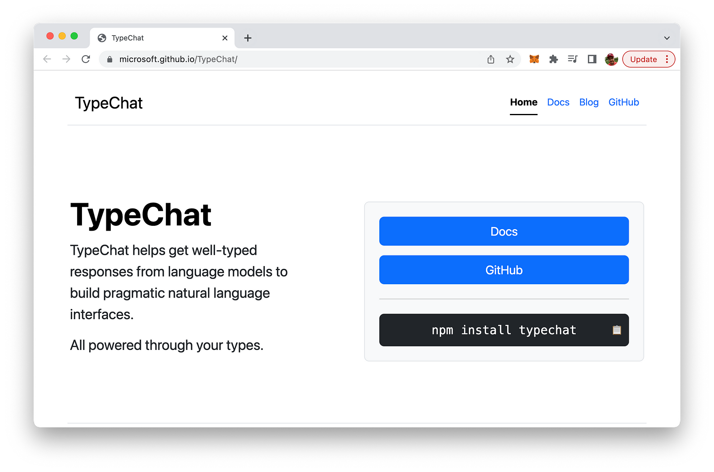
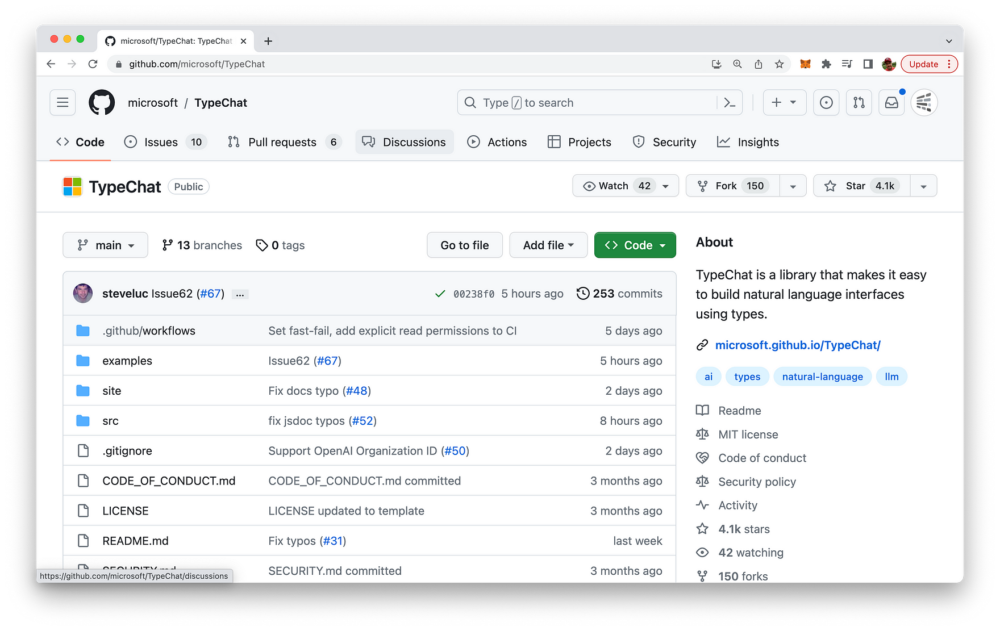
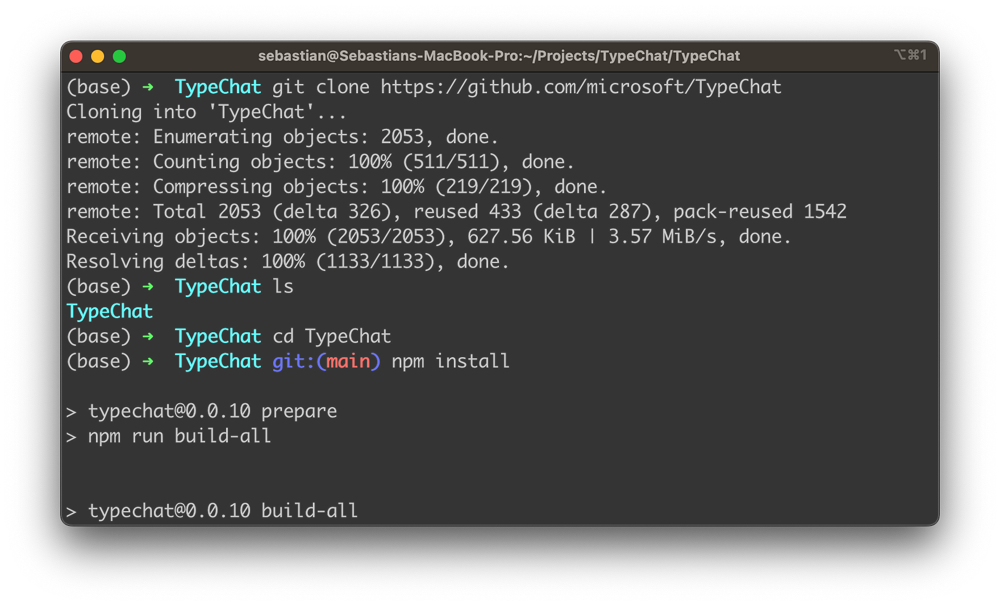
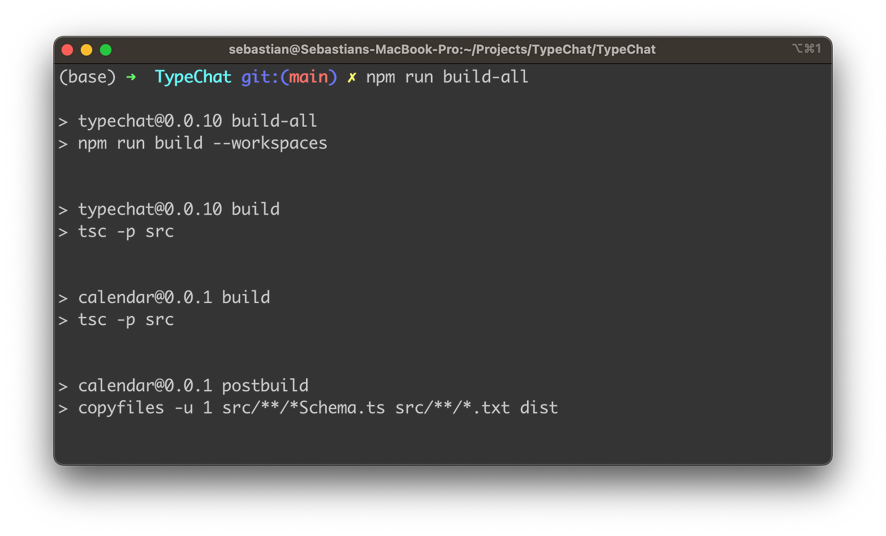
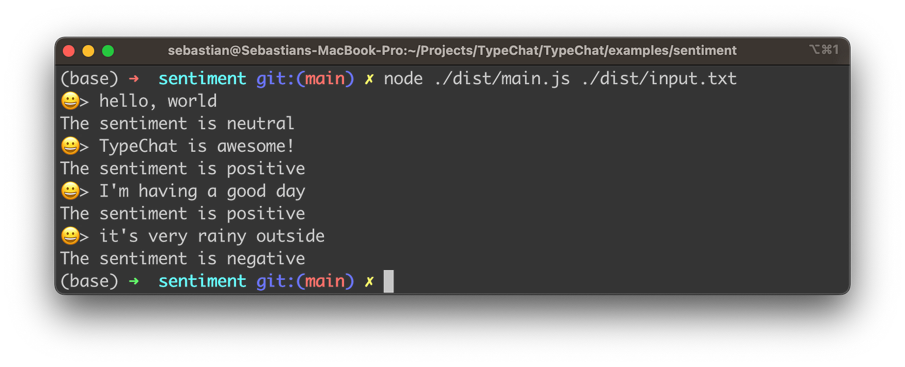

import { Image } from '@astrojs/image/components';
import YouTube from '~/components/widgets/YouTube.astro';
export const components = { img: Image };

In the ever-evolving world of technology, the quest for more efficient and effective ways to interact with software is a constant. One such innovation that has been making waves in the tech community is TypeChat, a library developed by Microsoft that leverages TypeScript to build natural language model interfaces in a typed way. This blog post aims to provide a comprehensive guide to TypeChat, its purpose, how to set it up, and how to use it effectively.

## What is TypeChat?

TypeChat is a revolutionary library that simplifies the process of building natural language model interfaces using TypeScript. Traditionally, creating natural language model interfaces has been a complex task, often relying on intricate decision trees to determine intent and collect the necessary inputs for action. With the advent of large language models (LLMs), this process has become easier, but it has also introduced new challenges such as constraining the model’s reply for safety, structuring responses for further processing, and ensuring the validity of the model’s reply.

TypeChat addresses these challenges by replacing prompt engineering with schema engineering. It allows developers to define types that represent the intents supported in their natural language model application. These could range from simple interfaces for categorizing sentiment to more complex types for a shopping cart or music application. Once the types are defined, TypeChat takes care of the rest, constructing a prompt to the LLM using types, validating the LLM response against the schema, and summarizing the instance to confirm alignment with user intent.

You can find the project’s website at: https://microsoft.github.io/TypeChat/



The source code of the project (including examples) is hosted on GitHub at: https://github.com/microsoft/TypeChat



## The Purpose of TypeChat

The primary purpose of TypeChat is to bridge the gap between natural language and structured data that applications can work with. It aims to make it easier for developers to integrate natural language interfaces into their applications. By providing a model with a schema (some types) and a request, developers can work through well-typed structured data, making the process of integrating natural language into an application more streamlined and efficient.

## Setting Up TypeChat: A Step-by-Step Guide

Setting up TypeChat is a straightforward process. Here's a step-by-step guide:

1. Install Node.js: Ensure Node.js (18.16.0 LTS or newer) is installed on your machine. You can download it from the official Node.js website.

2. Clone the TypeChat Repository: Open your terminal and run the following command to clone the TypeChat repository from GitHub:

```bash
git clone https://github.com/microsoft/TypeChat
```

3. Navigate to the TypeChat Directory: Use the cd command to navigate to the TypeChat directory:

```bash
cd TypeChat
```

4. Install the Dependencies: Run the following command to install the necessary dependencies:

```bash
npm install
```



5. Build TypeChat: Build TypeChat and the examples by running the following command in the repository root:

```bash
npm run build-all
```




6. Configure OpenAI Environment Variables: You need to set up the OpenAI environment variables. You can do this by creating a `.env` file in the root directory of the project and adding the following lines:

```
OPENAI_MODEL=gpt-3.5-turbo
OPENAI_API_KEY=your_openai_api_key
```

Replace `your_openai_api_key` with your actual OpenAI API key.

7. Run the Examples: Examples can be found in the examples directory. To run an example interactively, navigate to the example's directory and run the following command:

```bash
node ./dist/main.js
```

You can enter requests when prompted and type quit or exit to end the session.

Let's try this out for the sentiment analyzer example. The input text which should be used for sentiment analysis can be taken from the input.txt file which is available in the dist subfolder as well:

```bash
node ./dist/main.js ./dist/input.txt
```

You should then be able to see the following output on the console:



## A Usage Example of TypeChat

To see TypeChat code in action, let's consider an example. Suppose we have a coffee shop application, and we want to translate user intent into a list of coffee order items. We can define a type for a coffee order item and use TypeChat to handle natural language input and map it to validated JSON as output. This way, we can easily translate a user's natural language request into a structured order that our application can understand and process.

Here's a simple TypeScript type definition for a coffee order:

```js
interface CoffeeOrder {
  type: string;
  size: string;
  extras: string[];
}
```

To use TypeChat, we can create a new instance and pass our CoffeeOrder type to it:

```js
import { TypeChat } from 'typechat';
const typeChat = new TypeChat<CoffeeOrder>();

// User input
const userInput = "I would like a large cappuccino with extra foam and a shot of vanilla.";

// Use TypeChat to get a structured order
const order = typeChat.process(userInput);
console.log(order);

// Output: { type: 'cappuccino', size: 'large', extras: ['extra foam', 'shot of vanilla'] }
```

In this example, TypeChat takes the user's natural language input and translates it into a structured CoffeeOrder that our application can easily process.

## Conclusion

In conclusion, TypeChat is a powerful tool that leverages the power of TypeScript to simplify the process of building natural language interfaces. It bridges the gap between natural language and structured data, making it easier for developers to integrate natural language interfaces into their applications. With its ease of setup and use, TypeChat is set to revolutionize the way we interact with software, making it more intuitive and user-friendly. So, if you're a developer looking to enhance your application with natural language interfaces, TypeChat is definitely worth exploring.
