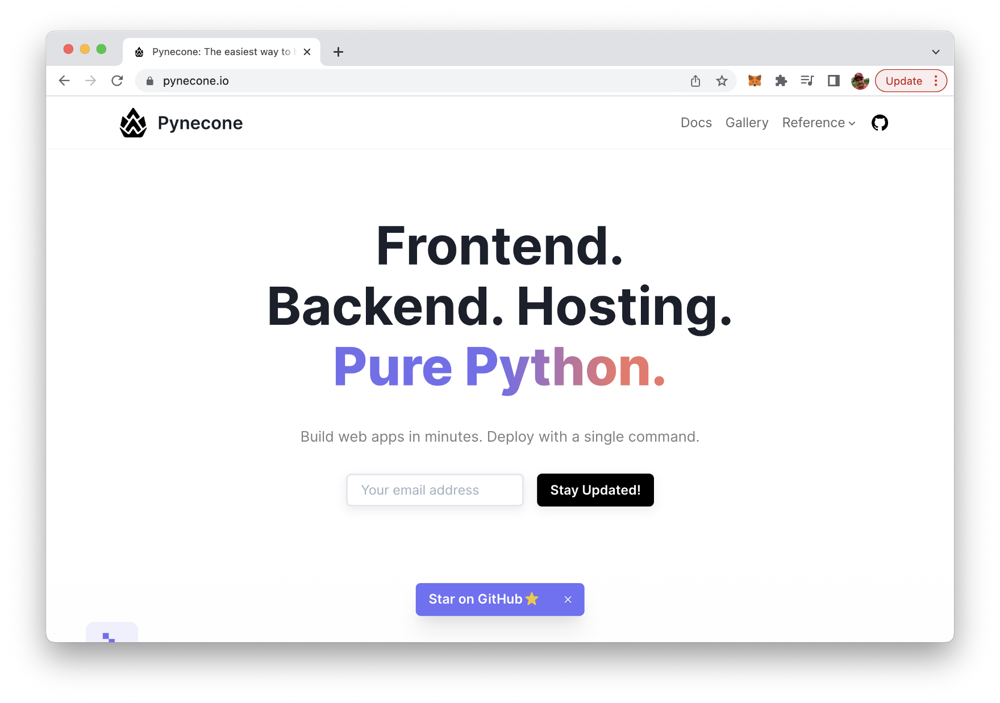
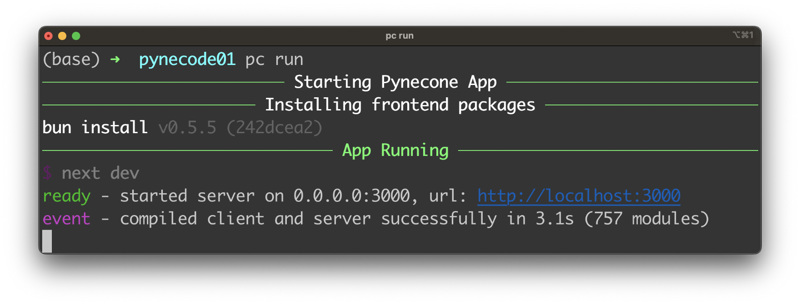
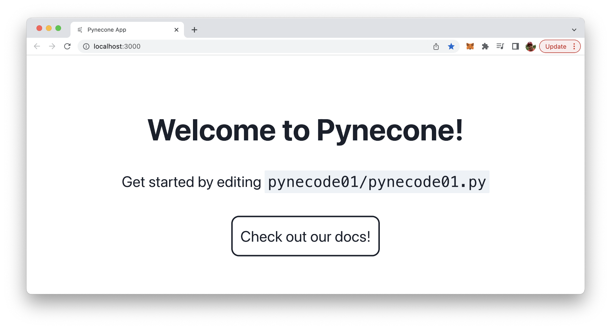
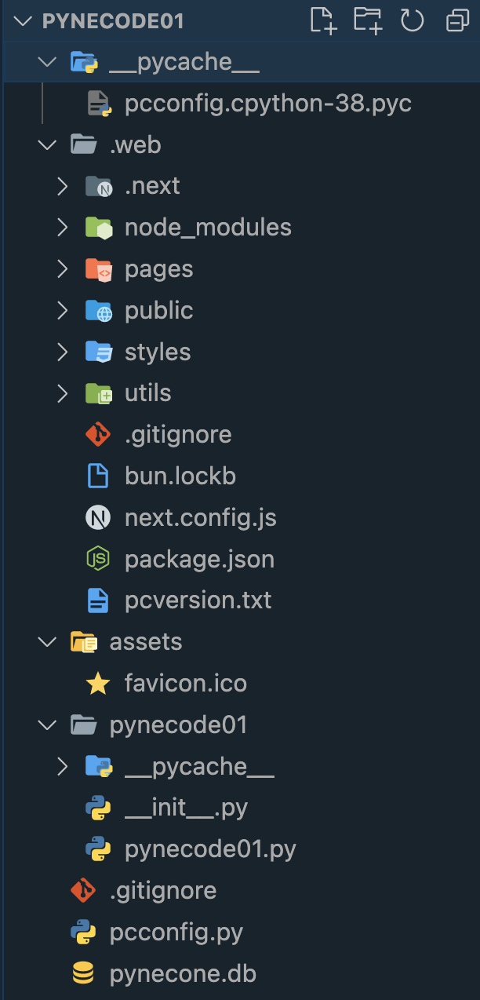
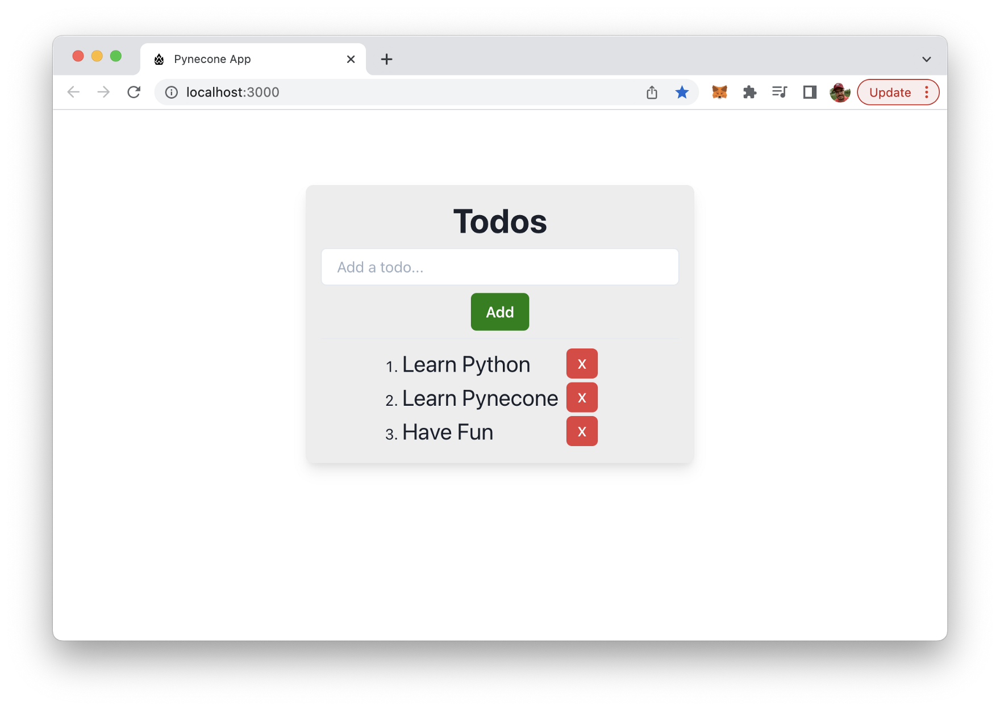
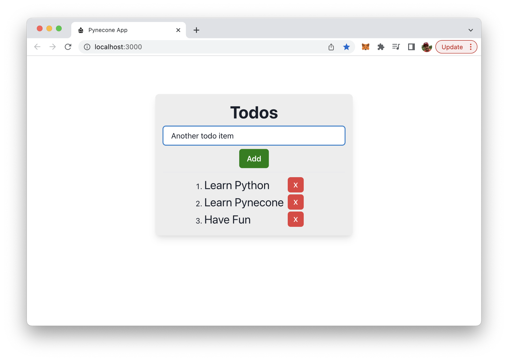
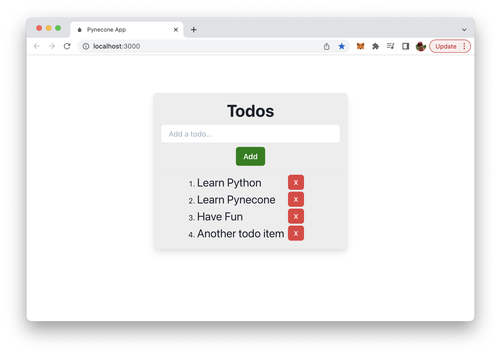

import { Image } from '@astrojs/image/components';
import YouTube from '~/components/widgets/YouTube.astro';
export const components = { img: Image };

<YouTube url="https://youtu.be/LYl-kxYUnCc" />

Python is one of the most popular programming languages used in web development today. With its clean syntax and extensive libraries, it has become a go-to language for building web apps. Pynecone is a full-stack Python framework for building and deploying web apps. This makes the process of building and deploying web apps with Python a lot easier.

Pynecone is a new Python web framework that covers the complete stack: front-end, back-end and deployment. The framework's website is available at https://pynecone.io/:



This tutorial is an introduction to Pynecone. You'll learn some of the framework's basics and we'll run through a practical sample web project.

## Installation

In order to be able to install Pynecone on your development system you need to make sure to have two prerequisites covered:

*Python 3.7+ must be installed on your system
*Node.js 12.22.0+ must be installed on your system

You can then use the pip command to install Pynecone in the following way:

```bash
$ pip install pynecone
```

## Creating Your First Pynecone Project

Let's create a first project with Pynecone. Therefore you first need to create a new empty project folder, change into that new folder and use the pc command the initialize a new Pynecone project:

```bash
$ mkdir pynecode01
$ cd pynecode01
$ pc init
```

You should then see the output of Pynecode as you can see in the following screenshot:


The project is setup successfully.

## Running The Web Server

The Pynecone project was created succesfully and we're ready to start up the development web server to be able to see the output of the default Pynecone project in the browser. Use the following command to get the development web server up and running:

```bash
$ pc run
```

You should then see the following output on the command line:



Here you can see that the web server was started on port 3000, so that you can access the project's output by accessing http://localhost:3000 in the browser. The default output can be seen in the following screenshot:



Pynecone's development web server comes with live reloading capabilities. So everytime you change the implementation the output in the browser will be updated automatically without the need to manually trigger a reload on the website.

## Project Structure

Let's dive a little bit deeper and take a look at the project structure which has been created by default:



* The .web folder contains the compiled output of the Pynecone project. The output which is generated is a Next.js JavaScript project which is located inside that folder.
* The assets folder is used to store any static assets which are used in the project (images, fonts, other static files etc.).
* Furthermore a subfolder with the name of the project (pynecode01) is available. This is the main folder of the project where the implementation of the Pynecode web application will take place. By default this folder contains a file with the same name (pynecode01.py). This is where the default

## Implementing A Sample Application

Let's start with building a complete Pynecone sample todo application. Start with deleting the complete default code inside pynecode01.py and then add the following import statement on top of the file:

```python
import pynecone as pc
```

This gives us access to the Pynecone framework in general.

Next, we start to specify the application's state. The app's state is where all the vars that can change in the app are defined, as well as all the functions that can modify them. We do so be implementing a State class which inherits from pc.State:

```python
class State(pc.State):
    items = ["Learn Python", "Learn Pynecone", "Have Fun"]
    new_item: str

    def add_item(self):
        self.items += [self.new_item]
        self.new_item = ""

    def finish_item(self, item):
        self.items = [i for i in self.items if i != item]
```

The class has a class attribute items that is a list of strings containing three items. Additionally, there is an instance attribute new_item which is of type string.

The State class has two instance methods - add_item and finish_item. The add_item method appends the value of the new_item instance attribute to the items list, then sets new_item to an empty string. This method effectively adds a new item to the items list.

The finish_item method removes the specified item from the items list. This method uses a list comprehension to create a new list with all items from the original list except the one that matches the argument.

Let's further add a function which is able to generate a part of the UI, a single list todo item:

```python
def render_item(item):
    return pc.list_item(
        pc.hstack(
            pc.text(item, font_size="1.5em"),
            pc.button(
                "X", 
                color_scheme="red", 
                size="sm",
                on_click=lambda: State.finish_item(item),
            ),
            justify_content="space-between",
        )
    )
```

The list item output is generated by using some of Pynecone's components like list_item, hstack, text, and button. The item itself is passed into that function via the item argument, so that the text component can be used to output the item text.

The next function which we're going to implement in the todo_list function. This function is generating the remaining parts of the UI and among other things is making use of the previously implemented render_item function to output single todo items:

```python
def todo_list():
    return pc.container(
        pc.vstack(
            pc.heading("Todos"),
            pc.input(
                on_blur=State.set_new_item,
                placeholder="Add a todo...",
                bg="white",
            ),
            pc.button("Add", on_click=State.add_item, bg="green", color="white"),
            pc.divider(),
            pc.ordered_list(
                pc.foreach(State.items, lambda item: render_item(item)),
            ),
            bg="#ededed",
            margin="5em",
            padding="1em",
            border_radius="0.5em",
            shadow="lg",
        )
    )
```

The application UI is build up by using the container component as the top UI element. Inside this container components a vstack layout component is used to stack items vertically.

Inside this layout component we're making use of further Pynecone UI components like heading, button, divider and ordered_list.

Finally we need to add three lines of code which are needed to create the application instance, add the routes and finally initiates the compilation of the Pynecone web app by calling app.compile():

```python
app = pc.App(state=State)
app.add_page(todo_list, path="/")
app.compile()
```

Let's check the result in the browser again:



By default the todo list is already containing three to item. You can use the text input field to input text for a new todo item:



In order to create that new todo item you simply need to click on the Add button. The new todo item is added to the list of todo items right away:



The red buttons can be used to delete single todo items from the list. E.g. press the red button for the last element in the list and you can see that the item is removed from the list immediately:


## Conclusion

Pynecone offers a complete solution for building and deploying web apps with Python, making the process easier than ever before. With its extensive libraries and clean syntax, Python is a popular language for web development, and Pynecone takes it to the next level by providing a full-stack framework. From front-end to back-end and deployment, Pynecone has everything you need to build and launch your web app with ease. Whether you are a beginner or an experienced developer, Pynecone offers a simple and efficient way to bring your web app ideas to life. So, if you want to take advantage of the power and simplicity of Python in web development, give Pynecone a try and see how easy it can be to build and deploy your web app.

