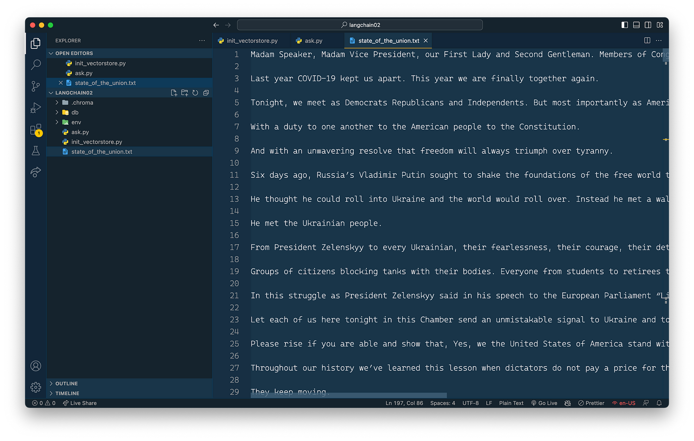
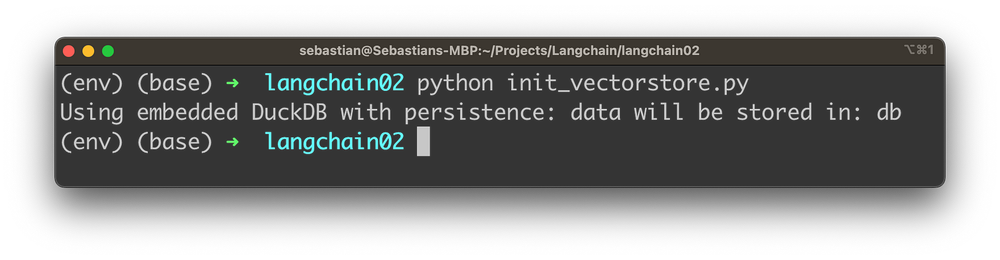

import { Image } from '@astrojs/image/components';
import YouTube from '~/components/widgets/YouTube.astro';
export const components = { img: Image };

Welcome to the fascinating world of Artificial Intelligence, where the lines between human and machine communication are becoming increasingly blurred. In this blog post, we'll explore an exciting new frontier in AI-driven interactions: chatting with your text documents! With the powerful combination of OpenAI's models and the innovative LangChain framework, you can now turn static documents into interactive conversations.

Are you ready to revolutionize the way you work with text files? Then buckle up and dive into our ultimate guide to integrating OpenAI with LangChain, as we walk you through the process step by step.

## What is LangChain?

LangChain is a powerful framework designed to simplify the development of Large Language Model (LLM) applications. By providing a single generic interface for various LLMs, prompt management, chaining, data-augmented generation, agent orchestration, memory, and evaluation, LangChain enables developers to seamlessly integrate LLMs with real-world data and workflows. This framework allows LLMs to solve real-world problems more effectively by incorporating external data sources and orchestrating the sequence of interactions with different components.


We'll use the framework in the following sample application to generate embeddings from a text document source and persist this content in a Chroma vector database. We'll then use LangChain to query this source with user provided questions using the OpenAI language models in the background for processing the request.

This will enable us to chat with out own text document.

## Setting Up The Project

Create a new project folder and install the following Python package:

```bash
pip install langchain openai chromadb tiktoken
```

The command `pip install langchain openai chromadb tiktoken` is used to install four Python packages using the Python package manager, pip. Each package serves a specific purpose, and they work together to help you integrate LangChain with OpenAI models and manage tokens in your application. Let's break down the packages involved:

1. `langchain`: This package is the main LangChain library, which facilitates seamless integration with OpenAI models for creating interactive chat experiences with text documents.
2. `openai`: This is the official Python package for OpenAI's API, enabling you to work with the powerful language models provided by OpenAI, such as GPT-4.
3. `chromadb`: ChromaDB is a lightweight, high-performance, schema-less vector database designed for use with AI applications. It allows you to store, retrieve, and manage the vector data (embeddings) required for your LangChain and OpenAI-powered document chat applications.
4. `tiktoken`: Tiktoken is a utility library provided by OpenAI that helps you count and manage tokens in text strings without making API calls. This is useful for monitoring token usage, staying within API limits, and efficiently working with OpenAI's models.

By executing this command, you install all the necessary packages to start building and deploying text document chat applications that utilize LangChain with OpenAI.

Add the following two files into the project folder:

```bash
touch init_vectorstore.py ask.py
```

Furthermore let's add a txt document to the project as well. For the example of this article the State of the Union text is added as state_of_the_union.txt as you can see in the following:



Let's start adding the following Python code into file init_vectorstore.py.

The code reads a text document, splits it into smaller chunks, and generates embeddings using OpenAI models. Then, it creates and persists a Chroma database containing the embeddings and associated metadata. This allows for efficient storage and retrieval of document embeddings for AI-driven text analysis and interactions.

```python
from langchain.embeddings.openai import OpenAIEmbeddings
from langchain.text_splitter import CharacterTextSplitter
from langchain.vectorstores import Chroma

import os
os.environ["OPENAI_API_KEY"] = "[INSERT YOUR OPEN AI API KEY HERE]"

with open("state_of_the_union.txt") as f:
    state_of_the_union = f.read()

text_splitter = CharacterTextSplitter(chunk_size=1000, chunk_overlap=0)
texts = text_splitter.split_text(state_of_the_union)

embeddings = OpenAIEmbeddings()

docsearch = Chroma.from_texts(texts, embeddings, metadatas=[{"source": f"Text chunk {i} of {len(texts)}"} for i in range(len(texts))], persist_directory="db")

docsearch.persist()
docsearch = None
```

Here's a step-by-step description of the code:

1. Import the necessary libraries and modules:

* `OpenAIEmbeddings` from `langchain.embeddings.openai` to work with OpenAI models and generate embeddings.
* `CharacterTextSplitter` from `langchain.text_splitter` to split the input text into smaller chunks.
* `Chroma` from `langchain.vectorstores` for creating the Chroma database to store the embeddings and metadata.
* `os` for handling environment variables.

2. Set the OpenAI API key as an environment variable using `os.environ`. To obtain your OpenAI API key, sign up for an account at OpenAI's official website (https://www.openai.com/). Once your account is approved, navigate to the API key section under your account settings or dashboard. You'll find your unique API key there, which you can use to access OpenAI's models and services.

3. Open and read the contents of the "state_of_the_union.txt" file into a variable called `state_of_the_union`.

4. Create an instance of `CharacterTextSplitter` with a `chunk_size` of 1000 characters and `chunk_overlap` of 0, meaning no overlapping characters between chunks.

5. Split the `state_of_the_union` text into chunks using the `split_text` method of the `text_splitter` instance.

6. Create an instance of `OpenAIEmbeddings` called `embeddings` to generate document embeddings using OpenAI models.

7. Instantiate the `Chroma` object with the `from_texts()` method, which takes the following arguments:

* `texts`: The text chunks generated earlier.
* `embeddings`: The OpenAIEmbeddings instance for generating embeddings.
* `metadatas`: A list of metadata dictionaries for each text chunk.
* `persist_directory`: The directory where the Chroma database will be stored (in this case, "db").

8. Persist the `Chroma` object to the specified directory using the `persist()` method.
   
9.  Set the `docsearch` variable to `None` to clear it from memory.

In summary, this code reads a text document, splits it into smaller chunks, generates embeddings using OpenAI models, creates a Chroma database with the generated embeddings and metadata, and persists the database to a specified directory for future use.

Let's run this code to create the embeddings content for the Chroma vector database by using the following command:

```bash
python init_vectorstore.py
```

You should then receive the following output:



In your project folder you should then be able to find a db subfolder which is containing some content.


## Interact With The Text Document

Let's implement the the interaction logic with our text document in file _ask.py_. The following code demonstrates how to create a question-answering (QA) system using LangChain, OpenAI models, and a Chroma database containing embeddings. The Chroma vector database has been prepared with our content in the last step, so that we're now ready to make use of this:

```python
from langchain.chains import RetrievalQAWithSourcesChain
from langchain import OpenAI
from langchain.vectorstores import Chroma
from langchain.embeddings.openai import OpenAIEmbeddings

import os
os.environ["OPENAI_API_KEY"] = "[INSERT YOUR OPEN AI API KEY HERE]"

embeddings = OpenAIEmbeddings()

docsearch = Chroma(persist_directory="db", embedding_function=embeddings)

chain = RetrievalQAWithSourcesChain.from_chain_type(OpenAI(temperature=0), chain_type="stuff", retriever=docsearch.as_retriever())

user_input = input("What's your question: ")

result = chain({"question": user_input}, return_only_outputs=True)

print("Answer: " + result["answer"].replace('\n', ' '))
print("Source: " + result["sources"])
```

Here's a description of the code:

1. Import the necessary libraries and modules, including `RetrievalQAWithSourcesChain`, `OpenAI`, `Chroma`, and `OpenAIEmbeddings`.
2. Set the OpenAI API key as an environment variable using `os.environ`.
3. Create an instance of `OpenAIEmbeddings` called `embeddings` to generate document embeddings using OpenAI models.
4. Instantiate the `Chroma` object using the `persist_directory` argument (where the previously created Chroma database is stored) and the `embedding_function` argument (the `embeddings` instance).
5. Create a `RetrievalQAWithSourcesChain` instance using the `from_chain_type()` method. This instance takes the following arguments:

* `OpenAI(temperature=0)`: An instance of the OpenAI class with the specified temperature setting.
* `chain_type="stuff"`: The type of chain to create (in this case, "stuff").
* `retriever=docsearch.as_retriever()`: The retriever object, which is the Chroma instance converted to a retriever using the as_retriever() method.

6. Prompt the user to input a question using the `input()` function.
7. Pass the user's question to the QA system (the `chain` instance) and retrieve the result.
8. Print the answer and source of the answer, with line breaks removed from the answer text.

In summary, this code creates a simple QA system using LangChain, OpenAI models, and a Chroma database. It prompts the user for a question, processes the question using the QA system, and returns the answer along with its source - let's see it in action. Start the script with

```bash
python ask.py
```


Enter a question which is related to any content of the State of the Union text, e.g.:


You'll then receive the answer together with the source information of the text chunk which has been used to retrieve the necessary information from.

This allows us now to ask any question which is associated to the text document by using OpenAI's language model in the background.

## Conclusion

The powerful combination of OpenAI models and LangChain has opened up new possibilities for transforming the way we interact with text documents. As we've demonstrated in this guide, integrating these cutting-edge technologies has never been easier.