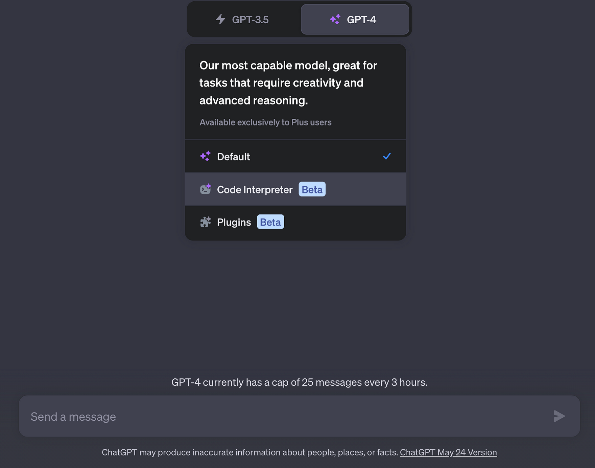

import { Image } from '@astrojs/image/components';
import YouTube from '~/components/widgets/YouTube.astro';
export const components = { img: Image };

In the realm of artificial intelligence, OpenAI’s ChatGPT has been making waves with its impressive capabilities. One of its most notable features is the Code Interpreter, a plugin that has revolutionized the way we interact with AI. Launched on July 6th, 2023, this feature is now available to all ChatGPT Plus users, offering a sandboxed Python interpreter that allows for data analytics, image conversions, code editing, and more. However, as with any technology, it comes with its own set of limitations. In this blog post, we’ll delve into the strengths and weaknesses of this fascinating tool.

## The Power of the Code Interpreter

The Code Interpreter is a game-changer in the field of AI. It provides an interactive platform for learning to code, with the AI guiding users through the coding process, explaining concepts, correcting mistakes, and suggesting improvements. It can execute code snippets in real time, allowing users to see the immediate results of their code. It supports various programming languages, with Python being the most commonly used due to its simplicity and popularity in data analysis and machine learning tasks.

The Code Interpreter can process datasets and execute complex computations or data manipulations using libraries like Pandas or NumPy. It's also capable of generating visual outputs such as graphs using libraries like Matplotlib or Seaborn. It can even provide assistance in debugging code by identifying and explaining common errors, such as syntax errors or logical mistakes. Furthermore, it can generate code snippets based on a user's description or requirements, offering a starting point for various programming tasks.

## The Limitations of the Code Interpreter

Despite its impressive capabilities, the Code Interpreter has its limitations. For security and privacy reasons, the code interpreter does not have access to the Internet. This means it cannot install new packages, update existing packages, or perform actions that require internet access. The environment has limited computational resources, so running computationally intensive tasks or large jobs could result in timeouts or failures.

Another limitation is state management. If the conversation takes too long or gets interrupted, the interpreter may lose the state of the session, requiring the user to reload data or redefine variables or functions. While the interpreter does report errors, it may not provide detailed debugging information for complex code issues.

The Code Interpreter also has a knowledge cut-off. The assistant's training only includes knowledge up to September 2021, and it may not be aware of developments or changes in programming languages, libraries, or practices after this date. Furthermore, some advanced features, such as multithreading, multiprocessing, or certain machine learning operations, might not be fully supported.

## Conclusion

OpenAI's Code Interpreter is a remarkable tool, pushing the boundaries of code generation and data analytics. It offers users an interactive learning platform with real-time code execution, support for multiple languages, data processing capabilities, and visual outputs. However, while the potential applications are impressive, the interpreter has certain limitations such as no internet access, limited computational resources, and restricted support for advanced features, which users should bear in mind. As AI technology continues to evolve, we can expect these limitations to be addressed and the capabilities of tools like the Code Interpreter to expand even further.