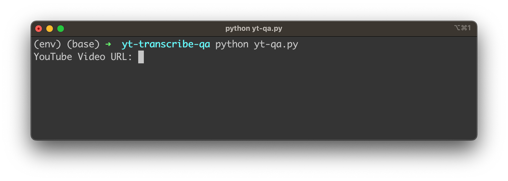
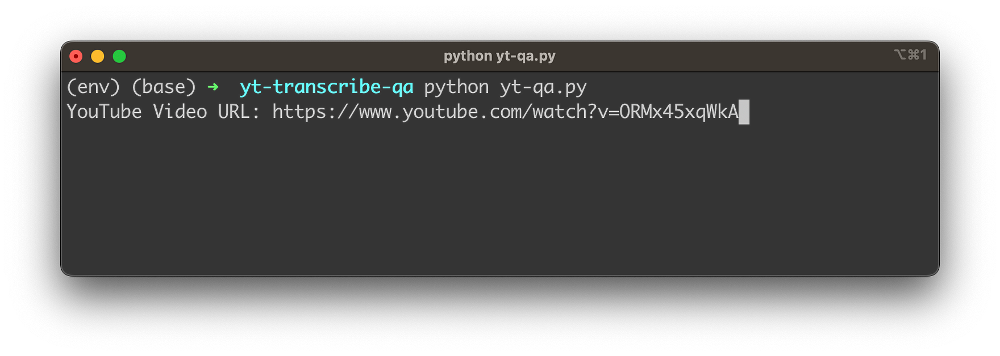
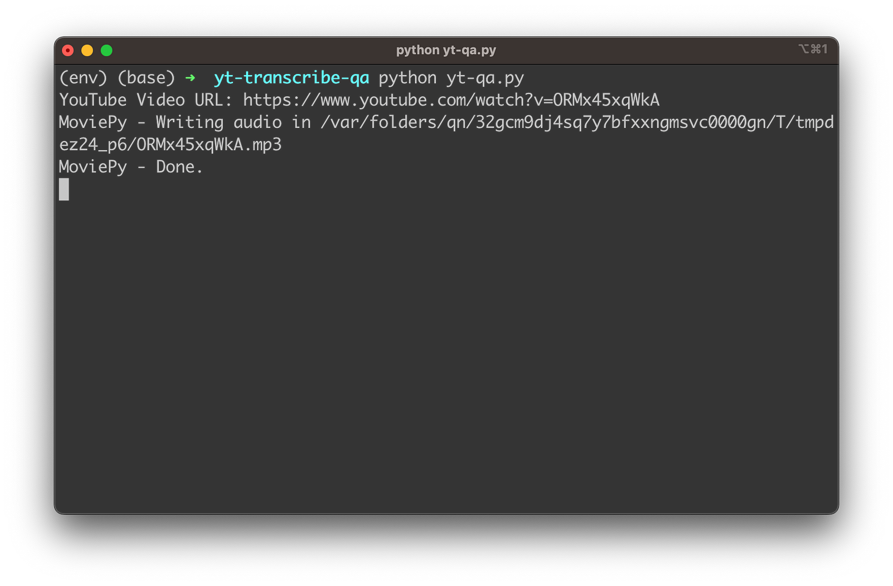
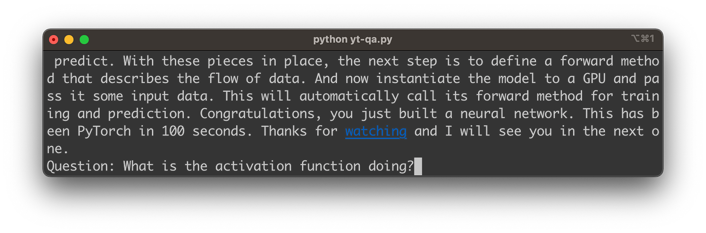
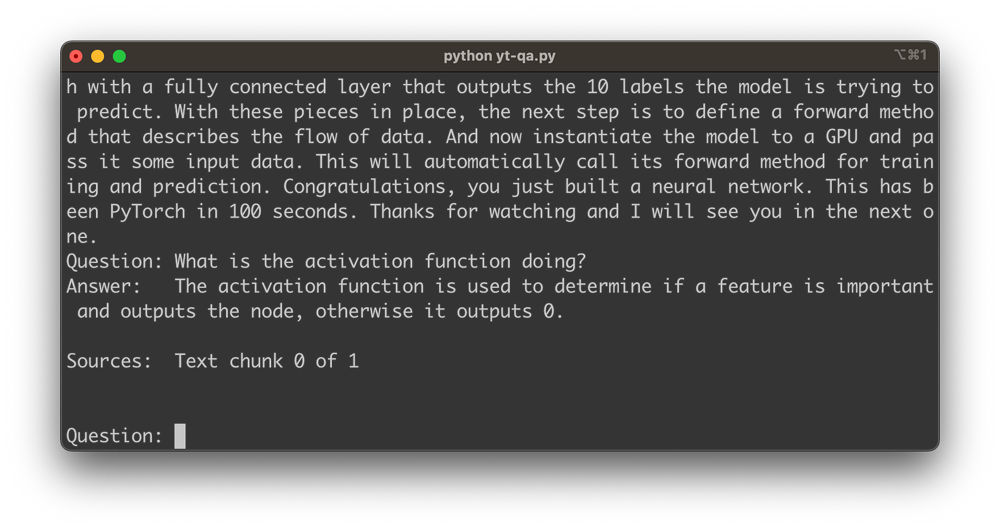
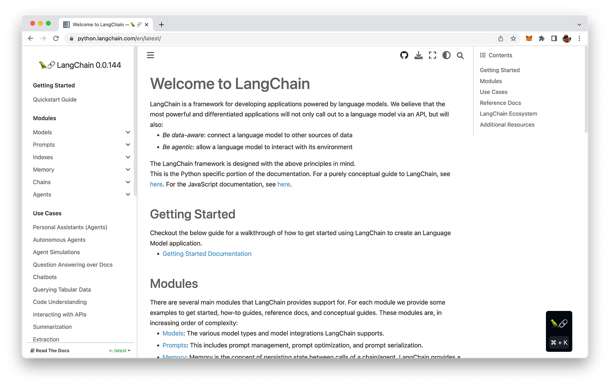

import { Image } from '@astrojs/image/components';
import YouTube from '~/components/widgets/YouTube.astro';
export const components = { img: Image };

In the ever-evolving world of artificial intelligence, language models have become a game-changer, enabling remarkable applications in various domains. Imagine harnessing this power to create an intelligent chatbot that not only understands and processes the content of YouTube videos but can also answer questions based on that content. Sounds intriguing, right? In this blog post, we'll take you on a journey to unlock the power of language models by combining OpenAI's state-of-the-art Whisper Speech-To-Text API and the versatile LangChain framework. Get ready to dive into the world of Python programming as we guide you through the process of building a YouTube Video Q&A Chatbot, a tool that is bound to revolutionize the way we interact with video content!

## What We Are Going To Build

The YouTube Transcript and Q&A Assistant app we're going to build in this article is a Python-based application designed to help extract, transcribe, and analyze the audio content from a YouTube video. It allows to input the URL of a YouTube video, and the application will download the audio, convert it into an MP3 format, transcribe the audio into text, and split the text into smaller segments. The application utilizes the OpenAI Whisper API and LangChain library to manage the transcriptions and enable a question-and-answer functionality for further analysis.

With this application, you can easily extract valuable information from YouTube videos without needing to manually transcribe the content. Additionally, the question-and-answer feature helps gain deeper insights by allowing us to ask questions about the transcribed content and receive relevant answers with their corresponding sources. This tool is particularly useful for educational purposes, research, or simply enhancing my understanding of a video's content.

Let's see the application in action. Once started the command line application is asking the user to provide a URL of a YouTube video as you can see in the following:



We're inputting the video link and confirming the input by hitting return:



Next, the audio stream of the video is downloaded in MP3 format and saved in a temporary file:



Once the audio download is done, the audio file is handed over to Whisper API, so that the transcription process can be started. Once the transcription is available the text is printed to the console. After the transcript is ready the script is entering the question and answering loop. You can now start inputting your first question related to the video content:



Hit return and you'll see that and answer is provided which is based on the video content:



## Building Block: Whisper API & LangChain

Let's get familiar with the two main important building blocks first before diving into the implementation details:

__Whisper__

OpenAI's Whisper API is a powerful and versatile speech-to-text service that harnesses the capabilities of the state-of-the-art Whisper Automatic Speech Recognition (ASR) system. This API enables developers and businesses to convert spoken language into written text with remarkable accuracy and efficiency. By leveraging cutting-edge machine learning models and techniques, Whisper API provides a reliable solution for a wide range of applications, including transcription services, voice assistants, real-time captioning, and more.

Whisper ASR is built on a vast dataset containing 680,000 hours of multilingual and multitask supervised data collected from the web, ensuring impressive performance across numerous languages and use cases. With the Whisper API, developers can integrate this robust speech-to-text technology into their applications, products, or services, opening up new possibilities for communication, accessibility, and productivity in various domains.

__LangChain__

Amidst this rapidly evolving landscape of AI frameworks, LangChain has emerged as a versatile framework designed to help developers harness the full potential of LLMs for a wide range of applications. Built around the core concept of "chaining" different components together, LangChain simplifies the process of working with LLMs like GPT-3, GPT-4, and others, allowing you to create customized, advanced use cases with ease.

The project's website can be found at https://python.langchain.com/en/latest/:



## Implementation

Next we'll provide you with a detailed and step-by-step description of how to implement the provided Python script to create a YouTube video Q&A chatbot using OpenAI's Whisper Speech-To-Text API and the LangChain framework. Let's first take a look at the complete code:

```python
import os 
import openai
import faiss
import tempfile

from moviepy.editor import *
from pytube import YouTube
from urllib.parse import urlparse, parse_qs

from langchain.embeddings.openai import OpenAIEmbeddings
from langchain.text_splitter import CharacterTextSplitter
from langchain.vectorstores.faiss import FAISS
from langchain.chains import RetrievalQAWithSourcesChain
from langchain import OpenAI

# os.environ["OPENAI_API_KEY"] = ""

# Transcripe MP3 Audio function
def transscribe_audio(file_path):
    file_size = os.path.getsize(file_path)
    file_size_in_mb = file_size / (1024 * 1024)
    if file_size_in_mb < 25:
        with open(file_path, "rb") as audio_file:
            transcript = openai.Audio.transcribe("whisper-1", audio_file)

        return transcript
    else:
        print("Please provide a smaller audio file (max 25mb).")

def divide_segments():
    return

# Main application
def main(): 
    # Get YouTube video URL from user
    url = input("YouTube Video URL: ")

    # Extract the video ID from the url
    query = urlparse(url).query
    params = parse_qs(query)
    video_id = params["v"][0]

    with tempfile.TemporaryDirectory() as temp_dir:
        
        # Download video audio
        yt = YouTube(url)

        # Get the first available audio stream and download this stream
        audio_stream = yt.streams.filter(only_audio=True).first()
        audio_stream.download(output_path=temp_dir)

        # Convert the audio file to MP3
        audio_path = os.path.join(temp_dir, audio_stream.default_filename)
        audio_clip = AudioFileClip(audio_path)
        audio_clip.write_audiofile(os.path.join(temp_dir, f"{video_id}.mp3"))

        # Keep the path of the audio file
        audio_path = f"{temp_dir}/{video_id}.mp3"

        # Transscripe the MP3 audio to text
        transcript = transscribe_audio(audio_path)
        
        # Delete the original audio file
        os.remove(audio_path)
        
        print(transcript.text)

    # Splitting the text
    textsplitter = CharacterTextSplitter(chunk_size=512, chunk_overlap=0)

    texts = textsplitter.split_text(transcript.text)

    store = FAISS.from_texts(
        texts, OpenAIEmbeddings(), metadatas=[{"source": f"Text chunk {i} of {len(texts)}"} for i in range(len(texts))]
    )

    faiss.write_index(store.index, "docs.faiss")

    llm = OpenAI(temperature=0)
    chain = RetrievalQAWithSourcesChain.from_chain_type(
        llm=llm, chain_type="stuff", retriever=store.as_retriever()
    )

    # Enter question / answer loop
    while True:
        question = input("Question: ")
        answer = chain({"question": question}, return_only_outputs=True)
        print("Answer: ", answer["answer"])
        print("Sources: ", answer["sources"])
        print("\n")

## execute main
if __name__ == "__main__":
    main()
```

Let's go through the code step-by-step:

1. First, import the necessary libraries and modules:

* `os` and tempfile: For file and directory manipulation.
* `openai`: For using OpenAI's APIs.
* `faiss`: For efficient similarity search and clustering of dense vectors.
* `moviepy.editor`: For video editing tasks.
* `pytube`: To download YouTube videos.
* `urllib.parse`: To parse and manipulate URLs.
* LangChain-related imports: For using the LangChain framework.

2. Set up the environment variable for the OpenAI API key (optional):

3. Uncomment the line `# os.environ["OPENAI_API_KEY"] = ""` and replace the empty string with your OpenAI API key.

4. Define the `transscribe_audio` function:

This function takes the path to an audio file as input and returns its transcript using the Whisper API. It checks if the file size is below 25 MB (Whisper's limit), and if it is, it transcribes the audio and returns the transcript.

5. Define the `main` function:

* The `main` function is where the core functionality of the script resides. Here's a breakdown of the steps within the function:
* Prompt the user for the YouTube video URL and extract the video ID.
* Create a temporary directory to store the downloaded audio file.
* Download the audio stream from the YouTube video using `pytube`.
* Convert the audio file to MP3 format using `moviepy.editor`.
* Transcribe the MP3 audio to text using the previously defined `transscribe_audio` function.
* Split the text into smaller chunks using the `CharacterTextSplitter` from the LangChain framework.
* Create a `FAISS` index from the text chunks using the `FAISS.from_texts` method.
* Save the FAISS index to a file called `"docs.faiss"` for future use.
* Initialize the OpenAI language model and configure the `RetrievalQAWithSourcesChain`.
* Enter a question and answer loop, allowing the user to ask questions and receive answers based on the video's content.

6. Execute the `main` function:

The last line of the script, `if __name__ == "__main__": main()`, executes the `main` function when the script is run.

To implement the script, follow these steps:

1. Install the required libraries and packages by running `pip install openai faiss-cpu moviepy pytube3 langchain tiktoken`.
2. Create a new Python script and copy the provided code into it.
3. Uncomment and update the line with your OpenAI API key or set the OpenAI Key on the command like with `export OPENAI_API_KEY=""`
3. Save the script and run it with `python script_name.py`.

After implementing the script, you'll have a functional YouTube video Q&A chatbot that leverages the power of OpenAI's Whisper API and the LangChain framework.

## Conclusion

This blog post has demonstrated the incredible potential of combining OpenAI's Whisper Speech-To-Text API with the LangChain framework to create a powerful YouTube Video Q&A Chatbot in Python. This application not only simplifies the process of transcribing and analyzing YouTube video content but also enables users to interact with the content on a deeper level through a question-and-answer interface.

The step-by-step guide provided in this post has allowed you to implement the code and unlock the potential of this cutting-edge technology. By following these steps, you have taken a significant leap into the realm of artificial intelligence and natural language processing, opening up new possibilities for creating innovative and intelligent applications.

As AI technologies continue to advance, the potential applications and use cases for such tools will only grow, making it an exciting time to be a developer. We hope this blog post has inspired you to explore further and harness the power of language models in your own projects. Happy coding!

