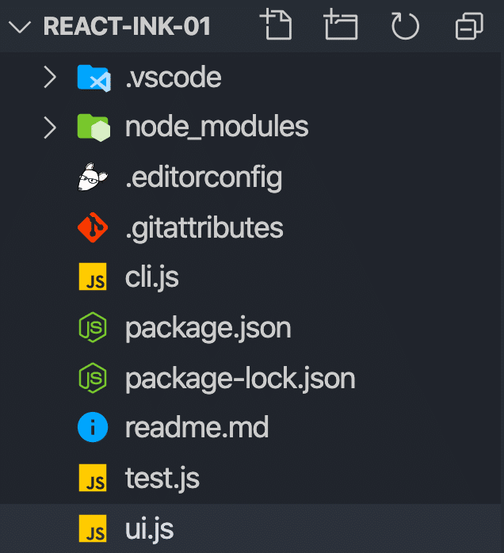

import { Image } from '@astrojs/image/components';
import YouTube from '~/components/widgets/YouTube.astro';
export const components = { img: Image };


<YouTube url="https://youtu.be/jQXM8o_c3io" />

If you’re a developer you’ve probably working with a lot of different command-line interfaces (CLIs). Recently modern command-line interfaces have been becoming more interactive and more user-friendly.

Modern command-line interfaces are accepting user input, provide nice looking command-line user interfaces, and are able to handle even complex tasks like guiding the user through different process steps. 

As the usability increases command-line interfaces are provided for more and more tasks and use cases. Modern CLIs are able to already replace some graphical user interfaces (GUIs). 

## React And Ink 3

When you think of React you most of think of web and mobile development. However, by using the Ink 3 React library it becomes possible to use React for building modern CLIs. If you have already gained some experiences with React and React’s component-based approach you can directly make use of that knowledge when developing CLIs.

The project’s website is available at [https://github.com/vadimdemedes/ink](https://github.com/vadimdemedes/ink):


## Scaffolding An Ink 3 Project

Let’s start with creating a new Ink 3 project by using the create-ink-app scaffolding script inside a new empty project folder:

`$ mkdir react-ink-01`

`$ cd react-ink-01`

`$ npx create-ink-app`

We’re able to directly download and run the script by using the _npx_ command. The _npx_ command is part of Node.js, so you need to make sure the install Node.js on your system first. 

Finally you should be able to see an initial project structure which should correspond to the following:



Now let’s take a closer look at the default implementation of a commend-line interface which can be found in _ui.js_:

```jsx
"use strict";
const React = require("react");
const { Text } = require("ink");

const App = ({ name = "Stranger"}) => (
   <Text>
        Hello,{" "}
        <Text color="green">
            {name}
        </Text>
    </Text>
);

module.exports = App;
```

This piece of code should look familiar to you if you have been working with React before. First of all the React package and the Text component from the Ink package are being imported. A functional React component App is created. This component is containing the code which is describing the UI of the command-line interface by making use of Ink’s components.

## Trying It Out

Let’s try the default implementation out by using the command in the following way:

`$ react-ink-01`

As output you should be able to see the text “Hello, Stranger”:


 By default the command also provides help output by using the `--help` command line option. 

`$ react-ink-01 --help`

The output gives you then further instructions of the CLI’s usage:


 It also tells you that the command is able to receive one command line parameter `--name` in the following way:

`$ react-ink-01 --name=Sebastian`

Supply a value for the name parameter is changing the output in the following way:


## Adding Another Command-line Parameter

Now you should have a first idea of the default implementation, so that we can start extending the default CLI implementation in the next step. In the first step let’s add another command line parameter:

```jsx
"use strict";
const React = require("react");
const { Text } = require("ink");

const App = ({ name = "Stranger", from = "Nowhere" }) => (
    <Text>
        Hello,{" "}
        <Text color="green">
            {name} from {from}
        </Text>
    </Text>
);

module.exports = App;
```

To add a new command line parameter we need to a another parameter to the object which is passed into the App component function. As you can see in the code listing the name of this new parameter is _from_ and the default value of that parameter is set to string “Nowhere”. 

We’re making use of the _from_ value in the component’s output as well:

```js
{name} from {from}
```

Let’s try it out once again, by only passing a value for the name command line parameter:

`$ react-ink-01 --name=Sebastian`

In the following screenshot you can see the resulting output in which the default value for the _from_ parameter is used:


 In the next step let’s add a value for the _from_ command-line parameter as well:

`$ react-ink-02 --name=Sebastian --from=Germany`

The output changes accordingly and the default string _Nowhere_ is replaced with the value supplied by via command-line:


## Adding A Box Component

Let’s move on to another example in which we’re making use of another Ink layout component: _Box_. 

```jsx
"use strict";
const React = require("react");
const { Text, Box } = require("ink");

const App = ({ name = "Stranger", from = "Nowhere" }) => (
   <Box borderStyle="round" borderColor="green">
        <Text>
            Hello,{" "}
            <Text color="green">
                {name} from {from}
            </Text>
        </Text>
    </Box>
);

module.exports = App;
```

Here we’re surrounding the text element with the _Box_ component. For the _Box_ we adding attributed _boderStyle_ and _borderColor_. By setting 

Let’s see how the output is changed when executing the following command once again:

`$ react-ink-02 --name=Sebastian --from=Germany`

You should be able to see the text embedded in a green box with rounded corners:


## Implementing A Counter

The next example is the implementation of a counter CLI which is updating the command line output continuously when incrementing the counter value. Take a look at the following piece of code:

```jsx
const App = () => {
    const [counter, setCounter] = React.useState(0);
    React.useEffect(() => {
        const timer = setInterval(() => {
            setCounter((prevCounter) => prevCounter + 1);
        }, 100);

        return () => {
            clearInterval(timer);
        };
    }, []);

    return <Text color="green">{counter} tests passed</Text>;
};
```

The first thing you probably notice is that we’re making use of two React hooks in this implementation: _useState_ and _useEffect_. The _useState_ hook is used to create a new counter state in _App_ component and initialize this state with value 0. Later on the _setCounter_ function will be used to update the state value. 

The useEffect hook is used to register actions for side-effects to the component. In our specific example we’re using this hook to register a function which should be executed right at the beginning of the component’s lifecycle. Therefore we need to pass in an empty array as the second parameter of the _useEffect_ function. 

The function which is passed in the first parameter is setting a timer which is incrementing the counter state by 1 every 100 ms. 

As a result you should see an output similar to the following with an increasing counter value:


## Accepting User Input

Now let’s explore how we can bring real interactivity to our CLI by adding code which is needed to accept user input. Take a look at the following code example:

```jsx
"use strict";
const React = require("react");
const { useInput, useApp, Text, Box } = require("ink");

const App = () => {
    const { exit } = useApp();
    const [x, setX] = React.useState(1);
    const [y, setY] = React.useState(1);

    useInput((input, key) => {
        if (input === "q") {
            exit();
        }

        if (key.leftArrow) {
            setX(Math.max(1, x - 1));
        }

        if (key.rightArrow) {
            setX(Math.min(20, x + 1));
        }

        if (key.upArrow) {
            setY(Math.max(1, y - 1));
        }

        if (key.downArrow) {
            setY(Math.min(10, y + 1));
        }
    });

    return (
        <Box flexDirection="column">
            <Text>Use arrow keys to move the icon. Press "q" to exit.</Text>
            <Box height={12} paddingLeft={x} paddingTop={y}>
                <Text>😁</Text>
            </Box>
        </Box>
    );
};
```

Here we’re making use of some of Ink’s Hooks like the _useInput_ and _useApp_ hook:

- _useApp_: By using the _useApp_ hook we’re able to obtain access to the exit function which can be used to terminate the CLI app
- _useInput_: By using the _useInput_ hook we’re able to register an event handler function which is invoked when the user enters characters. The functions received two parameters: _input_ and _key_. The _input_ parameter is containing the character(s) which have been entered by the user and the _key_ object is containing additional properties (like _upArrow_) which are indicated if a specific key is pressed.

In our example the user input is used to move a smiley face around. By using the arrow keys you are able to move the icon in every direction (left, right, up, down). In order to move the smiley around we’re using two component states: _x_ and _y_. Each state is created by using the useState React Hook and is initialized with value 1. 

Each time the user is pressing an arrow key the _x_ and _y_ state values are increased or decreased accordingly. In order to place the smiley at the right position the x and y state values are used to set the _paddingLeft_ and _paddingTop_ properties of the surrounding Box component. 


 By pressing the _q_ button the user is able to exit the CLI execution. 

## Conclusion

By using Ink 3 you can structure terminal output in components in the same way you’d build an React app for the browser. By using the Ink layout components you can easily create modern and interactive command-line interfaces. Ink 3 supports the use of hooks which makes it easy and straightforward to e.g. access user input and therewith add interactivity to your CLIs.