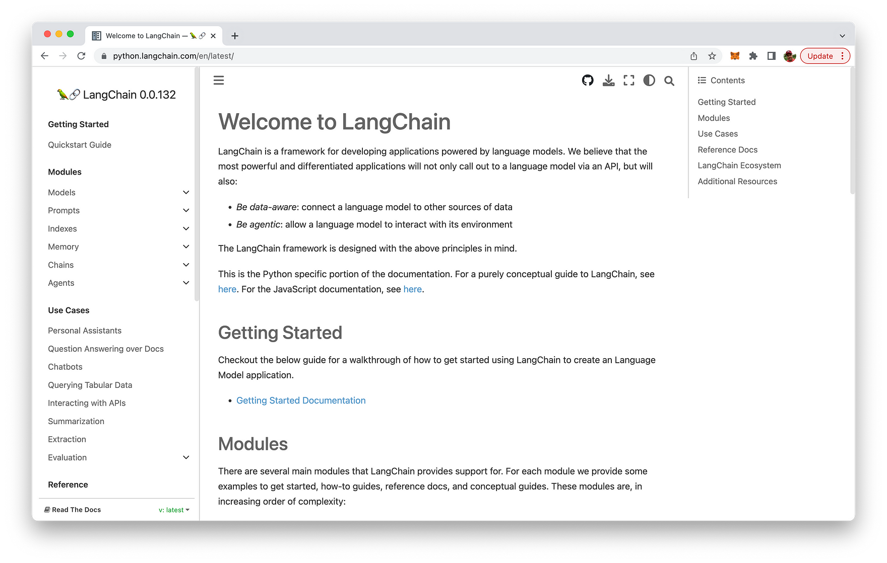
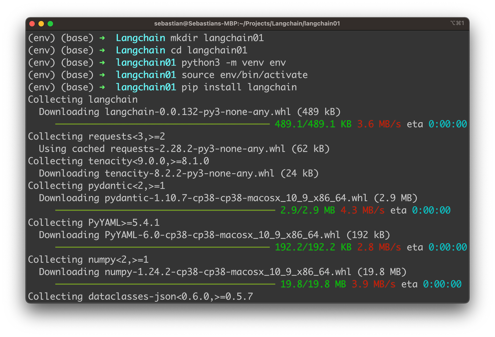
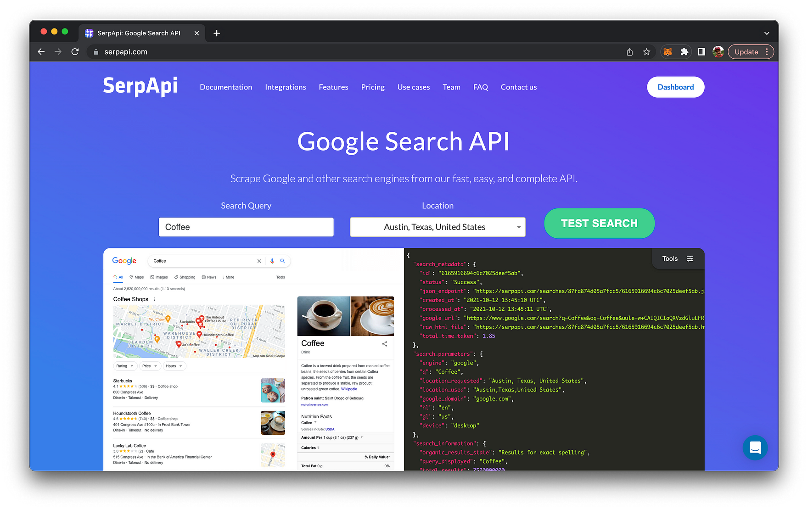
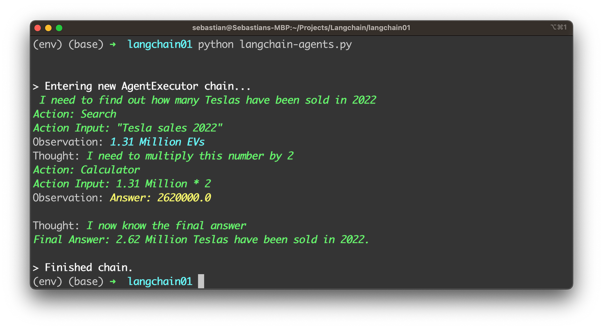

import { Image } from '@astrojs/image/components';
import YouTube from '~/components/widgets/YouTube.astro';
export const components = { img: Image };

As powerful as the OpenAI language models may be, it can be further enhanced by connecting those models with the world's most popular search engine, Google Search. This integration, made possible by LangChain, can revolutionize the way we interact with AI, making it a truly indispensable tool in various domains.

By connecting OpenAI models to Google Search, users can leverage real-time, up-to-date information to generate more accurate and relevant responses. This integration not only saves time and effort but also ensures that AI-generated content is more reliable and valuable. From content creation and data analysis to customer support and decision-making, the potential applications of this powerful combination are endless. Furthermore, it paves the way for developing more sophisticated AI systems, capable of handling complex tasks with ease and precision.

## What is LangChain

LangChain is an innovative framework designed to develop applications powered by language models like GPT. It goes beyond the traditional API-based approach, focusing on creating applications that are data-aware and agentic. This allows language models to connect with other data sources and interact with their environment effectively.

One of the standout features of LangChain is the ability to utilize LangChain Agents for seamless integration with various tools, including those that provide access to Google Search. This enables language models to tap into a wealth of real-time information, significantly enhancing their capabilities.

The LangChain framework comprises several main modules, including Prompts, LLMs, Indexes, Memory, Chains, and Agents. Each module offers different levels of complexity and functionality to cater to a wide range of applications. With prompt management, interface support for LLMs, data structuring, state persistence, and decision-making, LangChain is a comprehensive solution for creating powerful language model applications.

More information about LangChain can be found at: https://python.langchain.com/en/latest/



So let's explore how we can make use of LangChain to connect OpenAIs LLMs with Google Search in the following.

## Setting Up The Project And Installing Dependencies

Let's start by creating a new project folder first:

```bash
mkdir langchain01
cd langchain01
```

Next, create a new Python virtual environment:

```bash
python3 -m venv env
```

The command `python3 -m venv env` creates a new virtual environment named env using the Python 3 `venv` module.

Here's a breakdown of the command:

* `python3`: This specifies that the command should use Python 3 as the interpreter.
* `-m venv`: This flag indicates that the command should run the built-in venv module, which is used for creating virtual environments.
* `env`: This is the name of the virtual environment you want to create. In this case, the virtual environment will be named `env`.

A virtual environment is an isolated Python environment that allows you to install packages and dependencies specific to a particular project, without interfering with your system-wide Python installation or other projects. This isolation helps maintain consistency and avoid potential conflicts between different project requirements.

Once the virtual environment is created, you can activate it using the following command:

```bash
source env/bin/activate
```

With the virtual environment activated, we're ready to install the needed dependencies for our project. First we stat with the installation of LangChain by using the following command:

```bash
pip install langchain
```

The output on the console should then look like the following:



Let's continue installing the `openai` package:

```bash
pip install openai
```

Finally let's add the google-search-results package as well:

```bash
pip install google-search-results
```

The `google-search-results` package is a Python library that allows you to interact with the SerpApi, which is a Google Search Results API. SerpApi provides easy access to Google search results, allowing developers to query search engine results programmatically. By installing this package, you can use the API to fetch search results, such as web pages, images, news, etc., and process them in your Python applications.

The LangChain Agent which we're setting up below will use the serpapi tool which depends on the package being installed.

In order to be able to use the SerpApi service you need to retrieve a SerpApi API key as well. Got to the project's website at serpapi.com, sign-up for a free test account and retrieve the key from the dashboard:



In order to be able to use OpenAI's models through LangChain you need to retrieve an API key from OpenAI as well. Follow these steps:

1. Go to the OpenAI website: https://www.openai.com/
2. Click on "Get Started" or "Sign in" if you already have an account.
3. Create an account or sign in to your existing account.
4. After signing in, you'll be directed to the OpenAI Dashboard.
5. Navigate to the API section by clicking "API" in the left sidebar menu or by visiting: https://platform.openai.com/signup
6. Follow the instructions to access or sign up for the API. If you're eligible, you'll be provided with an API key.
7. The API key should look like a long alphanumeric string (e.g., "sk-12345abcdeABCDEfghijKLMNOP").

Once you have the API key, you can use it to authenticate your requests when using OpenAI's API in your applications. Make sure to keep the API key secure and not share it with unauthorized individuals, as it allows access to your OpenAI account and its associated resources.

Finally you need to set both API keys with the following commands:

```bash
export OPENAI_API_KEY="[INSERT YOUR OPENAI API KEY HERE]"
export SERPAPI_API_KEY="[INSERT YOUR SERPAPI API KEY HERE]"
```

To complete the project structure we also need to create a file which contains the Python code for our application:

```bash
touch langchain-agents.py
```

Insert the following code:

```python
from langchain.agents import load_tools
from langchain.agents import initialize_agent
from langchain.agents import AgentType
from langchain.llms import OpenAI

llm = OpenAI(temperature=0)
tools = load_tools(["serpapi", "llm-math"], llm=llm)
agent = initialize_agent(tools, llm, agent=AgentType.ZERO_SHOT_REACT_DESCRIPTION, verbose=True)
agent.run("How many Teslas have been sold in 2022. Multiple by 2")
```

The given Python code demonstrates the usage of the LangChain framework to create an agent that interacts with external tools and a language model to answer a question. In this case, the question is about Tesla's profit in 2021 and 2022 and the percentage change between these two years. The code can be described in detail as follows:

1. Import the necessary modules and functions:

* `load_tools` is a function that loads the specified tools.
* `initialize_agent` is a function that initializes an agent with the given tools and language model.
* `AgentType` is an enumeration of different types of agents available in the LangChain framework.
* `OpenAI` is the LLM class for interfacing with OpenAI's LLM.

2. Create an instance of the `OpenAI` class with a temperature of 0. The temperature parameter controls the randomness of the generated text, with lower values making the output more deterministic and focused.

3. Load the required tools by calling the `load_tools` function with a list of tool names, in this case, "serpapi" and "llm-math". The `llm` parameter is set to the previously created OpenAI instance. These tools allow the agent to access the SERP API for retrieving data and perform mathematical calculations using the LLM.

4. Initialize the agent by calling the `initialize_agent` function with the loaded tools, the OpenAI instance, and the agent type `AgentType.ZERO_SHOT_REACT_DESCRIPTION`. The `verbose` parameter is set to True to enable more detailed output during the agent's execution.

5. Finally, run the agent by calling its `run` method with the given question: "How many Teslas have been sold in 2022. Multiple by 2" The agent will use the loaded tools and the LLM to answer this question by retrieving the relevant data and performing the necessary calculations.

Let's run the app by executing:

```bash
python langchain-agents.py
```

You should then be able to see the following output:



Using the configured tools _serpapi_ and _llm-math_ the LangChain agent is able to find the answer to the provided question step by step.

## Conclusion

This blog post serves as a comprehensive guide on how to harness the power of LangChain to connect OpenAI's state-of-the-art language models with Google Search. By utilizing the LangChain framework and its various components, developers can create data-aware and agentic applications that tap into real-time information from the world's most popular search engine. This integration paves the way for more powerful AI applications across a wide range of domains, from content generation to decision-making.

We demonstrated the process of setting up a project, installing dependencies, and writing code to create an intelligent LangChain agent capable of using both OpenAI models and the SERP API. With the foundation laid out in this guide, developers can now explore and create more advanced applications, pushing the boundaries of what AI-powered systems can achieve. By combining the power of OpenAI's language models and Google Search, we are one step closer to realizing the full potential of AI in our daily lives.