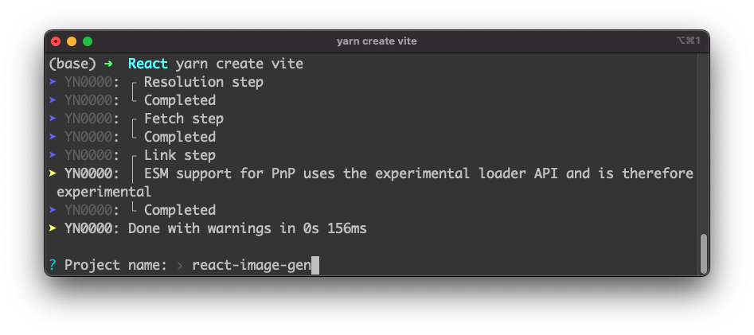
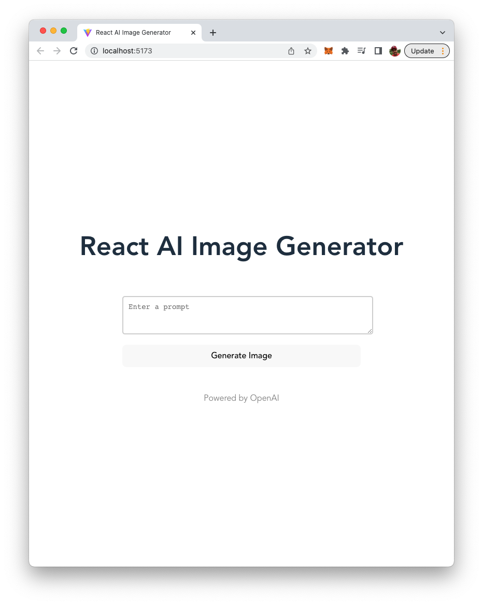

import { Image } from '@astrojs/image/components';
import YouTube from '~/components/widgets/YouTube.astro';
export const components = { img: Image };

<YouTube url="https://youtu.be/OZsihYstnb8" />

Welcome to the world of AI-powered apps! In this blog post, we will explore the exciting opportunity to create an image generator app using React and the powerful OpenAI platform.

Whether you're a beginner or an experienced developer, you will learn how to harness the power of machine learning to generate stunning images with just a few lines of code. From building the front-end interface to integrating the OpenAI API, we will walk you through every step of the process. So, let's get started and discover how to create an AI-powered React image generator app using OpenAI!

## Project Setup

Let's start building our AI-powered React Image Generator App by setting up a new React application with Vite. Make sure to have Node.js and Yarn installed on your system and start by executing the following command:

```bash
$ yarn create vite
```

Vite is then starting the generation process and is requesting you to input a project name:



In the next step Vite is asking you to select a framework. By using the arrow keys on your keyboard you can choose option "React" and then hit return again. Finally you need to decide which variant of a React project should be used. For the example of this article we're choosing option "JavaScript + SWC":


Finally you should receive the confirmation on the command line that the project has been fully setup:


Enter the newly generated project folder by using:

```bash
$ cd react-image-gen
```

Executing the yarn command within that folder is making sure that all the dependencies are being downloaded and installed in the project folder:

```bash
$ yarn
```

In addition we need to make sure to add the openai package to our React project in order to be able to access the OpenAI API:

```bash
$ yarn add openai
```

The development web server can be started by entering:

```bash
$ yarn dev
```

Once the server is started you should be able to see this default project in the browser:


## Cleaning Up The Default Code

Let's clean up the default code a little bit. Open src/App.jsx and delete everything except the following basic App component strcuture:

```js
import { useState } from 'react'
import './App.css'

function App() {

  return (
    <div className="App">
      <h1>React AI Image Generator</h1>
      <div className="card">
     
      </div>
      <p className="read-the-docs">
        Powered by OpenAI
      </p>
    </div>
  )
}

export default App
```

After having cleaned up the code the output in the browser should look like the following:


## Implementing The Application

It's time to start implementing the React application.

Start by insert another import statement on top of App.jsx:

```js
import { Configuration, OpenAIApi } from 'openai'
```

The code is importing two objects, `Configuration` and `OpenAIApi`, from the `openai` package.

Next insert the following code inside App component:

```js
const [prompt, setPrompt] = useState('')
const [result, setResult] = useState('')
const [loading, setLoading] = useState(false)
```

The code is defining three state variables in App component using the useState hook.

`prompt` is a string state variable that is initially set to an empty string. It is used to store the text prompt that will be sent to the OpenAI API to generate images or text.

`result` is a string state variable that is also initially set to an empty string. It is used to store the result returned by the OpenAI API after sending a prompt.

`loading` is a boolean state variable that is initially set to false. It is used to indicate whether a request to the OpenAI API is currently in progress. When `loading` is set to true, it means that a request is in progress, and when it is set to false, it means that a request has completed or has not been initiated.

The useState hook is a built-in React hook that allows you to add state to functional components. It returns an array containing the current state value and a function to update it. The `setPrompt`, `setResult`, and `setLoading` functions are used to update their respective state variables.

Let's continue the implementation and add the following lines of code to App component as well:

```js
const configuration = new Configuration({
  apiKey: import.meta.env.VITE_OPENAI_API_KEY,
})

const openai = new OpenAIApi(configuration);
```

The code is creating two objects, `configuration` and `openai`.

`configuration` is an instance of the Configuration class imported from the `openai` package. It takes an object with a single property `apiKey` as an argument. The value of this property is obtained from the `import.meta.env.VITE_OPENAI_API_KEY` variable.

The VITE_OPENAI_API_KEY is containing the API key for accessing the OpenAI API. In order to make this environment variable available you need to create a new file .env in the root folder of our React project. Inside this file you need to set this environment variable to your personal OpenAI API key in the following way:

```
VITE_OPENAI_API_KEY=[INSERT YOUR OPENAI API KEY HERE]
```

To retrieve your OpenAI API key you need to create a user account at https://openai.com/ and access the API Keys section in the OpenAI dashboard to create a new API key.


`OpenAIApi` is also a class imported from the `openai` package. `openai` is an instance of this class, it is created by passing the configuration object as an argument.

The Configuration class is used to set the necessary configurations for the OpenAI API, like the API key. The OpenAIApi class is used to interact with the OpenAI API, like sending requests to generate images or text.

The `configuration` object is then passed as an argument to the constructor of the `OpenAIApi` class, creating an instance of the class that can be used to interact with the OpenAI API.

Let's now create a function for image generation in App component:

```js
const generateImage = async () => {
setLoading(true)
    const response = await openai.createImage({
        prompt: prompt,
        n: 1,
        size: "512x512",
    });
    setLoading(false)
    setResult(response.data.data[0].url)
};
```

The code defines a function called `generateImage` which is an asynchronous function that sends a request to the OpenAI API to generate an image based on the prompt provided by the user.

The function starts by setting the `loading` state variable to `true` using the `setLoading` function. This is done to indicate that a request is in progress.

It then uses the `openai.createImage` method, which is a method provided by the OpenAIApi class, to send a request to the OpenAI API. The request contains the prompt, n which is the number of images to generate and the `size` of the image.

Once the response is received, the function sets the `loading` state variable to `false` using the `setLoading` function, indicating that the request has completed.

It then uses the `setResult` function to update the `result` state variable with the URL of the generated image. This URL can be used to display the image in the front-end.

Finally we need to extend the JSX code which is returned from App component and is needed to build up the user interface:

```js
  return (
    <div className="app">
      <h1>React AI Image Generator</h1>
      {loading ? (
        <h2> Image generation in progress ... Please wait!</h2>
      ) : (<></>)}
      <div className="card">
        <textarea
          className="text-input"
          placeholder="Enter a prompt"
          onChange={(e) => setPrompt(e.target.value)}
          row="5"
          cols="50"
        />
        <button className="button" onClick={generateImage}>Generate Image</button>
        {result.length > 0 ? (
          
        ) : (
          <></>
        )}
      </div>
      <p className="footer">
        Powered by OpenAI
      </p>
    </div>
  )
```

This JSX code is defining the structure of the component that renders the user interface of the React app. It returns a `div` element with a class of "app".

It contains a heading `h1` with the text "React AI Image Generator", which is the title of the application.

It then has a ternary operator which checks the value of `loading` state variable. If it's true, it shows a `h2` element with the text "Image generation in progress...Please wait!", indicating that an image generation request is in progress. If it's false, it returns an empty JSX element `<></>`.

Inside the `div` element, it has another `div` element with class "card". This element contains a `textarea` element which serves as a text input area, with a placeholder "Enter a prompt" and an `onChange` event that calls the `setPrompt` function passing the value of the textarea as an argument. It also has a button element with class "button" and an `onClick` event that calls the `generateImage` function when clicked.

It then has another ternary operator that checks if the `result` state variable has a length greater than 0. If it's true, it shows an `img` element which is the generated image, with the `src` attribute set to the `result` state variable, and an `alt` attribute "Generated Image". If it's false, it returns an empty JSX element `<></>`.

This JSX code is defining the UI of the component and it uses the state variables and functions to control the UI and the flow of the application.

## Complete Source Code of React AI Image Generator App

To conclude the implementation let's finally take a look at the complete source code in src/App.jsx:

```js
import { useState } from 'react'
import { Configuration, OpenAIApi } from 'openai'
import './App.css'

function App() {
  const [prompt, setPrompt] = useState('')
  const [result, setResult] = useState('')
  const [loading, setLoading] = useState(false)
  
  const configuration = new Configuration({
    apiKey: import.meta.env.VITE_OPENAI_API_KEY,
  })

  const openai = new OpenAIApi(configuration);

  const generateImage = async () => {
    setLoading(true)
    const response = await openai.createImage({
      prompt: prompt,
      n: 1,
      size: "512x512",
    });
    setLoading(false)
    setResult(response.data.data[0].url)
  };

  return (
    <div className="app">
      <h1>React AI Image Generator</h1>
      {loading ? (
        <h2> Image generation in progress ... Please wait!</h2>
      ) : (<></>)}
      <div className="card">
        <textarea
          className="text-input"
          placeholder="Enter a prompt"
          onChange={(e) => setPrompt(e.target.value)}
          row="5"
          cols="50"
        />
        <button className="button" onClick={generateImage}>Generate Image</button>
        {result.length > 0 ? (
          
        ) : (
          <></>
        )}
      </div>
      <p className="footer">
        Powered by OpenAI
      </p>
    </div>
  )
}

export default App
```

And the corresponding CSS code from src/App.css:

```css
#root {
  max-width: 1280px;
  margin: 0 auto;
  padding: 2rem;
  text-align: center;
}

.app {
  display: flex;
  flex-direction: column;
  align-items: center;
}

.text-input {
  height: 50px;
  width: 100%;
  margin-bottom: 20px;
  border: 2px solid lightgrey;
  padding: 10px;
  font-size: 14px;
  border-radius: 5px;
}

.result-image {
  margin-top: 20px;
  border: 2px solid lightgray;
  padding: 10px;
  width: 100%;
}

.card {
  padding: 2em;
  display: flex;
  flex-direction: column;
}

.footer {
  color: #888;
}
```

## Testing The Application

Time to test our application. When accessing the application in the browser you now should be able to see the following user interface:



Try to input a text prompt with a description of the image you'd like to get generated by OpenAI:


Hit button "Generate Image". The generation of the image is taking a few seconds and after that you'll see the generated image on the webpage:


## Conclusion

Building an AI-powered React image generator app using OpenAI is a great way to experience the power of machine learning. By following the steps outlined in this blog post, you have learned how to create a visually stunning front-end interface, and how to use the OpenAI API to generate images with just a few lines of code. With this app, you can now generate images on-demand, and use them in a variety of applications, such as social media, marketing campaigns, or even art projects. We hope you found this tutorial helpful, and that it has sparked your interest in experimenting with other AI-powered projects. Happy coding!"


