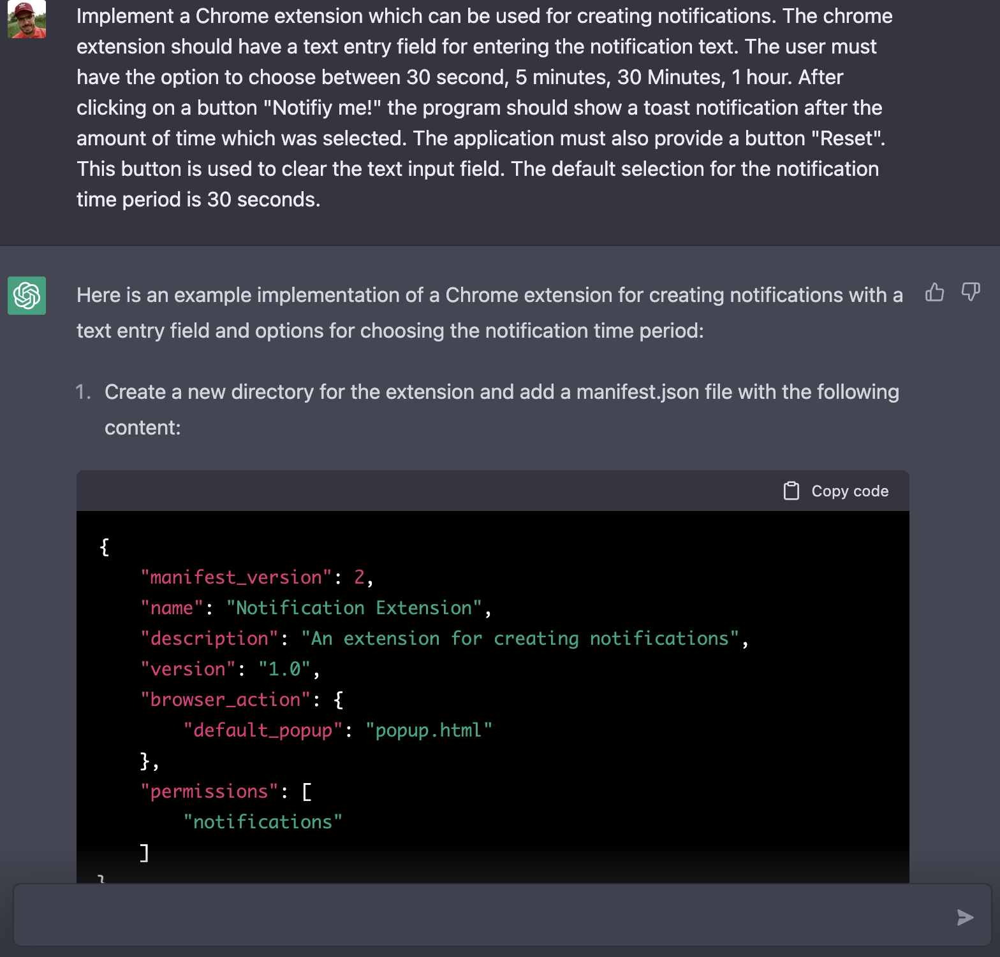
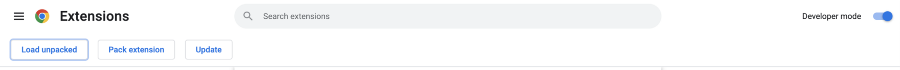
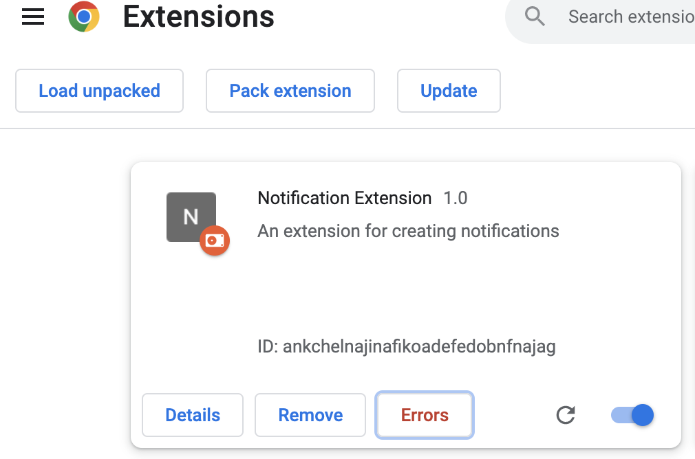
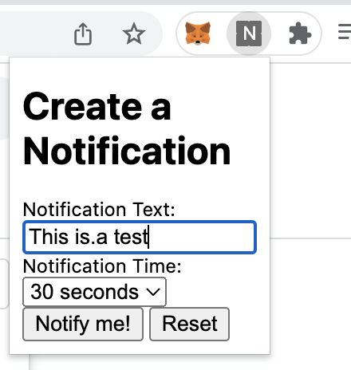
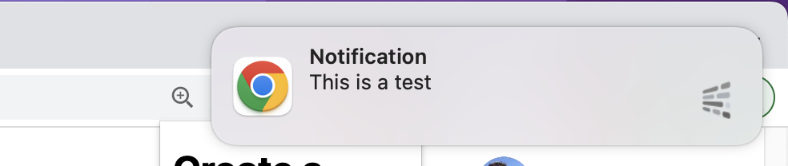
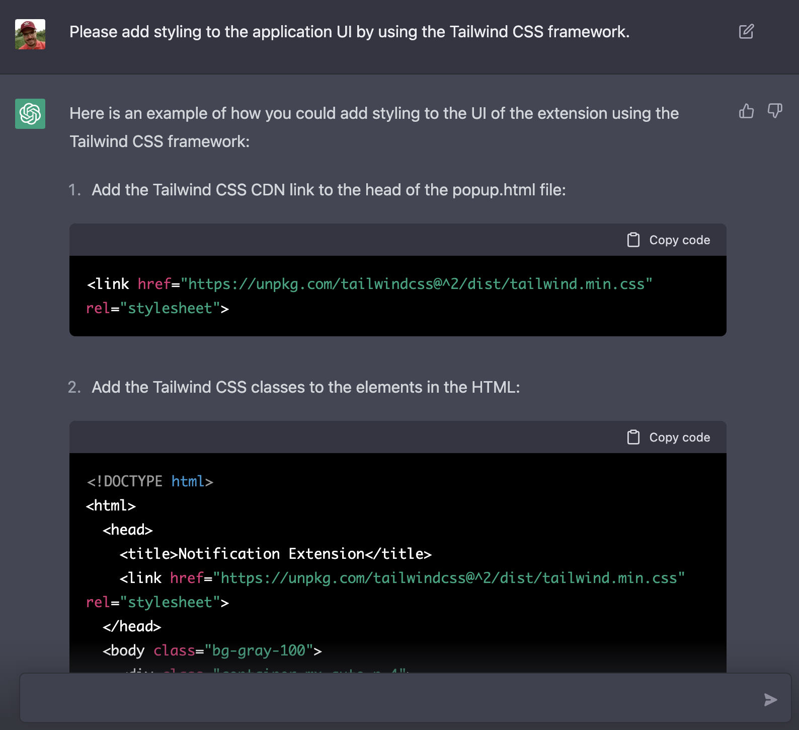
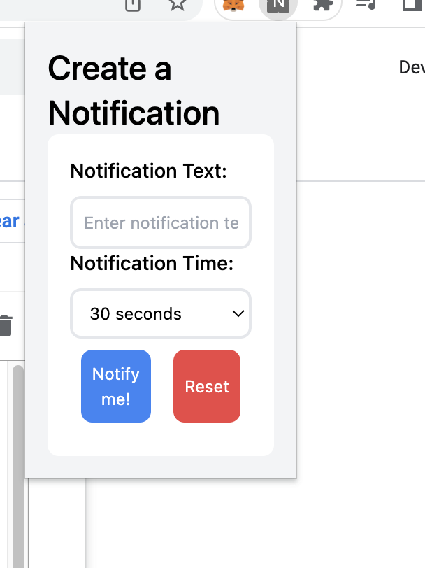

import { Image } from '@astrojs/image/components';
import YouTube from '~/components/widgets/YouTube.astro';
export const components = { img: Image };

With the help of ChatGPT, a large language model trained by OpenAI, we can create a Chrome extension that is tailored to our specific needs and can help streamline our daily tasks without writing a single line of code by ourselves. Let's see how this works …

In this step-by-step guide, we will show you how to use ChatGPT to develop a Chrome extension that can be used for creating notifications. The extension will have a text entry field for entering the notification text and the user will have the option to choose between 30 seconds, 5 minutes, 30 minutes, and 1 hour. After clicking on a button "Notify me!", the program will show a toast notification after the amount of time which was selected. The extension will also provide a button "Reset" which can be used to clear the text input field. The default selection for the notification time period will be 30 seconds.

This guide will take you through the process of creating a Chrome extension from scratch, including setting up the project, generating the code with the help of ChatGPT, and publishing the extension on the Chrome Web Store. Whether you're a beginner or an experienced developer, this guide will provide you with the knowledge you need to create your own custom Chrome extension with the help of ChatGPT. So, let's get started!

## Provide Our Requirements To ChatGPT

In order to get ChatGPT generating the code for our custom Chrome extension we need to provide a written description of what we want to get implemented. Let's start with the following input in ChatGPT:

_"Implement a Chrome extension which can be used for creating notifications. The chrome extension should have a text entry field for entering the notification text. The user must have the option to choose between 30 second, 5 minutes, 30 Minutes, 1 hour. After clicking on a button "Notify me!" the program should show a toast notification after the amount of time which was selected. The application must also provide a button "Reset". This button is used to clear the text input field. The default selection for the notification time period is 30 seconds."_

This is a clear description of what we want to have. Immediately ChatGPT starts providing the answer:



ChatGPT provides detailed descriptions of what we have to do together with the full source code which needs to be used.

The first step is to create a new directory for the extension and add a manifest.json file and insert the following generated code:

```json
{
    "manifest_version": 2,
    "name": "Notification Extension",
    "description": "An extension for creating notifications",
    "version": "1.0",
    "browser_action": {
        "default_popup": "popup.html"
    },
    "permissions": [
        "notifications"
    ]
}
```

A manifest.json file is a required file in a Chrome extension that provides important information about the extension to the browser. It is a JSON-formatted file that defines the extension's name, version, permissions, and other settings.

Add a popup.html file with the following content:

```html
<!DOCTYPE html>
<html>
  <head>
    <title>Notification Extension</title>
  </head>
  <body>
    <h1>Create a Notification</h1>
    <form>
        <label for="notification-text">Notification Text:</label>
        <input type="text" id="notification-text" placeholder="Enter notification text here">
        <br>
        <label for="notification-time">Notification Time:</label>
        <select id="notification-time">
            <option value="30000">30 seconds</option>
            <option value="300000">5 minutes</option>
            <option value="1800000">30 minutes</option>
            <option value="3600000">1 hour</option>
        </select>
        <br>
        <button type="button" id="notify-button">Notify me!</button>
        <button type="button" id="reset-button">Reset</button>
    </form>
    <script src="popup.js"></script>
  </body>
</html>
```

The code creates a simple UI for creating notifications with a text entry field and options for choosing the notification time period.

The code starts with the `<!DOCTYPE>` and `<html>` tags, which are standard tags in an HTML document. The `<head>` section contains the title of the page, which will be displayed in the browser tab.

In the `<body>` section, there is a heading _Create a Notification_ and a form. The form contains a label and an input field for the notification text, where the user can enter the text they want to be notified of. It also contains a label and a select element for choosing the time period for the notification. The options for the select element are 30 seconds, 5 minutes, 30 minutes, and 1 hour. The form contains two buttons, one for triggering the notification and one for resetting the text input field. The last line of the code

```html
<script src="popup.js"></script>
```

is a link to the JavaScript file, which handles the functionality of the extension.

The complete code which needs to go into popup.js is fully generated by ChatGPT as well:

```js
// Get the elements from the HTML
const notificationText = document.getElementById("notification-text");
const notificationTime = document.getElementById("notification-time");
const notifyButton = document.getElementById("notify-button");
const resetButton = document.getElementById("reset-button");

// Set the default time period to 30 seconds
notificationTime.value = 30000;

// Listen for the "Notify me!" button to be clicked
notifyButton.addEventListener("click", () => {
  // Get the text and time period from the form
  const text = notificationText.value;
  const time = notificationTime.value;

  // Show a notification after the selected time period
  setTimeout(() => {
    chrome.notifications.create("", {
      type: "basic",
      iconUrl: "icon.png",
      title: "Notification",
      message: text,
      priority: 2,
    });
  }, time);
});

// Listen for the "Reset" button to be clicked
resetButton.addEventListener("click", () => {
  // Clear the text input field
  notificationText.value = "";
});
```

This is JavaScript code that provides the functionality for a Chrome extension that creates notifications with a text entry field and options for choosing the notification time period.

The code first selects the DOM elements of the input field, select element, and the buttons from the HTML by using the `getElementById` method. Then it sets the default value of the select element to 30 seconds. Next, it listens for the clicks on the two buttons `notify-button` and `reset-button` using the addEventListener method.

When the `notify-button` is clicked, it retrieves the value from the input field and select element using the value property. Then it uses the `setTimeout` method to show the notification after the selected time period by creating the notification using `chrome.notifications.create` method with some options like type, icon, title, message and priority.

When the `reset-button` is clicked, it clears the text input field by setting the value of the input field to an empty string.
Create popup.js and copy and paste the generated code.

## Upload Extension to Chrome

Now it's time to install the extension into Chrome and test if the generated code is working as expected.

Open the "Manage Extensions" view in your Chrome browser and enable "Developer Mode":



You can now click on button "Load unpacked" and select the project directory of the Chrome extension. The extension is then uploaded and is visible in the extensions overview:



You can now access the Notification Extension from the Extensions bar:



To test the function you can simply put in a short notification text, leave the notification time at 30 seconds and hit button "Notify me!". You we'll then see the notification popping up after 30 seconds in chrome:



Ok great. So war ChatGPT has generated code for the extension which doesn't include any styling. That's pretty much ok because we have not been asking to do so.

## Add Some Styling With Tailwind CSS

Let's try to adapt the already generated code and tell ChatGPT to add some styling by using Tailwind CSS. Input the following request into ChatGPT:

_"Please add styling to the application UI by using the Tailwind CSS framework."_

ChatGPT will provide you with an answer immediately:



The complete HTML code is regenerated and updated according to our request.

```html
<!DOCTYPE html>
<html>
  <head>
    <title>Notification Extension</title>
    <link
      href="https://unpkg.com/tailwindcss@^2/dist/tailwind.min.css"
      rel="stylesheet"
    />
  </head>
  <body class="bg-gray-100">
    <div class="container mx-auto p-4">
      <h1 class="text-2xl font-medium">Create a Notification</h1>
      <form class="bg-white rounded-lg p-4">
        <label class="block text-sm font-medium mb-2" for="notification-text"
          >Notification Text:</label
        >
        <input
          class="border-2 rounded-lg p-2 w-full"
          type="text"
          id="notification-text"
          placeholder="Enter notification text here"
        />
        <br />
        <label class="block text-sm font-medium mb-2" for="notification-time"
          >Notification Time:</label
        >
        <select class="border-2 rounded-lg p-2 w-full" id="notification-time">
          <option value="30000">30 seconds</option>
          <option value="300000">5 minutes</option>
          <option value="1800000">30 minutes</option>
          <option value="3600000">1 hour</option>
        </select>
        <br />
        <div class="flex justify-end">
          <button
            class="bg-blue-500 text-white p-2 rounded-lg m-2"
            type="button"
            id="notify-button"
          >
            Notify me!
          </button>
          <button
            class="bg-red-500 text-white p-2 rounded-lg m-2"
            type="button"
            id="reset-button"
          >
            Reset
          </button>
        </div>
      </form>
    </div>
    <script src="popup.js"></script>
  </body>
</html>
```

The HTML code is now including styling by applying some of Tailwind's CSS classes, so that the UI of the chrome extension should now look like:



## Conclusion

In conclusion, creating a custom Chrome extension with the help of ChatGPT is a quick and easy process that can greatly improve your productivity and efficiency in your daily tasks. With just a few simple steps and minimal coding knowledge, you can develop an extension that is tailored to your specific needs and can streamline your work.

We hope that this guide has provided you with a clear understanding of how to create a custom Chrome extension with the help of ChatGPT. From setting up the project, to writing the code and publishing the extension on the Chrome Web Store, we've covered all the important steps to get you started. Whether you're a beginner or an experienced developer, you can now create your own custom Chrome extension with the help of ChatGPT in just 5 minutes.

Creating a custom Chrome extension has never been easier, thanks to the power of ChatGPT. So, go ahead and give it a try - you might be surprised by how much you can accomplish with just a few simple steps. The possibilities are endless, so let your creativity run wild and see what you can build with ChatGPT!