import { Image } from '@astrojs/image/components';
import YouTube from '~/components/widgets/YouTube.astro';
export const components = { img: Image };

Discord is a popular real-time messaging platform with great support for programmable bots. ChatGPT is a chatbot platform developed by OpenAI that allows developers to build custom chatbots using the GPT-3 language model. In this tutorial you'll learn how to build a Discord chatbot and use GPT-3 to generate text answers automatically. Therewith we're able to provide a ChatGPT-like functionality right inside of Discord.

The GPT-3 (short for "Generative Pre-training Transformer 3") language model is a large, state-of-the-art natural language processing (NLP) model developed by OpenAI. It is trained on a massive dataset of human-generated text and is able to generate human-like text in a wide range of languages and styles.

The GPT-3 model uses a transformer architecture, which is a type of neural network that is particularly well-suited for processing sequential data, such as text. It is able to perform a variety of language-related tasks, including translation, summarization, and question answering, as well as generating text that is difficult to distinguish from human-generated text.

The ChatGPT platform allows developers to use the GPT-3 model to build chatbots that can engage in natural, human-like conversations with users. It provides a simple, intuitive interface for developers to use and customize, making it easy to create chatbots that can be integrated into a variety of applications and platforms.

Let's get into the practical part and start building our Discord chatbot with ChatGPT-power inside:

## Creating An OpenAI Account And Get API Key

In order to use the OpenAI API you need to signup for an OpenAI account at: https://openai.com/.

Once you've created your account successfully you can sign into the OpenAI dashboard:

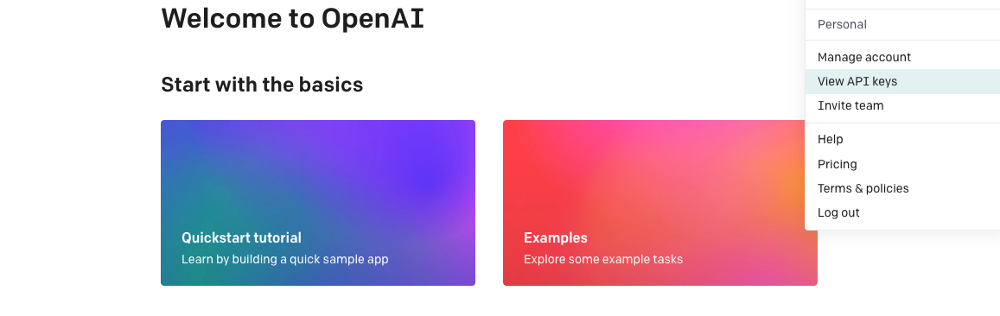

Click on the "View API key" menu option to go the API keys view:

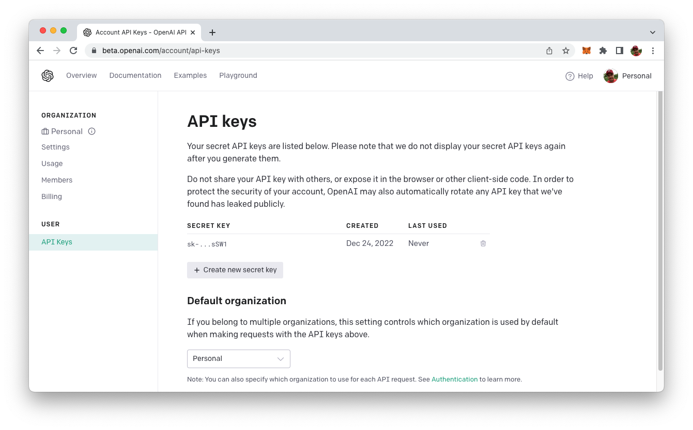

Here you can click on button "Create new secret key" in order to create a new OpenAI API key. This key will be needed later on when we're implementing the Discord chatbot.

## Creating A Discord Test Server

Next, we need to create our own Discord server. This means that you need to have a Discord user account already and that you're signed in. If you have not used Discord before and have no existing user account you need to go to https://discord.com/ first and create one.

When you are signed into Discord you can create a new server by simple clicking on the + icon on the left:


You should then see the "Create a server" dialog in which you can choose option "Create My Own":

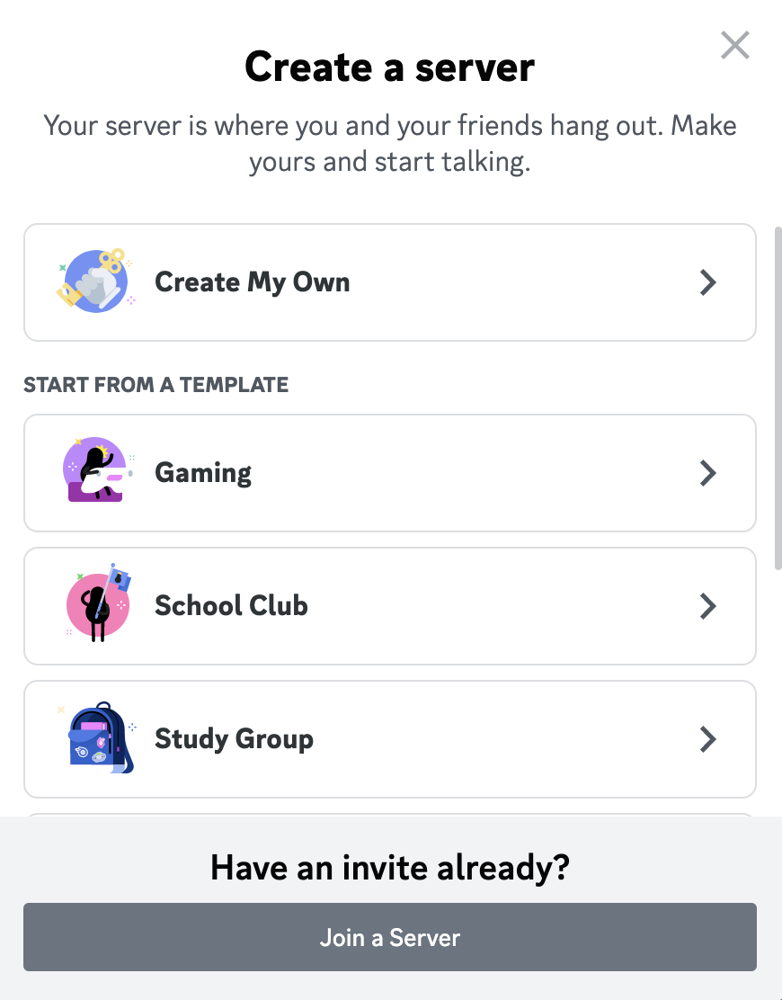

On the following screen we simply select "For a club or community":

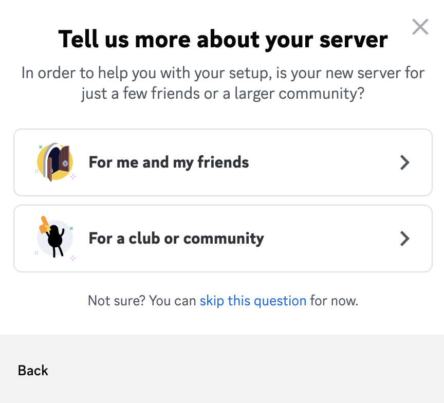

And finally you're being asked to assign a name to the new Discord server:

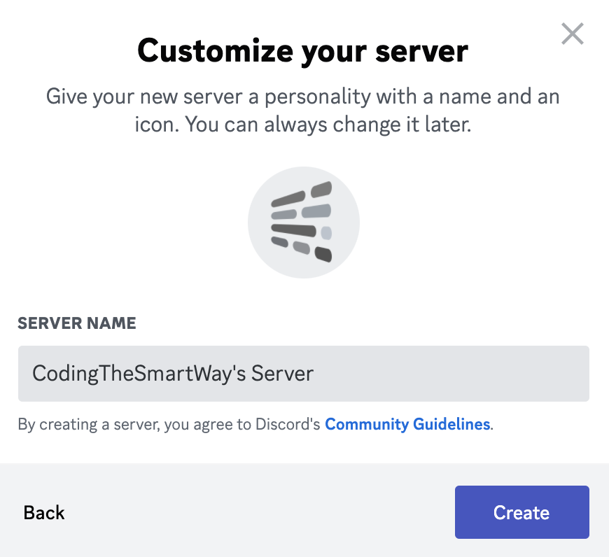

Once you hit button "Create" the new Server is created and added to your Discord user interface.

## Creating A Discord Application Entry and A Bot Account

Before we're starting to write code for our Discord bot, we need to go to the Discord developer dashboard which can be found at https://discord.com/developers/applications/:

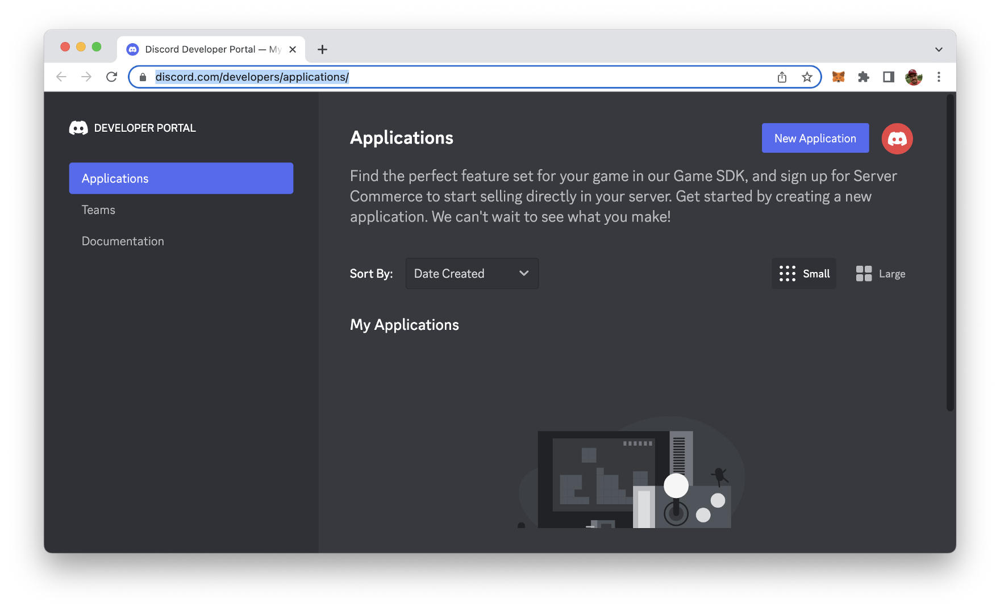

In the Applications section you need to create a new Discord application entry by clicking on Button "New Application". Next, you need to enter a name for the application:

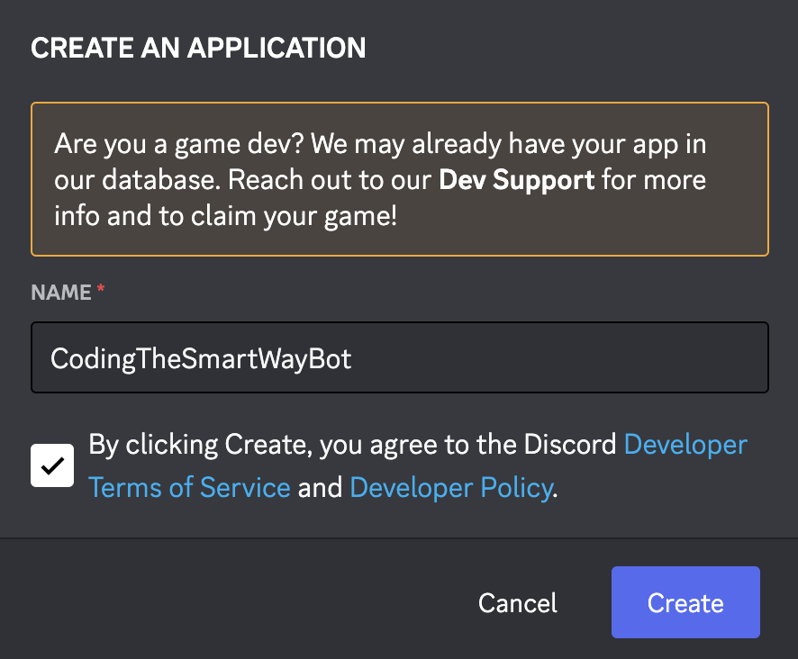

After clicking on button "Create" the new application entry is created and you're redirected to the details page of that application:

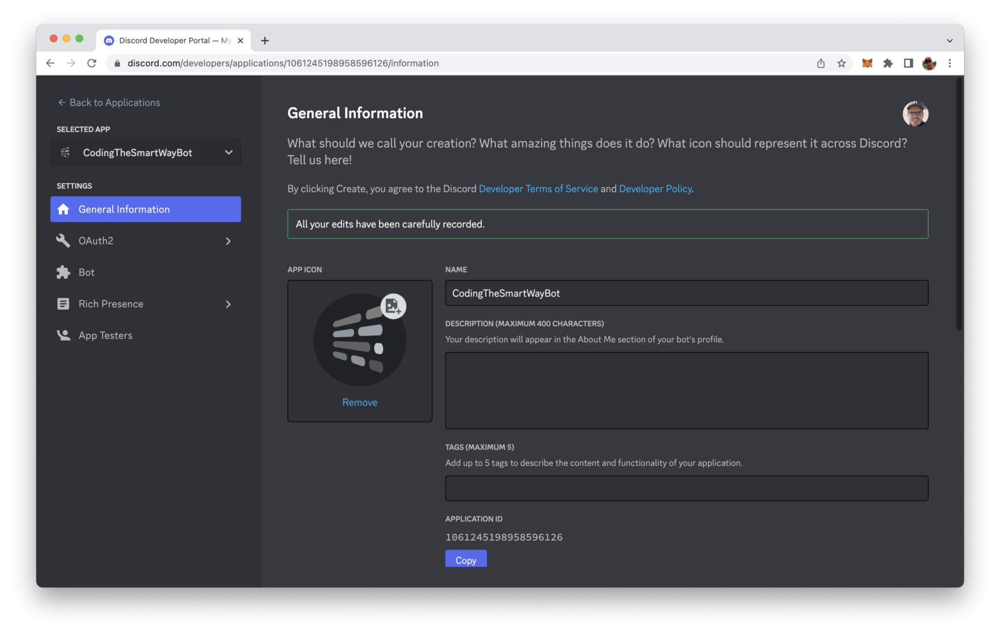

With the application entry available we need to open the Bot tab and create a bot user account which is needed to run our bot program later on.

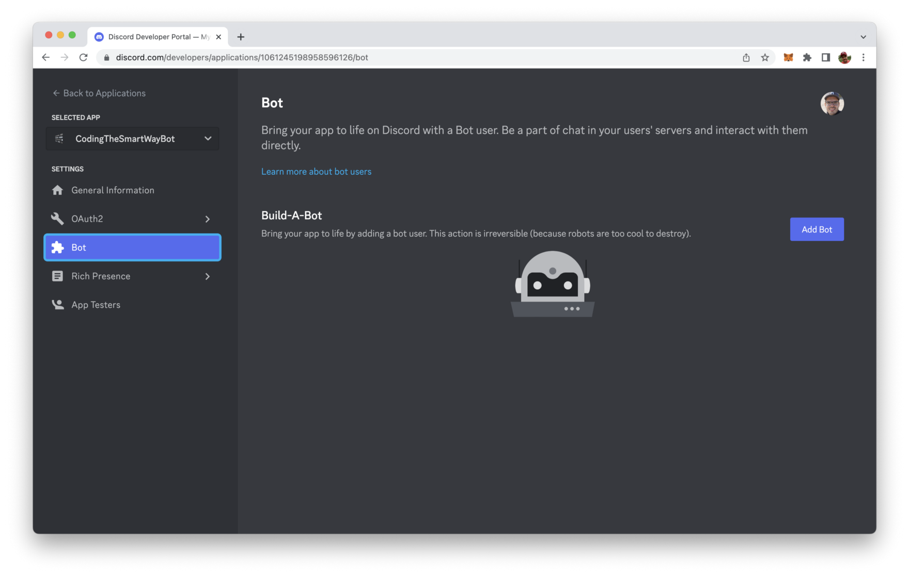

Click on button "Add Bot". In the following dialog you need to confirm this step again by clicking on "Yes, do it!":

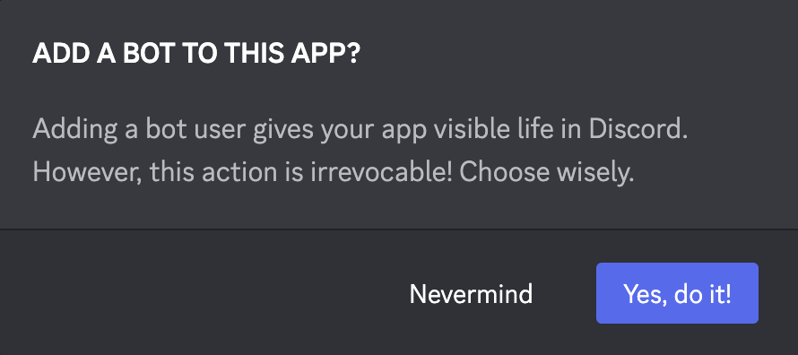

The bot user account is created. You will then see a screen similar to:

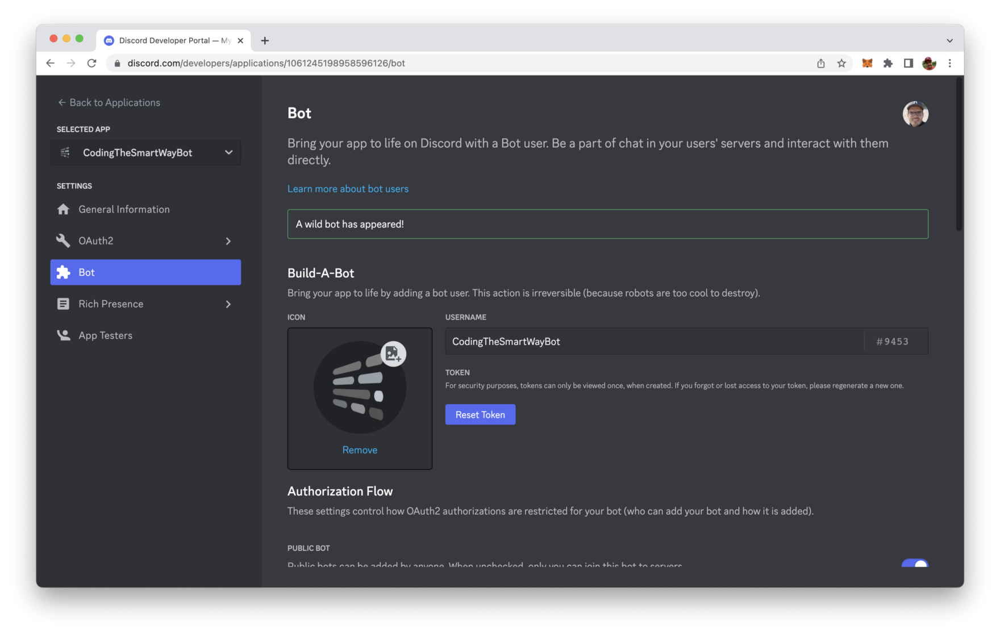

By clicking on the button "Reset Token" you can create a new token for the bot user. This token will be needed later on when implementing our Discord chabot with Node.js.

In the bot account view you need to scroll down and activate option "Message Content Intent":

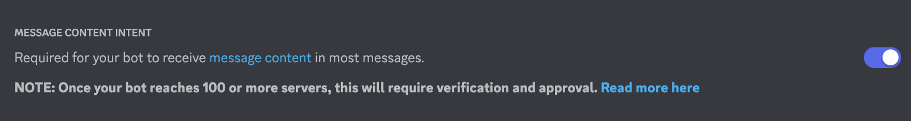

Activating this option is necessary, so that we can implement a bot who is able to receive and react on specific messages.

Switch to tab OAuth2. That the place where you can find the client ID. This ID will be needed for the next step.

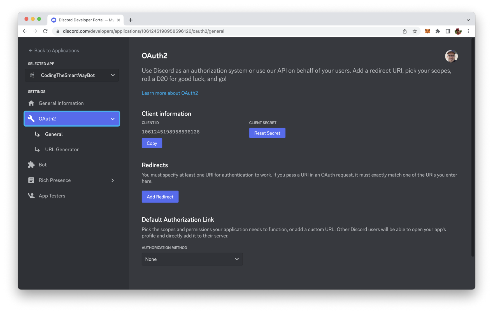

In order to connect the configured bot with the Discord server we have been creating at the beginning you need to add your specific client ID to the following URL and open this URL in any browser:

```
https://discord.com/oauth2/authorize?scope=bot&client_id=[YOUR CLIENT ID]
```

You will then see the following screen asking you for permission to connect the bot with the Discord server:

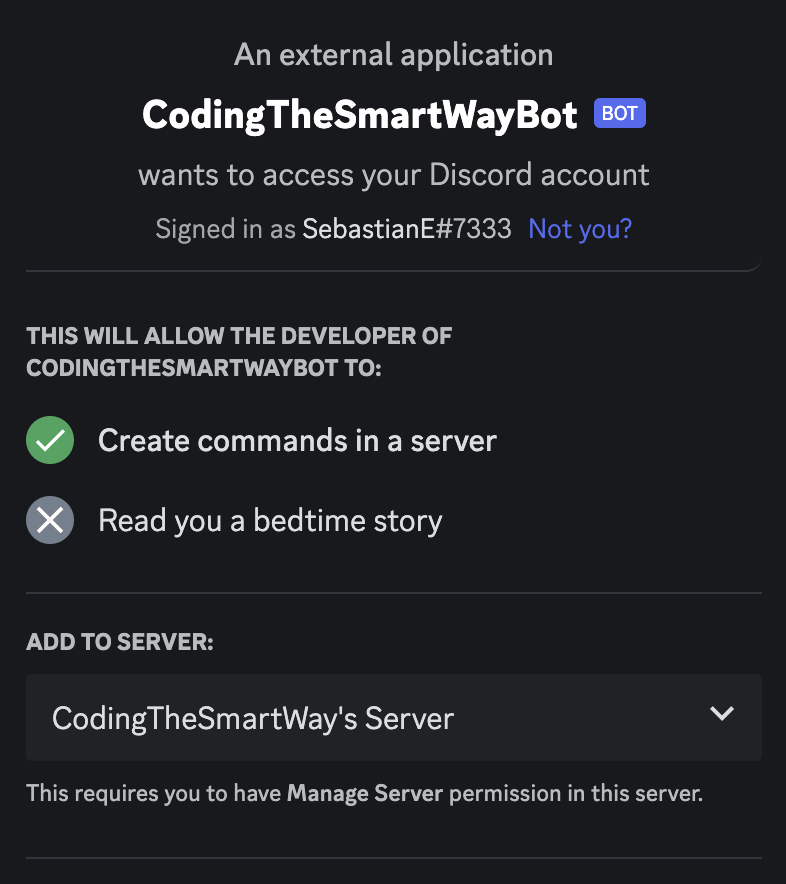

After permission is granted you can see that the bot account is listed as offline in the user list within your Discord application:

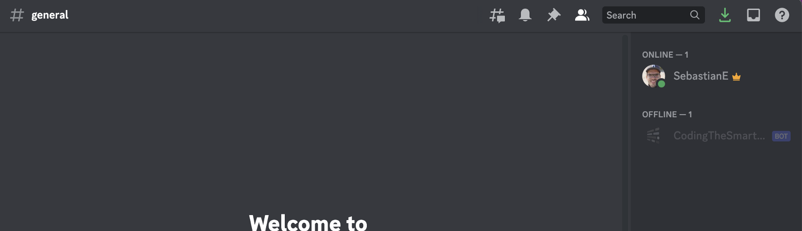

The configuration is done. Let's move on and implement the bot logic with Node.js.

## Creating The Node.js Project

To create the bot we'll use Node.js and Express. So we need to initialize a new Node project first:

```bash
$ mkdir discord_bot
$ cd discord_bot
$ npm init -y
```

Next we need to add the needed dependencies by running:

```bash
$ npm install eris express body-parser
```

Beside the Express framework and the body-parser package we're installing the Eris library. Eris is a lightweight Node.js wrapper for interfacing with Discord APIs easily.

If you'd like to get further information on Eris you can take a look at the project's website at https://abal.moe/Eris/:

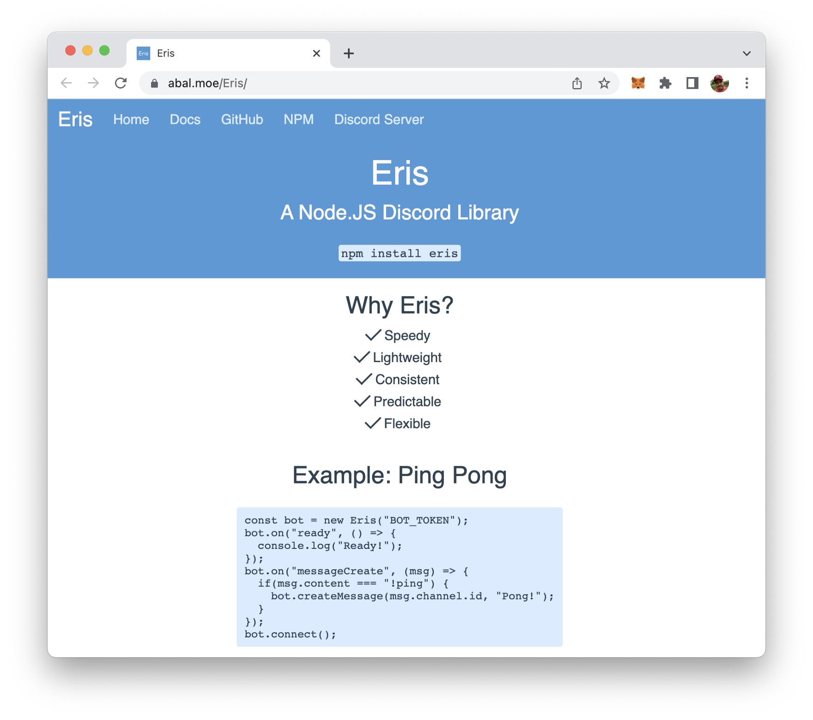

Furthermore we're adding the openai client library to the project:

```bash
$ npm install openai
```

The OpenAI Node.js library provides convenient access to the OpenAI API from Node.js applications. In the following steps we'll be making use of this library to implement our Node.js sample application.

Additionally we do need to install the dotenv package:

```bash
$ npm install dotenv --save
```

## Implementing The Bot

Great, the project setup is completed, the needed dependencies have been installed. It's time to implement the bot. Let's create two new file:

```bash
$ touch bot.js .env
```

Open file .env in a text editor and insert the following twi environment variables which holds the API key from your OpenAI account and the bot token from Discord:

```
OPENAI_API_KEY="INSERT YOUR OPENAI API KEY HERE"
DISCORD_BOT_TOKEN="INSERT YOUR DISCORD BOT TOKEN HERE"
```

Let's open bot.js and start implementing the Discord chatbot by inserting the following require statement on top of the file:

```js
const Eris = require("eris");
const { Configuration, OpenAIApi } = require("openai");
require('dotenv').config()
```

We're ready to create a new OpenAI configuration by initializing a Configuration object and passing an object to the constructor containing the property apiKey. The value which needs to be assigned to apiKey is the OpenAI API key which we can read out from the .env file by using process.env.OPENAI_API_KEY.

```js
const configuration = new Configuration({
    apiKey: process.env.OPENAI_API_KEY,
  });
const openai = new OpenAIApi(configuration);
```

Furthermore we're creating a new bot instance of Eris. The constructor requires is to hand over two parameter:

* As the first parameter you need to pass in your bot token. We can read out the bot token from the .env file by using process.env.DISCORD_BOT_TOKEN.
* The second parameter is a configuration object.

```js
const bot = new Eris(process.env.DISCORD_BOT_TOKEN, {
    intents: [
        "guildMessages"
    ]
});
```

Next we're going to implement an async runCompletion function:

```js
async function runCompletion (message) {
    const completion = await openai.createCompletion({
        model: "text-davinci-003",
        prompt: message,
        max_tokens: 200,
    });
    return completion.data.choices[0].text;
}
```

Inside this function we're using the openai.createCompletion method to create a OpenAI completion. An OpenAI Completion is a type of language model that can generate text based on a prompt provided by the user. In order to specify our completion we need to pass in a configuration object. This configuration object contains two properties: model and prompt. The model property is used to specifiy the OpenAI language model which should be used to generate an answer for the text we're assigning to the prompt property. The text-davinci-003 language model which is used here is the same language model which is used in the background by ChatGPT.

By using the bot.on method we're registering an event handler function for the ready event. This is printing out a message to the console once the ready event is received.

Furthermore we're adding code to also register an event handler function for the error event:

```js
bot.on("ready", () => { 
    console.log("Bot is connected and ready!"); 
});

bot.on("error", (err) => {
  console.error(err); 
});
```

The next step is to listen to incoming Discord chat messages. If the message is starting with # we're activating our bot function. This means that we're passing on the message (after the # sign) to the runCompletion function and sending back the result we're receiving from OpenAI:

```js
bot.on("messageCreate", (msg) => {
    if(msg.content.startsWith("#")) {
        runCompletion(msg.content.substring(1)).then(result => bot.createMessage(msg.channel.id, result));
    } 
});
```
At the end of bot.js we need to call the bot.connect method in order to take our bot online:

```js
bot.connect();
```

## Complete Code

Ok, as the Discord bot implementation is complete now, let's again take a look at the complete source code which should now be available in bot.js:

```js
const Eris = require("eris");
const { Configuration, OpenAIApi } = require("openai");
require('dotenv').config()

const configuration = new Configuration({
    apiKey: process.env.OPENAI_API_KEY,
  });
const openai = new OpenAIApi(configuration);

const bot = new Eris(process.env.DISCORD_BOT_TOKEN, {
    intents: [
        "guildMessages"
    ]
});

async function runCompletion (message) {
    const completion = await openai.createCompletion({
        model: "text-davinci-003",
        prompt: message,
        max_tokens: 200,
    });
    return completion.data.choices[0].text;
}

bot.on("ready", () => { 
    console.log("Bot is connected and ready!"); 
});

bot.on("error", (err) => {
  console.error(err); 
});

bot.on("messageCreate", (msg) => {
    if(msg.content.startsWith("#")) {
        runCompletion(msg.content.substring(1)).then(result => bot.createMessage(msg.channel.id, result));
    } 
});

bot.connect();
```

## Running The Bot

Now it's time to finally test the Discord bot. Start the Node.js program by typing in:

```bash
$ node bot.js
```

On the command line you should receive the message that the bot is connected and ready.

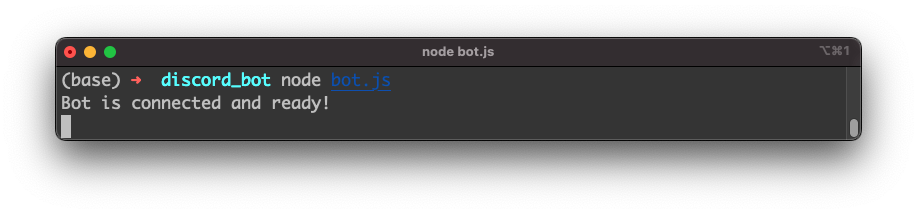

In the user list of your Discord server you can also see that the bot user account is now displayed with status "online":

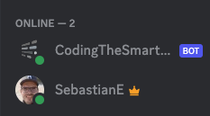

Let's address a question to the bot (remember to use # as the first sign):

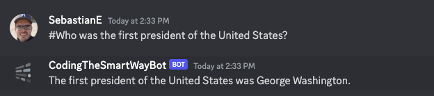

The response if generated by OpenAI and our bot is sending back the message as expected. The test is successful and the Discord chatbot implementation is running as expected, using the ChatGPT language model to generate answers.