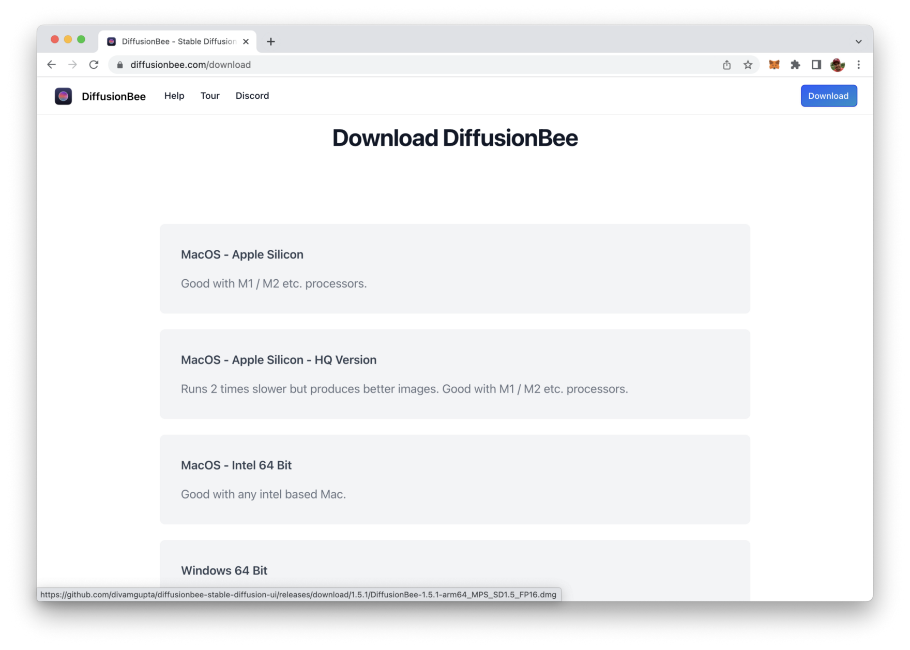
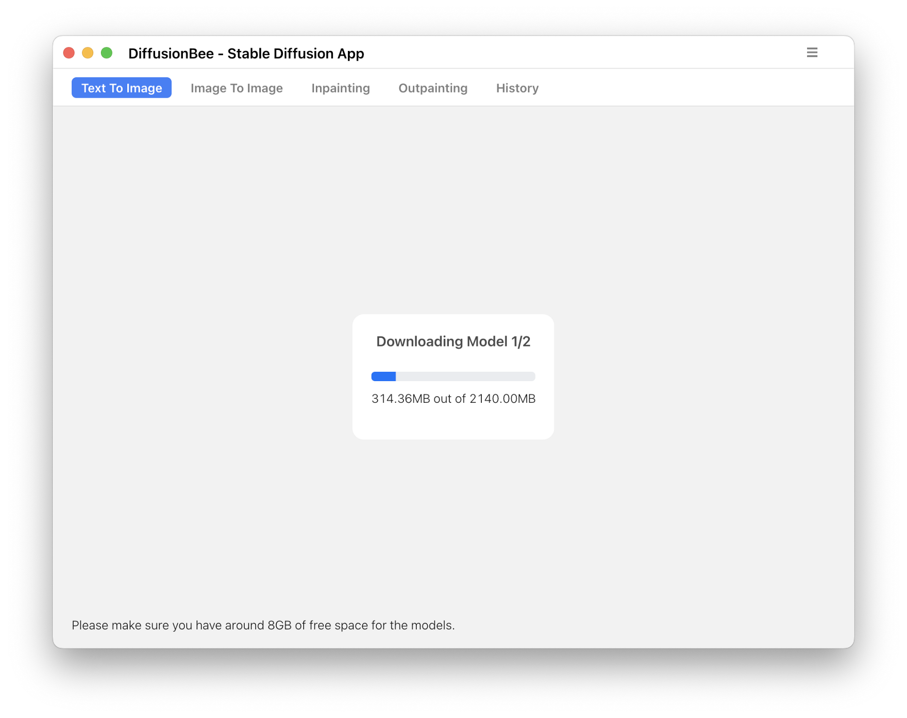
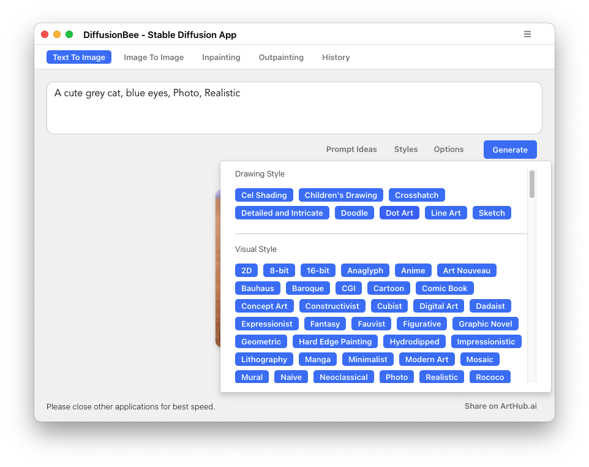
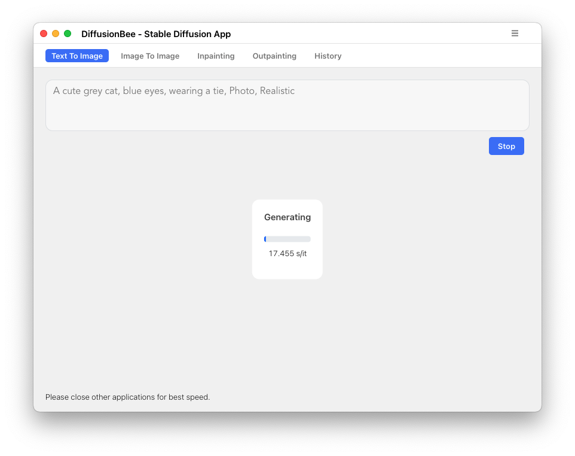
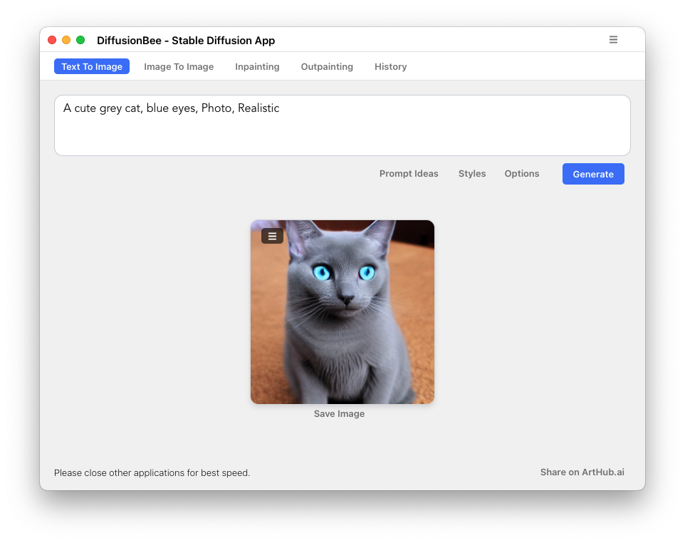
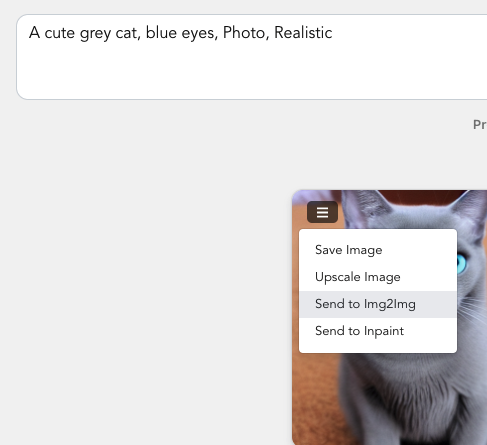

import { Image } from '@astrojs/image/components';
import YouTube from '~/components/widgets/YouTube.astro';
export const components = { img: Image };

Stable Diffusion is a powerful tool that uses deep learning to create detailed images based on written descriptions. It was first released in 2022 and can also be used for other image-related tasks such as inpainting, outpainting, and image-to-image translations with the help of a text prompt. DiffusionBee is a free and open-source tool which brings Stable Diffusion right to your desktop.

Stable Diffusion is a type of deep generative neural network known as a latent diffusion model, developed by the CompVis group at LMU Munich.

The Stable Diffusion model weights and code are available for free, and it can be run on most consumer hardware that has a GPU with at least 8 GB VRAM. This is a departure from previous text-to-image models such as DALL-E and Midjourney, which were only available through cloud services. With Stable Diffusion, anyone can generate high-quality images on their own computer.

The process of getting Stable Diffusion up and running on your local machine is getting much more easier when using DiffusionBee, a free desktop tools. Let's take a look at how to get started with DiffusionBee in the following.

## Installing DiffusionBee

DiffusionBee is available for MacOS only right know. You can download the desktop app from DiffusionBee's website at https://diffusionbee.com/.

Clicking on the "Download" button takes you directly to the download page. The download page offers you three options:
* DiffusionBee for Apple Silicon M1/M2 processors
* DiffusionBee for Apple Silicon M1/M2 processors with high quality
* DiffusionBee for Macs with Intel 64bit processors

Download the version with is suitable for your computer and just run through the setup process.

## Running DiffusionBee

Once DiffusionBee is installed you can open the desktop application. First the Stable Diffusion AI model needs to be downloaded, so that the execution can take place on your local system.

As the model download is quite large you need to make sure that you have at least 8 gigabytes of free space available on your local hard disk:

Once the model download is completed you can start providing your first prompt for image generation to DiffusionBee like you can see in the following screenshot:

The prompt you're entering needs to contain a detailed description of the image you want to get generated by Stable Diffusion's AI. Stable Diffusion is able to produce image outputs in various styles. You can use the "Styles" dialog to add respective keywords directly to your prompt.

In order to further fine tune the image generation process you can also access settings by clicking on the "Options" button.

Once the prompt is entered and parameters are set you're ready to click on button "Generate" button. Is the AI model is executed on your local machine this process is running for a few minutes, depending on your system performance:

Once the image generation is concluded the new image is displayed in DiffusionBee:

You can use the image's context menu to save the image to your local disk, upscale the image, or send the image to the "Image To Image" or "Inpaint" functionality within DiffusionBee right away:

## Conclusion

With the release of Stable Diffusion, creating high-quality images using artificial intelligence has never been more accessible. No longer do you need expensive cloud services to generate your visuals. Stable Diffusion is a free, open-source tool that can run on most consumer hardware equipped with a modest GPU. Its user-friendly interface makes it easy for anyone to create stunning visuals based on written descriptions. The possibilities are endless with Stable Diffusion; you can generate images, inpaint or outpaint, and even create image-to-image translations guided by a text prompt.

With the DiffusionBee Desktop client the process up setting up and using Stable Diffusion on your local system is becoming very easy.

