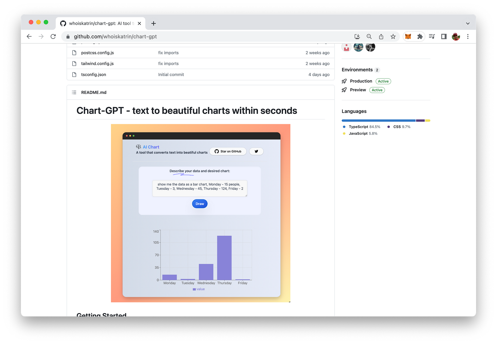
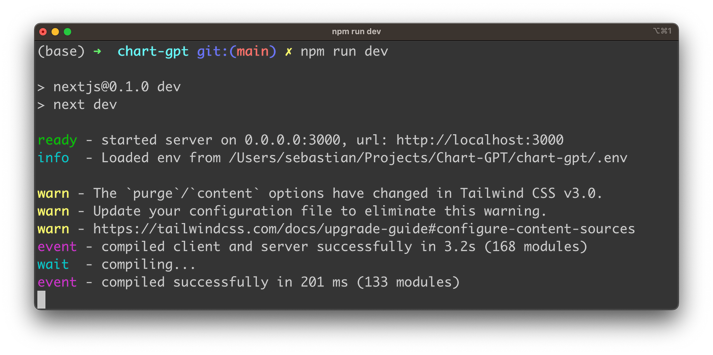
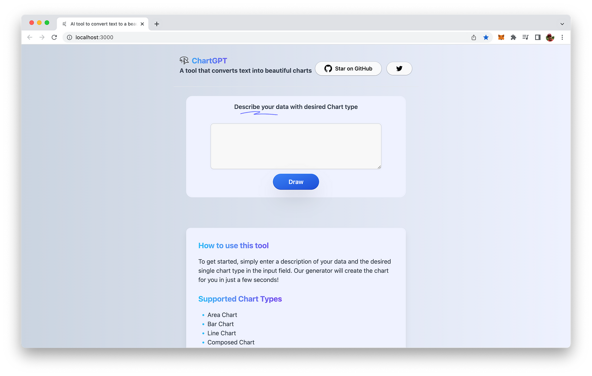
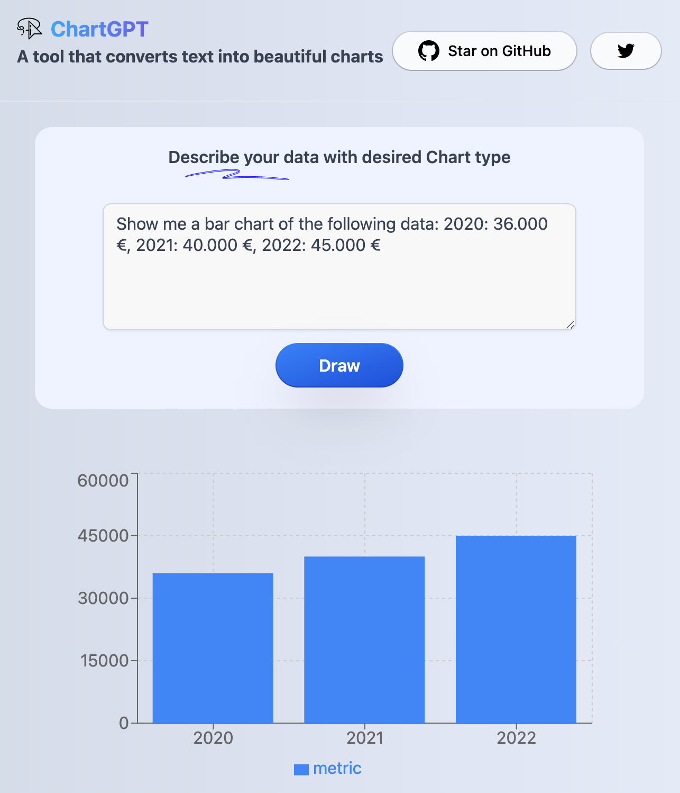

import { Image } from '@astrojs/image/components';
import YouTube from '~/components/widgets/YouTube.astro';
export const components = { img: Image };

As an AI enthusiast, I'm always on the lookout for new AI-powered tools and technologies to make my life easier. Recently, I stumbled upon Chart-GPT, a game-changing tool that transforms text into beautiful charts within seconds with the help of OpenAI's APIs.

The moment I discovered it, I knew I had to try it out and share my experience with you all. So, in this blog post, I'll guide you through the installation process of Chart-GPT so you, too, can start exploring its powerful capabilities.

Chart-GPT is available on GitHub at: https://github.com/whoiskatrin/chart-gpt:



## Step 1: Clone the Repository

To begin our journey, we'll first need to get our hands on the Chart-GPT codebase. Thankfully, this is a breeze with Git. Open up your favorite terminal or command prompt and run the following command:

```bash
git clone https://github.com/whoiskatrin/chart-gpt.git
```

This command will create a new directory called `chart-gpt` on your local machine and download the necessary files into it.

## Step 2: Enter the Chart-GPT Directory

With the repository cloned, it's time to navigate to the new chart-gpt directory. Simply run:

```bash
cd chart-gpt
```

Now we're inside the Chart-GPT directory, where all the magic happens!

## Step 3: Set Up Your Environment Variables

Before diving in, we need to configure a few settings. Chart-GPT uses environment variables to manage your OpenAI API key. First, create a copy of the `.env.example` template:

```bash
cp .env.example .env
```

This command duplicates the `.env.example` file, creating a new file called `.env`. Open this file in your preferred text editor and replace `your-api-key` with your actual OpenAI API key:

```
OPENAI_API_KEY="your-api-key"
```

Make sure to save the changes and close the file.

## Step 4: Install Dependencies and Start the Development Server

We're almost there! Now it's time to install the required dependencies for Chart-GPT. If you're using npm, run:

```bash
npm install
```

Alternatively, if you prefer yarn, run:

```bash
yarn
```

With the dependencies installed, we can finally start the development server. For npm users, execute:

```bash
npm run dev
```



For yarn users, run:

```bash
yarn dev
```

And voilà! The development server is up and running at http://localhost:3000. Open your favorite web browser, type in the address, and get ready to experience the power of Chart-GPT.



## Step 5: Generate Your Charts

To get started, simply enter a description of your data and the desired chart type in the input field. The following chart types are supported by Chart-GPT:

* Area Chart
* Bar Chart
* Line Chart
* Composed Chart
* Scatter Chart
* Pie Chart
* Radar Chart
* Radial Bar Chart
* Treemap
* Funnel Chart

Here is a simple example:



## Conclusion

With Chart-GPT now at your fingertips, you're equipped to transform plain text into stunning visual representations within seconds. This powerful tool is not only a testament to the capabilities of AI but also a fantastic resource for those seeking to communicate complex data more effectively.

As you experiment with the various chart types supported by Chart-GPT, you'll soon discover how this cutting-edge tool simplifies the process of data visualization, enabling you to focus on the story behind the data. Whether you're creating reports, presentations, or just exploring data for personal insights, Chart-GPT is poised to become an indispensable ally in your data visualization journey.