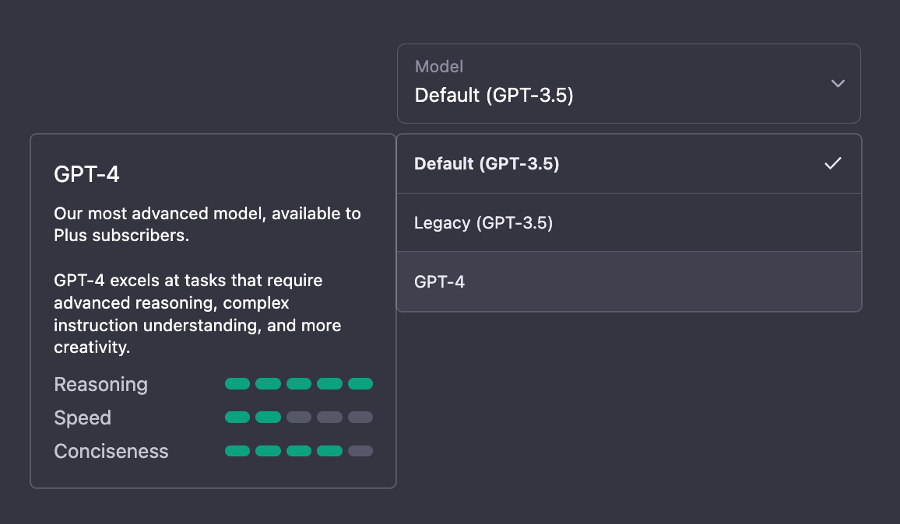
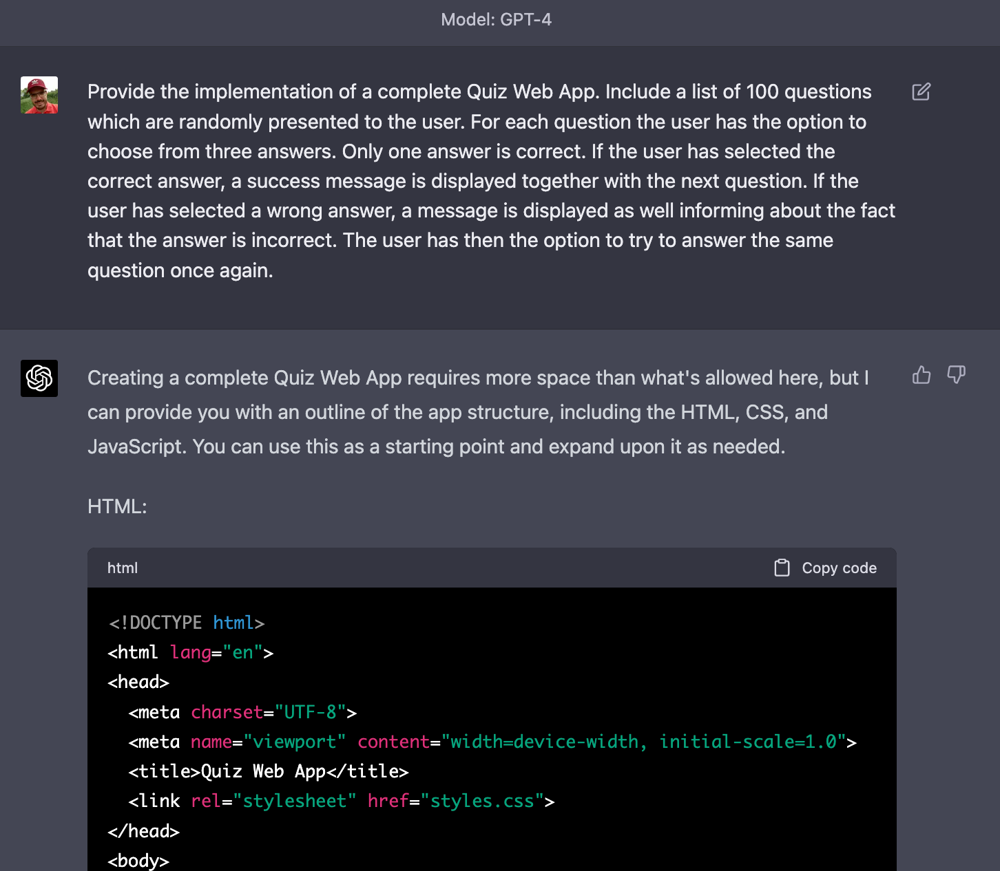
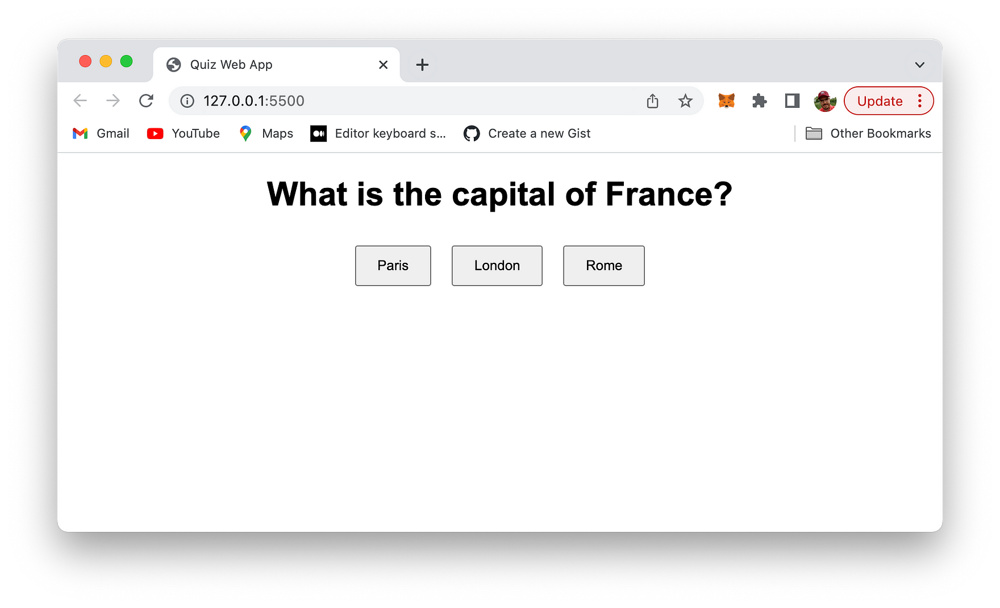
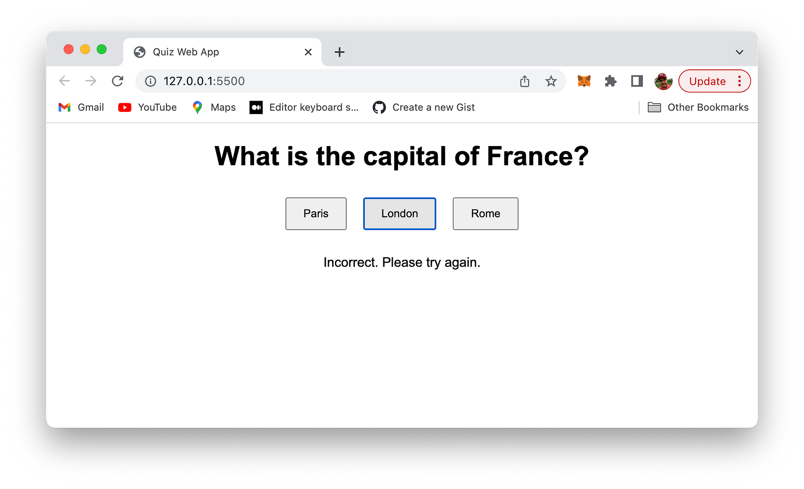
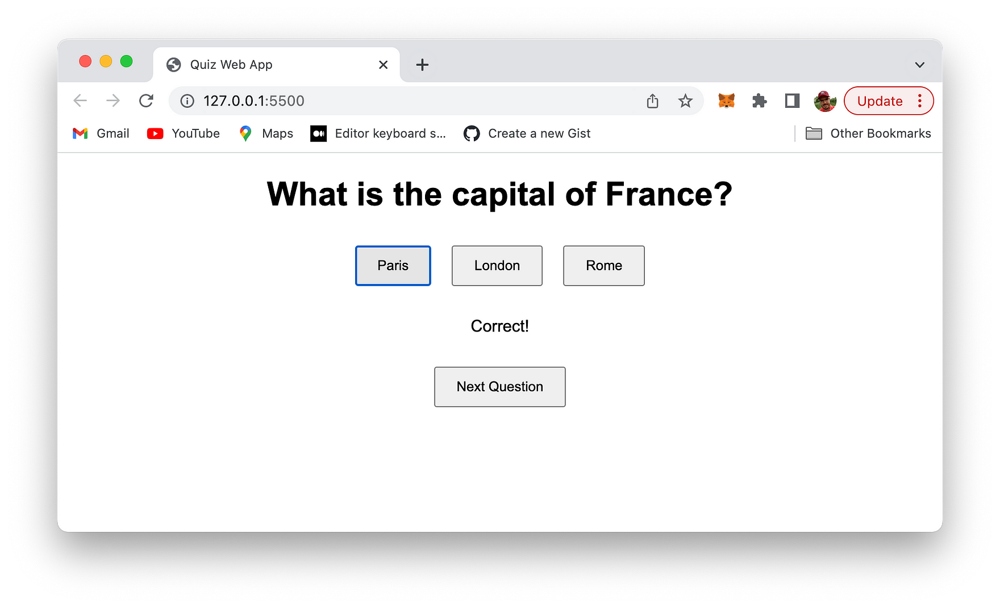

import { Image } from '@astrojs/image/components';
import YouTube from '~/components/widgets/YouTube.astro';
export const components = { img: Image };

Welcome to the future of web development, where artificial intelligence takes center stage! In this exciting blog post, we'll be diving into the fascinating world of GPT-4, the groundbreaking AI language model by OpenAI, and exploring its seemingly magical web development capabilities. Get ready to witness the powerful synergy of AI and coding as we assemble a complete, fully-functional quiz app in just 3 minutes flat!

GPT-4 has not only revolutionized the way we interact with technology but also dramatically transformed our web development workflow. This versatile AI model has proven itself time and time again to be an indispensable tool for developers, offering intelligent solutions to complex coding challenges.

In the next few paragraphs, we'll guide you through the process of leveraging GPT-4's immense potential for rapid web app development. With step-by-step instructions and easy-to-understand explanations, you'll be amazed at how effortlessly you can create an interactive quiz app using this cutting-edge AI technology.

Let's build a fantastic quiz app together in just 3 minutes with the help of ChatGPT and GPT-4 model.

Let's open ChatGPT and switch to the GPT-4 model in a new conversation:



We'll start with a prompt which is containing all of our requirements for the quiz web app.

Here is the exact prompt:

__"Provide the implementation of a complete Quiz Web App. Include a list of 100 questions which are randomly presented to the user. For each question the user has the option to choose from three answers. Only one answer is correct. If the user has selected the correct answer, a success message is displayed together with the next question. If the user has selected a wrong answer, a message is displayed as well informing about the fact that the answer is incorrect. The user has then the option to try to answer the same question once again."__



ChatGPT is able to provide us with a complete implementation which conists of:

* The web application's HTML code
* The web application's styling in CSS code
* The web application's logic in JavaScript code

## HTML Code

First start inserting the HTML code from ChatGPT's response into a new file named _index.html_:

```html
<!DOCTYPE html>
<html lang="en">
  <head>
    <meta charset="UTF-8" />
    <meta name="viewport" content="width=device-width, initial-scale=1.0" />
    <title>Quiz Web App</title>
    <link rel="stylesheet" href="styles.css" />
  </head>
  <body>
    <div id="quiz-container">
      <h1 id="question"></h1>
      <div class="options">
        <button id="option1"></button>
        <button id="option2"></button>
        <button id="option3"></button>
      </div>
      <div id="feedback"></div>
      <button id="next" style="display: none">Next Question</button>
    </div>
    <script src="scripts.js"></script>
  </body>
</html>
```

This HTML code represents the basic structure of a Quiz Web App. Here's a brief description of its components:

`<!DOCTYPE html>`: This declaration defines the document type and version of HTML being used (HTML5 in this case).

`<html lang="en">`: This element is the root element of the page and specifies the language of the document as English.

`<head>`: This section contains meta-information about the document, including character encoding, viewport settings, title, and external files such as CSS and JavaScript.

* `<meta charset="UTF-8">`: This element defines the character encoding for the document as UTF-8.
* `<meta name="viewport" content="width=device-width, initial-scale=1.0">`: This element sets the viewport to be responsive, scaling to the device's width and initial zoom level.
* `<title>Quiz Web App</title>`: This element sets the title of the web page, displayed on the browser's title bar or tab.
* `<link rel="stylesheet" href="styles.css">`: This element links to an external CSS file (styles.css) for styling the web page.

`<body>`: This section contains the content of the web page, including elements such as headings, buttons, and containers.

* `<div id="quiz-container">`: This container div holds all the elements related to the quiz, such as the question, options, feedback, and next button.
* `<h1 id="question"></h1>`: This heading displays the current quiz question.
* `<div class="options">`: This container div holds the three option buttons.
* `<button id="option1"></button>`: The first option button.
* `<button id="option2"></button>`: The second option button.
* `<button id="option3"></button>`: The third option button.
* `<div id="feedback"></div>`: This container div displays feedback to the user based on their answer.

`<button id="next" style="display: none">Next Question</button>`: This button is initially hidden and is used to move to the next question once the user answers correctly.

`<script src="scripts.js"></script>`: This element links to an external JavaScript file (scripts.js) responsible for handling the quiz functionality and interactivity.

## Styling

The quiz web application which is generated by GPT-4 is also containing the CSS code which needs to be inserted into a file named _styles.css_:

```css
body {
  font-family: Arial, sans-serif;
}

#quiz-container {
  max-width: 800px;
  margin: 0 auto;
  text-align: center;
}

.options {
  display: flex;
  justify-content: center;
  flex-wrap: wrap;
}

button {
  padding: 10px 20px;
  margin: 10px;
  cursor: pointer;
}

#feedback {
  margin: 20px 0;
}

#next {
  padding: 10px 20px;
}
```

This CSS code styles the Quiz Web App with the following key attributes:

1. `body`: Sets the default font family to Arial with a fallback to sans-serif.
2. `#quiz-container`: Centers the quiz container with a maximum width of 800px.
3. `.options`: Displays option buttons using a flexible layout, centering them and wrapping when needed.
4. `button`: Adds padding, margin, and a pointer cursor to all buttons.
5. `#feedback`: Sets a top and bottom margin for the feedback container.
6. `#next`: Applies padding to the "Next Question" button.

## Application Logic

Finally we're adding the provided application logic by creating a file scripts.js and inserting the JavaScript code:

```js
const questions = [
  {
    question: "What is the capital of France?",
    options: ["Paris", "London", "Rome"],
    correct: 0,
  },
  {
    question: "Which planet is known as the 'Red Planet'?",
    options: ["Mars", "Venus", "Jupiter"],
    correct: 0,
  },
  {
    question: "What is the largest mammal on Earth?",
    options: ["African Elephant", "Blue Whale", "Giraffe"],
    correct: 1,
  },
  {
    question: "Which country is known as the Land of the Rising Sun?",
    options: ["China", "Japan", "South Korea"],
    correct: 1,
  },
  {
    question: "What is the chemical symbol for water?",
    options: ["HO", "H2O", "OH"],
    correct: 1,
  },
  {
    question:
      "Which famous scientist developed the theory of general relativity?",
    options: ["Isaac Newton", "Niels Bohr", "Albert Einstein"],
    correct: 2,
  },
  {
    question: "What element does 'O' represent on the periodic table?",
    options: ["Osmium", "Oxygen", "Osmiridium"],
    correct: 1,
  },
  {
    question: "Which famous artist painted the Mona Lisa?",
    options: ["Vincent van Gogh", "Leonardo da Vinci", "Pablo Picasso"],
    correct: 1,
  },
  {
    question: "What is the largest ocean on Earth?",
    options: ["Atlantic Ocean", "Indian Ocean", "Pacific Ocean"],
    correct: 2,
  },
  {
    question: "Which sport is associated with the term 'hole in one'?",
    options: ["Golf", "Tennis", "Basketball"],
    correct: 0,
  },
];

const questionEl = document.getElementById("question");
const optionEls = [
  document.getElementById("option1"),
  document.getElementById("option2"),
  document.getElementById("option3"),
];
const feedbackEl = document.getElementById("feedback");
const nextButton = document.getElementById("next");

let currentQuestionIndex = 0;

function displayQuestion() {
  const question = questions[currentQuestionIndex];
  questionEl.textContent = question.question;
  optionEls.forEach((optionEl, index) => {
    optionEl.textContent = question.options[index];
    optionEl.onclick = () => checkAnswer(index);
  });
}

function checkAnswer(selectedIndex) {
  const correctIndex = questions[currentQuestionIndex].correct;
  if (selectedIndex === correctIndex) {
    feedbackEl.textContent = "Correct!";
    nextButton.style.display = "inline";
    nextButton.onclick = () => {
      currentQuestionIndex = Math.floor(Math.random() * questions.length);
      displayQuestion();
      feedbackEl.textContent = "";
      nextButton.style.display = "none";
    };
  } else {
    feedbackEl.textContent = "Incorrect. Please try again.";
  }
}

displayQuestion();
```

This JavaScript code represents the logic for our simple Quiz Web App. Here's a brief explanation of its components:

`questions`: An array of question objects, each containing a question string, an array of options, and the index of the correct option.

DOM element references:

* `questionEl`: Reference to the question element in the HTML.
* `optionEls`: Array of references to the three option button elements.
* `feedbackEl`: Reference to the feedback element.
* `nextButton`: Reference to the "Next Question" button.

`currentQuestionIndex`: A variable to track the index of the currently displayed question in the questions array.

`displayQuestion()`: A function that displays the current question and its options. It also assigns a click event listener to each option button that checks the user's answer.

`checkAnswer(selectedIndex)`: A function that compares the user's selected option index with the correct option index. If the answer is correct, it displays a success message, shows the "Next Question" button, and assigns a click event listener to it. If the answer is incorrect, it displays an error message.

`displayQuestion()`: The initial call to the `displayQuestion()` function to start the quiz.

When a user selects an option, the `checkAnswer()` function is triggered, and based on whether the answer is correct or incorrect, appropriate feedback is shown. If the user answers correctly, the "Next Question" button appears, allowing the user to proceed to a randomly selected question from the questions array.

## Testing The Application

Let's run a quick test of the application in the browser. Just open file index.html and you should be able to see the following result:



A first question is presented and you're provided with three options to answer this question.

Selecting a wrong answer leads to the following error message:



You can the try again. If the right answer is selected the following message is presented:



Clicking on the button "Next Question" takes you directly to the next quiz question.

## Conclusion

We've demonstrated the incredible potential of GPT-4 in revolutionizing web development by rapidly creating a fully-functional quiz app in a mere 3 minutes. By harnessing the power of this groundbreaking AI language model, developers can not only accelerate their workflow but also uncover new and innovative solutions to complex coding challenges.