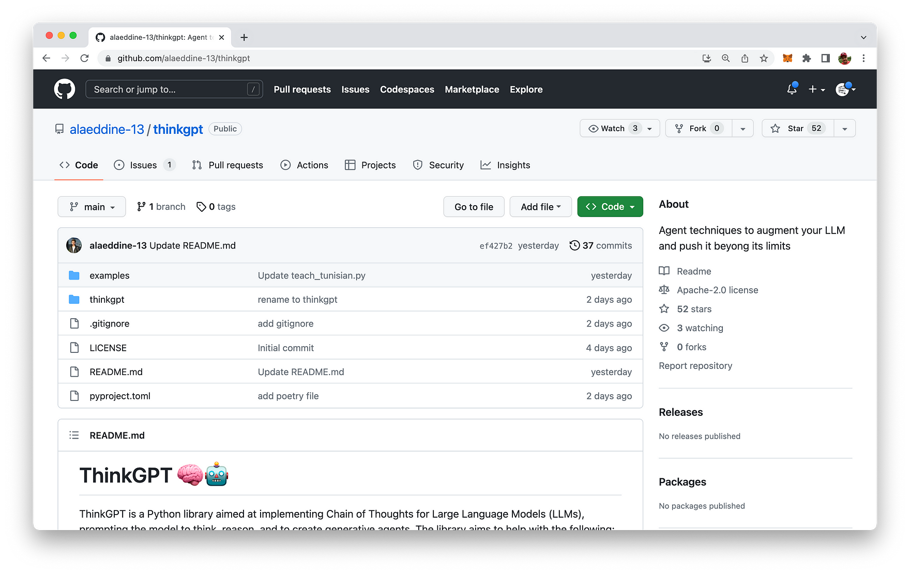
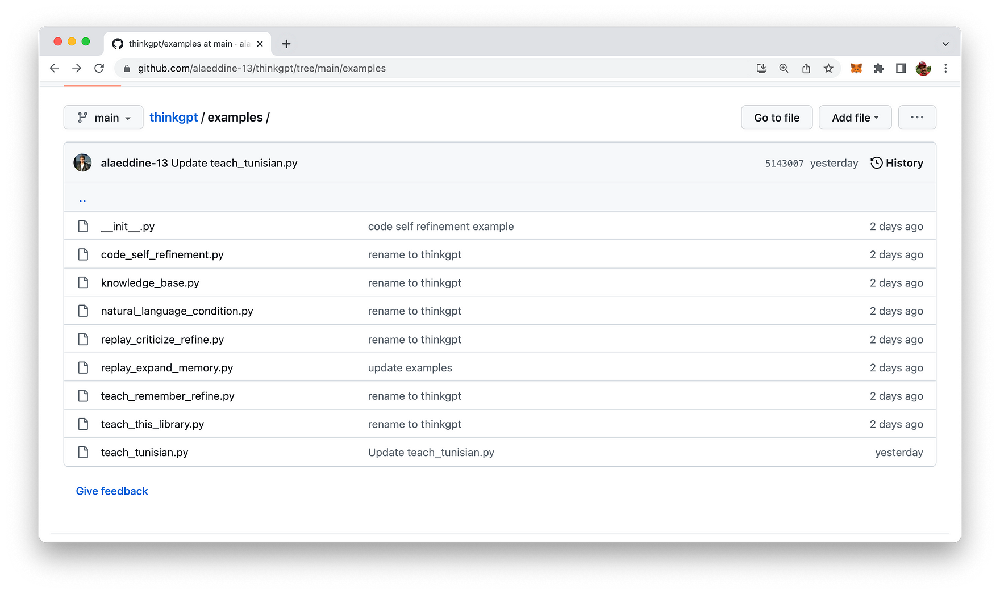
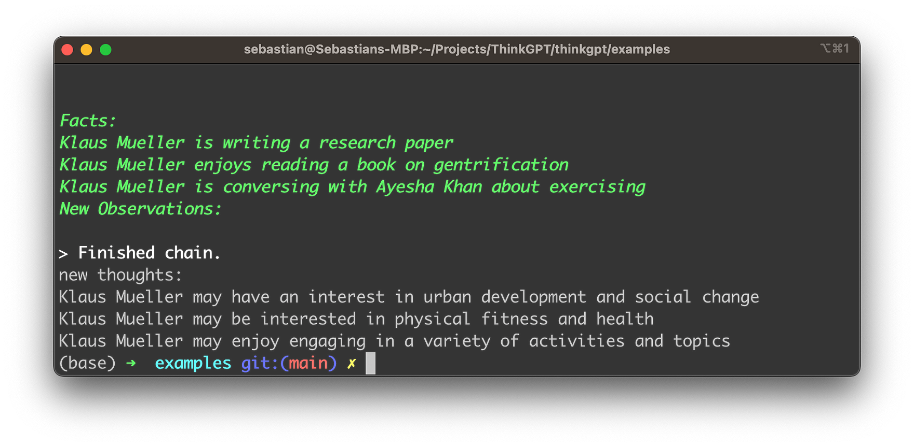

import { Image } from '@astrojs/image/components';
import YouTube from '~/components/widgets/YouTube.astro';
export const components = { img: Image };

ThinkGPT is an innovative Python library that enhances the capabilities of large language models, enabling them to think, reason, and take action more effectively. If you're eager to integrate ThinkGPT into your Python scripts and leverage its advanced features, you've come to the right place! In this blog section, we'll guide you through the first steps of using ThinkGPT in your Python projects.

We will explore the core features of ThinkGPT, including its advanced memory capabilities, self-refinement mechanisms, and higher-order reasoning skills in the following. You will be able to discover how this innovative library is transforming the landscape of AI development and learn how you can harness its power to enhance your own projects. So, join me on this fascinating journey as we delve into the world of ThinkGPT and uncover its potential!

ThinkGPT is hosted on GitHub. The repository can be found at: https://github.com/alaeddine-13/thinkgpt



## Key Features of ThinkGPT

* Memory: ThinkGPT enables large language models (LLMs) to remember experiences and learn new concepts.
* Self-refinement: This feature allows the model to improve generated content by addressing critics, fixing issues, and refining its understanding.
* Abstraction: Encourages LLMs to generalize rules from examples or observations, helping to create compressed knowledge that better fits the model's limited context length.
* Inference: Enables LLMs to make educated guesses based on available information.
* Natural Language Conditions: Users can easily express tasks and conditions in natural language, allowing the model to make intelligent decisions.
* Easy setup and Pythonic API: Thanks to DocArray, ThinkGPT offers an extremely easy setup process and a Pythonic API.

## Installation

Installing ThinkGPT is simple and can be done using pip:

```bash
pip install git+https://github.com/alaeddine-13/thinkgpt.GitHub
```

This command will install the ThinkGPT library directly from its GitHub repository.

## First Step To Use ThinkGPT In Your Python Script

Once the installation is complete, you can start using ThinkGPT in your Python script. To do this, simply import the ThinkGPT class from the `thinkgpt.llm` module and create a new instance of the class:

```python
from thinkgpt.llm import ThinkGPT

llm = ThinkGPT(model_name="gpt-3.5-turbo")
```

This code snippet initializes a new `ThinkGPT` instance with the specified model, in this case, "gpt-3.5-turbo".

With the ThinkGPT instance created, you can now teach your AI model new concepts or facts using the `memorize()` method:

```python
llm.memorize(['DocArray is a library for representing, sending, and storing multi-modal data.'])
```

To recall the memorized information, you can use the `remember()` method:

```python
memory = llm.remember('DocArray definition')
```

Once your AI model has learned some information, you can use the `predict()` method to make predictions or answer questions based on the memorized data:

```bash
llm.predict('what is DocArray ?', remember=memory)
```

This code snippet uses the `remember()` method to retrieve the memorized information and feeds it to the `predict()` method to answer the question.

## Practical Examples

ThinkGPT comes with some easy to understand example use case. The corresponding Python scripts can be found in the example folder of the repository:



Let's take a deeper look at one of the provided examples: replay_expand_memory.py:

```python
from thinkgpt.llm import ThinkGPT

llm = ThinkGPT(model_name="gpt-3.5-turbo")

# Load old memory
old_memory = [
    "Klaus Mueller is writing a research paper",
    "Klaus Mueller enjoys reading a book on gentrification",
    "Klaus Mueller is conversing with Ayesha Khan about exercising"
]

# Teach the LLM the old memory
llm.memorize(old_memory)

# Induce reflections based on the old memory
new_observations = llm.infer(facts=llm.remember())
print('new thoughts:')
print('\n'.join(new_observations))

llm.memorize(new_observations)
```

In this ThinkGPT example script, the goal is to use the ThinkGPT library to induce new reflections or observations based on existing information about Klaus Mueller.

1. First, the script imports the `ThinkGPT` class from the `thinkgpt.llm` module.
2. A new `ThinkGPT` instance is created and initialized with the "gpt-3.5-turbo" model.
3. The `old_memory` variable is defined, containing three statements about Klaus Mueller, representing previous knowledge.
4. The `memorize()` method is used to teach the large language model (LLM) the information stored in `old_memory`.
5. The `infer()` method is called with the facts parameter set to the result of the `remember()` method. This instructs the LLM to induce new observations or reflections based on the previously memorized information.
6. The newly induced observations are printed to the console under the label "new thoughts:".
7. Finally, the `memorize()` method is called again to store the new observations in the LLM's memory, allowing it to build upon its understanding of Klaus Mueller in future interactions.

Before we're ready to execute the script and see what the result looks like we need to retrieve an OpenAI API Key and set the corresponding environment variable OPENAI_API_KEY with the key value retrieved.

To obtain an OpenAI API key, follow these simple steps:

1. Visit the OpenAI website at https://www.openai.com/.
2. Sign up for an account if you don't have one. Click "Sign Up" at the top right corner of the homepage and follow the registration process.
3. After signing up or logging in, navigate to the API section by clicking on "API" at the top of the page or by visiting https://www.openai.com/api/.
4. Check the available API pricing plans and choose the one that suits your needs. Some plans may offer free access with limited usage, while others provide different levels of access depending on your requirements and budget.
5. After selecting a plan, you will be provided with your unique API key. Make sure to keep it secure, as it grants access to the API with your account's usage limits and privileges.

On the command use the following command to set the OpenAI API key:

```bash
export OPENAI_API_KEY="YOUR OPENAI API KEY"
```

Now we're ready to execute the script by typing in:

```bash
python replay_expand_memory.py
```

You should then be able to see a result similar to the following:



## Conclusion

ThinkGPT is a powerful Python library that enhances the capabilities of large language models by adding advanced memory, self-refinement, abstraction, and inference features. Its user-friendly installation process and Pythonic API make it a valuable addition to many AI project. By exploring the practical examples provided in this blog post, you can harness the power of ThinkGPT to revolutionize the way your AI thinks, draws conclusions, and takes action.