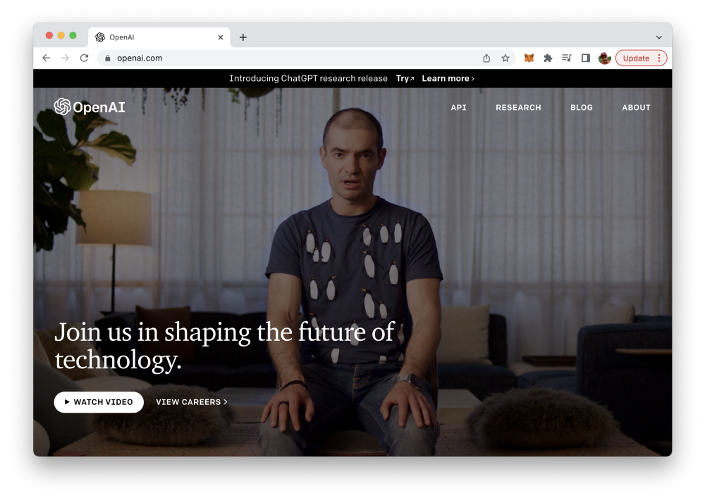
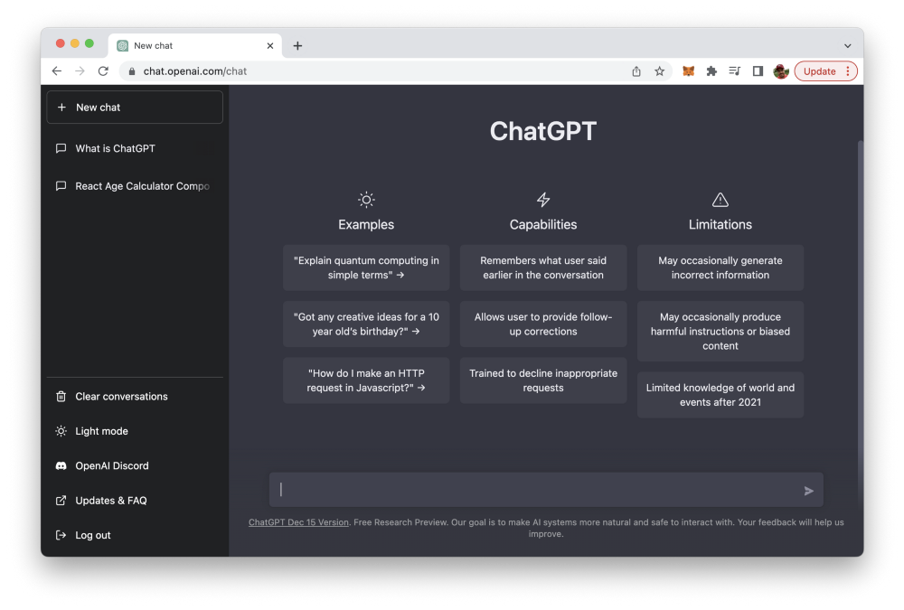
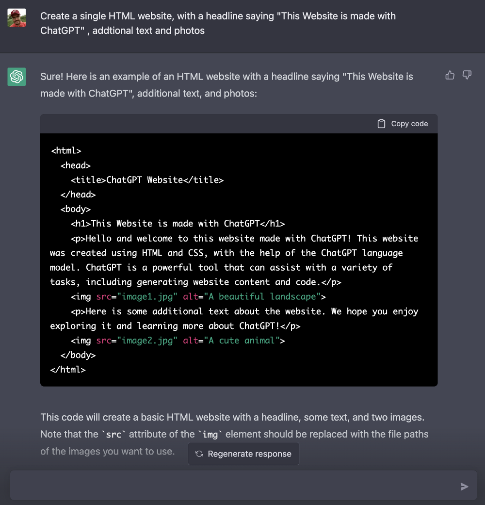

import { Image } from '@astrojs/image/components';
import YouTube from '~/components/widgets/YouTube.astro';
export const components = { img: Image };

ChatGPT is a variant of the GPT (Generative Pre-trained Transformer) language model developed by OpenAI. It is a large, unidirectional language model that has been trained on a large dataset of human-generated text, including conversations from social media platforms, forums, and chat logs.

One of the main features of ChatGPT is its ability to generate human-like responses to prompts given to it. This is achieved through the use of transformer architecture and pre-training on a large dataset. ChatGPT is able to understand the context and content of a conversation and generate appropriate responses based on that information.

ChatGPT can be used in a variety of applications, including chatbots, language translation, and natural language processing tasks. It can be fine-tuned for specific tasks or domains by training it on additional data specific to that task or domain.

## How Can I Access ChatGPT

ChatGPT is provided bei OpenAI. You can find the project's website at https://openai.com/:



Here you need to sign up for a free account. ChatGPT can then be accessed by using the OpenAI account at: https://chat.openai.com/.




## How Can ChatGPT Help To Write Code For A Web Application with Front-end and Back-end?

While ChatGPT is not specifically designed to write code, it could potentially be used to assist with code writing in certain contexts. For example, it might be able to help a programmer generate code snippets or suggest alternative approaches to solving a problem based on the prompts it is given.

Let's explore some of the possibilities in this article.

**1. Let ChatGPT create a simple HTML website**

We start by asking:

*Create a single HTML website, with a headline saying "This Website is made with ChatGPT" , additional text and photos*

As a response ChatGPT is generating the following HTML code:

```html
<html>
  <head>
    <title>ChatGPT Website</title>
  </head>
  <body>
    <h1>This Website is made with ChatGPT</h1>
    <p>Hello and welcome to this website made with ChatGPT! This website was created using HTML and CSS, with the help of the ChatGPT language model. ChatGPT is a powerful tool that can assist with a variety of tasks, including generating website content and code.</p>
    
    <p>Here is some additional text about the website. We hope you enjoy exploring it and learning more about ChatGPT!</p>
    
  </body>
</html>
```

In addition ChatGPT is giving us fruther instructions how to deal with this code:

*This code will create a basic HTML website with a headline, some text, and two images. Note that the src attribute of the img element should be replaced with the file paths of the images you want to use.*



Now we can take it further. Let's ask for a form on the website which gives the user the option to sign up for a newsletter:

Asking ChatGPT: *Add a newsletter sign-up form to this website.*

Will extend the HTML code by adding a newsletter sign-up form. The following extended HTML code is generated:

```html
<html>
  <head>
    <title>ChatGPT Website</title>
  </head>
  <body>
    <h1>This Website is made with ChatGPT</h1>
    <p>Hello and welcome to this website made with ChatGPT! This website was created using HTML and CSS, with the help of the ChatGPT language model. ChatGPT is a powerful tool that can assist with a variety of tasks, including generating website content and code.</p>
    
    <p>Here is some additional text about the website. We hope you enjoy exploring it and learning more about ChatGPT!</p>
    
    <h2>Sign up for our newsletter:</h2>
    <form action="/newsletter-signup" method="POST">
      <label for="email">Email:</label><br>
      <input type="email" id="email" name="email" required><br>
      <label for="name">Name:</label><br>
      <input type="text" id="name" name="name" required><br><br>
      <input type="submit" value="Sign up">
    </form> 
  </body>
</html>
```

In addition ChatGPT is providing the following explaining:

*This code will add a form to the website that allows users to enter their email address and name and sign up for a newsletter. The form will be submitted using the POST method, and the action of the form will be set to /newsletter-signup. This means that when the form is submitted, a POST request will be sent to the URL /newsletter-signup with the form data as the body of the request.*

Ok, that means that we need a POST endpoint available at /newsletter-signup which is able to process the submitted form data. In order to create such a server we can use Node.js and Express for example. Let's find out if ChatGPT can help us to implement the this server as well.

**2. Implementing a Node.js And Express Server**

Again, we're simply asking ChatGPT to implement to corresponding server which is accepting POST request at the /newsletter-signup endpoint:

*Implement a Node.js / Express server for the /newsletter-signup POST endpoint.*

ChatGPT is then generating the following Node.js / Express server implementation for us:

```js
const express = require('express');
const bodyParser = require('body-parser');

const app = express();

// parse application/x-www-form-urlencoded
app.use(bodyParser.urlencoded({ extended: false }));

// parse application/json
app.use(bodyParser.json());

app.post('/newsletter-signup', (req, res) => {
  // get form data from the request body
  const email = req.body.email;
  const name = req.body.name;

  // add user to newsletter list or database here

  res.send(`Thank you for signing up for our newsletter, ${name}!`);
});

app.listen(3000, () => {
  console.log('Server listening on port 3000');
});
```

Furthermore we're receiving some explanations:

*This code will create a basic Node.js/Express server that listens for POST requests to the /newsletter-signup endpoint. When a request is received, the server will parse the form data from the request body and get the email and name of the user. You can then add the user to your newsletter list or database as needed. Finally, the server will send a response to the client thanking them for signing up.*

Maybe we should also ask ChatGPT to add the Cors middleware to the express server as well:

*Could you please add the cors middleware to the express server?*

Again ChatGPT is generating the Node.js / Express server implementation, this time with the cors middleware added:

```js
const express = require('express');
const bodyParser = require('body-parser');
const cors = require('cors');

const app = express();

// enable CORS
app.use(cors());

// parse application/x-www-form-urlencoded
app.use(bodyParser.urlencoded({ extended: false }));

// parse application/json
app.use(bodyParser.json());

app.post('/newsletter-signup', (req, res) => {
  // get form data from the request body
  const email = req.body.email;
  const name = req.body.name;

  // add user to newsletter list or database here

  res.send(`Thank you for signing up for our newsletter, ${name}!`);
});

app.listen(3000, () => {
  console.log('Server listening on port 3000');
});
```

Again, ChatGPT is explaining what is changed with the following word:

*To enable CORS, you can simply require the cors module and use the cors() middleware function provided by it. This will allow the server to accept cross-origin requests from any domain.*

Ok, nice! Currently ChatGPT has provided us with a function which is handling the incoming POST request which is not complete. At the moment only the email and name information which is received via the incoming POST request is extracted and saved in two constants: email and name. A comment is included in the code which is suggesting to implement a logic to add those information to a database. However this code is not included in the sample.

Let's ask ChatGPT to further complete this implementation and generate the code which is needed to insert the user information (name and email) to a database table called users which is available in a MongoDB instance which is running on port 3333:

*Add the code which is needed to insert the received email and name into a database table users of a MongoDB database instance which is running on port 3333.*

As a result of that request we're getting back the extended code:

```js
const express = require('express');
const bodyParser = require('body-parser');
const cors = require('cors');
const mongoose = require('mongoose');

const app = express();

// enable CORS
app.use(cors());

// parse application/x-www-form-urlencoded
app.use(bodyParser.urlencoded({ extended: false }));

// parse application/json
app.use(bodyParser.json());

// connect to MongoDB
mongoose.connect('mongodb://localhost:3333/mydatabase', {
  useNewUrlParser: true,
  useUnifiedTopology: true
});

// create a schema for the users collection
const userSchema = new mongoose.Schema({
  email: String,
  name: String
});

// create a model for the users collection
const User = mongoose.model('User', userSchema);

app.post('/newsletter-signup', (req, res) => {
  // get form data from the request body
  const email = req.body.email;
  const name = req.body.name;

  // create a new user document
  const user = new User({
    email: email,
    name: name
  });

  // save the user document to the database
  user.save((error) => {
    if (error) {
      res.send(`Error saving user to database: ${error}`);
    } else {
      res.send(`Thank you for signing up for our newsletter, ${name}!`);
    }
  });
});

app.listen(3000, () => {
  console.log('Server listening on port 3000');
});
```

To insert the received email and name into the database, you will need to require the mongoose module and use it to connect to the MongoDB database instance. Then, you can create a schema and model for the users collection, and use the save() method of the model to insert a new document representing the user into the collection.

## Conclusion

This simple full-stack web application example illustrated how easy it is to involve ChatGPT in your coding process effectively. As the chat is able to provide answers and at the same time using the context from the chat history it's easy to extend the generated code step by step. This could be a great help to speed up your coding process - just try it out.