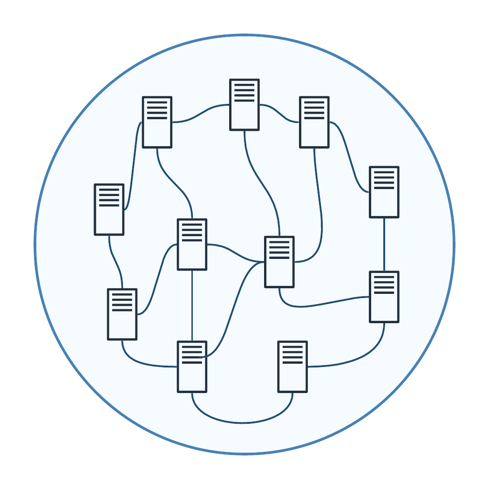
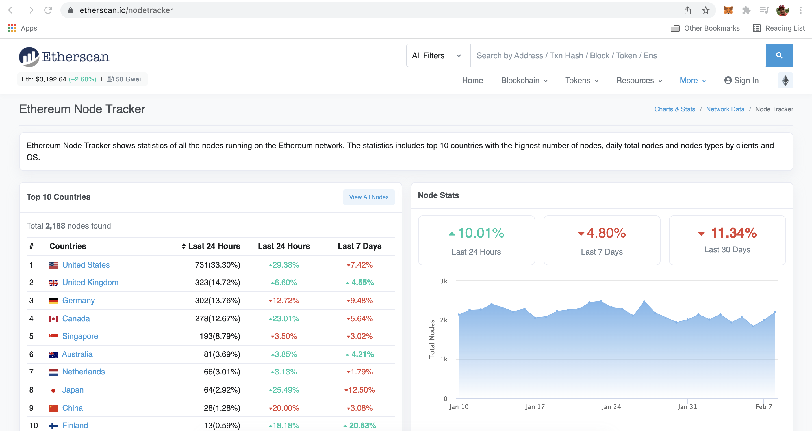
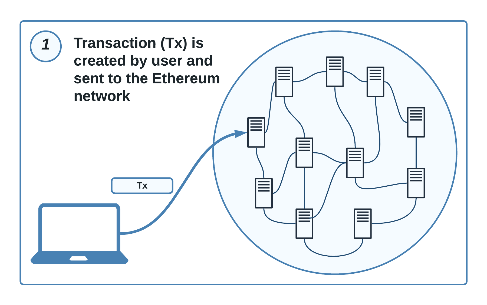
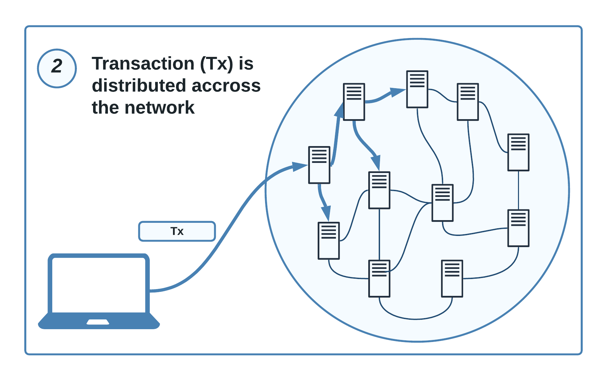
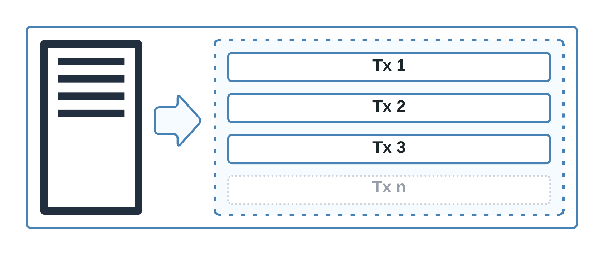
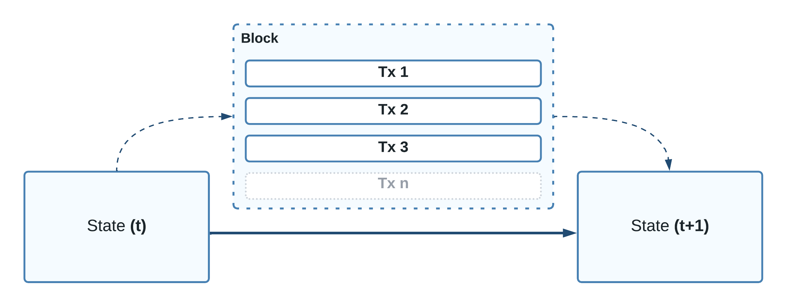
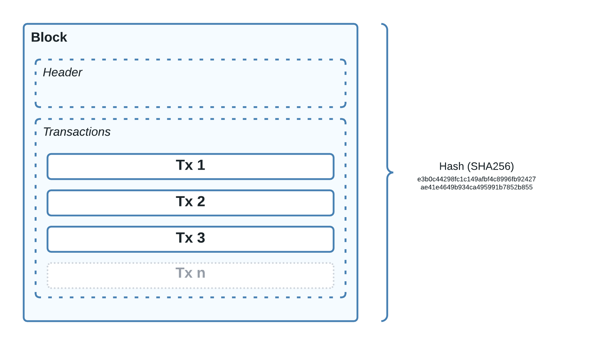

import { Image } from '@astrojs/image/components';
import YouTube from '~/components/widgets/YouTube.astro';
export const components = { img: Image };

In order to get started with Ethereum we first of all need to clarify what exactly is Ethereum and what are the main building blocks of the Ethereum technology. Ethereum describes itself as a technology that’s a home to digital money, global payments, and applications.

When compared to a blockchain technology like Bitcoin Ethereum differs in many important aspects. The Bitcoin network was build to only support one specific application: a peer-to-peer digital currency. The Ethereum network supports many different applications and enables you to not only implement and run you own digital currency on the network but also enables you to build your own decentralized applications (DAPPs) on the Ethereum blockchain. Furthermore the Ethereum blockchain hosts its own native digital currency which is called Ether.

The Ethereum blockchain can be described as a decentralized database which holds the single source of truth for the state of the Ethereum network. This means that the blockchain keeps track of all transactions which are executed (e.g. is Ether is send from one wallet to another wallet) and of the execution state of applications running on the blockchain. As the name already suggests a blockchain is built of blocks. A block is an entity which groups together several transactions. A block is then distributed to the decentralized Ethereum network and validated by the network Nodes before it is attached to the blockchain at the end.

## The Ethereum Network

So before diving deeper into the concept of the Ethereum blockchain we first need to get an understanding of the Ethereum network itself which is essential to operate the blockchain.

The Ethereum network is fully decentralized which means that there is no single instance or organization which is operating or hosting the blockchain. Instead the decentralized network is operated by multiple Nodes which are operated independently from each other and are connected over the internet. In the following you can see an illustration of the Ethereum network with Nodes connected to each other:

So what exactly is a Node? Nodes in the Ethereum network are computers which are connected over the internet with the purpose to participate in running the decentralized and distributed Ethereum network. The main tasks of Nodes are:

- Validation of blocks and verification of transaction data
- Storage of blockchain data
- Creating and attaching blocks to the blockchain

A real-time overview of the current Nodes in the Ethereum network can be seen at https://etherscan.io/nodetracker.

The Ethereum Node Tracker website list all Nodes which are running on the Ethereum network at the moment. Here you can get even more insights into the network, e.g. discovering in which countries Nodes are running and how the network structure is changing over time.

## Ethereum Clients

As the Ethereum network is distributed and connected over the internet everybody can join the network by setting up a node and therewith participating in the network. To setup you own node on your computer you need an Ethereum client software.

Many Ethereum clients exists and you can choose clients which are implemented in a variety of programming languages. A list of actively maintained Ethereum client projects can be found at https://ethereum.org/en/developers/docs/nodes-and-clients/#execution-clients.

## Type of Nodes

The Ethereum network supports different kind of Nodes:

- *Full Node*
- *Light Node*
- *Archive Node*

Let’s examine the main differences of these three Node types.

First of all a Full Node is the standard node type which is used. It contains a full set of the full Ethereum blockchain data. A Full Node:

- Stores the full blockchain data on disk and can serve the network with any data on request.
- Participates in block validation.
- Verifies blocks and states.

In contrast a Light Node:

- Doesn’t store the entire blockchain data on disk. Instead it stores only the header information of each block and only retrieves additional information if needed from Full Nodes accessible in the network.
- Requires less storage capacity on the computer.

An *Archive Node*:

- Stores everything which is kept in a Full Node and builds an archive of historical states.
- Is needed if you want to query a historian state of the blockchain like an account balance at a specific block number.

# Transactions & Blocks

From the first chapter you’ve already a basic understanding of the decentralized structure of the Ethereum network. In this part we’ll move on and learn about the details which happens in the network when a user (a wallet) starts interacting with the Blockchain network. Therefore we need to understand the concept of transactions & blocks.

## Transactions

By using the term transaction we’re referring to an action with is initiated by an external-owned account and sent to the Ethereum network and you can see in the following:

An external-owner account is an account which is managed by a user (e.g. by using an Ethereum wallet). A transaction can be initiated to achieve various outcomes in the Ethereum network. E.g. a transaction can be used to transfer Ether (ETH) from one account to another account. This is a transaction which changes the state within the network because the sender account is being reduced by the amount of Ether and the receiving account is being increased with the same amount of Ether.

The external-owner account who is initiating the transactions connects to a Node in the Ethereum network and sends the transaction. Afterwards the transaction is distributed across the other Nodes in the network like you can see in the following illustration:

## Blocks

As transactions are distributed across the network the next question which comes into mind is: what is each node doing with the transactions that are being received?

To provide an answer to that question we need make ourselves familiar with the concept of Blocks.

So what are Blocks? Blocks are batches of transactions. Nodes are grouping together transactions in Blocks in order perform a state change of the Ethereum network by adding the batch of transactions to the blockchain:

By building Blocks and combining multiple transactions the Ethereum network ensures that a state change of the network can be performed by validating the Block with a consensus mechanism and then adding this new block to the blockchain. The following figure illustrates the state change in the network by adding a new Block:

Once a new network state is available the new state is distributed across all Nodes in the network, so that it is ensured that the network state is synchronized.

Blocks and transactions are strictly ordered. This means that the transaction history is always preserved in the Blockchain. To make sure that blocks are ordered every new Block which is created contains as an additional information a reference to its parent block. The reference is a hash value which is generated from the data which is contained in a Block. The hash value which is calculated for a block is specific to the content which is available inside the block. Each block comprises of transactions and header data. If anything of that changes, the calculated hash value changes as well:

> __Hash Function:__
> A hash function is used to generate a hash value. This function maps data of arbitrary size to a fix-size value. There are different kind of hashing algorithms which can be used. Ethereum uses the SHA-256 hash algorithm to generate hash values which are of 256 bit size.

##Mining

The process of putting a new Block together, validating this Block, and finally adding it to the Ethereum Blockchain is called Mining. This process is started and performed by the Nodes in the network. Any Node which succeeds in putting together a block, getting it validated, and added to the Blockchain is rewarded in Ether.

