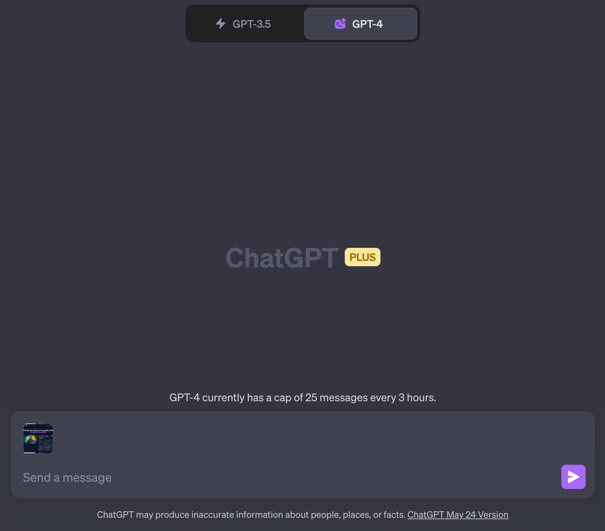
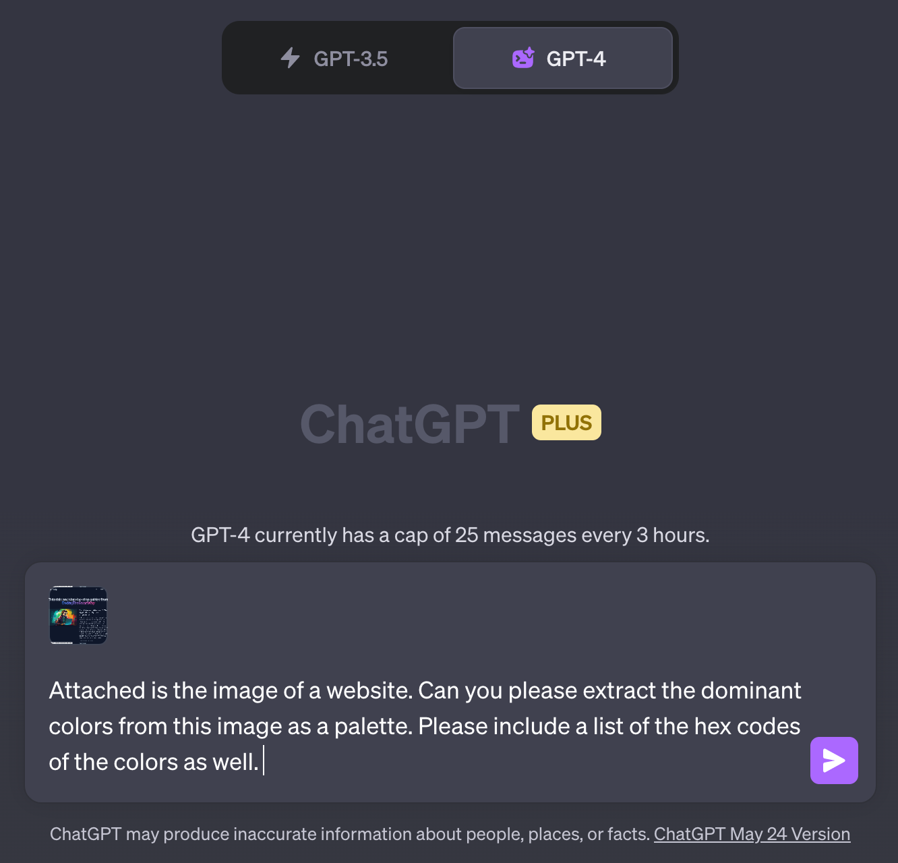
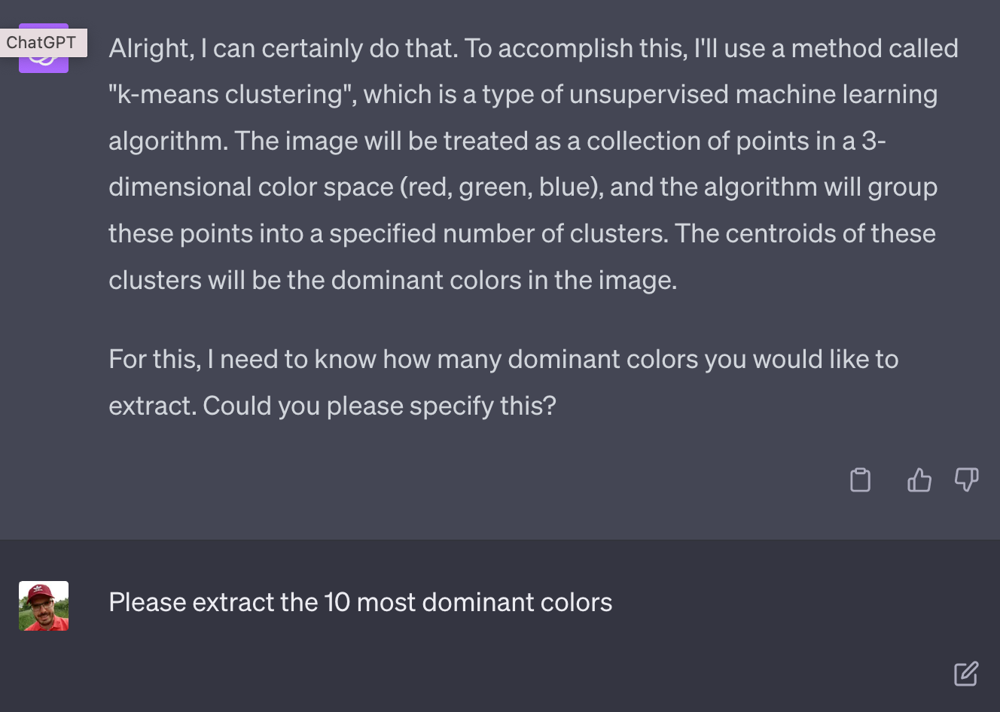
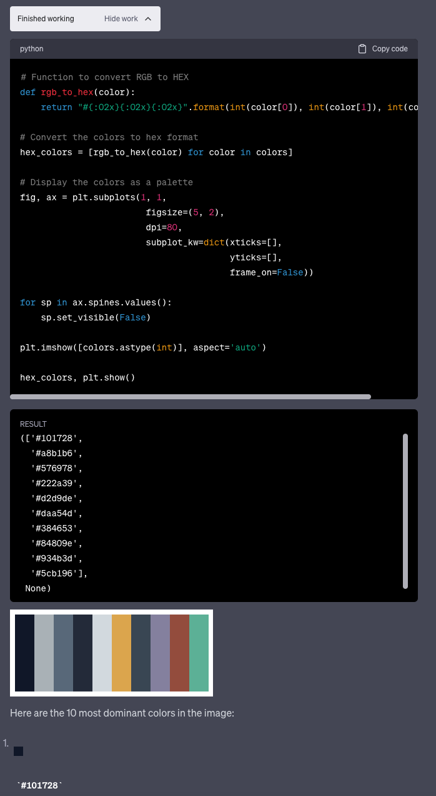

import { Image } from '@astrojs/image/components';
import YouTube from '~/components/widgets/YouTube.astro';
export const components = { img: Image };

Hi there! Today, I’m going to share with you a fascinating journey I embarked on with ChatGPT’s new Code Interpreter. If you’re not familiar with this tool, don’t worry, I’ve got you covered. We’ll start with a brief introduction to the Code Interpreter, and then we’ll dive into a practical application: extracting color palettes from any website. So, let’s get started!

## What is ChatGPT's Code Interpreter?

ChatGPT's Code Interpreter is a revolutionary tool developed by OpenAI. It's a part of the ChatGPT suite and has been making waves in the tech world since its beta release. The Code Interpreter is designed to perform a variety of tasks such as analyzing data, editing code, and even manipulating images. It's still in its beta stage, which means it's being continuously tested and improved.

The beauty of the Code Interpreter lies in its ability to execute code while maintaining a natural language understanding. This means it can identify and correct any errors it encounters, making it a powerful tool for tasks ranging from data analysis to computer vision tasks. It supports different file formats, such as PNG, CSV, and JSON, making it a versatile tool for data scientists and developers alike.

## Activating the Code Interpreter

To use the Code Interpreter, you need to be subscribed to ChatGPT Plus. Once you're signed in to your Plus account, you can activate the Code Interpreter by going to Settings, choosing Beta Features, and enabling "Code Interpreter". After that, you can access the Code Interpreter by clicking on "GPT-4" at the top center of the screen and then selecting "Code Interpreter".

## Extracting Color Palettes with Code Interpreter

Now that we've covered the basics, let's dive into the fun part: extracting color palettes from websites using the Code Interpreter. This is a handy feature for web designers or anyone interested in the aesthetics of a website.

During my exploration, I discovered that the Code Interpreter can extract dominant colors from images using k-means clustering, a popular machine learning algorithm. The result is a list of hex codes representing the most prominent colors in the image. This can be incredibly useful if you're looking to design a website or a piece of content around a specific image.

For instance, let's say you have a beautiful image that you want to use as the centerpiece of your website design. You can use the Code Interpreter to extract the dominant colors from this image, and then use these colors to guide your design process. This ensures that your design is cohesive and visually appealing.

In order to get started, you first need to take a screenshot from the website you'd like to extract the dominant color codes.

Store the screenshot in an image file and upload the image file to Code Interpreter by using the file upload function in the prompt input field of ChatGPT:

Next you need to input the prompt text as well:

Once you hit return you can see that Code Interpreter is coming up an idea of how to solve this problem. Code Interpreter is asking how many colors should be extract:

Once this additional information is provided Code Interpreter is able to generate and executed the needed source code and extract the color palette as requested:

## Wrapping Up

The Code Interpreter is a game-changer in the world of AI and coding. Its ability to perform complex tasks in a conversational manner makes it an accessible tool for both technical and non-technical users. The color palette extraction feature is just one of the many ways you can leverage this tool to simplify your tasks and enhance your projects.

As the Code Interpreter continues to evolve, I'm excited to see what other features and capabilities will be added. For now, I hope this blog post has given you a good introduction to this powerful tool and its potential applications. Happy coding!