import { Image } from '@astrojs/image/components';
import YouTube from '~/components/widgets/YouTube.astro';
export const components = { img: Image };


<YouTube url="https://youtu.be/p4t3qlaJz5U" />

Making server requests in JavaScript-based application is a common task. There are different ways of solving that task. Back in the day developers used the XMLHttpRequest (XHR) objects to interact with servers. For the first time it has been possible to retrieve data from a URL without having to do a full page refresh. This was one of the prerequisites to enable a web page to update just parts of the page without needed to do a full refresh.  
  
However, using XMLHttpRequest has never felt very natural to JavaScript developers and has lead to code which is hard to read and understand. External libraries like jQuery or Axios have been trying to solve that problem and have provide better and cleaner server request APIs.  
  
With the release of the Fetch API JavaScript has now build-in a much cleaner promised-based API which can be used to perform server request in an easy way without needing to use third-party libraries.  
  
This tutorial is for all of you who have not worked with the Fetch API yet. In the following steps we're going to cover the Fetch API basics and learn to perform HTTP GET and POST requests with that API by implementing practical examples.  

## Setting Up The Project

Let's get started. First step is to setup a new JavaScript project. Because we'll be using plain JavaScript this step is actually very easy. You just need to create a new project folder. Inside that folder you'll then add an empty file _index.html_ and open this file in your favourite code editor.  
  
`$ mkdir fetch-api-demo`  
  
`$ cd fetch-api-demo`  
  
`$ touch index.html`  
  
For the following steps Visual Studio Code is used. In the following screenshot you can see Visual Studio with the project folder opened:  

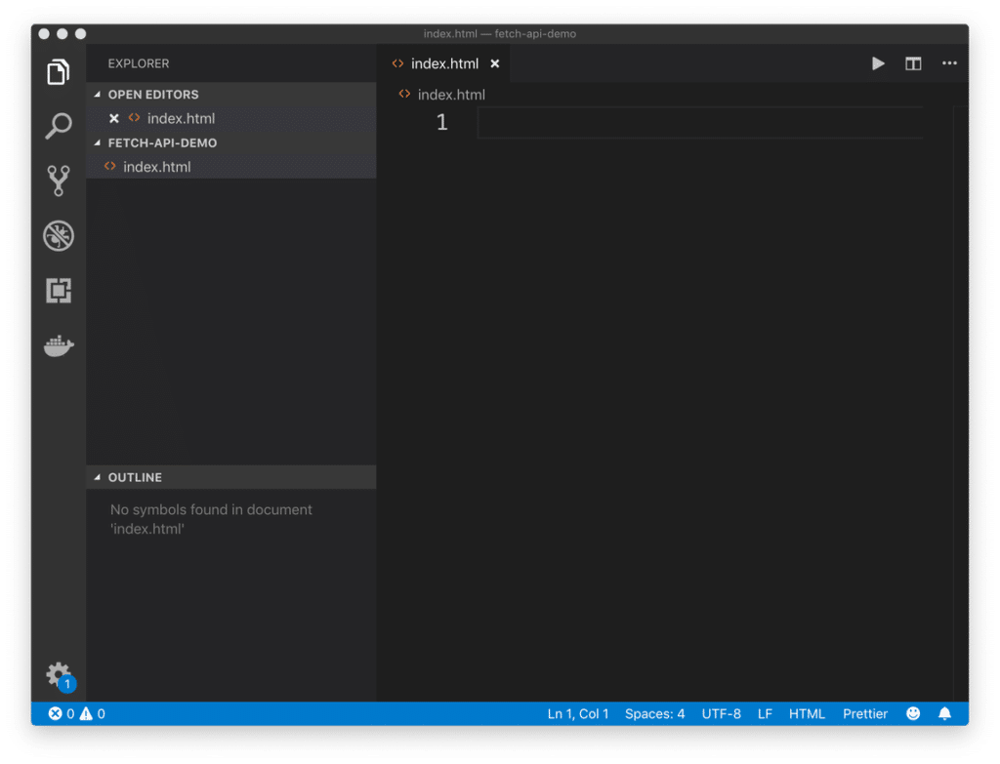

We'll start with inserting a first simple HTML template into _index.html_. By using the integrated Emmet extension in Visual Studio code this is easy: just type in an exclamation mark and hit the TAB key to insert the following Emmet template in _index.html_:  

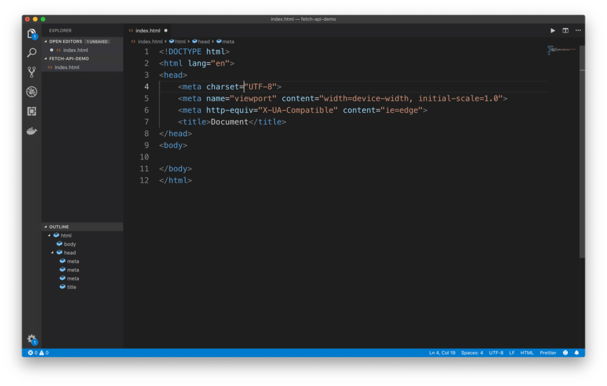

To view the result of this HTML file in the browser we're able to make use of the Live Server extension in Visual Studio Code. Go go the extension tab, search for “Live Server” and make sure to install the corresponding extension:  

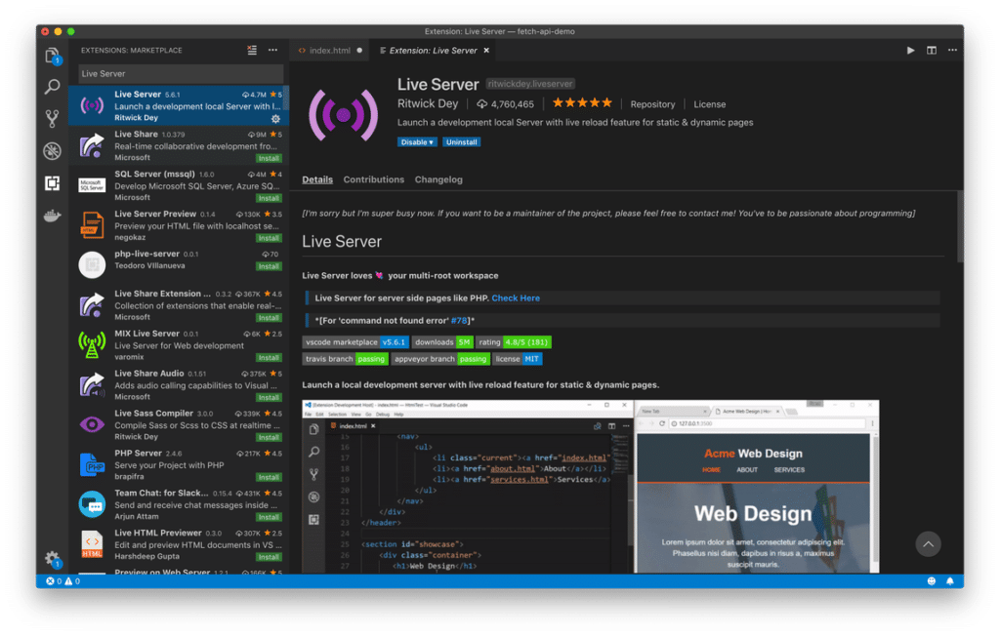

Once the extension is installed successfully you're able to launch the live-reloading development web server by selecting the context menu entry _Open with Live Server_ by right-clicking on file _index.html_:  

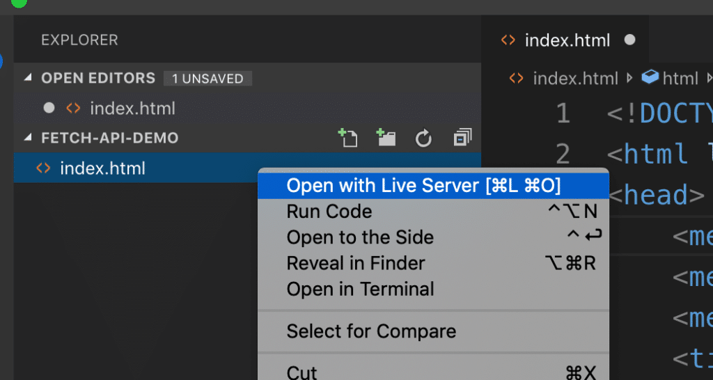

The server is started, the browser is opened and you will see the output from file _index.html_. As the body section is currently containing no content you'll see only a white page. Because the web server has live reloading capabilities you're now able to insert additional content into the body section and you'll be able to see the result in the browser immediately without the need of reloading the page.  

```html
<body>  
    <h1>Getting Started With Fetch API</h1>  
</body>
```

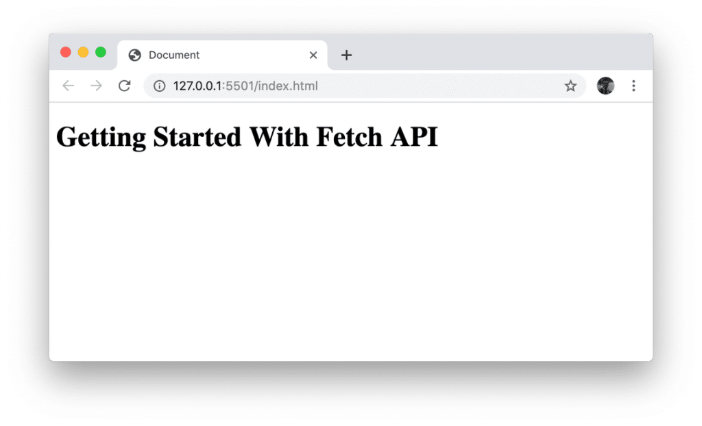

## Performing A First Request

The project setup is in place, the web server is up and running. Now we're ready to perform a first request to fetch data by using the Fetch API.  
  
In general the Fetch API is able to retrieve data from any URI. This can be just a local file or a remote server. For the following examples we'll be using the JSONPlaceholder service which is available at [https://jsonplaceholder.typicode.com/](https://jsonplaceholder.typicode.com/). JSONPlaceholder is exposing multiple endpoints which can be used for sending GET or POST requests to. In the following you can see the list of resources available:  
  

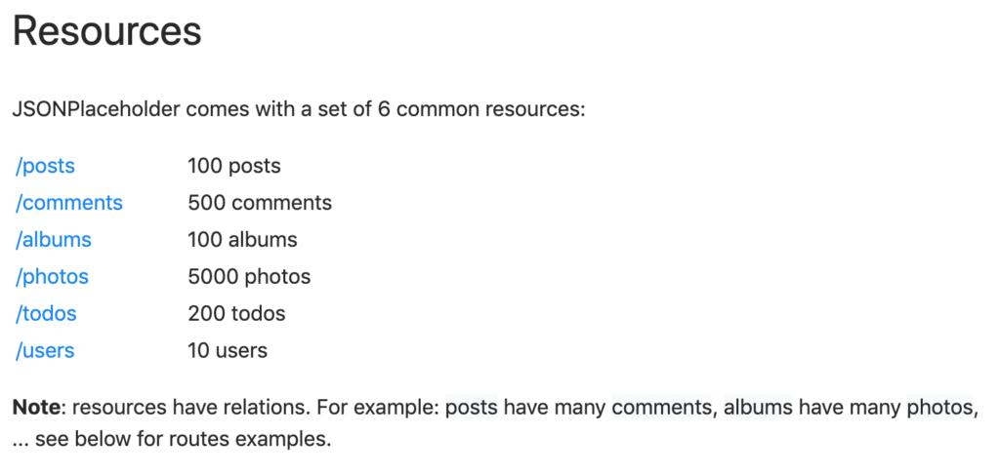

For the first example, let's start by accessing the _/users_ endpoint. First let's start by adding the some more HTML code to the body section in _index.html_:  

```html
<body>
    <div>
        <h1>Getting Started With Fetch API</h1>
        <button id="fetchUserDataBtn">Fetch User Data</button>
    </div>
    <hr>
    <div id="response"></div>
</body>
```

A button is added with _id_ equal to _fetchUserDataBtn_. Furthermore a div element with id _response_ is added.  
  
Now we're ready to further complete the implementation by adding a script section:

```javascript
<body>
    ...

    <script>
        document.getElementById('fetchUserDataBtn').addEventListener('click', fetchUserData);
    
        function fetchUserData(){
            fetch('https://jsonplaceholder.typicode.com/users/1')
                .then(response => response.json())
                .then(json => console.log(json))
        }
    </script>
</body>
```

This JavaScript code is used to first add a click event listener function to the _fetchUserDataBtn_. The function contains the code which is needed to retrieve data from endpoint [https://jsonplaceholder.typicode.com/users/1](https://jsonplaceholder.typicode.com/users/1). This endpoint is returning the user data object with ID 1 in JSON format.  
  
The endpoint is passed into the call of the _fetch_ function as string. The call of _fetch_ returns a promise. This means that we're able to attach calls of the _then_ method in order to wait for the promise to be resolved.  
  
The first call of _then_ is used to execute an arrow function to extract the JSON part of the response object. The second call of _then_ is used to output the JSON result to the console. In the following screenshot you can see the output in the browser console after clicking on the button:  

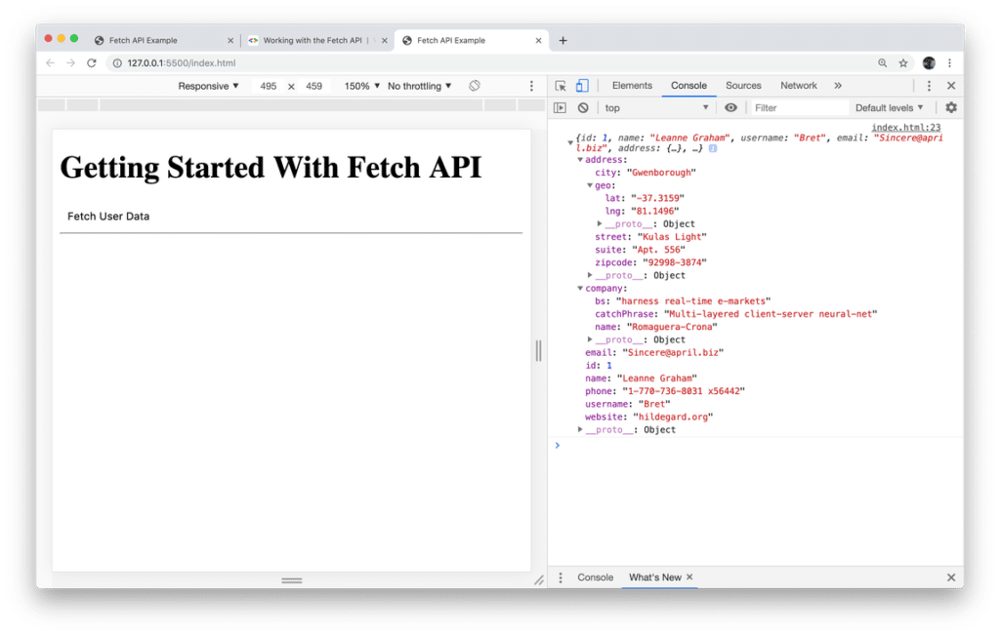

Let’s adapt the code a little bit. Instead of requesting only one user data objects lets retrieve all user objects by using endpoint [https://jsonplaceholder.typicode.com/users/](https://jsonplaceholder.typicode.com/users/):

```javascript
    <script>
        document.getElementById('fetchUserDataBtn').addEventListener('click', fetchUserData);
    
        function fetchUserData(){
            fetch('https://jsonplaceholder.typicode.com/users/')
                .then(response => response.json())
                .then(users => console.log(users));
        }
    </script>
```

Again the output is written to the console, so that you should be able to see a list of user objects like in the following screenshot:  

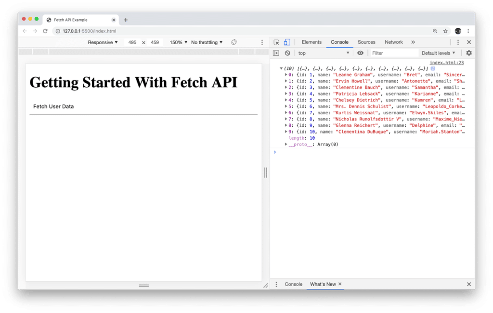

We've already added a div element with id response to the HTML code. Let's use this div element to output the list of user names directly on the website:  

```javascript
<script>
        document.getElementById('fetchUserDataBtn').addEventListener('click', fetchUserData);
    
        function fetchUserData(){
            fetch('https://jsonplaceholder.typicode.com/users/')
                .then(response => response.json())
                .then(users => {
                    let output = '<h2>Lists of Users</h2>';
                    output += '<ul>';
                    users.forEach(function(user) {
                        output += `
                            <li>
                                ${user.name}
                            </li>
                        `;
                    });
                    output += '</ul>'
                    document.getElementById("response").innerHTML = output;
                });
        }
</script>
```

The HTML code which is used to output the list of user names is stored in _variable_ output. The _forEach_ method is used to loop over the items avaiable in the users array. A function is passed into the call of _forEach_. This function is executed for every item in the array. The current user item is passed into this function via paramater, so that you have access to the user properties from within this function.  
  
The list item <li></li> element is added to _output_ by using a template string (back-ticks are used). Template strings can contain placeholders. These are indicated by the dollar sign and curly braces (`${user.name}`). By using this placeholder we’re able to add the name value directly to the HTML output.  
  
Finally the HTML code which is stored in the variable output is added to the website by using the following line of code:  

```javascript
document.getElementById("response").innerHTML = output;
```

The output in the browser should then look like what you can see in the following:

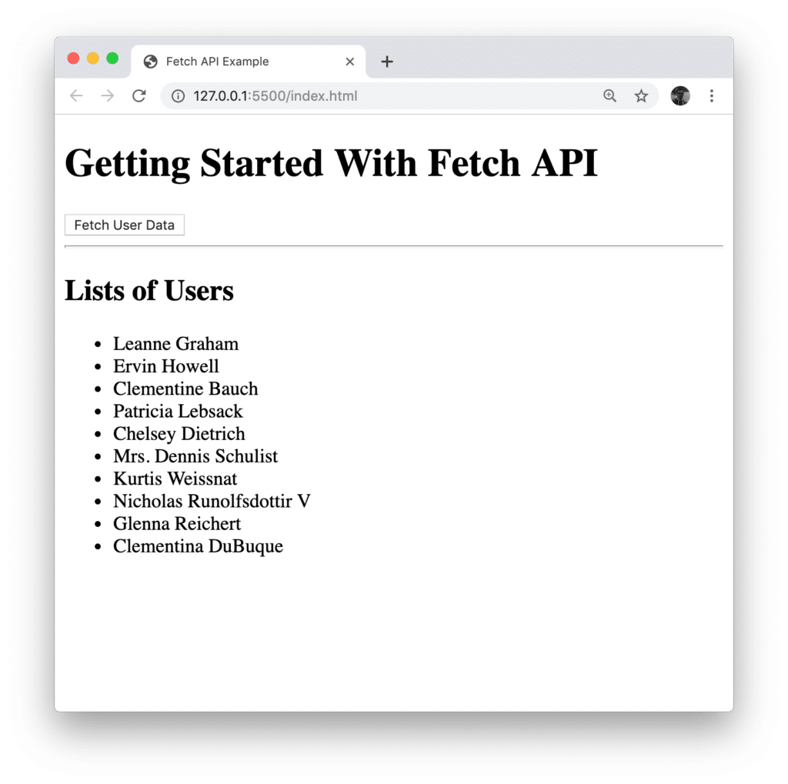

## Sending Post Requests

The Fetch API is not only capable of retrieving data. It can also be used to send HTTP POST, PUT, or DELETE requests. In the following let’s take a look at another example which is sending HTTP POST requests via the Fetch API. Let’s take a look at the list of available endpoints at [https://jsonplaceholder.typicode.com/](https://jsonplaceholder.typicode.com/)  
  

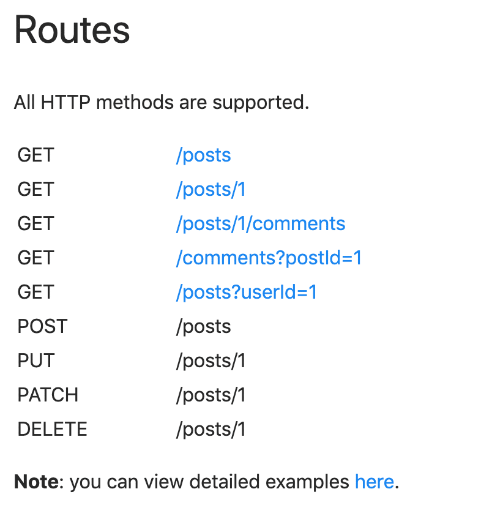

As you can see there is one endpoint (/posts) available which is of type POST. This endpoint is accepting new post entries in JSON format consisting of the properties _title_ and _body_. Let's add a simple form to our application which consists of two input fields so that the user is able to provide values for a new post entry:

```javascript
<form id="addPostForm">
    <div>
        <input type="text" id="title" placeholder="Title">
    </div>
    <div>
        <textarea id="body" placeholder="Body"></textarea>
    </div>
    <input type="submit" value="Submit">
</form>
```

Furthermore a submit button is part of the form. To handle the submit event we need to add a new event handler function next:

```javascript
document.getElementById('addPostForm').addEventListener('submit', addPost);
```

This line of code is attaching the addPost function as an event handler to the submit event of the form. The implementation of the _addPost_ function consists of the following code:

```javascript
function addPost(event) {
    event.preventDefault();
    
    let title = document.getElementById('title').value;
    let body = document.getElementById('body').value;

    const myPost = {
        title: title,
        body: body
    };

    fetch('https://jsonplaceholder.typicode.com/posts', {
        method: 'POST',
        headers: {
            'Content-Type': 'application/json'
        },
        body: JSON.stringify(myPost)
    })
        .then((res) => res.json())
        .then((data) => console.log(data))
}
```

The first thing which needs to be done inside of addPost is to call the _event.preventDefault()_ method to prevent the default submit behaviour of the browser. This enables us to implement our own submit logic in the following lines of code.  
  
Before sending the HTTP POST request to the endpoint by using the Fetch API we need to prepare the new user object based on what has been entered in the from by the user.  
  
The values which have been entered in the input elements are stored in the variables _title_ and _body_ and are used to create a new user object which is stored in _myPost_.  
  
The HTTP POST request is sent by calling the _fetch_ function. Two parameters are passed into this function call:  

- the URI of the endpoint as string
- a configuration object

The configuration object needs to contain the _method_ property which needs to be set to the string _POST_. Furthermore we need to add the _headers_ property and the body _property_.  
  
The value which is assigned to _headers_ is an object container properties which are added to the request header. Here we're setting the _Content-Type_ header property to the string value _application/json_.  
  
Furthermore we need to add the body property and set the value the the JSON string representation of the new post object. This is done by calling the _JSON.stringify_ method and passing in the _myPost_ variable as a parameter.  

## Error Handling

Let's further extend our implementation by adding error handling. To simulate an error situation we're first changing the POST endpoint to something that is not existing, like [https://jsonplaceholder.typicode.com/postsERROR](https://jsonplaceholder.typicode.com/postsERROR).  
  
Next let's add further code to the function which is passed to the first call of _then_:  

```javascript
.then((res) => {
        if (res.ok) {
            return res.json() 
        } else {
            return Promise.reject({ status: res.status, statusText: res.statusText });
        }   
        
    })
```

Inside this function we're checking if the _ok_ property of the response object is _true_. If that is the case (no error) we're just returning what we're getting back from _res.json()_ like before. If that is not the case (error) we're instead creating and returning a new Promise containing status information. This new Promise is rejected by using the _reject_ method.  
  
Now we're ready to attach a _catch_ block to handle this error situation:  

```javascript
function addPost(event) {
    event.preventDefault();
    
    let title = document.getElementById('title').value;
    let body = document.getElementById('body').value;

    const myPost = {
        title: title,
        body: body
    };

    fetch('https://jsonplaceholder.typicode.com/postsERROR', {
        method: 'POST',
        headers: {
            'Content-Type': 'application/json'
        },
        body: JSON.stringify(myPost)
    })
        .then((res) => {
            if (res.ok) {
                return res.json() 
            } else {
                return Promise.reject({ status: res.status, statusText: res.statusText });
            }   
            
        })
        .then((data) => console.log(data))
        .catch(err => console.log('Error message:', err.statusText));
}
```

The output in the browser console should now look like you can see in the following screenshot:

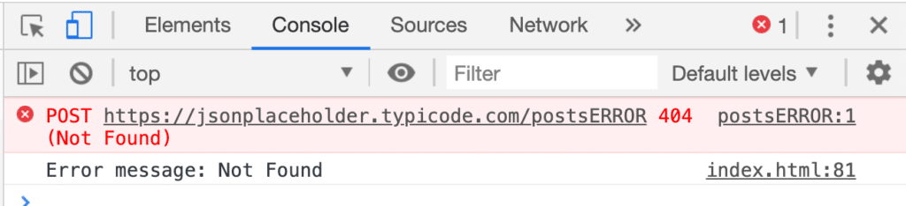
