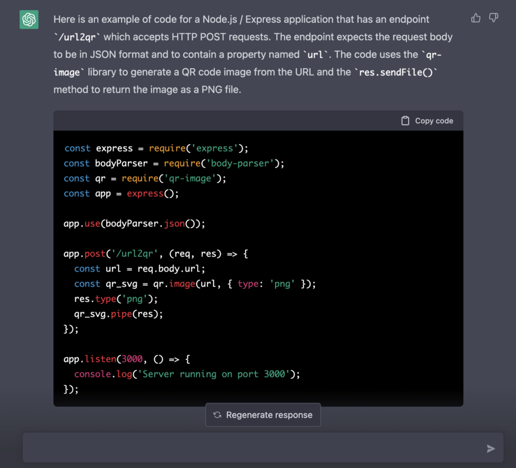
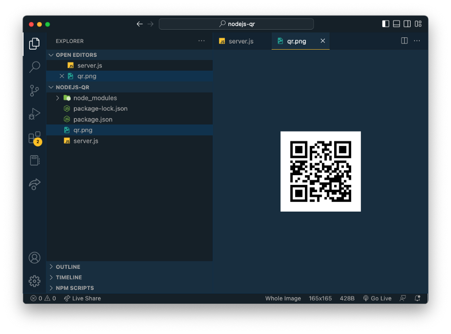

import { Image } from '@astrojs/image/components';
import YouTube from '~/components/widgets/YouTube.astro';
export const components = { img: Image };

A powerful AI tool that can help with coding tasks is ChatGPT, a language model developed by OpenAI. In this article, we will show you how to harness the power of ChatGPT to generate a complete Node.js API, from start to finish - without the need to write a single line of code by yourself. Let's get started …

So here is the input for ChatGPT, just a describe of what the API should do:

_"Generate code for a Node.js / Express application which has an endpoint url2qr. The endpoint must accept HTTP POST requests. Body data of this request is in JSON format containing a property named url. The url received is then converted to a QR code image. The image is returned as a PNG file."_

After hitting return, ChatGPT is starting to generate an answer simitlar to what you can see in the following screenshot:



The Node.js/Express code is fully generated:

```js
const express = require('express');
const bodyParser = require('body-parser');
const qr = require('qr-image');
const app = express();

app.use(bodyParser.json());

app.post('/url2qr', (req, res) => {
  const url = req.body.url;
  const qr_svg = qr.image(url, { type: 'png' });
  res.type('png');
  qr_svg.pipe(res);
});

app.listen(3000, () => {
  console.log('Server running on port 3000');
});
```

This code creates ourNode.js/Express application with an endpoint `/url2qr` that accepts HTTP POST requests.

The first line `const express = require('express');` imports the Express module. Express is a web application framework for Node.js that allows for easy routing and handling of HTTP requests.

The second line `const bodyParser = require('body-parser');` imports the `body-parser` middleware. This middleware is used to parse the request body of an HTTP request and make it available as a JavaScript object in the request object.

The third line `const qr = require('qr-image');` imports the `qr-image` library. This library is used to generate QR code images from a given input (in this case, a URL).

The fourth line `const app = express();` creates an instance of the Express application.

The line `app.use(bodyParser.json());` sets up the `body-parser` middleware to parse JSON request bodies.

The line `app.post('/url2qr', (req, res) => {` sets up an endpoint for the Express application that listens for HTTP POST requests to the `/url2qr` path. The callback function passed as the second argument to the `.post()` method is executed when a POST request is made to that path. The function takes two arguments, `req` and `res`, which represent the request and response objects respectively.

The line `const url = req.body.url;` extracts the url property from the request body.

The line `const qr_svg = qr.image(url, { type: 'png' });` generates a QR code image from the URL and assigns it to the variable `qr_svg`

The line `res.type('png');` sets the content type of the response to `image/png`.

The line `qr_svg.pipe(res);` pipes the QR code image to the response object, which sends it to the client as a PNG file.

The line `app.listen(3000, () => {` starts the Express application and listens for incoming requests on port 3000.

The line `console.log('Server running on port 3000');` logs a message to the console that the server is running on port 3000.

After starting the server, the code will listen on port 3000 for any incoming request on the endpoint `/url2qr` and when a post request is made to this endpoint it will convert the url given in the body of the request to QR code and sends it back to the client as a PNG file.

With the code available you now need to perform the following steps:

* Create a new directory for your project and navigate to it in the command line.
* Initialize a new Node.js project by running npm init. This will create a package.json file in your project directory.
* Install the express, body-parser, and qr-image dependencies by running the following command:

```bash
npm install express body-parser qr-image
```

Finally create a new file in your project directory called server.js or any name you prefer and add the code I provided in the previous answer.

## Testing The Generated Code

You can start the server by running the code in your Node.js environment, for example by using the node command in the command line:

```bash
$ node server.js
```

Once the server is running, you can use a tool like curl or httpie to make a POST request to the endpoint and pass in the desired URL in the request body. Here's an example using curl:

```bash
$ curl -X POST -H "Content-Type: application/json" -d '{"url":"https://example.com"}' http://localhost:3000/url2qr > qr.png
```

You can also use a tool like postman to make the request.

You should now have a qr.png file containing the QR code image of the URL you passed in the request:

