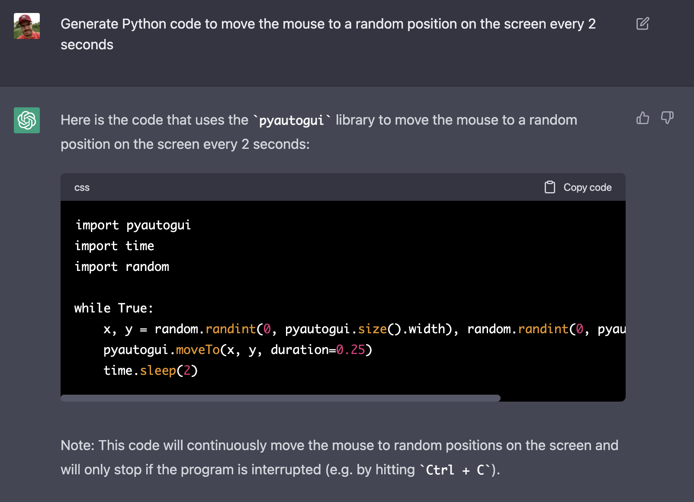

import { Image } from '@astrojs/image/components';
import YouTube from '~/components/widgets/YouTube.astro';
export const components = { img: Image };   

In this tutorial, we utilized the power of OpenAI's language model, ChatGPT, to generate Python code for a mouse moving bot.

The code should move the mouse pointer to a random position on the screen every 2 seconds. With the ability to generate code based on natural language inputs, ChatGPT offers a convenient and efficient solution for developers who want to quickly implement certain functionality without having to write code from scratch.

Let's see how that works in just a few easy steps:

Log into ChatGPT at https://chat.openai.com/chat and type in the following:

_"Generate Python code to move the mouse to a random position on the screen every 2 seconds"_

In the following screenshot you can see that ChatGPT is providing you as an answer with the complete Python script which is able to fulfill the requirement:



Again in the following listing you can see the generated Python code:

```python
import pyautogui
import time
import random

while True:
    x = random.randint(0, pyautogui.size().width)
    y = random.randint(0, pyautogui.size().height)
    pyautogui.moveTo(x, y, duration=0.25)
    time.sleep(2)
```

The code uses the pyautogui library to automate mouse movements, time library to pause the program for a specific amount of time and random library to generate random numbers.

The code starts with an infinite loop that generates random x and y coordinates representing the horizontal and vertical positions of the mouse pointer. The pyautogui.size().width and pyautogui.size().height functions are used to get the width and height of the screen, and the random.randint() function is used to generate random x and y values within the screen bounds.

Then the pyautogui.moveTo() function is called with the generated x and y coordinates, which moves the mouse pointer to that position. The duration argument is set to 0.25, which means it will take 0.25 seconds for the mouse to move to the new position.

After moving the mouse, the time.sleep() function is called with a value of 2 seconds to pause the program for 2 seconds before repeating the loop.

This code will continuously move the mouse to random positions on the screen and will only stop if the program is interrupted (e.g. by hitting Ctrl + C).

In order to execute the code first create a new project directory and in that directory create a new and empty Python file mousemouse.py:

```shell
$ mkdir py-mouse
$ cd py-mouse
$ touch mousemove.py
```

Copy and paste the generated code into that file and the return to the command line and make sure that the pyautogui package is installed by using the pip command in the following way:

```bash
$ pip install pyautogui
```

Finally start the script:

```
$ python mousemove.py
```

You should see the mouse pointer being moved to a random position on your screen every two seconds.

__Remember:__
__This code will continuously move the mouse to random positions on the screen and will only stop if the program is interrupted (e.g. by hitting Ctrl + C).__

## Conclusion

It is very easy to let ChatGPT generate the Python code for a mouse moving bot. All you need to do is ask ChatGPT to write the code for your desired task and it will provide you with a concise and well-written code snippet. In this case, it generated a complete Python code that implements a mouse moving bot that moves the mouse pointer to a random position on the screen every 2 seconds.

ChatGPT's ability to generate code based on natural language inputs makes it an extremely useful tool for developers who want to quickly implement certain functionality without having to write code from scratch. This can save a lot of time and effort, especially for simple tasks like this one.
