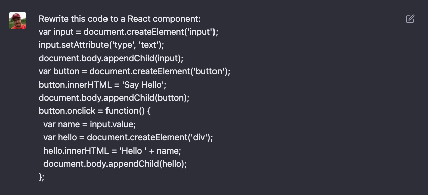
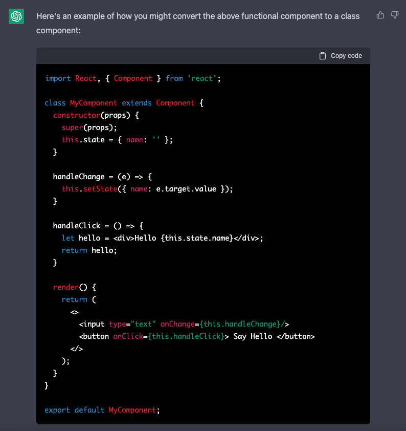

import { Image } from '@astrojs/image/components';
import YouTube from '~/components/widgets/YouTube.astro';
export const components = { img: Image };

Welcome to our tutorial on how to generate React components from JavaScript code using ChatGPT. In this guide, we will explore the benefits of using ChatGPT for this task and walk you through the step-by-step process.

React is a popular JavaScript library for building user interfaces, and generating components is a common task when working with it.

ChatGPT is a powerful language model that can help automate this process by generating React component code based on a set of inputs. By using ChatGPT, you can quickly and easily generate high-quality React components, saving you time and reducing the risk of errors.

In this tutorial, we will show you how to use ChatGPT to generate React components from JavaScript code. Let's see how that works …

React is a JavaScript library for building user interfaces. It allows developers to create reusable components that manage their own state and can be easily composed to build complex UIs. React components are a fundamental building block in React development and are used to encapsulate and manage the logic and rendering of a specific part of the UI. Each component can have its own state and props, which are used to pass data and actions from parent components to children. React's component-based architecture makes it easy to build and maintain large-scale applications.


_Photo by [Rahul Mishra](https://medium.com/r/?url=https%3A%2F%2Funsplash.com%2F%40rahuulmiishra%3Futm_source%3Dmedium%26utm_medium%3Dreferral) on [Unsplash](https://medium.com/r/?url=https%3A%2F%2Funsplash.com%3Futm_source%3Dmedium%26utm_medium%3Dreferral)_

Let's start with an easy JavaScript example. Take a look the following lines of code:

```js
var input = document.createElement('input');
input.setAttribute('type', 'text');
document.body.appendChild(input);
var button = document.createElement('button');
button.innerHTML = 'Say Hello';
document.body.appendChild(button);
button.onclick = function() {
  var name = input.value;
  var hello = document.createElement('div');
  hello.innerHTML = 'Hello ' + name;
  document.body.appendChild(hello);
};
```

This code creates an HTML input element and a button element, and then appends them to the body of the current web page. The input element is given a `type` attribute with a value of `text`, so it will be rendered as a text input field. The button element has its `innerHTML` property set to `Say Hello`, so it will display the text `Say Hello` on the button.

When the button is clicked, the code inside the anonymous function attached to the "onclick" event of the button is executed. This code retrieves the current value of the input element, assigns it to a variable called `name`, creates a new `div` element and assigns it to a variable called `hello`, sets the `innerHTML`property of the `hello` element to a string `Hello ` concatenated with the `name` variable and finally, appends the `hello` element to the body of the current web page.

In summary, this code creates an input field and a button and when the button is clicked it retrieves the value from the input field, creates a new div element with the text 
```
Hello {value of input field}
```

and appends it to the body of the current web page.

## Converting This JavaScript Code To React With ChatGPT

A React component can help to better structure this code by breaking it down into smaller, reusable parts. Instead of manipulating the DOM directly, as is done in the original code, a React component can manage its own state and render itself based on that state.

For example, a React component could have a state variable to store the input value and a function to handle the onClick event of the button. The component would then use this state to render the input field and the button, and use the function to update the state and render the "Hello" message.

Let's ask ChatGPT to do the transformation for us:



As a response we're getting back:


Furthermore ChatGPT is providing some helpful explanations to us as well:

_"This is a simple example of how you could convert the given code to a React component. The component is using the state hook useState to manage the input value and the component renders an input field and a button. The onChange event of the input field is used to update the component's state with the input value. The button has an onClick event that calls a function that returns a new JSX element with the "Hello" message and the name from the input field. It's worth noting that this component doesn't append the returned element to the DOM, in order to do that you should use the setState hook or another way to update the component."_

## Turn It Into A React Class Component

In general React supports two type of components: functional components and class components.

React functional components are JavaScript functions that return React elements. They are typically used for simple components that do not need to manage state or lifecycle methods. They are easy to read and test.

React class components, on the other hand, are JavaScript classes that extend the React.Component class. They provide additional features such as local state, lifecycle methods, and the ability to handle user events with methods. They are typically used for more complex components that need more functionality.

Let's see if ChatGPT can also help us converting the functional component code to a class component implementation by asking:

_"Convert the React component into a class component"_

As a response ChatGPT is providing us with the complete re-implementation of the component as a React class component:



The class component uses this.state instead of `useState` to manage state, and uses constructor, `this.setState`, and `this.state` instead of `useState` hooks. Additionally, it uses class methods instead of functions for handling events like `onClick` and `onChange`.

## Conclusion

ChatGPT can be a powerful tool for developers who need to convert existing plain JavaScript code into React components. With its advanced natural language processing capabilities, ChatGPT can quickly understand the structure and functionality of your code, and generate corresponding React component code that is both efficient and easy to read. Whether you're working on a new project or updating an existing one, ChatGPT can save you time and effort, allowing you to focus on creating a great user experience. Additionally, ChatGPT can help you with many other programming-related tasks and it can be a valuable support for developers of any experience level.
