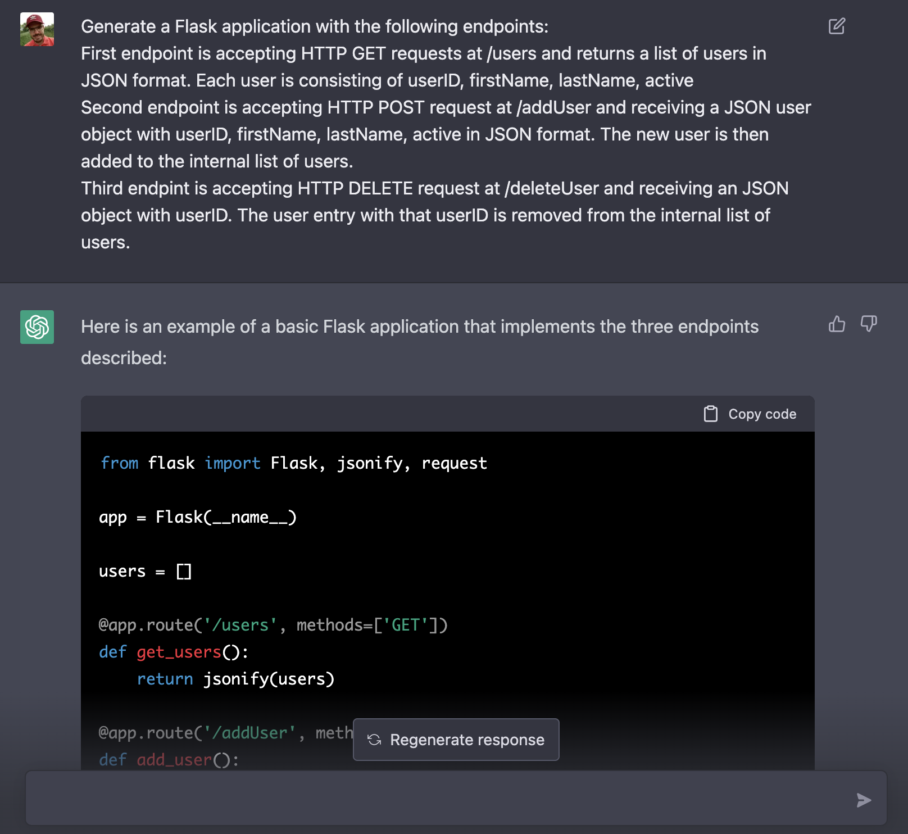
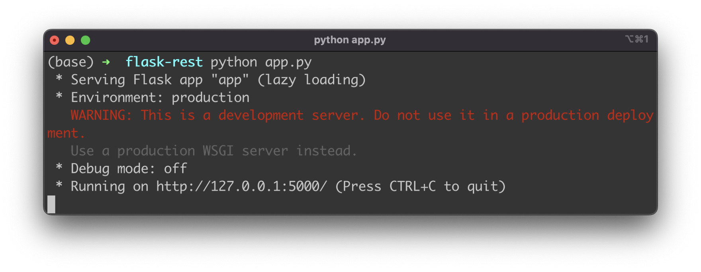
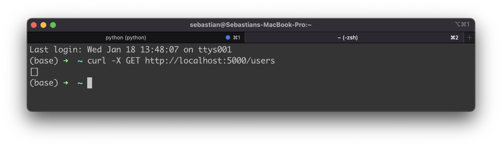
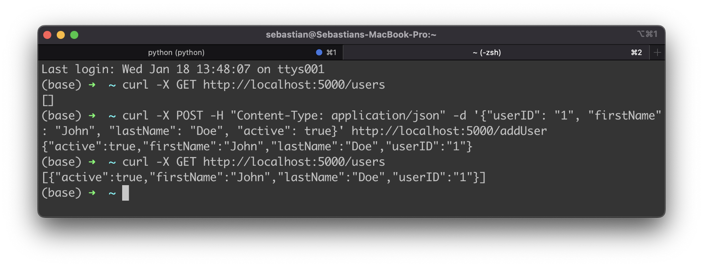
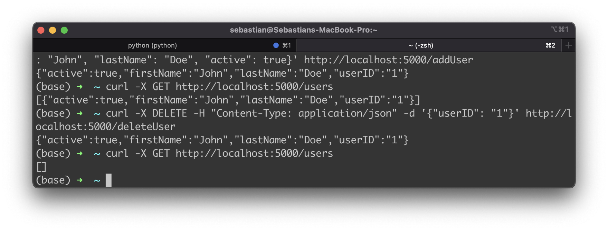

import { Image } from '@astrojs/image/components';
import YouTube from '~/components/widgets/YouTube.astro';
export const components = { img: Image };

API development can be a time-consuming and complex task, but it doesn’t have to be. With the advancements in natural language processing and machine learning, we now have access to tools like ChatGPT that can greatly simplify the process. In this blog post, we’ll be taking a step-by-step approach to using ChatGPT to generate a Flask REST API. We’ll cover everything from setting up the initial project to testing and deploying the final product. By the end of this post, you’ll have a solid understanding of how to use ChatGPT to generate a Flask REST API, and you’ll be able to apply this knowledge to your own projects. So, let’s get started!

In order to generate the Flask REST API web application we need to input out specific requirements into ChatGPT. The description used for the example of this article is the following:

_“Generate a Flask application with the following endpoints:_

_First endpoint is accepting HTTP GET requests at /users and returns a list of users in JSON format. Each user is consisting of userID, firstName, lastName, active_

_Second endpoint is accepting HTTP POST request at /addUser and receiving a JSON user object with userID, firstName, lastName, active in JSON format. The new user is then added to the internal list of users._

_Third endpoint is accepting HTTP DELETE request at /deleteUser and receiving an JSON object with userID. The user entry with that userID is removed from the internal list of users.”_

ChatGPT will then start providing a complete implementation of a Flask web app as requested:



The complete Flask code which is provided by ChatGPT:

```python
from flask import Flask, jsonify, request

app = Flask(__name__)

users = []

@app.route('/users', methods=['GET'])
def get_users():
    return jsonify(users)

@app.route('/addUser', methods=['POST'])
def add_user():
    user = request.get_json()
    users.append(user)
    return jsonify(user)

@app.route('/deleteUser', methods=['DELETE'])
def delete_user():
    user_id = request.get_json()['userID']
    for user in users:
        if user['userID'] == user_id:
            users.remove(user)
            return jsonify(user)
    return jsonify({"message": "User not found"})

if __name__ == '__main__':
    app.run()
```

* The first line `from flask import Flask, jsonify, request` imports the necessary modules from the Flask library. The `Flask` module is used to create the Flask application, `jsonify` is used to convert Python objects to JSON when returning them in the response, and request is used to get the data from the body of the HTTP requests.

* The second line `app = Flask(__name__)` creates a new Flask application and assigns it to the app variable. The __name__ parameter is used to determine the root path of the application.

* The `users` variable is a list that will hold the users data.

* Next, there are three functions, each one decorated with a `@app.route` decorator. Each function is responsible for handling a specific endpoint of the API.

* The first function `get_users()` handles the GET `/users` endpoint. It's decorated with `@app.route('/users', methods=['GET'])` which tells Flask that this function should handle GET requests to the `/users` endpoint. It returns the list of users in JSON format using the `jsonify` function.

* The second function `add_user()` handles the POST `/addUser` endpoint. It's decorated with `@app.route('/addUser', methods=['POST'])` which tells Flask that this function should handle POST requests to the `/addUser` endpoint. It uses the `request.get_json()` method to get the user data from the request body, it then appends the user data to the users list and returns the added user in JSON format using the `jsonify` function.

* The third function `delete_user()` handles the DELETE `/deleteUser` endpoint. It's decorated with `@app.route('/deleteUser', methods=['DELETE'])` which tells Flask that this function should handle DELETE requests to the `/deleteUser` endpoint. It uses the `request.get_json()` method to get the `userID` from the request body, then it loops through the users list to find the user with the matching `userID`, and if found it removes it from the users list and returns the removed user in JSON format using the `jsonify` function. If the user is not found it returns a json object with a message "User not found"
  
* The last lines `if __name__ == '__main__':` check if the script is being run directly and not imported as a module, and if so, it runs the application using the `app.run()` method.

Copy this code into a new file app.py. You can then start the development server by using the command:

```bash
$ python app.py
```

You can then see that the server is started and running on port 5000:



## Testing The Endpoints

You can use the `curl` command in the command line to test the different endpoints of your Flask application. Here are some examples of how you can use `curl` to test the different endpoints of the application I provided earlier:

__GET /users__ — To test the `/users` endpoint which returns a list of users, you can use the following command:

```bash 
$ curl -X GET http://localhost:5000/users
````

Initially you’ll receive just an empty array because no users have been created yet:



__POST /addUser__ — To test the `/addUser` endpoint which adds a new user to the internal list of users, you can use the following command:

```bash
$ curl -X POST -H "Content-Type: application/json" -d '{"userID": "1", "firstName": "John", "lastName": "Doe", "active": true}' http://localhost:5000/addUser
```

After having executed this command you can again send a POST request to /users:



As a result you can see that the new user object is now available.

__DELETE /deleteUser__ — To test the `/deleteUser` endpoint which removes a user from the internal list of users, you can use the following command:

```bash
$ curl -X DELETE -H "Content-Type: application/json" -d '{"userID": "1"}' http://localhost:5000/deleteUser
```

If you then access the /users endpoint again you’ll get an empty array again because the user entry has been deleted successfully:



## Conclusion

ChatGPT is a powerful tool that can greatly simplify the process of API development with Flask, and we hope this blog post has helped you understand how to use it. We encourage you to experiment with ChatGPT and see how it can benefit your own projects. Happy coding!