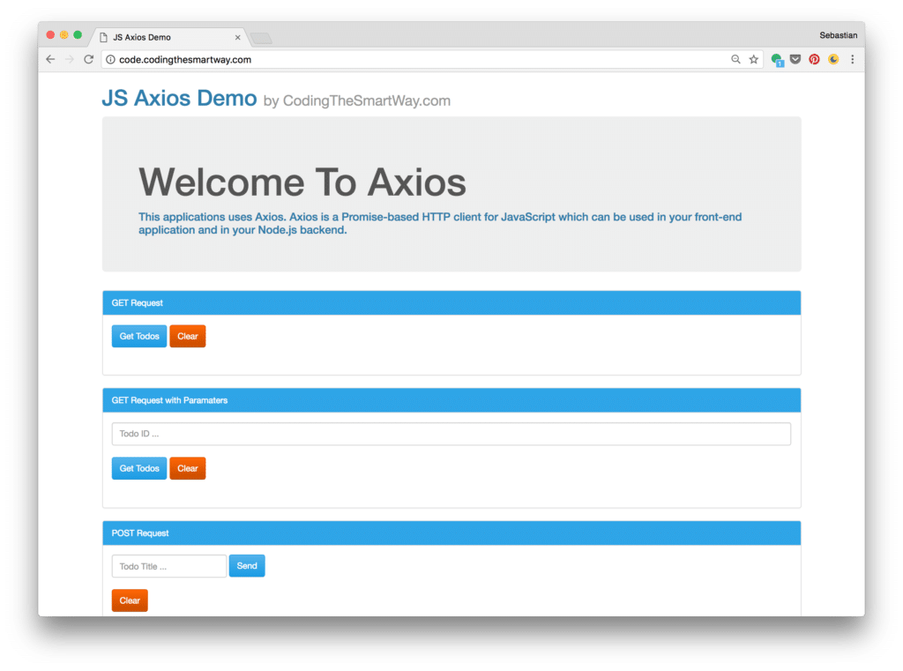
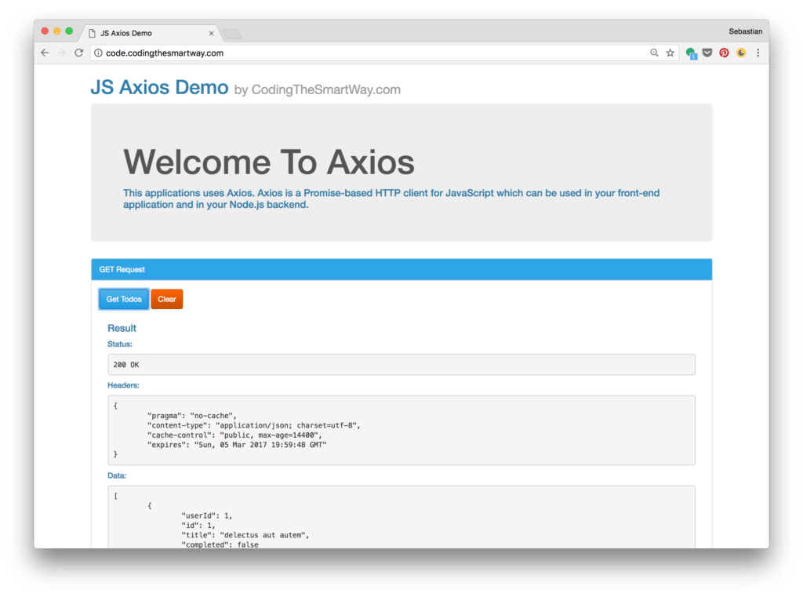
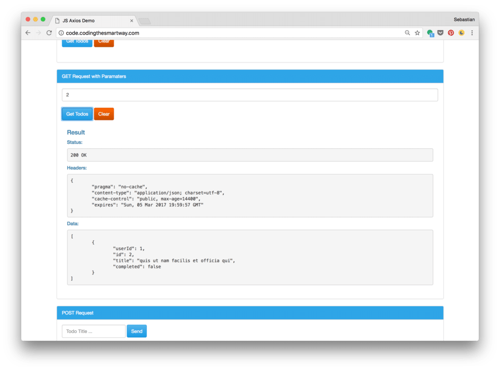
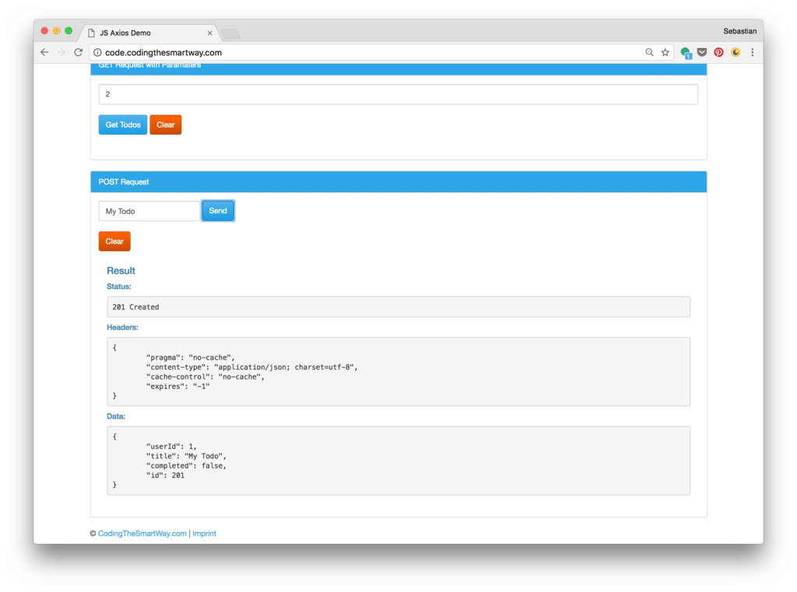

import { Image } from '@astrojs/image/components';
import YouTube from '~/components/widgets/YouTube.astro';
export const components = { img: Image };


<YouTube url="https://youtu.be/1vbpBDWu1AQ" />

## Accessing REST Web Services / HTTP APIs in JavaScript

Axios is a Promise-based HTTP client for JavaScript which can be used in your front-end application and in your Node.js backend.

By using Axios it's easy to send asynchronous HTTP request to REST endpoints and perform CRUD operations. The Axios library can be used in your plain JavaScript application or can be used together with more advanced frameworks like Vue.js.

Here is the full feature list of Axios is stated in the project's website [https://github.com/mzabriskie/axios](https://github.com/mzabriskie/axios):

- Make XMLHttpRequests from the browser
- Make http requests from node.js
- Supports the Promise API
- Intercept request and response
- Transform request and response data
- Cancel requests
- Automatic transforms for JSON data
- Client side support for protecting against XSRF

In the following tutorial, you'll learn how to install and add Axios to your project and perform asynchronous HTTP request. We'll use a real-world scenario throughout this tutorial.

## What We're Going To Build

In the following you can see some screenshots of the sample application we're going to build in this tutorial:



The user interface is split up into three sections:

- GET Request
- GET Request with Parameters
- POST Request

With each of these three sections the user is able to try out a specific use case for Axios. Performing a GET request in the first list leads to the following result:



In the second use case the user is able to send a GET request with the ID of a specific record included:



The third use case is a POST request to create a new Todo item. Therefore the user needs to enter a new todo description:



## Installing Axios

Adding Axios to your project is easy. There are two options:

### Option 1: Installation Axios With Node Package Manager

Installation Axios by using the Node.js package manager. This is done by using the following command:

`$ npm install axios`

This downloads the library and installs it in the _node\_modules_ folder.

### Option 2: Using a CDN

The easiest way is to include Axios by using a Content Delivery Network, e.g. by including the following `<script>` tag in your index.html file:

`<script src="https://unpkg.com/axios/dist/axios.min.js"></script>`

## Backend

As we want to use the Axios library for requesting and sending data to a REST web service we need to have access to a corresponding backend. In our last [CodingTheSmartWay.com](http://CodingTheSmartWay.com) tutorial you've learned how to easily set up a local REST server by using JSON-Server. Now you can make use of JSON-Server again

If you want to skip that step, you can use a JSON-Server instance which is running at [http://jsonplaceholder.typicode.com/](http://jsonplaceholder.typicode.com/) and offers endpoints for various entities.

In the following, we'll make use of the Todo entity which is available at the endpoint: [http://jsonplaceholder.typicode.com/todos](http://jsonplaceholder.typicode.com/todos).

## Implementing The User Interface

The first step is to create a new project directory and within that directory create a new file _index.html_. We'll use some Bootstrap CSS classes to style the elements of our user interface. Insert the following HTML code into _index.html_:

```html
<!DOCTYPE html>
<html>
  <head>
    <meta charset="utf-8">
    <meta http-equiv="X-UA-Compatible" content="IE=edge">
    <meta name="viewport" content="width=device-width, initial-scale=1">
    <title>JS Axios Demo</title>
    <!-- Latest compiled and minified CSS -->
    <link rel="stylesheet" href="https://bootswatch.com/cerulean/bootstrap.min.css">
  </head>
  <body>
    <div class="container">
      <div class="alert alert-warning alert-dismissible" role="alert">
        <button type="button" class="close" data-dismiss="alert" aria-label="Close"><span aria-hidden="true">&times;</span></button>
        <strong><a href="http://codingthesmartway.com/courses/complete-javascript/" target="\_blank">\[ONLINE COURSE\] - The Complete JavaScript Course: Build a Real-World Project</a></strong> +++ Master JavaScript with the most complete JavaScript course on the market! Includes projects, challenges, final exam, ES6 +++ You will gain a deep and true understanding of how JavaScript works behind the scenes. +++
      </div>
      <h1>JS Axios Demo <small>by CodingTheSmartWay.com</small></h1>
      <div class="jumbotron">
        <h1>Welcome To Axios</h1>
        <h4>This applications uses Axios. Axios is a Promise-based HTTP client for JavaScript which can be used in your front-end application and in your Node.js backend. </h4>
      </div>
      <div class="panel panel-primary">
        <div class="panel-heading">GET Request</div>
        <div class="panel-body">
          <button class="btn btn-primary" onclick="performGetRequest1()">Get Todos</button>
          <button class="btn btn-warning" onclick="clearOutput()">Clear</button>
          <div class="panel-body" id="getResult1"></div>
        </div>
      </div>
      <div class="panel panel-primary">
        <div class="panel-heading">GET Request with Paramaters</div>
        <div class="panel-body">
          <input type="text" class="form-control" id="todoId" placeholder="Todo ID ..."/><br/>
          <button class="btn btn-primary" onclick="performGetRequest2()">Get Todos</button>
          <button class="btn btn-warning" onclick="clearOutput()">Clear</button>
          <div class="panel-body" id="getResult2"></div>
        </div>
      </div>
       <div class="panel panel-primary">
        <div class="panel-heading">POST Request</div>
        <div class="panel-body">
          <form class="form-inline" id="todoInputForm">
            <div class="form-group">
              <input type="text" class="form-control" id="todoTitle" placeholder="Todo Title ...">
            </div>
            <button type="submit" class="btn btn-primary">Send</button>
          </form><br/>
          <button class="btn btn-warning" onclick="clearOutput()">Clear</button>
          <div class="panel-body" id="postResult"></div>
        </div>
      </div>
      <div class="footer">
        <p>&copy <a href="http://codingthesmartway.com" target="\_blank">CodingTheSmartWay.com</a> | <a href="http://codingthesmartway.com/imprint" target="\_blank">Imprint</a></p>
      </div>
    </div>
    <script src="https://unpkg.com/axios/dist/axios.min.js"></script>
    <script src="https://code.jquery.com/jquery-3.1.1.min.js" integrity="sha256-hVVnYaiADRTO2PzUGmuLJr8BLUSjGIZsDYGmIJLv2b8=" crossorigin="anonymous"></script>
    <!-- Latest compiled and minified JavaScript -->
    <script src="https://maxcdn.bootstrapcdn.com/bootstrap/3.3.7/js/bootstrap.min.js" integrity="sha384-Tc5IQib027qvyjSMfHjOMaLkfuWVxZxUPnCJA7l2mCWNIpG9mGCD8wGNIcPD7Txa" crossorigin="anonymous"></script>
    <script src="main.js"></script>
  </body>
</html>
```

The implementation of the HTML user interface makes use of several Bootstrap CSS classes. To be able to use Bootstrap classes we need to include Bootstrap. We do that by including corresponding script and link tags. Furthermore file _main.js_ is included by using a `<script>` element at the bottom of the body section. The _main.js_ file will be created in the project folder and will be used to include the JavaScript code which is needed for the sample application.

The user interface is split up into three main div section:

`<div class="panel panel-primary">...</div>`

Each div sections contains the HTML code which is needed for one Axios use case. The HTML code of each section includes a div element which is a placeholder for the result:

`<div class="panel-body" id="getResult1"></div>`

`<div class="panel-body" id="getResult2"></div>`

`<div class="panel-body" id="postResult"></div>`

Later when adding the JavaScript code for our application we're able to retrieve these elements by ID and insert the inner HTML code. For use case one and two the user is able to initiate the POST request by clicking on a button:

`<button class="btn btn-primary" onclick="performGetRequest1()">Get Todos</button>`

`<button class="btn btn-primary" onclick="performGetRequest2()">Get Todos</button>`

By using the _onclick_ attribute we're connecting the click events to function _performGetRequest1()_ and _performGetRequest2()_. Both methods will make use of the Axios library to initiate the GET requests and will be implemented in _main.js_.

The third use case makes use of a HTML form for data entry (entering a new todo description). To respond to the submit event of the form we'll connect a corresponding event handler function to this event type in the JavaScript code later.

## Performing A GET Request

Now we're able to implement the event handler methods which makes use of the Axios framework to communicate with the REST web services. We'll start with the first use case and implement the event handler _performGetRequest1_ in file _main.js_:

```js
function performGetRequest1() {
  var resultElement = document.getElementById('getResult1');
  resultElement.innerHTML = '';
  
  axios.get('http://jsonplaceholder.typicode.com/todos')
    .then(function (response) {
      resultElement.innerHTML = generateSuccessHTMLOutput(response);
    })
    .catch(function (error) {
      resultElement.innerHTML = generateErrorHTMLOutput(error);
    });   
}
```

First a reference of the div element wth id _getResult1_ is retrieved. This is the HTML element which should be used to insert the result output from the web service call.

To perform a HTTP GET request and retrieve the list of todos from the endpoint [http://jsonplaceholder.typicode.com/todos](http://jsonplaceholder.typicode.com/todos) the _axios.get()_ function is used. We need to pass in the URI of the endpoint as a parameter. The method returns a Promise, so that we can use the _then_ and _catch_ methods to handle the result.

If the request has been completed successfully the function is called with is passed into the call of the _then_ method. Within that function the response object is handed over to function _generateSuccessHTMLOutput_. This method extracts the information of the response object and generates a corresponding HTML output. The resulting HTML string is returned and assigned to the _innerHTML_ property of resultElement.

If the HTTP GET request has not been completed successful the catch function is activated. In this case the _generateErrorHTMLOutput_ method is called to generate the HTML output.

The implementation of both functions - _generateSuccessHTMLOutput_ and _generateErrorHTMLOutput_ - is inserted into file _main.js_ as well. The source code is available in the following listing:

```js
function generateSuccessHTMLOutput(response) {
  return  '<h4>Result</h4>' + 
          '<h5>Status:</h5> ' + 
          '<pre>' + response.status + ' ' + response.statusText + '</pre>' +
          '<h5>Headers:</h5>' + 
          '<pre>' + JSON.stringify(response.headers, null, '\\t') + '</pre>' + 
          '<h5>Data:</h5>' + 
          '<pre>' + JSON.stringify(response.data, null, '\\t') + '</pre>'; 
}

function generateErrorHTMLOutput(error) {
  return  '<h4>Result</h4>' + 
          '<h5>Message:</h5> ' + 
          '<pre>' + error.message + '</pre>' +
          '<h5>Status:</h5> ' + 
          '<pre>' + error.response.status + ' ' + error.response.statusText + '</pre>' +
          '<h5>Headers:</h5>' + 
          '<pre>' + JSON.stringify(error.response.headers, null, '\\t') + '</pre>' + 
          '<h5>Data:</h5>' + 
          '<pre>' + JSON.stringify(error.response.data, null, '\\t') + '</pre>'; 
}
```

## Performing A GET Request with Parameter

In the second use case we'd like to perform another HTTP GET request. This time we'd like to use a specific todo ID as a request parameter. The ID can be entered by the user. The function _performGetRequest2()_ is implemented in _main.js:_

```js
function performGetRequest2() {
  var resultElement = document.getElementById('getResult2');
  var todoId = document.getElementById('todoId').value;
  resultElement.innerHTML = '';
  
  axios.get('http://jsonplaceholder.typicode.com/todos', {
    params: {
      id: todoId
    }
  })
  .then(function (response) {
    console.log(response);
    resultElement.innerHTML = generateSuccessHTMLOutput(response);
  })
  .catch(function (error) {
      resultElement.innerHTML = generateErrorHTMLOutput(error);
  });
}
```

Here you can see two main differences:

- the ID which is entered by the user is retrieved from the input element with id _todoId_
- a second parameter is passed to method call _axios.get()_

This second parameter is an object containing the _params_ property. Another object can be assigned to params to specify a list of URL parameters. In our case we only need the _id_ parameter here.

## Performing A POST Request

The third use case of our sample application is a HTTP POST request. The post request is used to create a new todo entry. In the following listing you can see the corresponding JavaScript code which is added in file _main.js_:

```js
document.getElementById('todoInputForm').addEventListener('submit', performPostRequest);

function performPostRequest(e) {
  var resultElement = document.getElementById('postResult');
  var todoTitle = document.getElementById('todoTitle').value;
  resultElement.innerHTML = '';
  
  axios.post('http://jsonplaceholder.typicode.com/todos', {
    userId: '1',
    title: todoTitle,
    completed: false
  })
  .then(function (response) {
    resultElement.innerHTML = generateSuccessHTMLOutput(response);
  })
  .catch(function (error) {
    resultElement.innerHTML = generateErrorHTMLOutput(error);
  });
  
  e.preventDefault();
}
```

This time a form is used to let the user enter a new todo title. So the first thing we need to do is to connect the submit event of the form with the event handler method _performPostRequest()_. This is done by first retrieving a reference to the form element by using the _getElementById_ method and then calling _addEventListener_.

In function _performPostRequest_ we're first retrieving the div element with ID _postResult_ and second the value from the input element with ID _todoTitle_.

The HTTP post request is performed by calling _axios.post()_. Again, two parameter are needed. First we're passing in the URI of the service endpoint. Second, we're passing in an object which contains the properties of the new todo item: _userId_, _title_ and completed. By default the _userId_ is set to '1' and _completed_ is set to _false_.

Processing the result is done in the same way as seen before when we've executed the HTTP GET requests. In case the POST request has been completed successfully the _generateSuccessHTMLOutput()_ function is called and the returned HTML string is assigned to the _innerHTML_ property of the output div element. If the request is not completed successfully the _generateErrorHTMLOutput()_ method is used instead.
