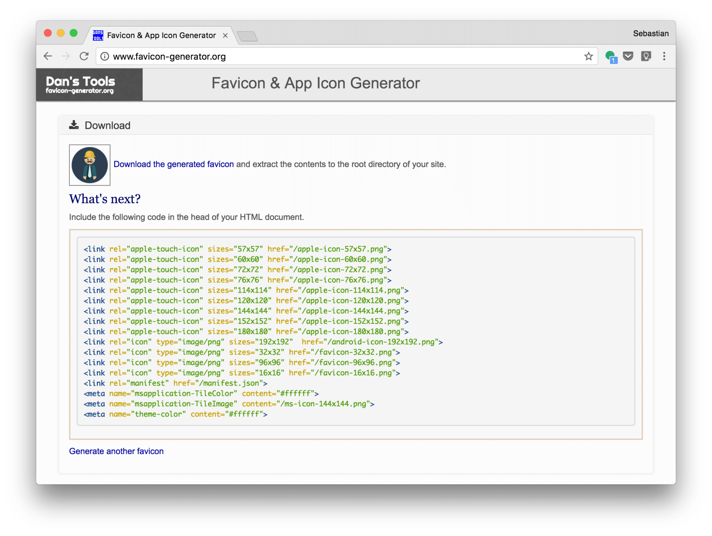
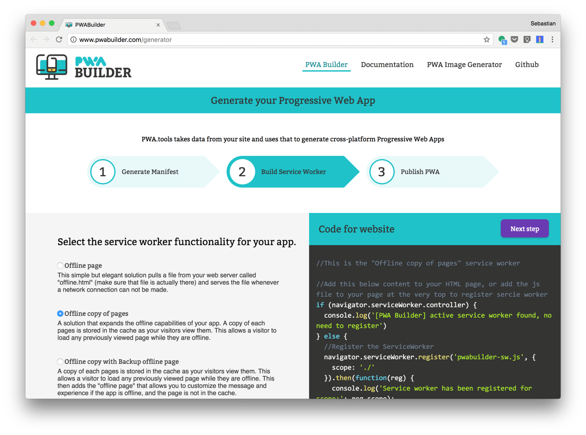
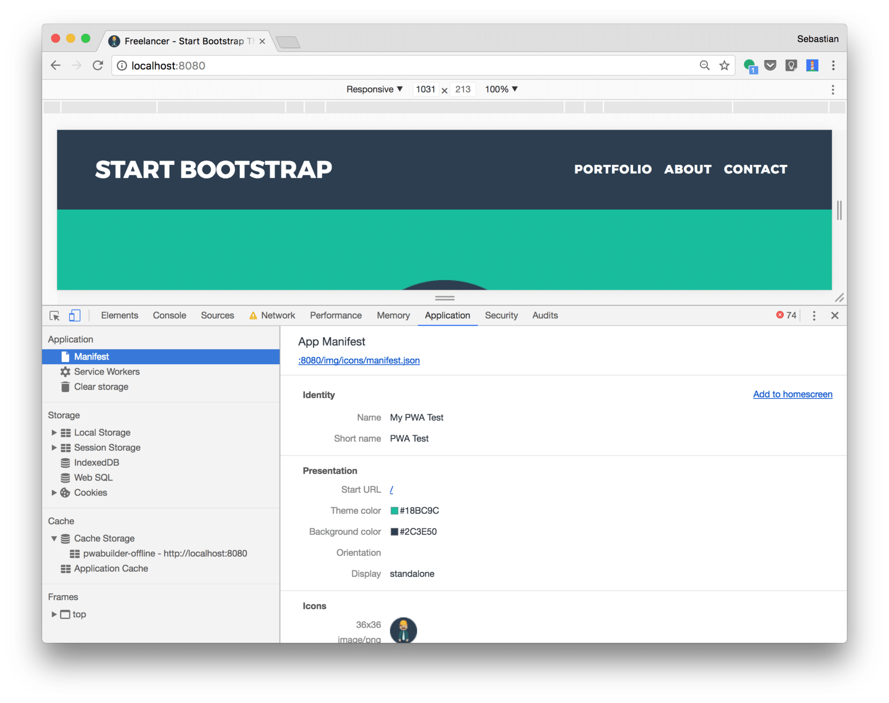
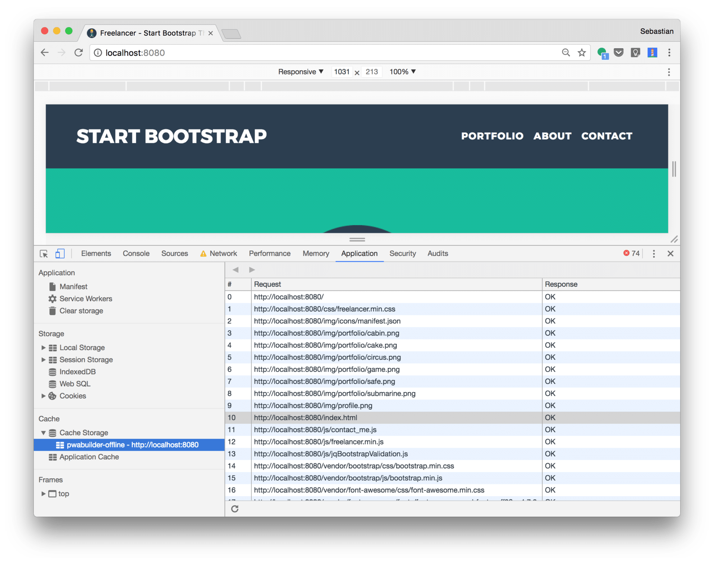
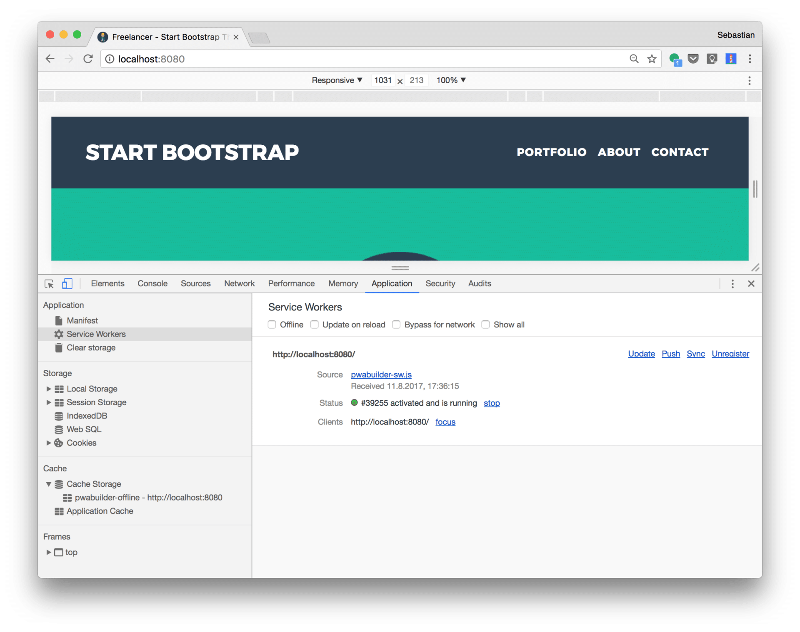
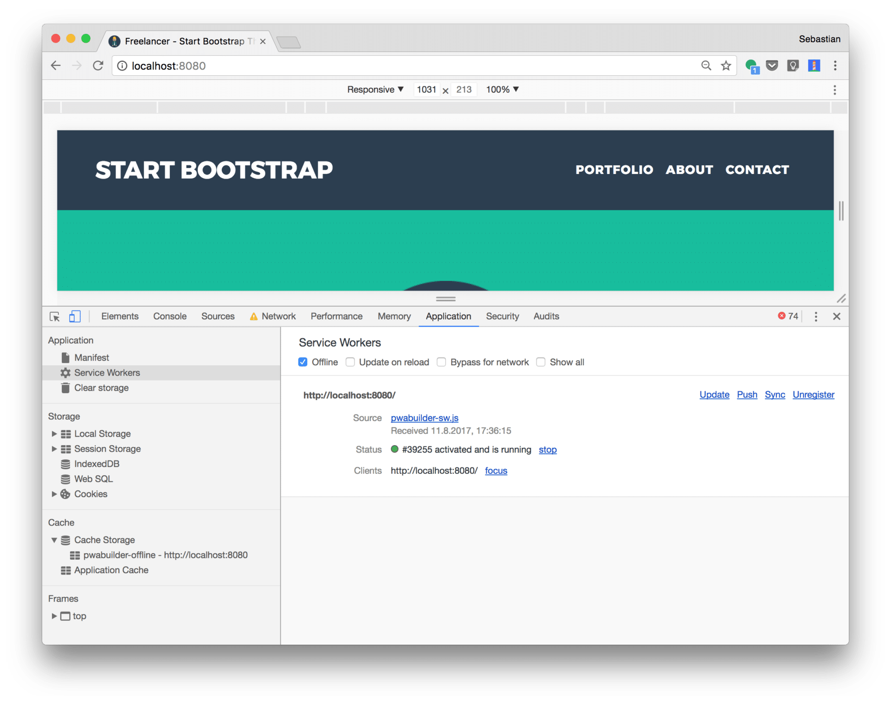
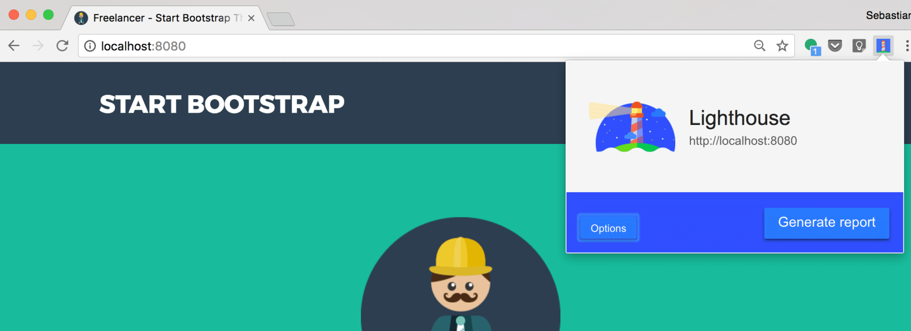
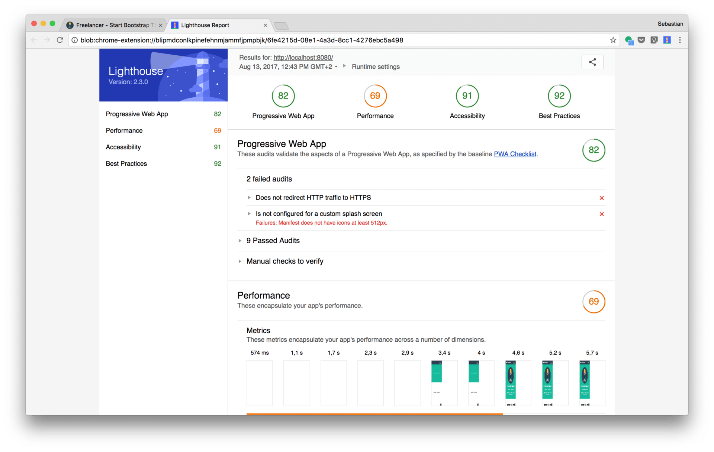

import { Image } from '@astrojs/image/components';
import YouTube from '~/components/widgets/YouTube.astro';
export const components = { img: Image };

<YouTube url="https://youtu.be/M_gWF8Cw6KY" />

Progressive Web Apps (PWAs) are gaining more and more popularity in these days. Maybe you've already used a PWA without knowing because many big websites have already enhanced their platforms with PWA features.

A Progressive Web App is a web application which makes use of latest web technologies to make a web application act and feel like an app. This is achieved by making use of web app manifest files and service workers. Using that technologies a PWA is able to close the gap between a classic web application and a desktop. or native mobile application.

## Building Blocks of a PWA

To enhance a classic web application with PWA features there are two essential building blocks you should add to your application: a web app manifest file and a service worker. Let's clarify what's the prupose of these two elements.

### Web App Manifest

The main purpose of the web app manifest file is to provide information about the web application. The JSON structure of that file can contain information such as name, author, icons and description. This information is used to install the web application to the homescreen of a device so that the user can access the application more easily and has an overall app-like experience.

### Service Workers

A service worker is a JavaScript file which is added to the project and registered in the browser. The service worker script is then able to run in the background and perform tasks like:

- Recognizing the network state and display a special page if no network / internet connection is available.
- Add application data to the browser cache when online and provide that data when offline.
- Display push notifications to the user when your website is not open.

As you can see from that list of use cases, services workers are very powerful and can help to improve the user experience and increase conversion rates significantly.

For now, only Chrome, Firefox and Opera have adequate support for service workers. Of course this means that two big players are missing: Safari and Edge. However, Apple has begun working on adding Service Workers to WebKit, the open source layout engine used by the Safari browser recently. So we can expect to see service worker support in Safari soon.

The same is true for Microsoft Edge. According to [https://developer.microsoft.com/en-us/microsoft-edge/platform/status/serviceworker/](https://developer.microsoft.com/en-us/microsoft-edge/platform/status/serviceworker/) the service worker feature is under development right now and will be available for Edge browsers in the near future.

## Implementing A First PWA

Now that you have a basic understanding of what a PWA is and how the various pieces fit together, let's continue with building a simple sample app.

### Setting Up The Project

First we need to set up a new project. As a starter template we're using the free Bootstrap template from [https://startbootstrap.com/template-overviews/freelancer/](https://startbootstrap.com/template-overviews/freelancer/). Click on the button _Download V4_ to download the source code which is based on the Bootstrap 4 framework as a ZIP archive. Unpack the content of the archive to a folder of your choice.

To check that everything has been downloaded successfully switch to the command line and change into the newly created project directory. To start up a development web server in that folder we're using live-server, which is available as a NPM package. If you have not yet installed live-server, you can do so by executing the following command first to install the server globally on your system:

`$ npm install -g live-server`

Now we can start the server with

`$ live-server`

The server is starting up and the application is made available on port 8080. Accessing http://localhost:8080 in your browser should now show the start page of the Bootstrap template as you can see in the following screenshot:

 In the following steps we'll extend this web application with the building blocks of a PWA.

### Adding An App Icon

The user will have the option to add our PWA to the home screen of a mobile device. Therefore we need to include an app icon.

As a basis for the app icon we'll use an image with is already included in the project: img/profile.png.

As our app icon must work on different platforms and different screen resolutions we need to provide the icon in different dimensions. To generate all dimensions which are needed we can make use of [http://www.favicon-generator.org/](http://www.favicon-generator.org/). Upload the profile.png file and select option _Generate icons for Web, Android, Microsoft, and iOS (iPhone and iPad) Apps_ and click on button _Create Favicon_. The output should now look like the following:



The result comes as a ZIP file you can download to your project directory. Within your project directory unzip that archive to a new folder. For the following step we'll assume that the png files are extracted to a folder which is named _img/icons_.

Next copy the HTML code which is given on the download site and paste that code into the head section of the index.html. Furthermore adapt the value which is assigned to the href value of each `<link>` element. Each path needs to contain the prefix _img/icons/_ as well, so that the code should now look like the following:

```html
    <!-- App Icons -->
    <link rel="apple-touch-icon" sizes="57x57" href="img/icons/apple-icon-57x57.png">
    <link rel="apple-touch-icon" sizes="60x60" href="img/icons/apple-icon-60x60.png">
    <link rel="apple-touch-icon" sizes="72x72" href="img/icons/apple-icon-72x72.png">
    <link rel="apple-touch-icon" sizes="76x76" href="img/icons/apple-icon-76x76.png">
    <link rel="apple-touch-icon" sizes="114x114" href="img/icons/apple-icon-114x114.png">
    <link rel="apple-touch-icon" sizes="120x120" href="img/icons/apple-icon-120x120.png">
    <link rel="apple-touch-icon" sizes="144x144" href="img/icons/apple-icon-144x144.png">
    <link rel="apple-touch-icon" sizes="152x152" href="img/icons/apple-icon-152x152.png">
    <link rel="apple-touch-icon" sizes="180x180" href="img/icons/apple-icon-180x180.png">
    <link rel="icon" type="image/png" sizes="192x192"  href="img/icons/android-icon-192x192.png">
    <link rel="icon" type="image/png" sizes="32x32" href="img/icons/favicon-32x32.png">
    <link rel="icon" type="image/png" sizes="96x96" href="img/icons/favicon-96x96.png">
    <link rel="icon" type="image/png" sizes="16x16" href="img/icons/favicon-16x16.png">
    <link rel="manifest" href="img/icons/manifest.json">
    <meta name="msapplication-TileColor" content="#ffffff">
    <meta name="msapplication-TileImage" content="img/icons/ms-icon-144x144.png">
    <meta name="theme-color" content="#ffffff">
```

### Adding A Manifest File

Now we need to add the application manifest file. However if you take a closer look at the HTML code which has been inserted in the last step you'll notice that a manifest.json file has already been included via the following line:

```html
<link rel="manifest" href="img/icons/manifest.json">
```

We'll use that file as a basis for our application manifest. Let's take a look inside that file:

```js
{
 "name": "App",
 "icons": [
  {
   "src": "android-icon-36x36.png",
   "sizes": "36x36",
   "type": "image\/png",
   "density": "0.75"
  },
  {
   "src": "android-icon-48x48.png",
   "sizes": "48x48",
   "type": "image\/png",
   "density": "1.0"
  },
  {
   "src": "android-icon-72x72.png",
   "sizes": "72x72",
   "type": "image\/png",
   "density": "1.5"
  },
  {
   "src": "android-icon-96x96.png",
   "sizes": "96x96",
   "type": "image\/png",
   "density": "2.0"
  },
  {
   "src": "android-icon-144x144.png",
   "sizes": "144x144",
   "type": "image\/png",
   "density": "3.0"
  },
  {
   "src": "android-icon-192x192.png",
   "sizes": "192x192",
   "type": "image\/png",
   "density": "4.0"
  }
 ]
}
```

As you can see the icons are already included and corresponding entries are available in the JSON structure. According to the official specification of a Web App Manifest file ([https://www.w3.org/TR/appmanifest/](https://www.w3.org/TR/appmanifest/)), the structure should contain further properties to describe the application, the application language, the start url, colors and a display mode. Let's extend the JSON content with the following code:

```
{
 **"name": "My PWA Test",
 "short_name": "PWA Test",
 "lang": "en-US",
 "start_url": "/",
 "background_color": "#2C3E50",
 "theme_color": "#18BC9C",
 "display": "standalone",**
 "icons": [
    ...
  ]
}
```

If you want to generate an App Manifest from scratch you can also take a look at Web App Manifest Generator ([https://tomitm.github.io/appmanifest/](https://tomitm.github.io/appmanifest/)).

### Adding a Service Worker

After having added the Web App Manifest file we now need to add a Service Worker to our application as well. There are many ways of how to add a service worker to your application. E.g. you can use the Service Worker generator from [http://www.pwabuilder.com/generator](http://www.pwabuilder.com/generator).



In the second step you can choose between different service worker functionalities. The corresponding JavaScript source code is generated, so that you can copy and paste this code into the project.

The simplest form of a server worker implementation is the option _Offline page_. In this scenario the service worker is running in the background and just detecting if the network connection to the server is available. If the connection is not available the service worker serves a special HTML page (offline.html) which needs to be added to the project.

For our PWA example we're choosing the option _Offline copy of pages_. In the case a copy of each page is stored in the cache after having requested by the user once. If the application is offline and the corresponding page is already in the cache the request is fullfilled by the service worker and the page is displayed in the browser.

To add that service worker functionality to our app we simple need to copy the code which is given in the left area “Code for website” to a script section in _index.html_ like you can see in the following listing:

```html
    <!-- Service worker registration -->
    <script type="text/javascript">
      if (navigator.serviceWorker.controller) {
        console.log('[PWA Builder] active service worker found, no need to register')
      } else {
        //Register the ServiceWorker
        navigator.serviceWorker.register('pwabuilder-sw.js', {
          scope: './'
        }).then(function(reg) {
          console.log('Service worker has been registered for scope:'+ reg.scope);
        });
      }
    </script>
```

Insert this script section right after the last `<div>` element in the body section.

The script makes use of the _navigator.serviceWorker_ object to detect if a service worker has already been installed. If this is not the case the service worker is registered by using the _navigator.serviceWorker.register_ method. This methods takes two parameters:

- A string which contains the file in which the service worker implementation can be found. In our case this string is set to _pwabuilder-sw.js_. We'll create that file and add the service worker implementation in the next step.
- A JSON configuration object which contains the property scope which is set to the string “_./”_. This means that the service worker is installed for root URL of the application and thus can control all pages.

Now you need to copy and paste the following code from the PWABuilder website into file _pwabuilder-sw.js_:

```js
//This is the "Offline copy of pages" wervice worker

//Install stage sets up the index page (home page) in the cahche and opens a new cache
self.addEventListener('install', function(event) {
  var indexPage = new Request('index.html');
  event.waitUntil(
    fetch(indexPage).then(function(response) {
      return caches.open('pwabuilder-offline').then(function(cache) {
        console.log('[PWA Builder] Cached index page during Install'+ response.url);
        return cache.put(indexPage, response);
      });
  }));
});

//If any fetch fails, it will look for the request in the cache and serve it from there first
self.addEventListener('fetch', function(event) {
  var updateCache = function(request){
    return caches.open('pwabuilder-offline').then(function (cache) {
      return fetch(request).then(function (response) {
        console.log('[PWA Builder] add page to offline'+response.url)
        return cache.put(request, response);
      });
    });
  };

  event.waitUntil(updateCache(event.request));

  event.respondWith(
    fetch(event.request).catch(function(error) {
      console.log( '[PWA Builder] Network request Failed. Serving content from cache: ' + error );

      //Check to see if you have it in the cache
      //Return response
      //If not in the cache, then return error page
      return caches.open('pwabuilder-offline').then(function (cache) {
        return cache.match(event.request).then(function (matching) {
          var report =  !matching || matching.status == 404?Promise.reject('no-match'): matching;
          return report
        });
      });
    })
  );
})
```

Here you can see that the service logic is split up into two main sections:

- First an event handler for the install event is registered. The event handler function creates a new cache and adds the index.html page to that cache.
- Second a fetch event handler function is registered. The methods first takes the existing cache and updates the files which are requested in that cache. If the network request fails it is checked if the cache contains the requested files already. If this is the case the request is fulfilled by providing all assets from the cache. The user is able to see the requested website although no connection to the web server is available.

## Chrome Developer Tools

After having added web app manifest and service worker to our application, let's test the PWA in the browser. As live-server is still running just access http://localhost:8080 an open the Chrome Developer Tools. Change to the _Application_ tab next. Within the _Application_ tab open the _Manifest_ view like you can see in the following screenshot:



If your app manifest is in the right format this view gives you an overview of the settings including the included icons. Next you can expand the Cache Storage section at the left to check if the _pwabuilder-offline_ storage has already been created and the first assets have been added: 


Finally you can open up the _Service Workers_ section and you'll get the following screen presented:



Here you can check if the service worker has been installed correctly. To test our service worker you can use that view and activate the _Offline_ checkbox like you can see in the following screenshot:



Now the browser is working in offline mode. If you try to access the application page once again, you'll get the same result in the browser. This time the response is generated by using the assets from the cache.

## Lighthouse

To test your PWA you can use Lighthouse ([https://developers.google.com/web/tools/lighthouse/)](https://developers.google.com/web/tools/lighthouse/) which is available as a Chrome extension.

If a PWA is regognized you can activate Lighthouse by clicking on the app symbol and then selection button _Generate report_:



Generating the reports takes a few seconds. After executing all checks, Lighthouse gives you a summary in the following form:



Here you are getting detailed information about your PWA. You can see to which degree the application complies to the baseline PWA checklist. Furthermore you get KPIs for performance, accessibility and best practices. A list of failed audits gives you detailed information for further optimizations.