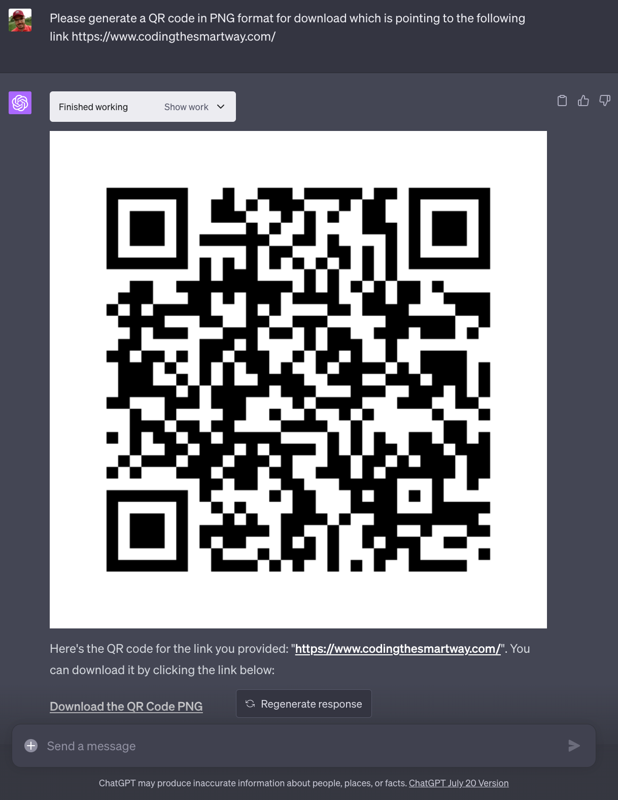
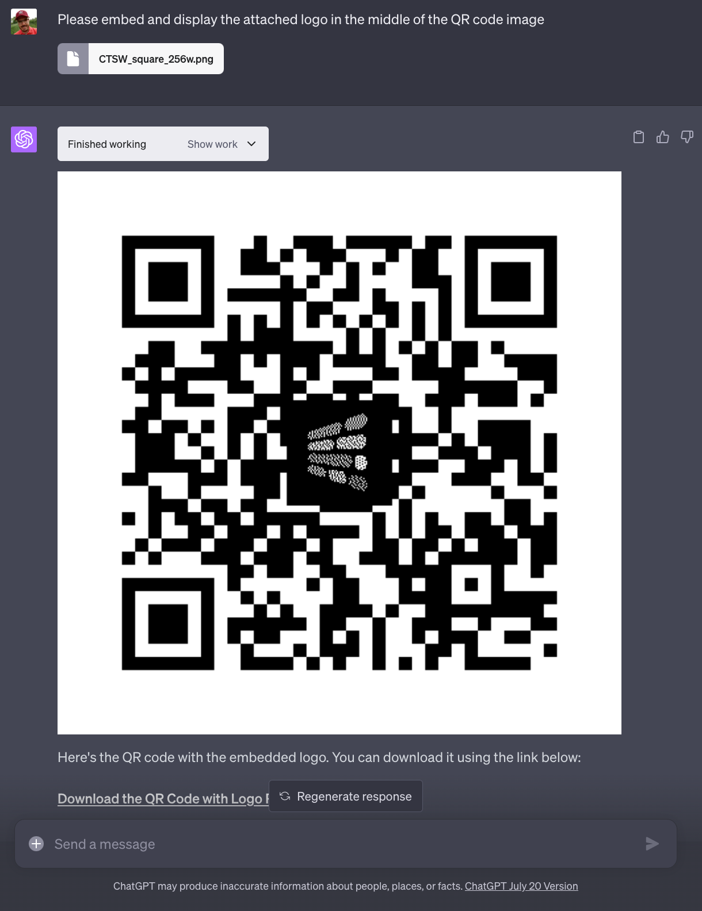
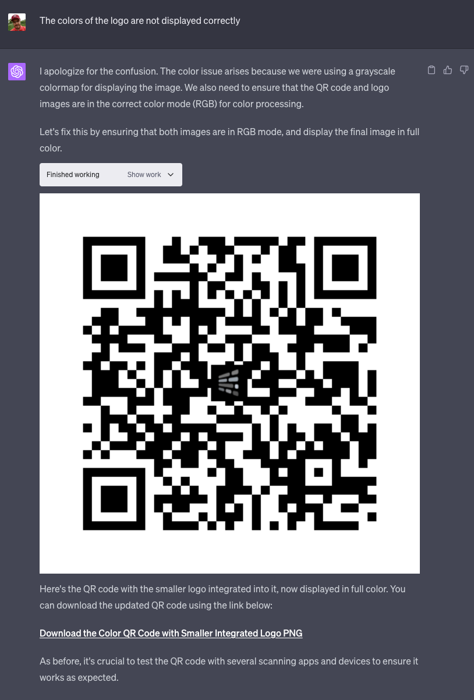

import { Image } from '@astrojs/image/components';
import YouTube from '~/components/widgets/YouTube.astro';
export const components = { img: Image };

In an era where convenience is paramount, QR codes have become a ubiquitous part of our daily lives. From restaurant menus to event tickets, these two-dimensional barcodes seamlessly bridge the gap between the physical and digital world. But have you ever wondered how to create one? Better yet, how to create a QR code with a custom logo integrated into it? In this blog post, we'll dive into the exciting journey of QR code generation using OpenAI's powerful language model, ChatGPT's Code Interpreter.

In oder to get started to use ChatGPT's Code Interpreter to generate a QR code image you need to get Code Interpreter activated for a new ChatGPT chat instance:


You can then set the task for Code Interpreter by providing the following prompt:



As requested Code Interpreter is starting to generate the needed Python code immediately, executing the code and providing the final QR as PNG image for download.

From here we can take it a step further and ask ChatGPT to also embed a logo into the generated QR code image. Therefor we need to upload the logo file and provide the following prompt:



Ok, the result which is provided is not perfect yet. The colors of the logo are displayed in grayscale only, so the logo is not looking very nice. Let's ask ChatGPT's Code Interpreter to get this corrected:



This results looks much better. The QR code is not working as expected and the logo is embedded into the image without preventing the QR code to work.

## What Code Interpreter Is Teaching Us About QR Code Generation

Now that we've seen that Code Interpreter is able to generate the needed Python code which generates the QR code with easy, let's also take a look under the bonnet and see what we can learn from Code Interpreter programming skills as a developer.

QR codes are generated using specific algorithms that convert your data into a pattern of squares. To create a QR code with ChatGPT, we need to use the qrcode library in Python. Here's a basic snippet:

```python
import qrcode
qr = qrcode.QRCode(
    version = 1,
    error_correction = qrcode.constants.ERROR_CORRECT_H,
    box_size = 10,
    border = 4,
)
data = "Your Data Here"
qr.add_data(data)
qr.make(fit=True)
img = qr.make_image(fill='black', back_color='white')
```

This code generates a QR code that encodes the data "Your Data Here". You can replace this with any data you wish to encode. The generated QR code has a high error correction level (ERROR_CORRECT_H), meaning it can sustain more damage before becoming unscannable.

## Embedding a Logo into the QR Code

Adding a logo to your QR code not only makes it look more professional but also helps reinforce your brand identity. However, it's essential to do this without damaging the QR code's scannability. Let's reduce the size of the logo to 10% of the QR code size, and embed it into the QR code:

```python
logo_path = "/path/to/logo.png"
logo = Image.open(logo_path).convert("RGB")
logo_size_ratio = 0.1
logo_size = int(img.size[0] * logo_size_ratio)
logo = logo.resize((logo_size, logo_size))
pos = ((img.size[0] - logo_size) // 2, (img.size[1] - logo_size) // 2)
mask = Image.new('L', logo.size, color=255)
img.paste(logo, pos, mask=mask)
```

In the above code, `logo_path` is the location of your logo file. We resize the logo according to the `logo_size_ratio`, create a mask for the logo, and paste it onto the QR code. The mask ensures that the logo blends smoothly into the QR code.

## Displaying the QR Code in Full Color

Initially, we were displaying the QR code in grayscale. However, we can easily display it in full color:

```python
img = img.convert("RGB")
plt.imshow(img)
plt.axis('off')
plt.show()d
```

This code converts the QR code image to RGB mode for color processing and displays it using Matplotlib.

## Conclusion

QR codes are a versatile tool in today's digital world. Thanks to ChatGPT's Code Interpreter, generating custom QR codes is now an effortless task. By integrating a logo into your QR codes, you can make them unique and aligned with your brand identity.

Remember, while the steps outlined in this post ensure that the QR code remains scannable after integrating a logo, it's still crucial to test the final QR code with various scanning apps and devices.

Embrace the convenience of QR codes and the power of the ChatGPT Code Interpreter to streamline your digital interactions. Happy coding!

